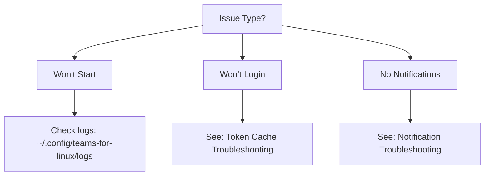
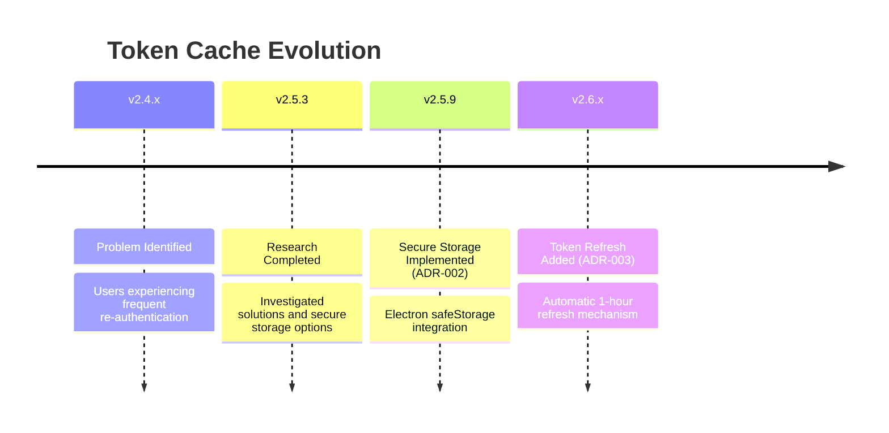
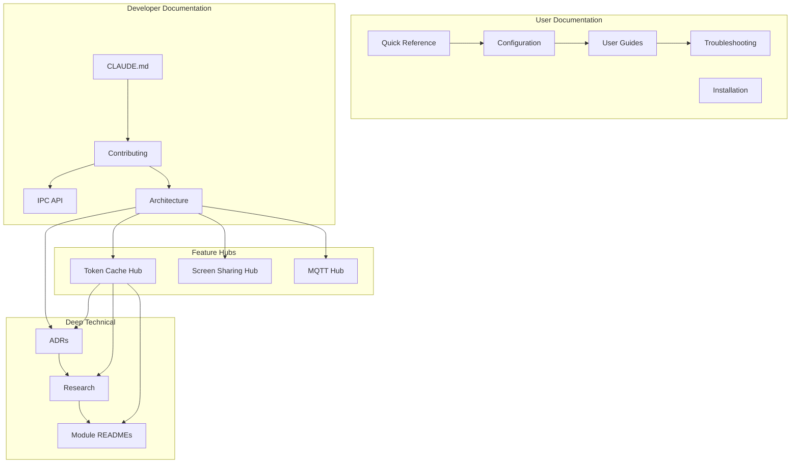
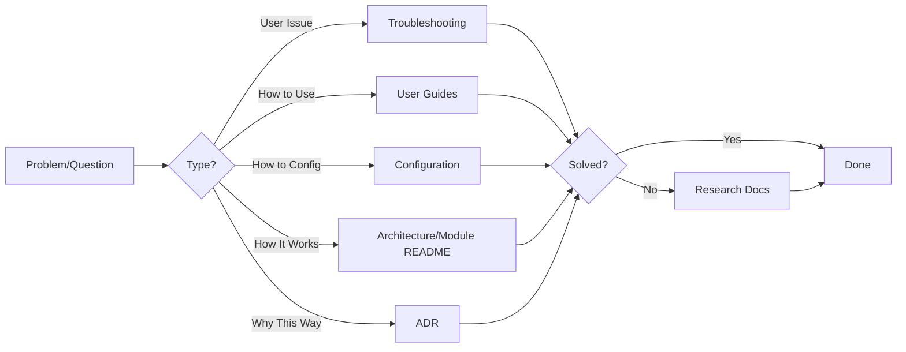

# Documentation Consolidation Plan
## Teams for Linux - LLM & Human Optimized Documentation

**Version:** 1.0
**Date:** 2025-11-12
**Status:** Proposal - Pending Review
**Estimated Effort:** 3-4 weeks (part-time)

---

## Executive Summary

The Teams for Linux project has **excellent documentation coverage** (70 markdown files, 8.5/10 health score) but lacks standardization and cross-referencing that would optimize it for both LLM consumption and human discoverability. This plan focuses on **high-impact, low-complexity improvements** that will:

1. **Standardize metadata** across all documentation types
2. **Improve discoverability** through cross-references and feature hubs
3. **Optimize for LLM consumption** with consistent structure and machine-readable metadata
4. **Maintain human readability** with quick references and clear navigation

**Key Principle:** We're not rewriting documentation - we're adding structure and connections.

---

## Current State Summary

### Strengths
- ✅ Comprehensive coverage (user, developer, architecture, research)
- ✅ Modern Docusaurus deployment with search
- ✅ Well-structured ADR system (3 ADRs)
- ✅ Detailed research documentation (9 docs)
- ✅ Module-level self-documentation (21 module READMEs)

### Gaps
- ❌ Inconsistent metadata across document types
- ❌ Missing bidirectional cross-references
- ❌ Module READMEs not discoverable from main docs
- ❌ No quick-reference materials
- ❌ No "feature hubs" linking related documentation
- ❌ No version/date tracking

**LLM Optimization Score:** 6.5/10
**Target Score:** 9/10

---

## Guiding Principles

1. **Add, Don't Replace** - Enhance existing docs rather than rewriting
2. **Standards Over Volume** - Consistent structure > more content
3. **Discoverability First** - If docs can't be found, they don't exist
4. **Machine + Human** - Optimize for both LLM parsing and human reading
5. **Incremental Value** - Each step provides immediate benefit

---

## Implementation Plan

### Phase 1: Foundation (Week 1)
**Goal:** Establish standards and quick wins
**Effort:** 8-10 hours

#### Step 1.1: Create Documentation Standards
**File:** `docs-site/docs/development/documentation-standards.md`

**Actions:**
1. Create comprehensive standards document defining:
   - Metadata schema for each doc type (ADR, research, guide, module)
   - Cross-reference format and requirements
   - Heading structure standards
   - Code block formatting
   - Version annotation format

2. Include templates for:
   - ADR template (based on ADR-002)
   - Research document template
   - Module README template
   - Feature hub template

**Template Example:**
```markdown
---
# Standard YAML Frontmatter
title: "Document Title"
type: [adr | research | guide | reference | module]
last_updated: YYYY-MM-DD
status: [draft | active | implemented | superseded]
tags: [tag1, tag2, tag3]
audience: [users | developers | contributors]
difficulty: [beginner | intermediate | advanced]

# For ADRs only
decision_date: YYYY-MM-DD
authors: ["Name/Team"]
related_adrs: [001, 002]
implemented_in_version: "v2.x.x"

# For Research only
research_date: YYYY-MM-DD
implementation_status: [planned | implemented | abandoned]
---

# Document Title

## Quick Facts (for complex docs)
- **Status:** Current status in plain language
- **Impact:** High/Medium/Low
- **Last Updated:** Date in human format

[Content here]

---

## Related Documentation

### Prerequisites
- [Doc Title](path) - Why to read this first

### Deep Dives
- [Doc Title](path) - Where to go next

### See Also
- [Doc Title](path) - Related topics
```

**Deliverable:** Single standards doc + 4 templates

#### Step 1.2: Create Quick Reference Guide
**File:** `docs-site/docs/quick-reference.md`

**Actions:**
1. Create essential commands table (development, building, testing)
2. Add troubleshooting decision tree (flowchart format)
3. Add common configuration snippets
4. Add links to detailed documentation

**Format:**
```markdown
# Quick Reference

## Essential Commands

| Task | Command | When to Use |
|------|---------|-------------|
| Dev mode | `npm start` | Development and testing |
| Lint (required) | `npm run lint` | Before every commit |
| E2E tests | `npm run test:e2e` | Before PRs |
| Build Linux | `npm run dist:linux` | Creating packages |

## Troubleshooting Decision Tree



## Common Configuration Tasks

### Enable MQTT Integration
```json
{
  "mqtt": {
    "enabled": true,
    "brokerUrl": "mqtt://localhost:1883"
  }
}
```
[Full MQTT docs →](user-docs/mqtt-integration.md)
```

**Deliverable:** Comprehensive quick reference (200-300 lines)

#### Step 1.3: Fix CLAUDE.md Path References
**File:** `CLAUDE.md`

**Actions:**
1. Update all doc references to current paths
2. Add metadata YAML frontmatter
3. Add "Last Reviewed" date
4. Add link to full documentation site

**Changes:**
```markdown
---
title: "CLAUDE.md - Teams for Linux Development Guide"
last_updated: 2025-11-12
version_compatibility: "v2.5.x+"
audience: [LLM, developers]
priority: critical
status: active
related_docs:
  - "docs-site/docs/development/README.md"
  - "docs-site/docs/development/ipc-api.md"
---

# CLAUDE.md

> **Note:** This is a condensed guide for AI assistants. For complete documentation, visit the [full documentation site](https://ismaelmartinez.github.io/teams-for-linux/).

[Existing content with path fixes]
```

**Deliverable:** Updated CLAUDE.md with correct paths and metadata

---

### Phase 2: Standardization (Week 2)
**Goal:** Apply metadata standards to existing docs
**Effort:** 10-12 hours

#### Step 2.1: Standardize All ADRs
**Files:** `docs-site/docs/development/adr/*.md`

**Actions:**
1. Add YAML frontmatter to ADR-001 and ADR-003 (ADR-002 is already good)
2. Ensure all ADRs have: decision_date, authors, status, related_adrs
3. Add bidirectional references (if ADR-003 references ADR-002, update ADR-002 to note this)
4. Create ADR index/README

**For ADR-001:**
```yaml
---
id: 001
title: "DesktopCapturer Source ID Format"
status: implemented
decision_date: 2024-09-15  # Infer from git history
implementation_date: 2024-09-20
authors: ["Teams for Linux Core Team"]
related_adrs: []
supersedes: []
superseded_by: []
implemented_in_version: "v2.3.0"  # Check git tags
tags: [screen-sharing, wayland, architecture]
difficulty: intermediate
---
```

**Create ADR Index:**
**File:** `docs-site/docs/development/adr/README.md`

```markdown
# Architecture Decision Records (ADRs)

## Status Overview

| ADR | Title | Status | Date | Version |
|-----|-------|--------|------|---------|
| [001](001-desktopcapturer-source-id-format.md) | DesktopCapturer Source ID Format | Implemented | 2024-09-15 | v2.3.0 |
| [002](002-token-cache-secure-storage.md) | Token Cache Secure Storage | Implemented | 2024-09-08 | v2.5.9 |
| [003](003-token-refresh-implementation.md) | Token Refresh Implementation | Implemented | 2025-09-22 | v2.5.x |

## By Topic

### Authentication & Security
- [002](002-token-cache-secure-storage.md) - Token Cache Secure Storage
- [003](003-token-refresh-implementation.md) - Token Refresh Implementation

### Screen Sharing
- [001](001-desktopcapturer-source-id-format.md) - DesktopCapturer Source ID Format

## ADR Process

For creating new ADRs, see [Documentation Standards](../documentation-standards.md#adr-template).
```

**Deliverable:** 3 standardized ADRs + ADR index

#### Step 2.2: Standardize Research Documentation
**Files:** `docs-site/docs/development/research/*.md`

**Actions:**
1. Add YAML frontmatter to all 9 research documents
2. Add "TL;DR" section to documents over 500 lines
3. Ensure all have: research_date, implementation_status, tags
4. Update research README with status matrix

**Example for automated-testing-strategy.md:**
```yaml
---
title: "Automated Testing Strategy"
type: research
research_date: 2024-08-15  # Infer from git
last_updated: 2024-08-15
status: implemented
implementation_status: implemented
implemented_in_version: "v2.5.0"
authors: ["Teams for Linux Core Team"]
tags: [testing, playwright, quality-assurance]
difficulty: intermediate
reading_time: "10 min"
related_docs:
  - "../contributing.md"
  - "../../CLAUDE.md"
---

# Automated Testing Strategy

## TL;DR
- **Problem:** Need reliable E2E testing for Electron app
- **Solution:** Playwright with Electron support
- **Status:** ✅ Implemented in v2.5.0
- **Key Decision:** Isolated temp directories per test
- **Test Coverage:** App launch, login redirect, window management

[Existing content]
```

**Update Research README:**
Add status matrix showing implementation status of all research

**Deliverable:** 9 standardized research docs + updated README

#### Step 2.3: Standardize Module READMEs
**Files:** `app/*/README.md` (21 files)

**Actions:**
1. Create standard template for module READMEs
2. Add metadata to comprehensive modules (mqtt, screenSharing, etc.)
3. Add "Documented in" links for minimal modules pointing to main docs
4. Ensure consistent structure

**Template for comprehensive modules:**
```yaml
---
title: "Module Name"
type: module
module_path: "app/moduleName"
last_updated: YYYY-MM-DD
status: active | experimental | deprecated
tags: [feature-tags]
main_docs: "docs-site/docs/path-to-main-docs.md"
---

# Module Name

**Location:** `app/moduleName/`
**Type:** Feature Module | Core Module | Utility Module
**Status:** Active

## Purpose
[What this module does]

## Architecture
[How it works]

## Configuration
[Config options - link to main docs]

## Related Documentation
- [Main Documentation](../../docs-site/docs/...)
- [Configuration Reference](../../docs-site/docs/configuration.md#module-name)
```

**For minimal modules (already pointing to main docs):**
```yaml
---
title: "Cache Manager"
type: module
module_path: "app/cacheManager"
last_updated: 2025-11-12
main_docs: "docs-site/docs/configuration.md#cache-management"
---

# Cache Manager

**See:** [Configuration Documentation - Cache Management](../../docs-site/docs/configuration.md#cache-management)

This module implements application cache management. Full documentation is maintained in the main documentation site.
```

**Deliverable:** 21 standardized module READMEs

---

### Phase 3: Discoverability (Week 3)
**Goal:** Create connections between documents
**Effort:** 10-12 hours

#### Step 3.1: Create Feature Hubs
**Files:** New files in `docs-site/docs/development/architecture/feature-hubs/`

**Actions:**
1. Create feature hub directory
2. Create hubs for major features:
   - Token cache (links: research → ADR-002 → ADR-003 → architecture → module README → config)
   - Screen sharing (links: ADR-001 → user docs → module README → research)
   - Authentication (links: token cache → intune → login module)
   - MQTT integration (links: module README → config → examples)

**Token Cache Hub Example:**
```markdown
---
title: "Token Cache - Documentation Hub"
type: feature-hub
last_updated: 2025-11-12
tags: [authentication, security, token-cache]
feature_status: implemented
implemented_in_version: "v2.5.9"
---

# Token Cache Documentation Hub

> **Central reference** for all token cache related documentation across the project.

## Quick Navigation

| Document Type | Link | Audience | Purpose |
|--------------|------|----------|---------|
| 📖 User Guide | [Configuration - Token Cache](../../../configuration.md#token-cache) | Users | How to configure token caching |
| 🏗️ Architecture | [Token Cache Architecture](../token-cache-architecture.md) | Developers | Implementation details |
| 🔬 Research | [Token Cache Research](../../research/token-cache-authentication-research.md) | Developers | Problem analysis & solutions explored |
| 📋 Decision | [ADR-002: Secure Storage](../../adr/002-token-cache-secure-storage.md) | All | Why this approach was chosen |
| 📋 Decision | [ADR-003: Token Refresh](../../adr/003-token-refresh-implementation.md) | All | Token refresh strategy |
| 💻 Code | [tokenCache.js](../../../../app/browser/tools/tokenCache.js) | Developers | Implementation code |
| 💻 Code | [Login Module](../../../../app/login/) | Developers | Login integration |

## Feature Timeline



## Change History

- **v2.6.0** (Planned): Configurable token refresh (ADR-003)
- **v2.5.9**: Added secure storage with OS-level encryption (ADR-002)
- **v2.5.3**: Initial implementation without encryption
- **v2.4.0**: Problem identified (Issue #1357)

## Related Features

- [Authentication Hub](authentication-hub.md) - Overall auth architecture
- [Intune SSO](intune-sso-hub.md) - Enterprise SSO integration
- [Login Module](../../../../app/login/README.md) - Login flow implementation

## How to Navigate This Topic

**For Users:**
1. Start with [Configuration Guide](../../../configuration.md#token-cache)
2. If issues arise, see [Troubleshooting](../../../troubleshooting.md#authentication)

**For Developers (New to Codebase):**
1. Read [Research Doc](../../research/token-cache-authentication-research.md) to understand the problem
2. Read [ADR-002](../../adr/002-token-cache-secure-storage.md) to understand the decision
3. Read [Architecture Doc](../token-cache-architecture.md) for implementation details
4. Review code in `app/browser/tools/tokenCache.js` and `app/login/`

**For Developers (Making Changes):**
1. Review [ADR-002](../../adr/002-token-cache-secure-storage.md) and [ADR-003](../../adr/003-token-refresh-implementation.md) for constraints
2. Update [Architecture Doc](../token-cache-architecture.md) if changing implementation
3. Test against scenarios in [Research Doc](../../research/token-cache-authentication-research.md)
4. Update [User Configuration](../../../configuration.md#token-cache) if adding options

## Key Concepts

- **Token Cache:** Persistent storage of authentication tokens
- **Secure Storage:** OS-level encryption using Electron safeStorage API
- **Token Refresh:** Proactive token renewal to prevent expiration
- **Silent Authentication:** Token reuse without user interaction

## Common Questions

**Q: Where are tokens stored?**
A: See [Architecture Doc - Storage Location](../token-cache-architecture.md#storage-location)

**Q: How often do tokens refresh?**
A: See [ADR-003 - Refresh Interval](../../adr/003-token-refresh-implementation.md#refresh-interval)

**Q: Is this secure?**
A: See [Security Architecture](../security-architecture.md#token-storage)

---

**Last Updated:** 2025-11-12
**Maintained By:** Teams for Linux Core Team
```

**Deliverable:** 4 comprehensive feature hubs

#### Step 3.2: Create Module Index
**File:** `docs-site/docs/development/architecture/module-index.md`

**Actions:**
1. Create comprehensive index of all app/* modules
2. Categorize by type (Core, Feature, Utility)
3. Link to module READMEs and related main docs
4. Add status indicators (active, experimental, deprecated)

**Structure:**
```markdown
---
title: "Module Index"
type: reference
last_updated: 2025-11-12
---

# Module Architecture Index

> Comprehensive index of all application modules in `app/` directory.

## Core Modules

Foundational modules required for application functionality.

| Module | Path | Purpose | Documentation | Status |
|--------|------|---------|---------------|--------|
| Main App Window | `app/mainAppWindow/` | Primary BrowserWindow management | [README](../../../app/mainAppWindow/README.md) | 🟢 Active |
| App Configuration | `app/appConfiguration/` | Centralized config management | [README](../../../app/appConfiguration/README.md), [Main Docs](../../configuration.md) | 🟢 Active |
| Browser | `app/browser/` | Browser preload and client scripts | [README](../../../app/browser/README.md) | 🟢 Active |
| IPC Communication | `app/ipcMain/` | Main process IPC handlers | [IPC API](../ipc-api.md) | 🟢 Active |

## Feature Modules

Specific application features.

| Module | Path | Purpose | Documentation | Status |
|--------|------|---------|---------------|--------|
| Screen Sharing | `app/screenSharing/` | Desktop capture and sharing | [README](../../../app/screenSharing/README.md), [User Docs](../../screen-sharing.md), [Hub](feature-hubs/screen-sharing-hub.md) | 🟢 Active |
| MQTT | `app/mqtt/` | Status publishing via MQTT | [README](../../../app/mqtt/README.md), [Hub](feature-hubs/mqtt-integration-hub.md) | 🟢 Active |
| Custom Background | `app/customBackground/` | Custom video backgrounds | [README](../../../app/customBackground/README.md), [User Docs](../../custom-backgrounds.md) | 🟢 Active |
| Intune | `app/intune/` | Microsoft Intune SSO | [README](../../../app/intune/README.md), [User Docs](../../intune-sso.md) | 🟢 Active |
| Login | `app/login/` | Authentication flow | [README](../../../app/login/README.md), [Hub](feature-hubs/authentication-hub.md) | 🟢 Active |

## Utility Modules

Supporting functionality.

| Module | Path | Purpose | Documentation | Status |
|--------|------|---------|---------------|--------|
| Cache Manager | `app/cacheManager/` | Application cache handling | [README](../../../app/cacheManager/README.md) | 🟢 Active |
| Helpers | `app/helpers/` | Utility functions | [README](../../../app/helpers/README.md) | 🟢 Active |
| Assets | `app/assets/` | Static assets management | [README](../../../app/assets/README.md) | 🟢 Active |

## UI Modules

User interface components.

| Module | Path | Purpose | Documentation | Status |
|--------|------|---------|---------------|--------|
| Menus | `app/menus/` | Application menus | [README](../../../app/menus/README.md) | 🟢 Active |
| Incoming Call Toast | `app/incomingCallToast/` | Call notifications | [README](../../../app/incomingCallToast/README.md) | 🟢 Active |
| Documentation Window | `app/documentationWindow/` | In-app docs viewer | [README](../../../app/documentationWindow/README.md) | 🟢 Active |
| GPU Info Window | `app/gpuInfoWindow/` | GPU debugging window | [README](../../../app/gpuInfoWindow/README.md) | 🟢 Active |

## Module Status Legend

- 🟢 **Active:** Stable, production-ready
- 🟡 **Experimental:** Under development, may change
- 🔴 **Deprecated:** Scheduled for removal

## Module Creation Guidelines

See [Documentation Standards - Module README Template](../documentation-standards.md#module-readme-template)
```

**Deliverable:** Comprehensive module index

#### Step 3.3: Add Bidirectional Cross-References
**Files:** Multiple (ADRs, research docs, architecture docs)

**Actions:**
1. Add "Related Documentation" sections to all major docs
2. Ensure bidirectional links (if A links to B, B should link to A)
3. Add "Referenced By" sections where applicable
4. Add "See Also" sections for related topics

**Standard Cross-Reference Template:**
```markdown
---

## Related Documentation

### Prerequisites (Read First)
Documents you should understand before reading this one.

- [Title](path) - Brief explanation of why

### Deep Dives (Read After)
Where to go for more detailed information.

- [Title](path) - Brief explanation of what you'll learn

### Related Topics
Other relevant documentation.

- [Title](path) - Brief explanation of relationship

### Referenced By
Other documents that reference this one.

- [Title](path) - How they use this doc
```

**Priority Documents for Cross-Referencing:**
1. All 3 ADRs
2. Token cache architecture doc
3. Screen sharing architecture doc
4. IPC API doc
5. Security architecture doc

**Deliverable:** Cross-references added to 10+ major documents

---

### Phase 4: Enhancement (Week 4)
**Goal:** Add discovery and maintenance features
**Effort:** 8-10 hours

#### Step 4.1: Create Documentation Map
**File:** `docs-site/docs/development/documentation-map.md`

**Actions:**
1. Create visual map showing relationships between doc types
2. Add Mermaid diagram showing information flow
3. Create "How to Find" guide for common scenarios

**Structure:**
```markdown
---
title: "Documentation Map"
type: reference
last_updated: 2025-11-12
---

# Documentation Map

> Visual guide to navigating the Teams for Linux documentation ecosystem.

## Documentation Layers



## How to Find Information

### "How do I configure X?"
1. Start: [Configuration Reference](../configuration.md)
2. Feature-specific: [User Guides](../index.md#user-guide)
3. Deep dive: Check feature hub in [Architecture](architecture/)

### "Why was this technical decision made?"
1. Start: [ADR Index](adr/README.md)
2. Background: Related research doc
3. Implementation: Architecture docs

### "How does feature X work internally?"
1. Start: [Module Index](architecture/module-index.md)
2. Architecture: Module README
3. Decisions: Related ADR

### "I want to contribute to feature X"
1. Start: [Contributing Guide](contributing.md)
2. Architecture: [Feature Hub](architecture/feature-hubs/)
3. Standards: [Documentation Standards](documentation-standards.md)

## Document Type Guide

| Type | Purpose | Example | When to Read |
|------|---------|---------|--------------|
| Quick Reference | Fast answers | [Quick Reference](../quick-reference.md) | Need command or config snippet |
| User Guide | Feature usage | [Screen Sharing](../screen-sharing.md) | Learning to use a feature |
| Configuration | Settings reference | [Configuration](../configuration.md) | Configuring the app |
| Troubleshooting | Problem solving | [Troubleshooting](../troubleshooting.md) | Something isn't working |
| Contributing | Development guide | [Contributing](contributing.md) | Starting development |
| Architecture | Technical design | [Token Cache Architecture](architecture/token-cache-architecture.md) | Understanding implementation |
| ADR | Decision rationale | [ADR-002](adr/002-token-cache-secure-storage.md) | Understanding why, not how |
| Research | Analysis & options | [Token Cache Research](research/token-cache-authentication-research.md) | Deep technical background |
| Module README | Module details | [MQTT README](../../app/mqtt/README.md) | Working on specific module |
| Feature Hub | Topic overview | [Token Cache Hub](architecture/feature-hubs/token-cache-hub.md) | Understanding a complex feature |

## Documentation Workflow



## Maintenance

This map should be updated when:
- New documentation types are added
- Major structural changes occur
- New feature hubs are created
```

**Deliverable:** Comprehensive documentation map

#### Step 4.2: Update Main Documentation Index
**File:** `docs-site/docs/index.md`

**Actions:**
1. Add "New to the docs?" section
2. Add popular documentation links
3. Add search tips
4. Link to documentation map

**Add to existing index:**
```markdown
## New to the Documentation?

### First-Time Users
1. [Installation](installation.md) - Get Teams for Linux running
2. [Quick Reference](quick-reference.md) - Essential commands and configs
3. [Configuration](configuration.md) - Customize your setup

### Developers
1. [CLAUDE.md](../../CLAUDE.md) - AI assistant development guide
2. [Contributing](development/contributing.md) - How to contribute
3. [Documentation Map](development/documentation-map.md) - Navigate the docs

### Finding Information
- Use the **search** in the top navigation (Ctrl/Cmd + K)
- Browse by topic in the sidebar
- See [Documentation Map](development/documentation-map.md) for visual navigation

## Popular Documentation

**User Guides:**
- [Screen Sharing Setup](screen-sharing.md)
- [Multiple Instances (Work/Personal)](multiple-instances.md)
- [Troubleshooting](troubleshooting.md)

**Developer Resources:**
- [IPC API Reference](development/ipc-api.md)
- [Architecture Overview](development/architecture/)
- [ADR Index](development/adr/README.md)
```

**Deliverable:** Enhanced documentation index

#### Step 4.3: Add Version Annotations
**Files:** Major feature documentation

**Actions:**
1. Add "Added in vX.X" badges to feature sections
2. Add "Changed in vX.X" badges to changed features
3. Add "Deprecated in vX.X" badges where applicable
4. Create annotation standard in documentation-standards.md

**Annotation Format:**
```markdown
## Token Cache [Added in v2.5.9]

Configuration for authentication token caching.

### Refresh Interval [Added in v2.6.0]

The interval at which tokens are refreshed automatically.

### Legacy Mode [Deprecated in v2.6.0]

> ⚠️ **Deprecated:** Use the new secure storage method instead.
```

**Standard in documentation-standards.md:**
```markdown
### Version Annotations

Use badges to indicate when features were added, changed, or deprecated:

- `[Added in vX.X.X]` - New feature
- `[Changed in vX.X.X]` - Behavior change
- `[Deprecated in vX.X.X]` - Scheduled for removal
- `[Removed in vX.X.X]` - No longer available

Place badges next to heading or as callout box for major changes.
```

**Deliverable:** Version annotations in 5+ major docs

---

## Verification & Testing

### Success Criteria

After implementation, verify:

1. **Metadata Complete:**
   - [ ] All ADRs have YAML frontmatter
   - [ ] All research docs have YAML frontmatter
   - [ ] All module READMEs have basic metadata

2. **Discoverability:**
   - [ ] Module index links to all app/* modules
   - [ ] At least 4 feature hubs created
   - [ ] Quick reference guide exists
   - [ ] Documentation map exists

3. **Cross-References:**
   - [ ] All ADRs have "Related Documentation" sections
   - [ ] All research docs have "See Also" sections
   - [ ] Bidirectional links verified for major docs

4. **Standards:**
   - [ ] Documentation standards document exists
   - [ ] Templates created for all doc types
   - [ ] CLAUDE.md updated with correct paths

### Testing Procedure

**LLM Testing:**
1. Ask an LLM: "Where can I find information about token caching?"
   - Should identify feature hub as central resource
2. Ask: "What architectural decisions have been made about authentication?"
   - Should identify ADR-002 and ADR-003
3. Ask: "How do I configure MQTT?"
   - Should find quick reference, config docs, and module README

**Human Testing:**
1. New developer scenario: Can they find contributing guidelines?
2. User scenario: Can they configure custom backgrounds?
3. Maintenance scenario: Can they find all token cache related docs?

### Metrics

**Before:**
- LLM Optimization Score: 6.5/10
- Docs with metadata: ~10%
- Cross-referenced docs: ~30%
- Discoverable modules: ~25%

**After (Target):**
- LLM Optimization Score: 9/10
- Docs with metadata: 100%
- Cross-referenced docs: 90%
- Discoverable modules: 100%

---

## Maintenance Plan

### Ongoing Tasks

**For New Documentation:**
1. Use appropriate template from documentation-standards.md
2. Add YAML frontmatter
3. Add to relevant index (ADR index, research README, module index)
4. Create or update feature hub if part of complex feature
5. Add cross-references to related docs

**For Documentation Updates:**
1. Update `last_updated` field
2. Update bidirectional links if structure changes
3. Update feature hub if implementation changes
4. Add version annotations for new features/changes

**Quarterly Review:**
1. Check for broken links
2. Update stale dates
3. Review and update documentation map
4. Archive completed research/PRDs

### Automation Opportunities

**Future Enhancements (Not in this plan):**
- Link checker in CI/CD
- Metadata validation in CI/CD
- Auto-generated module index
- Auto-generated ADR index
- Docusaurus plugin for version badges

---

## Risk Mitigation

### Identified Risks

| Risk | Impact | Mitigation |
|------|--------|------------|
| Metadata inconsistency | Medium | Create validation checklist, peer review |
| Broken links after refactoring | High | Add link checking to future CI/CD |
| Documentation going stale | Medium | Add last_updated dates, quarterly review |
| Over-complication | Low | Keep templates simple, provide examples |
| Time overrun | Medium | Phases are independent, can pause between |

### Rollback Plan

If issues arise, each phase is independent:
- Phase 1: Remove new files, revert CLAUDE.md
- Phase 2: Metadata in frontmatter doesn't affect rendering, can be ignored
- Phase 3: Feature hubs are additive, can be removed
- Phase 4: Enhancements are additive, can be removed

**No risk to existing documentation.**

---

## Resource Requirements

### Time Estimate

| Phase | Effort | Parallelizable |
|-------|--------|----------------|
| Phase 1: Foundation | 8-10 hours | No |
| Phase 2: Standardization | 10-12 hours | Yes (can split by doc type) |
| Phase 3: Discoverability | 10-12 hours | Partially |
| Phase 4: Enhancement | 8-10 hours | Yes |
| **Total** | **36-44 hours** | **~3-4 weeks part-time** |

### Skills Required

- Technical writing
- Markdown/YAML
- Git workflow
- Understanding of the project (can be learned during implementation)

### Tools Needed

- Text editor with YAML support
- Git
- Node.js (for running docs locally: `cd docs-site && npm start`)
- (Optional) Link checker tool

---

## Conclusion

This plan provides a **pragmatic, incremental approach** to consolidating and optimizing the Teams for Linux documentation for both LLM and human consumption. By focusing on:

1. **Standardization** through metadata and templates
2. **Discoverability** through indexes and feature hubs
3. **Connection** through cross-references
4. **Navigation** through maps and guides

We can achieve a 9/10 LLM optimization score while simultaneously improving the developer and user experience.

**Key Success Factors:**
- Each phase delivers immediate value
- Changes are additive, not disruptive
- Standards are simple and easy to follow
- Automation is possible but not required

**Next Steps:**
1. Review this plan with stakeholders
2. Get feedback from 3+ specialists
3. Adjust based on feedback
4. Begin Phase 1 implementation

---

**Document Status:** Draft for Review
**Feedback Welcome:** Please provide feedback on complexity, scope, and priorities
**Contact:** Teams for Linux Core Team
