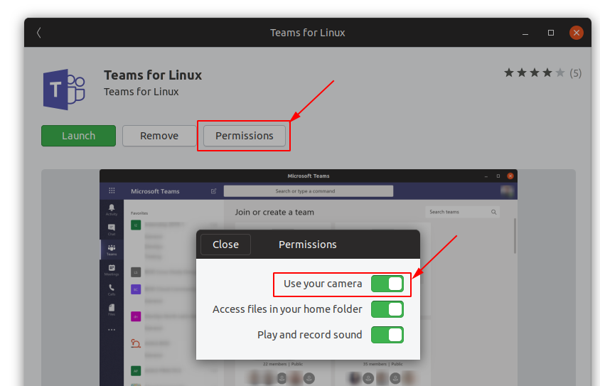

# Known issues

## Oauth services

Some services requires the app to open the windows in electron. An example is github that requires authentication using oauth.

We are defaulting in opening the links in a external browser, but links can be open ina electron windows by using the 'Crl+Click' combination.

## No history

Switching the userAgent with the persistence turn on sometimes have the side effect of "loosing" the channels history. Removing the data under `~/.config/teams-for-linux` or, if using snap `rm -rf /home/$HOME/snap/teams*`, should fix the issue.

## Spellchecker not working

Details are in issue [#28](https://github.com/IsmaelMartinez/teams-for-linux/issues/28)

In short, node_spellchecker only ships with en_US dictionary.

As a work around, you can enable the use of local dictionaries by installing hunspell and your locale dictionary as indicates in this link [https://github.com/atom/spell-check#debian-ubuntu-and-mint](https://github.com/atom/spell-check#debian-ubuntu-and-mint)

## Strange link icon on snap app

Some snap installation show a non standard icon for links. If you suffer this, please use the deb package instead.

Please refer to the issue #99 for more info.

## No desktop notifications

Some notifications daemons in linux don't support the implementation that Microsoft implemented in the browser.

This project includes a desktop notification hack that can be enable by running the application with `teams-for-linux --enableDesktopNotificationsHack`.

## Use camera using the Snap build

Snap uses confinement to provide more security, this restric the access to hardware or data on your device to prevent security issues.

The camera is a restricted device on Snap, so you need to allow the access to the camera on Teams For Linux to be able to do videocalls, to do that you can use the Software Store in your Operating System after the installation of the snap, look for a similar option in your Software Store app:



You can also use this command to create an interface to the camera:

```bash
sudo snap connect teams-for-linux:camera core:camera
```
