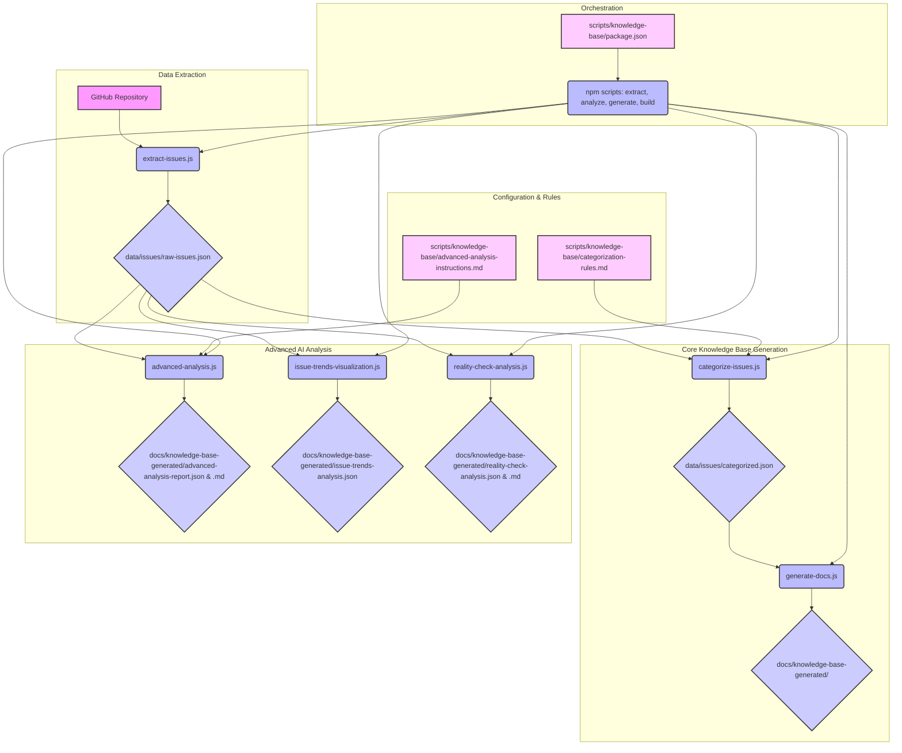

# teams-for-linux

Unofficial Microsoft Teams client for Linux using Electron. This app wraps the
web version of Teams as a standalone desktop application.

## Overview

Teams for Linux was developed to provide a native-like desktop experience by
wrapping the web version in an Electron shell.

While we strive to add useful features and improvements, some limitations are
inherent because the app relies on the Microsoft Teams web version. In cases
where Microsoft controls the feature set (or behavior), issues may be closed
with an explanation.

We are not affiliated with Microsoft, and this project is not endorsed by them.
It is an independent effort to provide a better experience for Linux users.

Please report bugs and enhancements in the issues section. We will attend them
as soon as possible. Please review the open/close issues before raising a new
one and avoid duplicates. We encourage everyone to join our chat room in
[matrix](https://matrix.to/#/#teams-for-linux_community:gitter.im) and ask your
questions. That's probably the quickest way to find solutions.

---

[](https://gitter.im/teams-for-linux/community "Gitter chat")


[](https://snyk.io//test/github/IsmaelMartinez/teams-for-linux?targetFile=package.json)
[](https://sonarcloud.io/summary/new_code?id=IsmaelMartinez_teams-for-linux)

Unofficial Microsoft Teams client for Linux using
[`Electron`](https://electronjs.org/). It uses the Web App and wraps it as a
standalone application using Electron.

## Downloads

Binaries available under
[releases](https://github.com/IsmaelMartinez/teams-for-linux/releases) for Linux
packaging formats — AppImage, rpm, deb, snap, and tar.gz — and, believe it or
not, for Windows and macOS as well.

In the case of `AppImage`, we recommend using
[`AppImageLauncher`](https://github.com/TheAssassin/AppImageLauncher) for the
best desktop experience.

We have a dedicated deb and rpm repo at https://teamsforlinux.de hosted with
:heart: by [Nils Büchner](https://github.com/nbuechner). Please follow the
installation instructions below.

### Debian/Ubuntu and other derivatives

```bash
sudo mkdir -p /etc/apt/keyrings
sudo wget -qO /etc/apt/keyrings/teams-for-linux.asc https://repo.teamsforlinux.de/teams-for-linux.asc
sh -c 'echo "Types: deb\nURIs: https://repo.teamsforlinux.de/debian/\nSuites: stable\nComponents: main\nSigned-By: /etc/apt/keyrings/teams-for-linux.asc\nArchitectures: amd64" | sudo tee /etc/apt/sources.list.d/teams-for-linux-packages.sources'
sudo apt update
sudo apt install teams-for-linux
```

### RHEL/Fedora and other derivatives

```bash
curl -1sLf -o /tmp/teams-for-linux.asc https://repo.teamsforlinux.de/teams-for-linux.asc; rpm --import /tmp/teams-for-linux.asc; rm -f /tmp/teams-for-linux.asc
curl -1sLf -o /etc/yum.repos.d/teams-for-linux.repo https://repo.teamsforlinux.de/rpm/teams-for-linux.repo
yum update
yum install teams-for-linux
```

Also available in:
[](https://aur.archlinux.org/packages/teams-for-linux)
[](https://github.com/pacstall/pacstall-programs/tree/master/packages/teams-for-linux-deb)
[](https://snapcraft.io/teams-for-linux)

<a href='https://flathub.org/apps/details/com.github.IsmaelMartinez.teams_for_linux'></a>

## Configuration and starting arguments

For detailed configuration options, including startup arguments to enable or
disable specific features, please refer to the
[Configuration Documentation](docs/configuration.md).

## Running teams-for-linux in a firejail

A dedicated
[firejail script](https://codeberg.org/lars_uffmann/teams-for-linux-jailed) is
available to help sandbox Teams for Linux. This script can both launch the
application and join meetings with an already running instance.

## Contributing

Contributions, PRs, and suggestions are always welcome!

For information on how to run the app from source or contribute code, please
refer to the [`CONTRIBUTING.md`](CONTRIBUTING.md) file.

## Known issues

A list of known issues and possible workarounds is available in the
[`Knowledge Base`](docs/knowledge-base.md) file. Please check it before opening a new
issue.

## AI Analyst: Knowledge Base System Flow

The Teams for Linux project utilizes an AI Analyst-powered Knowledge Base System to automatically extract, categorize, and analyze GitHub issues, generating comprehensive documentation and insights. This system is built around a series of Node.js scripts that work in a coordinated flow.

### System Flow Diagram



### Explanation of the Flow:

1.  **Data Extraction**:
    *   `extract-issues.js` is the starting point. It pulls raw issue data from the GitHub repository.
    *   The output is `data/issues/raw-issues.json`.

2.  **Core Knowledge Base Generation**:
    *   `categorize-issues.js` takes the `raw-issues.json` as input. It uses rules from `categorization-rules.md` to classify issues.
    *   The output is `data/issues/categorized.json`.
    *   `generate-docs.js` then uses `categorized.json` to create the structured Markdown documentation in `docs/knowledge-base-generated/`.

3.  **Advanced AI Analysis**:
    *   These scripts also operate on the `raw-issues.json` (or implicitly, the same data that `extract-issues.js` provides).
    *   `advanced-analysis.js` performs deep pattern recognition and generates insights, outputting to `docs/knowledge-base-generated/advanced-analysis-report.json` and a summary Markdown file. It's guided by `advanced-analysis-instructions.md`.
    *   `issue-trends-visualization.js` analyzes issue volume and contributor patterns, saving its findings to `docs/knowledge-base-generated/issue-trends-analysis.json`.
    *   `reality-check-analysis.js` provides a critical review of trends, generating `docs/knowledge-base-generated/reality-check-analysis.json` and a summary Markdown file.

4.  **Configuration & Rules**:
    *   `categorization-rules.md` and `advanced-analysis-instructions.md` serve as external configuration/instruction files for their respective scripts.

5.  **Orchestration**:
    *   The `package.json` defines `npm` scripts (`extract`, `analyze`, `generate`, `build`) that orchestrate the execution of these individual Node.js scripts, making it easy to run the entire pipeline or specific parts.

### Markdown Linting

For ensuring the quality and consistency of our Markdown files, we utilize `markdownlint-cli2`. This tool helps enforce GitHub standards and project-specific rules, ensuring our documentation remains clean and well-formatted.

## History

Read about the history of this project in the [`HISTORY.md`](HISTORY.md) file.

## License

Teams for Linux is released under the [`GPLv3`](LICENSE.md)

Some icons are from
[Icon Duck](https://iconduck.com/sets/hugeicons-essential-free-icons) and are
licensed under `CC BY 4.0`.
