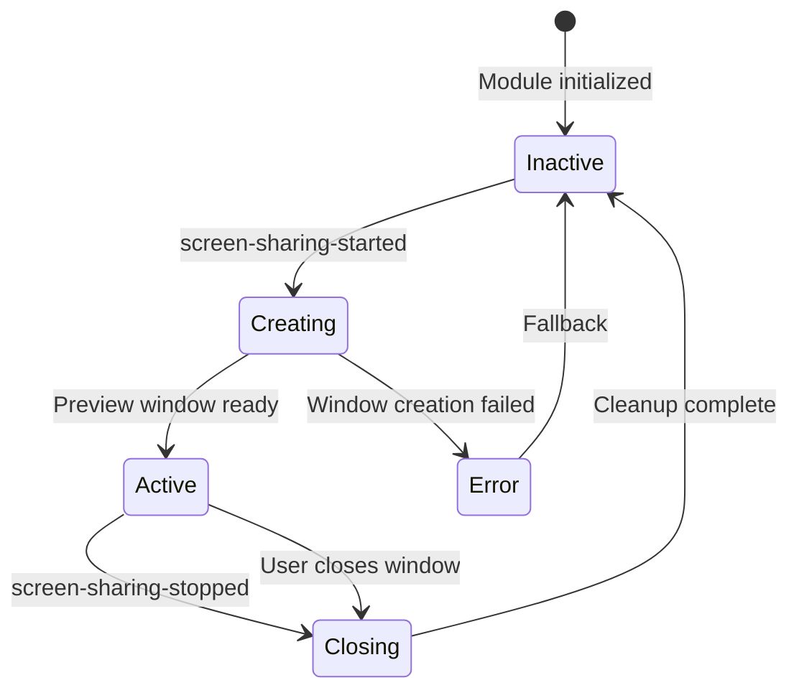

# Screen Sharing Module

This module provides comprehensive screen sharing functionality for Teams for Linux, including source selection, preview window management, and user interface integration.

## Overview

The Screen Sharing module coordinates between Teams' web-based screen sharing requests and native desktop capture capabilities. It manages the complete screen sharing lifecycle from source selection through cleanup.

## Components

### Core Files

- **[index.js](index.js)** - Main `ScreenSharingManager` class handling all screen sharing logic
- **[previewWindow.html](previewWindow.html)** - HTML interface for the screen share preview window
- **[previewWindowPreload.js](previewWindowPreload.js)** - Context bridge for preview window IPC communication

### ScreenSharingManager Class

Central coordinator for all screen sharing functionality:

```javascript
const ScreenSharingManager = require('./screenSharing');

const screenSharing = new ScreenSharingManager(config);

// Check status
const status = screenSharing.getStatus();
// { isActive: false, sourceId: null, screenConfig: null }

// Update configuration
screenSharing.updateConfig(newConfig);

// Cleanup on shutdown
screenSharing.cleanup();
```

## Features

### Preview Window Management

- **Smart Sizing**: Automatically scales preview to thumbnail size while maintaining aspect ratio
- **Always On Top**: Configurable via `screenSharingThumbnail.alwaysOnTop` setting
- **Live Preview**: Shows real-time preview of shared screen/window
- **Status Overlay**: Visual indicator of sharing state
- **Resizable**: User can adjust window size within constraints

### Configuration Options

```json
{
  "screenSharingThumbnail": {
    "enabled": true,
    "alwaysOnTop": true
  }
}
```

- `enabled`: Whether to show preview window (default: `true`)
- `alwaysOnTop`: Keep preview window above other windows (default: `true`)

### IPC Event Handling

The module manages these IPC channels:

#### Incoming Events
- `screen-sharing-started`: Initiates screen sharing with source ID
- `screen-sharing-stopped`: Stops sharing and cleanup
- `stop-screen-sharing-from-thumbnail`: Stop request from preview window
- `create-call-pop-out-window`: Creates preview window
- `resize-preview-window`: Resizes preview window
- `close-preview-window`: Closes preview window

#### Outgoing Events  
- `preview-window-opened`: Emitted when preview window opens
- `preview-window-closed`: Emitted when preview window closes

#### Request Handlers
- `get-screen-sharing-status`: Returns current sharing status
- `get-screen-share-stream`: Returns current source ID
- `get-screen-share-screen`: Returns screen configuration

## Integration

### With Main Process

```javascript
const ScreenSharingManager = require('./screenSharing');

const screenSharing = new ScreenSharingManager(config);

// Screen sharing is now fully managed by the module
```

### With Stream Selector

The screen sharing module works with the existing Stream Selector for source selection:

1. User initiates screen sharing in Teams
2. Stream Selector shows available sources  
3. User selects source
4. `screen-sharing-started` event triggers preview window creation
5. Preview window displays live stream of selected source

### With Browser Scripts

Browser injection scripts send IPC events that the module handles:

```javascript
// From injection scripts
window.electronAPI.sendScreenSharingStarted(sourceId);
window.electronAPI.sendScreenSharingStopped();
```

## Security

- **Context Isolation**: All renderer processes use context isolation
- **No Node Integration**: Renderer processes run without Node.js access
- **Sandboxed**: Compatible with Electron sandbox mode
- **Preload Scripts**: Secure IPC communication via `contextBridge`

## Window Lifecycle



## Error Handling

- **Window Creation Failures**: Graceful degradation without preview
- **Stream Access Errors**: Clear error messages in preview window  
- **IPC Communication Issues**: Robust error handling and logging
- **Configuration Errors**: Fallback to default settings

## Platform Support

- **Linux**: X11 and Wayland desktop capture
- **macOS**: Screen Recording permission handling
- **Windows**: Desktop Window Manager integration

---

For complete implementation details, see the [Screen Sharing Documentation](../../docs/screen-sharing.md).