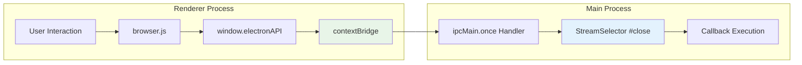

# Screen Sharing Module

The Screen Sharing module provides comprehensive screen sharing functionality for Teams for Linux. This includes the native screen/window selection interface, IPC communication handlers for screen sharing events, and preview window management.

## Overview

This module bridges the gap between Teams' web-based screen sharing requests and the native desktop capture capabilities provided by Electron's `desktopCapturer` API. It consists of two main components:

1. **StreamSelector** - Provides the native UI for selecting which screen/window to share
2. **ScreenSharingService** - Manages IPC handlers, screen sharing lifecycle events, and preview window state

The module ensures a smooth user experience while maintaining security through proper permission handling.

## Architecture

```mermaid
flowchart TD
    subgraph "Main Process"
        A[setDisplayMediaRequestHandler] --> B[StreamSelector.show()]
        B --> C[BrowserWindow Creation]
        C --> D[Load Selection UI]
        D --> E[desktopCapturer.getSources()]
        E --> F[Display Sources to User]
    end
    
    subgraph "Stream Selector Window"
        F --> G[User Interface]
        G --> H[Source Thumbnails]
        H --> I[User Selection]
        I --> J[IPC: source-selected]
    end
    
    subgraph "Callback Flow"
        J --> K[Callback Resolution]
        K --> L[Window Cleanup]
        L --> M[Return to Teams]
    end
    
    style G fill:#e3f2fd
    style I fill:#c8e6c9
    style L fill:#ffcdd2
```

## Key Components

### Files Structure

- **[service.js](service.js)** - ScreenSharingService class for IPC handlers and state management
- **[index.js](index.js)** - StreamSelector class for source selection UI
- **[browser.js](browser.js)** - Renderer process logic for UI interactions
- **[preload.js](preload.js)** - Context bridge for secure IPC communication
- **[previewWindowPreload.js](previewWindowPreload.js)** - Preload script for preview window
- **[index.html](index.html)** - User interface template for source selection
- **[previewWindow.html](previewWindow.html)** - User interface for preview window
- **[index.css](index.css)** - Styling for the selection interface
- **[injectedScreenSharing.js](injectedScreenSharing.js)** - Client-side script for Teams DOM integration

### ScreenSharingService Class

The ScreenSharingService class manages all IPC handlers and state for screen sharing functionality. It is instantiated in the main process and provides:

- **Desktop capturer access** - Handles requests for available screens and windows
- **Lifecycle event tracking** - Monitors screen sharing start/stop events
- **Preview window management** - Controls preview window state and dimensions
- **Screen picker dialog** - Shows modal dialog for legacy screen selection flows

```javascript
const ScreenSharingService = require("./screenSharing/service");
const screenSharingService = new ScreenSharingService(mainWindow);

// Register all IPC handlers
screenSharingService.initialize();
```

**IPC Channels Handled:**

- `desktop-capturer-get-sources` - Returns available screens and windows
- `choose-desktop-media` - Shows picker dialog and returns selected source
- `cancel-desktop-media` - Cancels ongoing source selection
- `screen-sharing-started` - Notifies when screen sharing session starts
- `screen-sharing-stopped` - Notifies when screen sharing session stops
- `get-screen-sharing-status` - Returns whether screen sharing is active
- `get-screen-share-stream` - Returns the active screen share source ID
- `get-screen-share-screen` - Returns screen dimensions for the shared source
- `resize-preview-window` - Resizes the preview window
- `stop-screen-sharing-from-thumbnail` - Stops sharing from preview window control

### StreamSelector Class

The StreamSelector class provides a modern interface for displaying the source selection dialog:

```javascript
const streamSelector = new StreamSelector(parentWindow);

// Show source selector and get user choice
streamSelector.show((selectedSource) => {
  if (selectedSource) {
    console.log('User selected:', selectedSource.name);
    // Use selectedSource.id for screen capture
  } else {
    console.log('User cancelled selection');
  }
});
```

### Window Lifecycle


## Implementation Details

### Security Features

⚠️ **Note**: As of v2.6+, security configuration has been modified for Teams DOM access:
- **Context Isolation**: **Disabled** to enable Teams DOM access functionality
- **Node Integration**: **Enabled** for browser tools functionality
- **Preload Script**: Direct window object exposure (no contextBridge)
- **Sandboxing**: **Disabled** to enable system API access

### Desktop Source Detection

The module uses Electron's `desktopCapturer.getSources()` to enumerate available sources:

```javascript
// Get all available screens and windows
const sources = await desktopCapturer.getSources({
  types: ['window', 'screen'],
  thumbnailSize: { width: 300, height: 200 }
});
```

Source types include:
- **Screen**: Full desktop/monitor capture
- **Window**: Individual application window capture

### User Interface Features

- **Live Thumbnails**: Preview of each available source
- **Source Information**: Display name and type for each option
- **Responsive Grid**: Adapts to different numbers of sources
- **Keyboard Navigation**: Arrow keys and Enter/Escape support
- **Click Selection**: Mouse interaction for source selection

### IPC Communication Pattern

The stream selector uses secure IPC communication via contextBridge:



**Key IPC Channels:**
- `selected-source` - User selected a screen/window source
- `close-view` - User cancelled or closed the selector

Both use `ipcMain.once()` pattern for single-use event handlers with automatic cleanup.

## Integration with Screen Sharing

The StreamSelector integrates with the broader screen sharing system through:

1. **Trigger**: `setDisplayMediaRequestHandler` in main window manager
2. **Selection**: StreamSelector handles user choice
3. **Result**: Selected source passed to screen sharing pipeline
4. **Cleanup**: Window closes and resources are freed

### Relationship to Other Modules

- **Main App Window**: Registers the display media request handler
- **Screen Sharing Logic**: Consumes the selected source for capture
- **Popup Window**: Created after source selection for thumbnail display
- **IPC System**: Facilitates secure communication between processes

## Configuration

No direct configuration options, but behavior is influenced by:

- **Screen sharing settings**: Whether thumbnails are enabled
- **System permissions**: Desktop capture access
- **Display settings**: Available screens and resolution

## Error Handling

### Common Scenarios

- **No sources available**: Shows appropriate message to user
- **Permission denied**: Handles desktop capture permission errors  
- **Window creation failure**: Graceful fallback to callback with null
- **User cancellation**: Properly cleans up and reports null selection

## Platform Differences

### Linux
- **X11**: Direct screen capture support
- **Wayland**: Uses PipeWire portal for desktop capture
  - **Important**: Wayland requires source IDs in `screen:x:y` or `window:x:y` format (from desktopCapturer)
  - MediaStream UUIDs will cause preview window failures on Wayland
  - See [ADR 001](../../docs/adr/001-use-desktopcapturer-source-id-format.md) for technical details

### macOS
- **Screen Recording Permission**: Required for desktop capture
- **Retina Displays**: High-DPI thumbnail generation

### Windows
- **DWM Integration**: Desktop Window Manager compatibility
- **Multi-monitor**: Proper handling of multiple displays

## Architecture Decisions

For important technical decisions regarding screen sharing implementation:

- [ADR 001: Use desktopCapturer Source ID Format](../../docs/adr/001-use-desktopcapturer-source-id-format.md) - Why we use `screen:x:y` format instead of MediaStream UUIDs

---

For more information about the complete screen sharing implementation, see [Screen Sharing Documentation](../../docs-site/docs/screen-sharing.md).