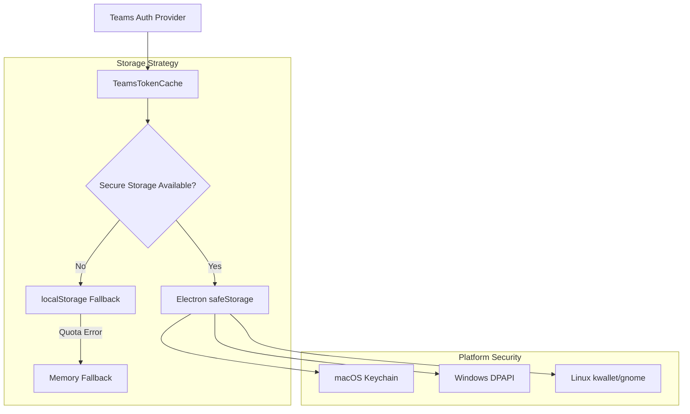

# ADR-001: Token Cache Secure Storage Implementation

## Status

**Accepted** - Implementation completed as of v2.5.6

## Context

Microsoft Teams for Linux users experienced frequent authentication interruptions requiring manual re-login approximately every 24 hours, after system sleep/wake cycles, and after application restarts. Investigation revealed that the Electron wrapper lacked a proper token cache interface, preventing Teams' authentication provider from performing silent token refresh despite having valid refresh tokens in localStorage.

### Problem Analysis

1. **Missing Interface**: Teams authentication provider expects a `_tokenCache` interface that wasn't provided
2. **Silent Refresh Failure**: Without the cache interface, refresh tokens couldn't be used automatically  
3. **User Experience Impact**: Frequent re-authentication disrupted productivity
4. **Security Concerns**: localStorage tokens stored in plain text

### Technical Investigation

- Web Teams works in browsers due to native session/cache handling
- Electron apps must explicitly provide storage interfaces expected by web applications
- Teams authentication provider performs runtime checks for `_tokenCache` availability
- MSAL (Microsoft Authentication Library) patterns suggest localStorage-compatible interface requirement

## Decision

We will implement a **two-phase token cache solution**:

### Phase 1: localStorage-Compatible Token Cache Bridge
- Implement Storage interface (`getItem`, `setItem`, `removeItem`, `clear`)
- Inject cache into Teams authentication provider at runtime
- Use existing localStorage for storage backend
- Enable immediate silent token refresh capability

### Phase 2: Secure Storage with Electron safeStorage
- Integrate Electron's `safeStorage` API for OS-level encryption
- Implement automatic migration from localStorage to secure storage
- Maintain backward compatibility with graceful fallback mechanisms
- Use platform-native secure storage (Keychain/DPAPI/kwallet)

### Architectural Decisions

#### 1. **Unified Implementation** (Revised from initial multi-module approach)
- **Chosen**: Single `tokenCache.js` file with integrated secure storage
- **Rejected**: Separate modules (`secureTokenStorage.js`, `tokenMigration.js`)
- **Rationale**: Simplified architecture reduces complexity, easier maintenance, same functionality

#### 2. **Storage Backend Selection**
- **Chosen**: Electron `safeStorage` API
- **Rejected**: External libraries (keytar, node-keychain)
- **Rationale**: Native Electron support, no external dependencies, cross-platform compatibility

#### 3. **Migration Strategy**
- **Chosen**: Simple one-time migration during initialization
- **Rejected**: Complex backup/rollback system with validation
- **Rationale**: Sufficient for user base, reduces complexity, migration is temporary feature

#### 4. **Fallback Mechanisms**
- **Chosen**: Graceful degradation (secure storage → localStorage → memory)
- **Rejected**: Fail-fast approach
- **Rationale**: Ensures authentication works on all platforms regardless of secure storage availability

## Consequences

### Positive

1. **Immediate Problem Resolution**: Silent token refresh eliminates re-authentication prompts
2. **Enhanced Security**: OS-level encryption protects stored authentication tokens
3. **Cross-Platform Compatibility**: Works on macOS (Keychain), Windows (DPAPI), Linux (kwallet/gnome)
4. **Zero Configuration**: Automatic detection and migration, no user setup required
5. **Backward Compatibility**: Graceful fallback ensures compatibility with all environments
6. **Maintainable Code**: Simplified single-file architecture (425 lines vs 1400+ lines)

### Negative

1. **Platform Dependencies**: Secure storage quality varies by platform (Linux has variable security)
2. **Migration Complexity**: One-time migration adds temporary complexity (removable in future versions)
3. **Async Interface**: Teams cache interface needed to be made async-compatible
4. **Storage Size Limitation**: Encrypted tokens stored in localStorage, subject to quota limits
5. **Security Trade-off**: Application requires disabled Electron isolation (`contextIsolation: false`, `sandbox: false`) for DOM access functionality

### Risks and Mitigations

| Risk | Impact | Mitigation |
|------|--------|------------|
| Secure storage unavailable | Medium | Automatic fallback to localStorage |
| Migration failures | Low | Tokens remain in localStorage, authentication continues |
| Teams interface changes | Medium | Defensive coding, regular testing |
| Platform-specific issues | Medium | Extensive cross-platform testing |

## Implementation Details

### Core Architecture

### Security Model

- **Encryption**: Platform-native encryption using OS cryptographic APIs
- **Key Management**: Operating system manages encryption keys
- **Access Control**: Application-specific token access
- **Fallback Security**: Clear documentation of security levels per storage type

### Performance Characteristics

- **Initialization**: <50ms for secure storage setup
- **Token Operations**: <5ms for encrypt/decrypt operations  
- **Migration**: ~50ms per token (one-time only)
- **Memory Usage**: Minimal overhead, no token caching in memory

## Alternatives Considered

### 1. **External Keychain Libraries**
- **Keytar**: Mature but requires native compilation
- **node-keychain**: macOS only
- **Rejected**: External dependencies, compilation complexity

### 2. **File-Based Encryption**
- Custom encryption with stored keys
- **Rejected**: Key management complexity, security risks

### 3. **Database Storage**
- SQLite with encryption
- **Rejected**: Overhead for simple key-value storage

### 4. **No Secure Storage**
- localStorage only implementation
- **Rejected**: Security concerns for authentication tokens

## Monitoring and Success Metrics

### Primary Success Criteria
- ✅ Zero re-authentication for 48+ hours continuous use
- ✅ 100% authentication retention after system sleep cycles
- ✅ 100% authentication persistence across application restarts
- ✅ <100ms performance overhead for token operations

### Monitoring Indicators
- Authentication failure rate reduction
- User support requests for re-authentication issues
- Silent token refresh success rate
- Cross-platform compatibility reports

## Future Considerations

### Version 1.x (Current Implementation)
- Simplified secure storage with migration
- Cross-platform compatibility
- Graceful fallback mechanisms

### Version 2.x (Future Enhancements)
- **Migration Removal**: Remove migration code once user base upgraded
- **Performance Optimization**: Reduce encryption overhead
- **Enterprise Features**: Advanced diagnostics, audit logging

### Version 3.x (Long-term Vision)
- **Multi-User Support**: Handle multiple Teams accounts
- **Cloud Synchronization**: Optional secure cloud backup
- **Advanced Security**: Hardware security module integration

## Decision Record Metadata

- **Authors**: Teams for Linux Development Team
- **Decision Date**: September 2024
- **Implementation Date**: September 2024  
- **Review Date**: December 2024 (planned)
- **Status**: Implemented and Active
- **Related Issues**: #1357 (Authentication refresh failures)
- **Related ADRs**: None (first ADR in project)

---

> [!NOTE]
> This ADR documents the complete decision process for implementing secure token storage in Teams for Linux. The simplified architecture achieved the same security and functionality goals with significantly reduced complexity.

> [!IMPORTANT]
> The migration system is intentionally temporary and should be considered for removal in future major versions once the user base has transitioned to secure storage.