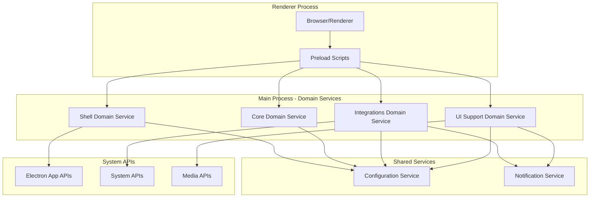

# Task 1.3: IPC Channel Domain Mapping - Architecture Modernization

*Generated: 2025-01-26*  
*Status: Completed*  
*Related PRD: Architecture Modernization*

## Executive Summary

Comprehensive analysis of 35+ IPC communication channels reveals significant domain boundary violations and coordination complexity. Current implementation mixes domain concerns across handlers, with the monolithic `app/index.js` managing handlers that should belong to specific domains. Clear migration path identified for redistributing IPC ownership.

## Complete IPC Channel Inventory

### Current Implementation Location vs Domain Assignment

| IPC Channel | Type | Current Location | Proposed Domain | Migration Complexity |
|-------------|------|------------------|-----------------|---------------------|
| `get-config` | handle | `app/index.js` | **Core** | ✅ Low - Simple config access |
| `config-file-changed` | on | `app/index.js` | **Shell** | ⚠️ Medium - App restart logic |
| `get-app-version` | handle | `app/index.js` | **Shell** | ✅ Low - Version metadata |
| `get-system-idle-state` | handle | `app/index.js` | **Integrations** | ⚠️ Medium - System API access |
| `user-status-changed` | handle | `app/index.js` | **Core** | ✅ Low - User state management |
| `set-badge-count` | handle | `app/index.js` | **Integrations** | ✅ Low - System integration |
| `show-notification` | handle | `app/index.js` | **Integrations** | ⚠️ Medium - Cross-domain notifications |
| `play-notification-sound` | handle | `app/index.js` | **Integrations** | ✅ Low - System audio |
| `get-zoom-level` | handle | `app/index.js` | **UI Support** | ❌ High - Partition management |
| `save-zoom-level` | handle | `app/index.js` | **UI Support** | ❌ High - Partition persistence |
| `desktop-capturer-get-sources` | handle | `app/index.js` | **UI Support** | ⚠️ Medium - Media capture |
| `choose-desktop-media` | handle | `app/index.js` | **UI Support** | ❌ High - Complex UI coordination |
| `cancel-desktop-media` | on | `app/index.js` | **UI Support** | ✅ Low - Simple cancellation |
| `screen-sharing-stopped` | on | `app/index.js` | **UI Support** | ⚠️ Medium - Global state cleanup |
| `get-screen-sharing-status` | handle | `app/index.js` | **UI Support** | ✅ Low - State query |
| `get-screen-share-stream` | handle | `app/index.js` | **UI Support** | ✅ Low - Stream info |
| `get-screen-share-screen` | handle | `app/index.js` | **UI Support** | ✅ Low - Display info |
| `resize-preview-window` | on | `app/index.js` | **UI Support** | ⚠️ Medium - Window management |
| `stop-screen-sharing-from-thumbnail` | on | `app/index.js` | **UI Support** | ⚠️ Medium - Cross-process coordination |

## Domain-Specific IPC Analysis

### Shell Domain IPC Channels

#### Application Lifecycle & Control
```javascript
// Proposed Shell Domain Handler Ownership
ipcMain.on("config-file-changed", restartApp);           // Line 88
ipcMain.handle("get-app-version", async () => {          // Line 113
  return config.appVersion;
});
```

**Responsibilities:**
- Application restart coordination
- Version information access
- Electron lifecycle management

**Migration Notes:**
- `config-file-changed` requires access to `app.relaunch()` and `app.exit()`
- Should remain in main entry point for lifecycle coordination

---

### Core Domain IPC Channels

#### Configuration & User State Management
```javascript
// Proposed Core Domain Handler Ownership
ipcMain.handle("get-config", async () => {              // Line 89
  return config;
});
ipcMain.handle("user-status-changed", userStatusChangedHandler); // Line 111
```

**Current Dependencies:**
- `appConfig.startupConfig` - Configuration access
- `userStatus` global variable - Needs encapsulation

**Migration Strategy:**
- Move handlers to Core domain service
- Create domain-specific configuration facade
- Encapsulate user status in Core state manager

---

### Integrations Domain IPC Channels

#### System Integration & Notifications
```javascript
// Proposed Integrations Domain Handler Ownership
ipcMain.handle("get-system-idle-state", handleGetSystemIdleState);     // Line 92
ipcMain.handle("show-notification", showNotification);                 // Line 110
ipcMain.handle("play-notification-sound", playNotificationSound);      // Line 109
ipcMain.handle("set-badge-count", setBadgeCountHandler);               // Line 112

// Additional handlers from modules
ipcMain.on("tray-update", (_event, data) => { ... });                 // menus/tray.js
ipcMain.on("offline-retry", this.refresh);                            // connectionManager
```

**Current Dependencies:**
- `powerMonitor.getSystemIdleState()` - System API
- `Notification`, `nativeImage` - Electron system integration
- `userStatus`, `idleTimeUserStatus` - Global state variables
- `player` - Audio notification system

**Complex Integration:**
- **show-notification** combines sound + visual + user status logic
- **get-system-idle-state** manages complex idle detection with user status
- **tray-update** bridges renderer notifications to system tray

---

### UI Support Domain IPC Channels

#### Screen Sharing & Media Management
```javascript
// Proposed UI Support Domain Handler Ownership
ipcMain.handle("desktop-capturer-get-sources", (_event, opts) =>      // Line 95
  desktopCapturer.getSources(opts));
ipcMain.handle("choose-desktop-media", async (_event, sourceTypes) => // Line 98
  // Complex UI coordination logic
ipcMain.on("cancel-desktop-media", () => { ... });                    // Line 104

// Screen sharing state management
ipcMain.handle("get-screen-sharing-status", () => {                   // Line 128
  return global.selectedScreenShareSource !== null;
});
ipcMain.handle("get-screen-share-stream", () => { ... });            // Line 132
ipcMain.handle("get-screen-share-screen", () => { ... });            // Line 142
ipcMain.on("screen-sharing-stopped", () => { ... });                 // Line 118
ipcMain.on("resize-preview-window", (event, { width, height }) =>    // Line 160
ipcMain.on("stop-screen-sharing-from-thumbnail", () => { ... });     // Line 170

// Zoom management
ipcMain.handle("get-zoom-level", handleGetZoomLevel);                 // Line 93
ipcMain.handle("save-zoom-level", handleSaveZoomLevel);               // Line 94

// Custom background management  
ipcMain.handle("get-custom-bg-list", this.handleGetCustomBGList);     // customBackground
```

**Complex State Dependencies:**
- `global.selectedScreenShareSource` - Screen sharing state
- `global.previewWindow` - Preview window reference
- `picker` - Screen picker window reference
- Partition management for zoom levels

**High Migration Complexity:**
- **choose-desktop-media** creates UI windows and coordinates user selection
- **Screen sharing handlers** manage cross-window state synchronization
- **Zoom level management** requires partition-aware storage

---

## Cross-Domain Communication Patterns

### Module-Specific IPC Handlers

#### mainAppWindow/browserWindowManager.js
```javascript
ipcMain.on("select-source", this.assignSelectSourceHandler());        // Line 82
ipcMain.handle("incoming-call-created", this.assignIncomingCallCreatedHandler()); // Line 86
ipcMain.handle("incoming-call-ended", this.assignIncomingCallEndedHandler());     // Line 90
ipcMain.handle("call-connected", this.assignOnCallConnectedHandler());           // Line 94
ipcMain.handle("call-disconnected", this.assignOnCallDisconnectedHandler());     // Line 95
```

**Domain Assignment:** Core Domain (Teams-specific call events)
**Migration Complexity:** Medium - Requires state coordination with UI

#### screenSharing/ Module
```javascript
ipcMain.once("selected-source", _close);                             // index.js:80
ipcMain.once("close-view", _close);                                   // index.js:81
```

**Domain Assignment:** UI Support Domain
**Migration Complexity:** Low - Self-contained module handlers

#### login/ Module
```javascript
ipcMain.on("submitForm", submitFormHandler(callback, win));           // index.js:25
```

**Domain Assignment:** Core Domain (Authentication)
**Migration Complexity:** Low - Isolated authentication logic

#### incomingCallToast/ Module  
```javascript
ipcMain.on('incoming-call-action', (event, action) => { ... });      // index.js:27
ipcMain.once('incoming-call-toast-ready', () => { ... });            // index.js:36
```

**Domain Assignment:** Integrations Domain (System notifications)
**Migration Complexity:** Low - Well-encapsulated UI component

---

## Renderer-to-Main Communication Analysis

### Browser Integration Points

#### Primary preload.js Integration
```javascript
// Core Domain calls
getConfig: () => ipcRenderer.invoke("get-config"),
setUserStatus: (data) => ipcRenderer.invoke("user-status-changed", data),

// Integrations Domain calls  
showNotification: (options) => ipcRenderer.invoke("show-notification", options),
playNotificationSound: (options) => ipcRenderer.invoke("play-notification-sound", options),
setBadgeCount: (count) => ipcRenderer.invoke("set-badge-count", count),
updateTray: (icon, flash) => ipcRenderer.send("tray-update", icon, flash),

// UI Support Domain calls
getZoomLevel: (partition) => ipcRenderer.invoke("get-zoom-level", partition),
saveZoomLevel: (data) => ipcRenderer.invoke("save-zoom-level", data),
cancelChooseDesktopMedia: () => ipcRenderer.send("cancel-desktop-media"),
sendScreenSharingStarted: (sourceId) => ipcRenderer.send("screen-sharing-started", sourceId),
sendScreenSharingStopped: () => ipcRenderer.send("screen-sharing-stopped"),
```

#### Activity Manager Integration
```javascript
// System integration calls
ipcRenderer.invoke("get-system-idle-state")

// Call event management
ipcRenderer.invoke("incoming-call-created", data)
ipcRenderer.invoke("incoming-call-ended")
ipcRenderer.invoke("call-connected")
ipcRenderer.invoke("call-disconnected")
```

---

## Main-to-Renderer Communication

### WebContents.send() Patterns
```javascript
// Screen sharing status updates
global.previewWindow.webContents.send("screen-sharing-status-changed");

// Call management
this.window.webContents.send("incoming-call-action", action);
this.window.webContents.send("enable-wakelock");
this.window.webContents.send("disable-wakelock");

// Settings synchronization
this.window.webContents.send("get-teams-settings");
this.window.webContents.send("set-teams-settings", fileContents);

// Window management
window.webContents.send("page-title", title);
```

---

## IPC Migration Strategy by Domain

### Phase 1: Shell Domain (Low Risk)
**Move to Shell Domain Service:**
- `get-app-version` ✅
- `config-file-changed` ⚠️ (coordinate with Core config access)

**Estimated Effort:** 1-2 hours
**Dependencies:** Minimal - version info and app lifecycle

---

### Phase 2: Core Domain (Medium Risk)
**Move to Core Domain Service:**
- `get-config` ✅
- `user-status-changed` ✅
- Call event handlers (`call-connected`, `call-disconnected`, etc.) ⚠️
- `submitForm` (login) ✅

**Estimated Effort:** 4-6 hours
**Dependencies:** Configuration facade, user state encapsulation

---

### Phase 3: Integrations Domain (High Risk)
**Move to Integrations Domain Service:**
- `get-system-idle-state` ❌ (complex user status interaction)
- `show-notification` ❌ (cross-domain notification logic)
- `play-notification-sound` ✅
- `set-badge-count` ✅
- `tray-update` ✅

**Estimated Effort:** 8-12 hours
**Dependencies:** User status access, notification coordination, system APIs

---

### Phase 4: UI Support Domain (Highest Risk) 
**Move to UI Support Domain Service:**
- Screen sharing handlers (9 handlers) ❌ (complex global state)
- Zoom management (2 handlers) ❌ (partition-aware storage)
- `choose-desktop-media` ❌ (UI window coordination)
- `get-custom-bg-list` ✅

**Estimated Effort:** 12-16 hours
**Dependencies:** Global state migration, window management, partition handling

---

## Critical Migration Challenges

### 1. Global State Dependencies
**Current:** Multiple IPC handlers directly access global variables
```javascript
let userStatus = -1;                    // Used by multiple domains
let idleTimeUserStatus = -1;           // System idle + user status
global.selectedScreenShareSource;      // Screen sharing state
global.previewWindow;                  // UI window reference
```

**Solution:** Domain-specific state encapsulation with service interfaces

### 2. Cross-Domain Notifications
**Current:** `show-notification` combines:
- Sound playback (Integrations)
- User status checking (Core)  
- System notification display (Integrations)

**Solution:** Domain event pattern with notification service coordination

### 3. Complex UI Coordination
**Current:** `choose-desktop-media` directly manages:
- Window creation
- Source enumeration
- User selection UI
- Callback coordination

**Solution:** UI Support domain service with proper abstraction layers

### 4. Configuration Access Patterns
**Current:** Multiple handlers directly access `config` object
**Solution:** Domain-specific configuration facades

---

## Proposed Domain IPC Architecture

### Domain Service Pattern


### Domain-Specific IPC Namespacing
```javascript
// Proposed IPC channel organization
// Shell Domain
"shell:get-version"
"shell:restart-app"

// Core Domain  
"core:get-config"
"core:user-status-changed"
"core:call-connected"

// Integrations Domain
"integrations:show-notification" 
"integrations:system-idle-state"
"integrations:tray-update"

// UI Support Domain
"ui:screen-sharing-status"
"ui:zoom-level-get"
"ui:custom-backgrounds"
```

## Next Steps

1. **Task 1.4:** Identify shared state and global variables needing encapsulation
2. **Create migration plan:** Prioritize low-risk handlers first
3. **Design domain services:** Create proper abstraction layers
4. **Implement IPC namespacing:** Prevent future domain violations

---

*This mapping provides the foundation for systematic IPC handler migration while maintaining backward compatibility.*