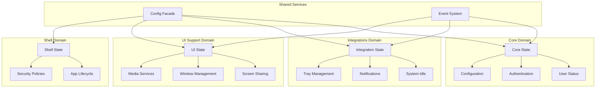

# Task 1.4: Shared State & Global Variables Analysis - Architecture Modernization

*Generated: 2025-01-26*  
*Status: Completed*  
*Related PRD: Architecture Modernization*

## Executive Summary

Analysis reveals **15+ shared state variables** and **6 global objects** that violate domain boundaries and create tight coupling across the application. The current architecture uses a mix of module-level variables, Node.js globals, and singleton patterns that make testing, reasoning, and domain separation extremely difficult. Critical migration path identified for proper state encapsulation.

## Global State Inventory

### Critical Global Variables (`app/index.js`)

| Variable | Type | Current Usage | Domain Assignment | Migration Complexity |
|----------|------|---------------|-------------------|---------------------|
| `userStatus` | `let` | Teams user status tracking (-1=unknown, 1=available) | **Core** | ❌ High - Used across domains |
| `idleTimeUserStatus` | `let` | User status when system went idle | **Integrations** | ❌ High - System idle coordination |
| `picker` | `let` | Screen picker window reference | **UI Support** | ⚠️ Medium - Window lifecycle |
| `player` | `let` | Audio notification player instance | **Integrations** | ✅ Low - Self-contained service |
| `config` | `const` | Application configuration object | **Cross-cutting** | ❌ High - Accessed everywhere |
| `appConfig` | `const` | AppConfiguration class instance | **Core** | ⚠️ Medium - Configuration management |

#### Usage Analysis
```javascript
// app/index.js - Current global state access patterns
let userStatus = -1;                    // Line 44 - Used by 3+ functions
let idleTimeUserStatus = -1;           // Line 45 - System idle detection  
let picker = null;                     // Line 46 - Screen picker window
let player;                           // Line 48 - Audio notification system
const config = appConfig.startupConfig; // Line 28 - Configuration access
```

**Cross-Domain Dependencies:**
- `userStatus` accessed by notification system (Integrations) and idle detection (Integrations)
- `config` object passed to every module and service
- `player` used by notification handlers in main index.js

---

### Node.js Global Objects

#### Screen Sharing State (`global.*`)
```javascript
// Managed across app/index.js and app/mainAppWindow/
global.selectedScreenShareSource = null;    // Current screen share source
global.previewWindow = null;                // Screen sharing preview window
```

**Access Locations:**
- **app/index.js**: Lines 119, 122, 123, 129, 134-137, 145-146, 151, 161-166, 171-173
- **app/mainAppWindow/index.js**: Lines 59-60, 64, 83, 87-88, 91-93, 175

**Domain Assignment:** UI Support Domain
**Migration Complexity:** ❌ **Highest Risk** - Complex cross-module coordination

#### Security Override (`global.eval`)
```javascript
// app/mainAppWindow/browserWindowManager.js:44
this.window.eval = global.eval = function () {
  throw new Error("Sorry, this app does not support window.eval().");
};
```

**Purpose:** Security hardening against eval() usage
**Domain Assignment:** Shell Domain (security enforcement)
**Migration Complexity:** ✅ Low - Security enforcement

---

### Module-Level Shared State

#### Main App Window Module (`app/mainAppWindow/index.js`)
```javascript
let iconChooser;                    // Line 30 - Tray icon management service
let intune;                        // Line 31 - Enterprise SSO service  
let isControlPressed = false;      // Line 32 - Keyboard state tracking
let aboutBlankRequestCount = 0;    // Line 36 - Auth flow counter
let window = null;                 // Line 38 - Main window reference
let appConfig = null;              // Line 39 - Configuration reference
let customBackgroundService = null; // Line 40 - Background service
let streamSelector;                // Line 41 - Screen sharing selector
let allowFurtherRequests = true;   // Line 206 - Request throttling
```

**Impact:** Central coordination module with 9 module-level variables
**Domain Violations:** Mixing Core, Integrations, and UI Support concerns
**Migration Complexity:** ❌ **Highest Priority** - Requires complete decomposition

#### Custom Background Service (`app/customBackground/index.js`)
```javascript
let customBGServiceUrl;            // Line 6 - Module-level service URL
```

**Usage:** HTTP redirect coordination for custom backgrounds
**Domain Assignment:** UI Support Domain
**Migration Complexity:** ⚠️ Medium - HTTP service coordination

#### InTune Integration (`app/intune/index.js`)
```javascript
let inTuneAccount = null;          // Line 3 - SSO account state
```

**Purpose:** Enterprise SSO account management
**Domain Assignment:** Core Domain (authentication)
**Migration Complexity:** ⚠️ Medium - Enterprise authentication state

#### Login Module (`app/login/index.js`)
```javascript
let isFirstLoginTry = true;        // Line 5 - Login attempt tracking
```

**Purpose:** Track authentication retry attempts
**Domain Assignment:** Core Domain (authentication)
**Migration Complexity:** ✅ Low - Simple boolean flag

---

## WeakMap-Based Private State

### Proper Encapsulation Patterns (Good Examples)

#### AppConfiguration Module
```javascript
let _AppConfiguration_configPath = new WeakMap();        // Line 6
let _AppConfiguration_startupConfig = new WeakMap();     // Line 7  
let _AppConfiguration_legacyConfigStore = new WeakMap(); // Line 8
let _AppConfiguration_settingsStore = new WeakMap();     // Line 9
```

**Assessment:** ✅ **Best Practice** - Proper private field simulation
**Domain:** Core (Configuration management)
**Migration:** No changes needed - exemplary pattern

#### StreamSelector Module  
```javascript
let _StreamSelector_parent = new WeakMap();       // Line 4
let _StreamSelector_window = new WeakMap();       // Line 5
let _StreamSelector_selectedSource = new WeakMap(); // Line 6
let _StreamSelector_callback = new WeakMap();     // Line 7
```

**Assessment:** ✅ **Good Pattern** - Proper state encapsulation
**Domain:** UI Support (Screen sharing)
**Migration:** No changes needed - can serve as template

#### Browser Tools (Multiple modules)
```javascript
// Zoom tool
let _Zoom_config = new WeakMap();           // Line 13
let _Zoom_initialized = new WeakMap();      // Line 14

// Settings tool  
let _Settings_config = new WeakMap();       // Line 3
let _Settings_ipcRenderer = new WeakMap();  // Line 4

// Shortcuts tool
let _Shortcuts_config = new WeakMap();      // Line 4
let _Shortcuts_initialized = new WeakMap(); // Line 5
```

**Assessment:** ✅ **Good Pattern** - Instance-specific private state
**Domain:** UI Support (Browser tools)
**Migration:** Templates for other module refactoring

---

## State Access Patterns Analysis

### Configuration Dependencies

#### Widespread Config Access
```javascript
// Configuration object passed to virtually every module
const config = appConfig.startupConfig;  // app/index.js:28

// Examples of direct config access:
new CustomBackground(app, config)         // app/index.js:408
mainAppWindow.onAppReady(appConfig, ...)  // app/index.js:408
new TrayIconChooser(config)              // mainAppWindow/index.js:108
```

**Problem:** Configuration coupling across all domains
**Impact:** Makes domain separation extremely difficult
**Solution:** Domain-specific configuration facades

#### Configuration State Mutations
```javascript
config.appPath = path.join(__dirname, !app.isPackaged ? "" : "../../");
// Direct mutation of supposedly immutable configuration
```

**Problem:** Configuration should be immutable after initialization
**Impact:** Unpredictable behavior, hard to reason about state changes

---

### Cross-Module State Sharing

#### User Status Coordination
```javascript
// app/index.js - Multiple functions access userStatus
async function userStatusChangedHandler(_event, options) {
  userStatus = options.data.status;     // Line 520 - Write access
}

async function playNotificationSound(_event, options) {
  if (config.disableNotificationSoundIfNotAvailable && 
      userStatus !== 1 && userStatus !== -1) {  // Lines 313-315 - Read access
    return; // Don't play sound if user not available
  }
}

async function handleGetSystemIdleState() {
  if (systemIdleState !== "active" && idleTimeUserStatus == -1) {
    idleTimeUserStatus = userStatus;    // Line 426 - Cross-variable dependency
  }
}
```

**Problem:** User status state accessed and modified by multiple concerns
**Impact:** Notification logic, idle detection, and status management tightly coupled
**Domain Violations:** Core (user status) mixed with Integrations (notifications, idle)

#### Screen Sharing Global Coordination
```javascript
// Multiple modules coordinate via global variables
// app/index.js
global.selectedScreenShareSource = null;           // Reset on stop
if (global.previewWindow && !global.previewWindow.isDestroyed()) {
  global.previewWindow.webContents.send("screen-sharing-status-changed");
}

// app/mainAppWindow/index.js  
global.selectedScreenShareSource = selectedSource;  // Set on selection
global.previewWindow = new BrowserWindow({...});   // Create preview window
```

**Problem:** Screen sharing state managed via global variables across modules
**Impact:** Complex lifecycle dependencies, hard to test, memory leaks possible
**Domain Violation:** UI Support concerns scattered across multiple modules

---

## Singleton Service Patterns

### Audio Notification System
```javascript
let player;
try {
  const { NodeSound } = require("node-sound");
  player = NodeSound.getDefaultPlayer();
} catch (err) {
  console.warn(`No audio players found. ${err}`);
}
```

**Pattern:** Module-level singleton with optional dependency
**Assessment:** ⚠️ **Acceptable** but needs proper service encapsulation
**Migration:** Move to Integrations Domain service

### Icon Management
```javascript
// app/mainAppWindow/index.js
let iconChooser;
// ... later
iconChooser = new TrayIconChooser(config);
```

**Pattern:** Lazy-initialized singleton service
**Assessment:** ⚠️ **Needs encapsulation** - service creation mixed with coordination
**Migration:** Move to Integrations Domain with proper lifecycle

---

## State Migration Strategy by Domain

### Phase 1: Shell Domain State
**Target Variables:**
- `global.eval` security override ✅
- App lifecycle flags

**Effort:** 1-2 hours
**Risk:** Low - Security and lifecycle concerns are well-isolated

### Phase 2: Core Domain State  
**Target Variables:**
- `userStatus` ❌ (high cross-domain usage)
- `inTuneAccount` ⚠️ (enterprise auth)
- `isFirstLoginTry` ✅ (simple flag)
- Configuration management ❌ (cross-cutting)

**Effort:** 6-8 hours
**Risk:** High - User status used across multiple domains

### Phase 3: Integrations Domain State
**Target Variables:**  
- `idleTimeUserStatus` ❌ (system idle + user status)
- `player` ✅ (audio notifications)
- `iconChooser` ⚠️ (tray management)

**Effort:** 4-6 hours
**Risk:** Medium - System integration with cross-domain dependencies

### Phase 4: UI Support Domain State
**Target Variables:**
- `global.selectedScreenShareSource` ❌ (complex coordination)
- `global.previewWindow` ❌ (window lifecycle)
- `picker` ⚠️ (screen selection UI)
- `customBGServiceUrl` ⚠️ (background service)
- `streamSelector` ⚠️ (screen sharing UI)

**Effort:** 10-12 hours  
**Risk:** Highest - Complex UI coordination and window management

---

## Proposed State Architecture

### Domain-Specific State Management



### State Encapsulation Patterns

#### Recommended: Domain State Services
```javascript
// Core Domain State Service
class CoreDomainState {
  #userStatus = -1;
  #authState = null;
  
  getUserStatus() { return this.#userStatus; }
  setUserStatus(status) { 
    this.#userStatus = status;
    this.#notifyStatusChange(status);
  }
  
  #notifyStatusChange(status) {
    // Event-based notification to other domains
  }
}

// UI Support Domain State Service  
class UiSupportDomainState {
  #screenShareSource = null;
  #previewWindow = null;
  
  setScreenShareSource(source) {
    this.#screenShareSource = source;
    this.#updatePreviewWindow();
  }
  
  getScreenShareStatus() {
    return this.#screenShareSource !== null;
  }
}
```

#### Configuration Access Facades
```javascript
// Domain-specific config access
class CoreConfigFacade {
  constructor(config) {
    this.#config = config;
  }
  
  get appVersion() { return this.#config.appVersion; }
  get userPreferences() { return this.#config.userPreferences; }
  // Only expose Core-relevant configuration
}
```

---

## Critical Migration Challenges

### 1. User Status Cross-Domain Usage
**Current:** `userStatus` directly accessed by:
- Notification sound logic (should user hear sounds?)
- System idle detection (what was user status when going idle?)
- Tray icon updates (visual status indicators)

**Solution:** Event-based notification system with domain boundaries

### 2. Screen Sharing Global Coordination
**Current:** Global variables coordinate:
- Source selection (UI Support)
- Preview window lifecycle (UI Support)  
- IPC status queries (cross-process)
- Cleanup on application exit (Shell)

**Solution:** UI Support Domain service with proper lifecycle management

### 3. Configuration Coupling
**Current:** Single configuration object accessed everywhere
**Solution:** Domain-specific configuration facades with immutable access

### 4. Initialization Dependencies
**Current:** Services initialized in random order with interdependencies
**Solution:** Proper dependency injection and service lifecycle management

---

## Success Metrics for State Migration

### Before Migration (Current State)
- **15+ global/module variables** scattered across domains
- **Direct cross-module state access** in 8+ locations
- **Global object usage** for coordination
- **Configuration mutations** possible throughout app lifecycle

### After Migration (Target State)  
- **0 global state variables** for business logic
- **Domain-specific state services** with proper encapsulation
- **Event-based communication** between domains
- **Immutable configuration** with domain facades
- **Private field usage** (#property) for proper encapsulation
- **WeakMap patterns** maintained where appropriate

### Validation Criteria
- ✅ Each domain manages only its own state
- ✅ No direct cross-domain variable access
- ✅ Configuration access through domain facades only
- ✅ Event system handles cross-domain notifications
- ✅ All business logic state properly encapsulated
- ✅ Test isolation possible for each domain

## Next Steps

1. **Design domain state services** with proper encapsulation
2. **Create configuration facade pattern** for each domain
3. **Implement event system** for cross-domain communication
4. **Plan migration order** starting with lowest-risk variables
5. **Create validation tests** to ensure state isolation

---

*This analysis completes the foundation for domain-driven architecture migration with proper state management.*