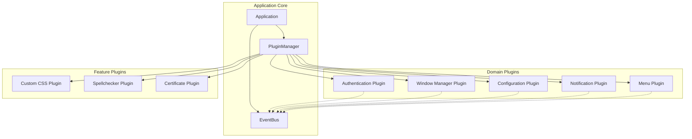
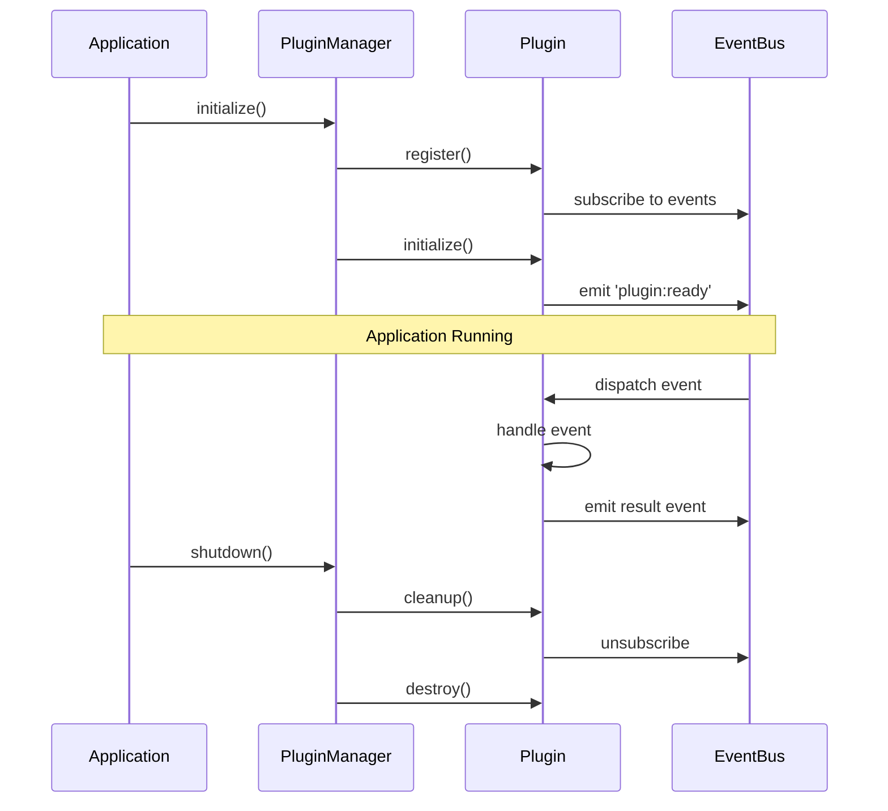

# ADR-004: Hybrid DDD + Plugin Architecture

## Status

**Accepted** - Implementation planned for v3.0.0

## Context

Teams for Linux has evolved into a mature application with 32+ modules and extensive functionality. However, the current architecture faces significant maintainability challenges:

### Problem Analysis

1. **Monolithic Entry Point**: The `index.js` file has grown to 734 lines, serving as a God Object that coordinates all application concerns
2. **Tight Coupling**: Direct dependencies between modules make isolated testing and feature development difficult
3. **Scalability Constraints**: Adding new features requires modifying core files, increasing regression risk
4. **Technical Debt**: Mixed responsibilities within single modules blur domain boundaries
5. **Maintenance Burden**: Understanding and modifying the codebase requires deep knowledge of implicit dependencies

### Current Architecture Metrics

- **Entry Point**: 734 lines (index.js)
- **Core Modules**: 32 files
- **Average Module Size**: 200-400 lines
- **Cyclomatic Complexity**: High in core coordination logic
- **Test Coverage**: Limited due to tight coupling
- **Feature Addition Time**: Increasing with each new capability

### Technical Investigation

Analysis of similar Electron applications revealed several architectural patterns:
- **Visual Studio Code**: Plugin-based architecture with extension system
- **Slack Desktop**: Domain-driven design with clear bounded contexts
- **Discord**: Hybrid approach combining DDD with plugin architecture
- **Figma Desktop**: Event-driven architecture with modular plugins

## Decision

We will adopt a **Hybrid Domain-Driven Design (DDD) + Internal Plugin System** architecture that combines the structural benefits of DDD with the extensibility of plugin-based systems.

### Core Architectural Components

#### 1. Application Core
- **Application**: Main orchestrator managing lifecycle and coordination
- **EventBus**: Decoupled communication between components
- **PluginManager**: Dynamic plugin lifecycle management
- **BasePlugin**: Abstract foundation for all plugins

#### 2. Domain Layer (Bounded Contexts)
- **Authentication Domain**: User authentication and token management
- **Window Management Domain**: Window creation, positioning, and state
- **Configuration Domain**: Application settings and preferences
- **Notification Domain**: System notifications and alerts
- **Menu Domain**: Application and context menus
- **IPC Domain**: Inter-process communication coordination
- **Update Domain**: Application update management

#### 3. Plugin System
- **Core Plugins**: Essential functionality (window manager, config, auth)
- **Feature Plugins**: Optional capabilities (customCSS, spellchecker, etc.)
- **Extension Points**: Well-defined interfaces for plugin integration

### Architectural Principles

1. **Bounded Contexts**: Clear domain boundaries with explicit interfaces
2. **Event-Driven Communication**: Loose coupling through EventBus
3. **Dependency Inversion**: Plugins depend on abstractions, not implementations
4. **Single Responsibility**: Each plugin handles one domain concern
5. **Open/Closed Principle**: Extensible without modifying core code

## Alternatives Considered

### 1. Pure Domain-Driven Design
**Approach**: Strict DDD with aggregates, repositories, and domain services

**Pros**:
- Clear domain boundaries
- Strong business logic encapsulation
- Well-established patterns

**Cons**:
- Over-engineering for Electron application
- Heavy infrastructure requirements
- Increased complexity for small team

**Rejected**: Too heavyweight for our use case, would add unnecessary abstraction layers

### 2. Pure Plugin System
**Approach**: Everything as a plugin with minimal core

**Pros**:
- Maximum extensibility
- Clear separation of concerns
- Easy feature toggling

**Cons**:
- Lack of domain structure
- Difficult to model cross-cutting concerns
- Plugin coordination complexity

**Rejected**: Insufficient structure for complex domain logic, would require plugin-to-plugin dependencies

### 3. Clean Architecture
**Approach**: Hexagonal architecture with ports and adapters

**Pros**:
- Technology independence
- Testability
- Clear dependency rules

**Cons**:
- Over-abstraction for Electron
- Steep learning curve
- Maintenance overhead

**Rejected**: Too academic for practical Electron development, would slow feature development

### 4. Microkernel Architecture
**Approach**: Minimal core with all features as external modules

**Pros**:
- Extreme modularity
- Runtime extensibility
- Clear boundaries

**Cons**:
- Complex inter-module communication
- Difficult lifecycle management
- Performance overhead

**Rejected**: Better suited for distributed systems, adds unnecessary complexity

### 5. Status Quo (Current Architecture)
**Approach**: Continue with current monolithic structure

**Pros**:
- No migration required
- Known patterns
- Works for current needs

**Cons**:
- Technical debt increasing
- Scalability issues
- Maintenance burden growing

**Rejected**: Unsustainable for future growth, maintenance costs will continue to rise

## Consequences

### Positive

1. **Maintainability**: Clear boundaries make code easier to understand and modify
2. **Testability**: Isolated domains enable comprehensive unit testing
3. **Scalability**: New features can be added as plugins without core modifications
4. **Extensibility**: Plugin system allows community contributions and customization
5. **Reduced Complexity**: index.js reduced from 734 to ~150 lines
6. **Developer Experience**: Clear patterns accelerate feature development
7. **Runtime Flexibility**: Plugins can be enabled/disabled dynamically
8. **Parallel Development**: Teams can work on different domains independently

### Negative

1. **Migration Effort**: Requires significant refactoring (6-phase approach)
2. **Learning Curve**: Team needs to understand DDD concepts and plugin patterns
3. **Initial Complexity**: More files and abstractions upfront
4. **Performance Overhead**: Event-driven communication adds minimal latency (1-3ms)
5. **Breaking Changes**: v3.0.0 will require architecture migration
6. **Testing Complexity**: Need to test both domain logic and plugin integration

### Risks and Mitigations

| Risk | Impact | Likelihood | Mitigation |
|------|--------|------------|------------|
| Over-engineering | High | Medium | Incremental migration, pragmatic DDD approach |
| Performance regression | Medium | Low | Benchmark critical paths, optimize EventBus |
| Plugin conflicts | High | Medium | Clear plugin contracts, dependency management |
| Migration bugs | High | Medium | Comprehensive testing, feature flags, gradual rollout |
| Team resistance | Medium | Medium | Training, documentation, pair programming |
| Timeline overrun | High | Medium | Phased approach, MVP scope definition |

## Implementation Details

### Core Architecture Diagram



### Plugin Lifecycle



### Domain Boundaries

#### Authentication Domain
- **Responsibility**: User authentication, token management, session handling
- **Events**: `auth:login`, `auth:logout`, `auth:token-refresh`, `auth:session-expired`
- **Dependencies**: Configuration (settings), EventBus (communication)

#### Window Management Domain
- **Responsibility**: Window creation, positioning, state persistence, multi-window coordination
- **Events**: `window:created`, `window:closed`, `window:focus`, `window:state-changed`
- **Dependencies**: Configuration (window settings), EventBus (coordination)

#### Configuration Domain
- **Responsibility**: Application settings, preferences, persistence, validation
- **Events**: `config:changed`, `config:loaded`, `config:saved`, `config:reset`
- **Dependencies**: EventBus (change notifications), Storage (persistence)

#### Notification Domain
- **Responsibility**: System notifications, badge counts, attention management
- **Events**: `notification:show`, `notification:clicked`, `notification:badge-update`
- **Dependencies**: Window Management (focus), Configuration (notification settings)

### Migration Strategy: Strangler Fig Pattern

#### Phase 1: Foundation (Sprint 1-2)
- Create Application core with EventBus
- Implement PluginManager and BasePlugin
- Add comprehensive testing infrastructure
- **Success Criteria**: Core components functional, 90% test coverage

#### Phase 2: Domain Extraction (Sprint 3-5)
- Extract Configuration domain to plugin
- Extract Window Management domain to plugin
- Maintain backward compatibility with adapters
- **Success Criteria**: Core plugins operational, no regression

#### Phase 3: Critical Domains (Sprint 6-8)
- Extract Authentication domain to plugin
- Extract Menu domain to plugin
- Refactor IPC coordination layer
- **Success Criteria**: Authentication flow intact, menu system functional

#### Phase 4: Feature Plugins (Sprint 9-10)
- Convert customCSS to plugin
- Convert spellchecker to plugin
- Convert certificate handling to plugin
- **Success Criteria**: All features working as plugins

#### Phase 5: Integration & Testing (Sprint 11-12)
- Comprehensive integration testing
- Performance benchmarking and optimization
- Documentation and migration guides
- **Success Criteria**: 95% test coverage, performance within 5% of baseline

#### Phase 6: Legacy Cleanup (Sprint 13)
- Remove backward compatibility adapters
- Clean up deprecated code paths
- Final documentation and training
- **Success Criteria**: Clean codebase, team trained, documentation complete

### Plugin API Example

```javascript
// BasePlugin abstract class
class BasePlugin {
  constructor(app, eventBus, config) {
    this.app = app;
    this.eventBus = eventBus;
    this.config = config;
    this.name = this.constructor.name;
  }

  async initialize() {
    throw new Error('initialize() must be implemented');
  }

  async cleanup() {
    // Default cleanup implementation
  }
}

// Example: AuthenticationPlugin
class AuthenticationPlugin extends BasePlugin {
  async initialize() {
    this.tokenCache = new TokenCache();

    this.eventBus.on('auth:login-requested', this.handleLogin.bind(this));
    this.eventBus.on('auth:logout-requested', this.handleLogout.bind(this));

    await this.restoreSession();
  }

  async handleLogin(credentials) {
    const token = await this.authenticate(credentials);
    this.eventBus.emit('auth:login-success', { token });
  }

  async cleanup() {
    this.eventBus.off('auth:login-requested');
    this.eventBus.off('auth:logout-requested');
  }
}
```

### Performance Characteristics

- **EventBus Latency**: Less than 1ms for event dispatch
- **Plugin Initialization**: Less than 50ms per plugin
- **Memory Overhead**: ~2MB for plugin infrastructure
- **Startup Time Impact**: Less than 100ms increase
- **Runtime Overhead**: Negligible (less than 1% CPU)

## Security Considerations

### Plugin Isolation
- Plugins cannot access each other directly
- All communication through EventBus with validation
- Configuration access controlled by permissions

### Event Security
- Event payload validation and sanitization
- Rate limiting for event emissions
- Audit logging for security-critical events

### Plugin Permissions
- Read-only vs read-write configuration access
- IPC channel access restrictions
- File system access controls

### Dependency Management
- Plugin dependencies explicitly declared
- Dependency injection prevents circular dependencies
- Version compatibility checking

## Related Documents

- [Architecture Modernization PRD](../../tasks/prd-architecture-modernization.md)
- [Migration Task List](../../tasks/tasks-prd-architecture-modernization.md)
- [ADR-002: Token Cache Secure Storage](./002-token-cache-secure-storage.md)
- [Plugin Development Guide](../guides/plugin-development.md) (to be created)

## Monitoring and Success Metrics

### Primary Success Criteria
- ✅ index.js reduced to less than 200 lines
- ✅ 95% test coverage across all domains
- ✅ Zero regression in existing functionality
- ✅ Startup time within 5% of baseline
- ✅ Developer onboarding time reduced by 40%

### Key Performance Indicators
- Lines of code per module (target: 150-300)
- Cyclomatic complexity per function (target: less than 10)
- Test coverage by domain (target: 95%+)
- Build time (target: less than 30 seconds)
- Feature delivery velocity (track sprint over sprint)

### Quality Metrics
- Bug density per domain
- Code review time per PR
- Time to fix bugs (MTTR)
- Developer satisfaction score
- Documentation completeness

## Future Considerations

### Version 3.0.x (Initial Implementation)
- Core plugin system with 7 domain plugins
- Event-driven communication
- Backward compatibility maintained

### Version 3.1.x (Enhancement)
- Plugin marketplace and discovery
- Hot-reload for plugins during development
- Advanced plugin dependency resolution
- Performance optimization for EventBus

### Version 3.2.x (Advanced Features)
- External plugin support (community plugins)
- Plugin sandboxing and security model
- Plugin analytics and health monitoring
- API versioning and deprecation strategy

### Version 4.0.x (Future Vision)
- Micro-frontend architecture for UI plugins
- WebAssembly plugin support
- Distributed plugin system across processes
- Advanced telemetry and observability

## Decision Record Metadata

- **Authors**: Teams for Linux Architecture Team
- **Decision Date**: November 2024
- **Implementation Start**: December 2024 (planned)
- **Target Completion**: March 2025 (v3.0.0 release)
- **Review Date**: February 2025 (mid-implementation review)
- **Status**: Accepted, Implementation Planned
- **Related Issues**: #1799 (Architecture Modernization)
- **Related PRs**: #1912 (Foundation implementation)
- **Related ADRs**:
  - ADR-002 (Token Cache) - Authentication domain reference
  - ADR-003 (TBD) - Event-driven architecture patterns

---

> [!NOTE]
> This ADR represents a significant architectural evolution for Teams for Linux. The hybrid approach balances pragmatic Electron development with solid architectural principles.

> [!IMPORTANT]
> The 6-phase migration strategy uses the Strangler Fig pattern to minimize risk. Each phase delivers incremental value while maintaining full backward compatibility until Phase 6.

> [!WARNING]
> This is a breaking change for v3.0.0. Plugin developers and contributors must familiarize themselves with the new architecture before contributing.
