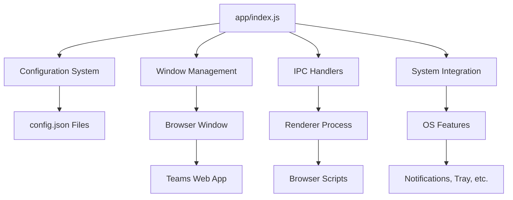

# Contributing to Teams for Linux

Thank you for considering contributing! This guide will help you get started with development.

:::tip New to Electron?
This project is a great starting point for learning Electron development!
:::

## Quick Start

1. **Fork** the repository
2. **Clone** your fork and create a feature branch
3. **Make changes** (entry point: `app/index.js`)
4. **Test** your changes with `npm start`
5. **Submit** a pull request to `main` branch

Each `app/` subfolder contains a README explaining its purpose.

## Testing Pull Requests

You can test PR changes without building from source by downloading pre-built artifacts from GitHub Actions.

### How to Download PR Artifacts

1. **Navigate to the PR** on GitHub
2. **Click the "Checks" tab** at the top of the PR
3. **Select a completed workflow run** (look for green checkmarks)
4. **Scroll down to "Artifacts" section** at the bottom of the workflow page
5. **Download the artifact** for your platform (Linux x64/ARM64/ARMv7l, macOS, Windows)

:::info Authentication Required
You need to be logged into GitHub to download artifacts. Artifacts are retained for 30 days after the workflow run.
:::

This is particularly useful for:
- **Reviewers** testing changes before approving PRs
- **Testers** validating bug fixes without setting up a development environment
- **Contributors** verifying their changes work across different platforms

:::note Future Enhancement
A potential improvement would be adding a bot that automatically posts or updates a comment on PRs with direct links to artifacts.
:::

## Development Setup

### Prerequisites

- **Node.js and npm** - [Installation guide](https://docs.npmjs.com/downloading-and-installing-node-js-and-npm)
- **Git** for version control

### Getting Started

```bash
# Clone your fork
git clone https://github.com/your-username/teams-for-linux.git
cd teams-for-linux

# Install dependencies
npm install

# Run from source
npm start

# Lint code (required before commits)
npm run lint
```

:::warning Code Quality
Always run `npm run lint` before committing. Pull requests with linting errors will not be accepted.
:::

## Building

### Local Linux Build

```bash
# Create all Linux packages (deb, rpm, snap, AppImage, tar.gz)
npm run dist:linux

# Development build without packaging
npm run pack
```

### Docker/Podman Build

For consistent builds across environments:

```bash
podman run -it --rm --volume .:/var/mnt:z -w /var/mnt/ node:20 /bin/bash -c \
  "apt update && apt install -y rpm && npm ci && npm run dist:linux"
```

### Snap-specific Build

```bash
npm run dist:linux:snap
cd dist && sudo snap install teams-for-linux_*.snap --dangerous
```

## Architecture Overview



### Key Components

- **Main Process** (`app/index.js`) - Application entry point
- **Configuration** (`app/appConfiguration/`) - Settings management
- **IPC System** (`app/` + browser scripts) - Process communication
- **Browser Integration** (`app/browser/`) - Teams web app enhancements
- **System Features** (notifications, tray, screen sharing)

## Code Standards

### Style Guidelines (some WIP)

- **ES6+ JavaScript** - Use modern JavaScript features
- **No `var`** - Use `const` by default, `let` for reassignment
- **async/await** - Prefer over promise chains
- **Private fields** - Use `#property` syntax for class private members
- **Arrow functions** - For concise callbacks

### Example Code Style

```javascript
class ExampleModule {
  #privateField = 'value';
  
  constructor(config) {
    this.config = config;
  }
  
  async performAction() {
    try {
      const result = await this.#processData();
      return result;
    } catch (error) {
      console.error('Error in performAction:', error);
      throw error;
    }
  }
  
  #processData() {
    // Private method implementation
    return Promise.resolve(this.#privateField);
  }
}
```

### Error Handling

- Use try-catch blocks for async operations
- Log errors with context
- Provide graceful degradation
- Use `electron-log` for structured logging

## Documentation

### Contributing to Documentation

The documentation is built with Docusaurus and automatically deployed to GitHub Pages.

#### Local Documentation Development

```bash
# Navigate to docs site
cd docs-site

# Install dependencies
npm install

# Start development server
npm run start

# Build for production
npm run build
```

#### Adding New Documentation

1. Create `.md` or `.mdx` files in `docs-site/docs/`
2. Update `docs-site/sidebars.ts` to include new pages
3. Test locally with `npm run start`
4. Commit and push changes

#### Documentation Standards

- Use **Docusaurus admonitions** for callouts (:::note, :::tip, :::warning)
- Include **code examples** for technical documentation
- Add **cross-references** to related documentation
- Use **Mermaid diagrams** for architecture visualization

### Markdown Standards

When creating or updating any markdown documentation in this project (including documentation files, README files, task lists, and PRDs), leverage existing markdown library features instead of building custom solutions:

#### Content Structure

- **Table of Contents**: Use GitHub's `<!-- toc -->` element or Docusaurus auto-TOC for automatic table of contents generation instead of manual lists
- **Collapsible Sections**: Use GitHub's `<details>` and `<summary>` elements for optional or lengthy information

#### Callouts and Alerts

- **Callouts**: Use GitHub's alert syntax for important information, warnings, and critical notes:
  - `> [!NOTE]` - For neutral informational notes
  - `> [!TIP]` - For helpful tips and best practices
  - `> [!IMPORTANT]` - For critical information users must know
  - `> [!WARNING]` - For warnings about potential issues
  - `> [!CAUTION]` - For dangerous actions or critical warnings
- **Docusaurus**: In Docusaurus files, use admonitions: `:::note`, `:::tip`, `:::warning`, `:::danger`, `:::info`

#### Code and Technical Content

- **Code Blocks**: Use proper syntax highlighting with language identifiers (e.g., ` ```javascript`, ` ```bash`, ` ```json`)
- **Inline Code**: Use backticks for inline code, commands, file paths, and variable names
- **Commands**: Show shell commands with appropriate prompts and syntax highlighting

#### Data Presentation

- **Tables**: Use standard markdown tables with proper alignment for structured data
- **Checkboxes**: Use standard GitHub checkbox syntax `- [ ]` and `- [x]` for task tracking and checklists

#### Links and References

- **Internal Links**: Use relative paths for internal documentation links (e.g., `[Configuration](../configuration.md)`)
- **External Links**: Use absolute URLs for external resources
- **Issue/PR References**: Use GitHub's `#123` syntax for issue and pull request references

#### Diagrams and Visuals

- **Mermaid Diagrams**: Use GitHub's Mermaid support for flowcharts, sequence diagrams, and architecture diagrams when applicable
- **Supported Types**: flowchart, sequence, class, state, ER, gantt, pie, git graph
- **Example**:
  ````markdown
  ```mermaid
  graph TD
      A[Start] --> B[Process]
      B --> C[End]
  ```
  ````

:::tip Single Source of Truth
These markdown standards apply to ALL markdown files in the project:
- Documentation site (`docs-site/docs/`)
- Root-level documentation (README, CONTRIBUTING, CLAUDE.md)
- Task management files (`tasks/`)
- AI agent instruction files (`.github/instructions/`)
- Module READMEs in `app/` directories

When updating standards, update this section only. All other files should reference these standards.
:::

## Testing

### End-to-End (E2E) Tests

Teams for Linux uses Playwright for automated end-to-end testing. These tests ensure the application launches correctly and validates core functionality.

#### Running E2E Tests

```bash
# Run all E2E tests
npm run test:e2e

# Run tests in headed mode (visible browser)
npx playwright test --headed

# Run tests in debug mode
npx playwright test --debug
```

:::tip Clean State Testing
Each E2E test runs with a clean slate using a temporary user data directory. This ensures tests don't interfere with each other and are reproducible. The test harness uses the `E2E_USER_DATA_DIR` environment variable to provide isolated storage for each test run.
:::

#### What E2E Tests Validate

Current E2E test coverage includes:

- **Application Launch**: Verifies the app starts successfully
- **Window Creation**: Ensures main window is created
- **Microsoft Login Redirect**: Validates initial redirect to Microsoft authentication

#### Writing New E2E Tests

When contributing new features, consider adding E2E tests. Tests are located in `tests/e2e/` and follow Playwright conventions.

Example test structure:

```javascript
import { test, expect } from '@playwright/test';
import { _electron as electron } from 'playwright';
import { mkdtempSync, rmSync } from 'node:fs';
import { tmpdir } from 'node:os';
import { join } from 'node:path';

test('your feature test', async () => {
  let electronApp;
  let userDataDir;

  try {
    // Create clean state
    userDataDir = mkdtempSync(join(tmpdir(), 'teams-e2e-'));

    electronApp = await electron.launch({
      args: ['./app/index.js'],
      env: {
        ...process.env,
        E2E_USER_DATA_DIR: userDataDir
      }
    });

    const mainWindow = await electronApp.firstWindow();

    // Your test logic here

  } finally {
    // Cleanup
    if (electronApp) {
      electronApp.process().kill('SIGTERM');
    }
    if (userDataDir) {
      rmSync(userDataDir, { recursive: true, force: true });
    }
  }
});
```

:::info Testing Strategy
For detailed information about the testing strategy, architecture decisions, and advanced testing patterns, see the [Automated Testing Strategy](research/automated-testing-strategy.md) documentation.
:::

### Manual Testing

```bash
# Run application in development mode
npm start

# Test specific features
npm start -- --user-data-dir=/tmp/test-profile
```

### Build Testing

```bash
# Test production build
npm run pack
./dist/linux-unpacked/teams-for-linux

# Test package installation
sudo dpkg -i dist/teams-for-linux_*.deb
teams-for-linux
```

## Pull Request Guidelines

### Before Submitting

- [ ] Code follows style guidelines
- [ ] `npm run lint` passes without errors
- [ ] `npm run test:e2e` passes (E2E tests)
- [ ] Manual testing completed
- [ ] Documentation updated if needed
- [ ] Commit messages are descriptive

### PR Requirements

1. **Target branch**: Always target `main` branch
2. **Description**: Clearly describe changes and motivation
3. **Testing**: Include testing instructions
4. **Screenshots**: For UI changes, include before/after screenshots
5. **Breaking changes**: Clearly mark and document

### Commit Message Format

```
type(scope): description

Longer explanation if needed

Fixes #123
```

Examples:
- `feat(config): add support for custom proxy settings`
- `fix(notifications): resolve notification sound not playing`
- `docs(api): update IPC channel documentation`

## Release Process

1. **Update version** in `package.json`:
   - Patches: `1.0.0` → `1.0.1` 
   - Features: `1.0.0` → `1.1.0`
   - Major: Reserved

2. **Update dependencies**: `npm install`

3. **Add release notes** in `com.github.IsmaelMartinez.teams_for_linux.appdata.xml`:
   ```xml
   <release version="2.0.17" date="2025-06-15">
     <description>
       <ul>
         <li>New feature description</li>
         <li>Bug fix description</li>
       </ul>
     </description>
   </release>
   ```

4. **Commit and push** changes, then create a pull request

See [Release Automation](release-info.md) for technical details.

## Getting Help

### Development Questions

- **[IPC API Documentation](ipc-api.md)** - Inter-process communication reference
- **[Configuration Guide](configuration.md)** - Understanding the config system
- **[Architecture Documentation](index.md#architecture-overview)** - System overview

### Community Support

- **Matrix Chat**: [#teams-for-linux_community:gitter.im](https://matrix.to/#/#teams-for-linux_community:gitter.im)
- **GitHub Discussions**: [Project discussions](https://github.com/IsmaelMartinez/teams-for-linux/discussions)
- **GitHub Issues**: [Bug reports and feature requests](https://github.com/IsmaelMartinez/teams-for-linux/issues)

## Code of Conduct

We are committed to providing a welcoming and inspiring community for all. Please be respectful and constructive in all interactions.

## License

By contributing to Teams for Linux, you agree that your contributions will be licensed under the GPL-3.0 license.

## Related Documentation

- [Configuration Options](configuration.md) - Application configuration reference
- [IPC API](ipc-api.md) - Developer integration documentation
- [Release Automation](release-info.md) - Release process details