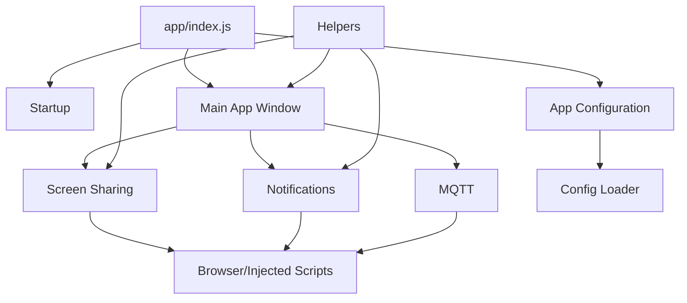

# Module Architecture Index

Comprehensive index of all application modules in the `app/` directory. Teams for Linux follows a modular architecture where functionality is organized into focused, single-responsibility modules.

:::tip
All module READMEs are available in the GitHub repository. Click the documentation links to view detailed information about each module.
:::

## Core Modules

These modules form the foundation of the application and are essential for basic operation.

| Module | Path | Purpose | Documentation |
|--------|------|---------|---------------|
| **Startup** | `app/startup/` | Command line switches & initialization flags | [README](https://github.com/IsmaelMartinez/teams-for-linux/blob/main/app/startup/README.md) |
| **Main App Window** | `app/mainAppWindow/` | Primary BrowserWindow that hosts Teams web interface | [README](https://github.com/IsmaelMartinez/teams-for-linux/blob/main/app/mainAppWindow/README.md) |
| **App Configuration** | `app/appConfiguration/` | Application-wide configuration management | [README](https://github.com/IsmaelMartinez/teams-for-linux/blob/main/app/appConfiguration/README.md) |
| **Browser** | `app/browser/` | Preload scripts & client-side injected scripts | [README](https://github.com/IsmaelMartinez/teams-for-linux/blob/main/app/browser/README.md) |

## Feature Modules

User-facing features and integrations.

| Module | Path | Purpose | Documentation |
|--------|------|---------|---------------|
| **MQTT** | `app/mqtt/` | MQTT broker integration for status publishing | [README](https://github.com/IsmaelMartinez/teams-for-linux/blob/main/app/mqtt/README.md), [User Guide](../mqtt-integration.md) |
| **Screen Sharing** | `app/screenSharing/` | Native screen/window selection and preview | [README](https://github.com/IsmaelMartinez/teams-for-linux/blob/main/app/screenSharing/README.md), [User Guide](../screen-sharing.md) |
| **Custom Background** | `app/customBackground/` | Virtual background management | [README](https://github.com/IsmaelMartinez/teams-for-linux/blob/main/app/customBackground/README.md), [User Guide](../custom-backgrounds.md) |
| **Custom CSS** | `app/customCSS/` | Custom styling and themes | [README](https://github.com/IsmaelMartinez/teams-for-linux/blob/main/app/customCSS/README.md) |
| **Notifications** | `app/notifications/` | Native desktop notifications & sound playback | [README](https://github.com/IsmaelMartinez/teams-for-linux/blob/main/app/notifications/README.md) |
| **Incoming Call Toast** | `app/incomingCallToast/` | Call notification toasts | [README](https://github.com/IsmaelMartinez/teams-for-linux/blob/main/app/incomingCallToast/README.md) |
| **InTune SSO** | `app/intune/` | Microsoft InTune single sign-on integration | [README](https://github.com/IsmaelMartinez/teams-for-linux/blob/main/app/intune/README.md), [User Guide](../intune-sso.md) |
| **Global Shortcuts** | `app/globalShortcuts/` | System-wide keyboard shortcuts | No README yet |
| **Graph API** | `app/graphApi/` | Microsoft Graph API integration for calendar and mail | [Research](./research/graph-api-integration-research.md) |

## System Integration Modules

OS-level integrations and platform-specific functionality.

| Module | Path | Purpose | Documentation |
|--------|------|---------|---------------|
| **Idle Monitor** | `app/idle/` | System idle state monitoring & status correlation | [README](https://github.com/IsmaelMartinez/teams-for-linux/blob/main/app/idle/README.md) |
| **Login** | `app/login/` | Authentication and login flow management | [README](https://github.com/IsmaelMartinez/teams-for-linux/blob/main/app/login/README.md) |
| **Menus** | `app/menus/` | Application menu bar and context menus | [README](https://github.com/IsmaelMartinez/teams-for-linux/blob/main/app/menus/README.md) |
| **Spell Check Provider** | `app/spellCheckProvider/` | Text spelling correction integration | [README](https://github.com/IsmaelMartinez/teams-for-linux/blob/main/app/spellCheckProvider/README.md) |

## Utility & Infrastructure Modules

Supporting infrastructure, utilities, and cross-cutting concerns.

| Module | Path | Purpose | Documentation |
|--------|------|---------|---------------|
| **Helpers** | `app/helpers/` | Shared utility functions and common logic | [README](https://github.com/IsmaelMartinez/teams-for-linux/blob/main/app/helpers/README.md) |
| **Cache Manager** | `app/cacheManager/` | Application cache handling | [README](https://github.com/IsmaelMartinez/teams-for-linux/blob/main/app/cacheManager/README.md) |
| **Config** | `app/config/` | Configuration file loading and parsing | [README](https://github.com/IsmaelMartinez/teams-for-linux/blob/main/app/config/README.md) |
| **Connection Manager** | `app/connectionManager/` | Network connectivity and connection state | [README](https://github.com/IsmaelMartinez/teams-for-linux/blob/main/app/connectionManager/README.md) |
| **Partitions** | `app/partitions/` | Electron partition management for sessions | [README](https://github.com/IsmaelMartinez/teams-for-linux/blob/main/app/partitions/README.md) |
| **Security** | `app/security/` | Security controls and validation | No README yet |
| **Certificate** | `app/certificate/` | Custom certificate handling | [User Guide](../certificate.md) |

## UI Components

Special-purpose windows and UI elements.

| Module | Path | Purpose | Documentation |
|--------|------|---------|---------------|
| **Documentation Window** | `app/documentationWindow/` | In-app documentation viewer | [README](https://github.com/IsmaelMartinez/teams-for-linux/blob/main/app/documentationWindow/README.md) |
| **GPU Info Window** | `app/gpuInfoWindow/` | GPU information display window | [README](https://github.com/IsmaelMartinez/teams-for-linux/blob/main/app/gpuInfoWindow/README.md) |
| **Screen Picker** | `app/screenPicker/` | Screen/window selection interface | No README yet |

## Assets

| Path | Purpose |
|------|---------|
| `app/assets/` | Icons, sounds, and static resources ([README](https://github.com/IsmaelMartinez/teams-for-linux/blob/main/app/assets/README.md)) |

## Module Development Guidelines

### Creating New Modules

When adding a new module to the application:

1. **Create a dedicated directory** under `app/` with a descriptive name
2. **Add a README.md** documenting:
   - Module purpose and responsibilities
   - Public API and IPC channels (if any)
   - Dependencies on other modules
   - Usage examples
3. **Follow single responsibility principle** - one module, one clear purpose
4. **Use dependency injection** - accept dependencies as constructor/function parameters
5. **Document IPC channels** - add descriptive comments above IPC registrations
6. **Update IPC allowlist** - add new channels to `app/security/ipcValidator.js`
7. **Generate IPC docs** - run `npm run generate-ipc-docs` after adding IPC channels
8. **Add to this index** - update the appropriate category in this document

### Module Structure Best Practices

```
app/myModule/
├── README.md              # Module documentation
├── index.js               # Public interface / entry point
├── service.js             # Service class (if applicable)
├── preload.js             # Preload script (if needs IPC)
└── tests/                 # Unit tests (future)
    └── myModule.spec.js
```

### IPC Channel Guidelines

- **Naming convention**: `module-name:action` (e.g., `screen-sharing:get-sources`)
- **Add descriptive comments** above `ipcMain.handle()` or `ipcMain.on()` calls
- **Register in allowlist**: Add to `app/security/ipcValidator.js`
- **Generate documentation**: Run `npm run generate-ipc-docs`
- **Document in module README**: List all IPC channels with descriptions

See [IPC API Documentation](ipc-api.md) for all available IPC channels.

## Architecture Patterns

### Module Dependencies

Modules are organized in a hierarchical dependency structure:



### Communication Patterns

- **IPC (Inter-Process Communication)**: Main process ↔ Renderer process
- **Event Emitters**: Within main process for loose coupling
- **Dependency Injection**: Pass dependencies explicitly, avoid global state
- **Configuration-First**: Modules read from centralized config object

## Related Documentation

- **Contributing Guide**: [Development Guidelines](contributing.md)
- **IPC API Reference**: [IPC Channel Documentation](ipc-api.md)
- **Configuration Options**: [Configuration Reference](../configuration.md)
- **Architecture Decisions**: [ADR Index](adr/README.md)

## Questions?

- **"Where should I add new functionality?"** → Check if an existing module fits, otherwise create a new focused module
- **"How do I communicate between modules?"** → Use dependency injection and IPC for renderer↔main communication
- **"Which modules are most important to understand?"** → Start with Core Modules, then explore Feature Modules
- **"How do I add a new IPC channel?"** → See [Module Development Guidelines](#module-development-guidelines) above
