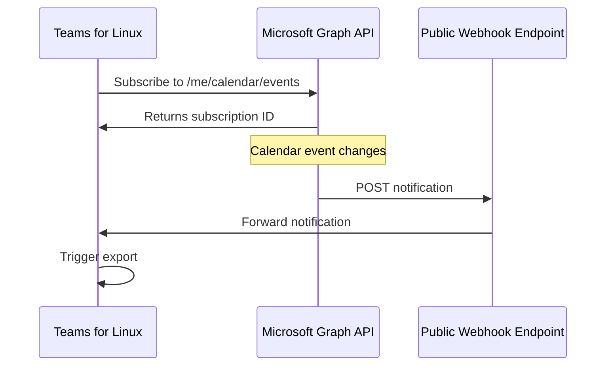
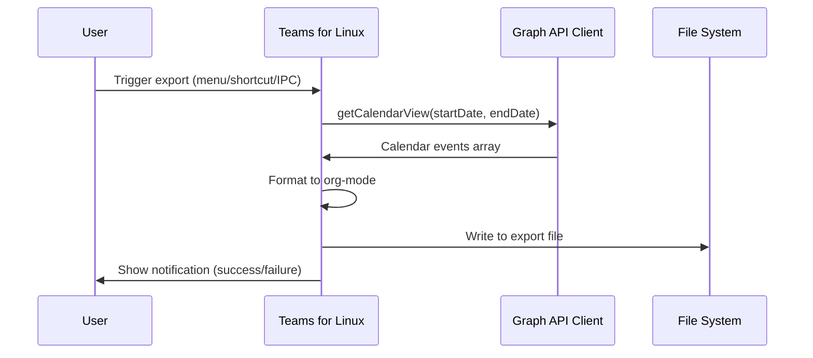
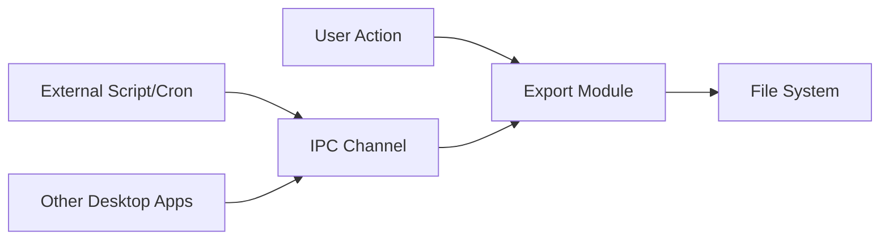

# Calendar Data Export Research

**Issue**: [#1995](https://github.com/IsmaelMartinez/teams-for-linux/issues/1995)
**Related**: [#1832 - Graph API Integration](https://github.com/IsmaelMartinez/teams-for-linux/issues/1832)
**Status**: Research Phase
**Date**: 2025-11-27

## Overview

This document investigates the implementation of calendar data export functionality for Teams for Linux, enabling users to access their calendar data for external processing (e.g., org-mode conversion). The research focuses on event-driven architecture where the system reacts to external events rather than implementing internal scheduling logic.

## Problem Statement

### User Requirements

From issue #1995, the user needs to:

1. **Extract calendar/meeting data** from Teams for personal processing
2. **Convert to org-mode format** for personal knowledge management
3. **Avoid daily authentication** - Creating standalone extraction scripts is impractical due to 2FA expiring daily

### Core Challenge

The user must log into Teams daily anyway, making Teams for Linux an ideal integration point for calendar data extraction without requiring separate authentication flows.

## Current State Analysis

### Existing Infrastructure

Teams for Linux already has foundational components for calendar access:

#### 1. Graph API Integration (Phase 1 Complete)

Location: `app/graphApi/`

**Capabilities:**
- Token acquisition via Teams React authentication
- Authenticated Graph API requests
- Calendar endpoint support:
  - `GET /me/calendar/events` - List all events
  - `GET /me/calendar/calendarView` - Time-range filtered view
  - `POST /me/calendar/events` - Create events
  - `PATCH /me/calendar/events/{id}` - Update events
  - `DELETE /me/calendar/events/{id}` - Delete events

**Key Files:**
- `app/graphApi/index.js` - GraphApiClient class
- `app/graphApi/ipcHandlers.js` - IPC handlers for renderer access
- `app/browser/tools/reactHandler.js` - Token acquisition

**Configuration:**
```yaml
graphApi:
  enabled: true  # Must be enabled for calendar access
```

#### 2. IPC Communication Infrastructure

**Existing Calendar IPC Channels:**
- `graph-api-get-calendar-events` - Get events with OData options
- `graph-api-get-calendar-view` - Get events within date range

**Security:**
- All channels validated through `app/security/ipcValidator.js`
- Channels must be on allowlist

### Limitations of Current Implementation

1. **Pull-based only** - Client must request data, no push notifications
2. **No export functionality** - No mechanism to write data to files
3. **No scheduling** - No way to trigger exports automatically
4. **No webhook support** - Cannot receive change notifications from Microsoft

## Architecture Options

### Option 1: Event-Driven via Microsoft Graph Webhooks (RECOMMENDED)

**Concept:** Subscribe to Microsoft Graph change notifications and react to calendar changes.

#### How Microsoft Graph Webhooks Work



**Microsoft Graph Subscription:**
```javascript
POST https://graph.microsoft.com/v1.0/subscriptions
{
  "changeType": "created,updated,deleted",
  "notificationUrl": "https://your-server.com/webhook",
  "resource": "/me/calendar/events",
  "expirationDateTime": "2025-11-28T18:00:00.0000000Z",
  "clientState": "secretClientValue"
}
```

**Requirements:**
1. **Public HTTPS endpoint** - Microsoft requires publicly accessible webhook URL
2. **Subscription management** - Renewals required (max 3 days for calendar)
3. **Validation handshake** - Endpoint must respond to validation token
4. **Change processing** - React to notifications and fetch updated data

**Pros:**
- ✅ True event-driven - no polling needed
- ✅ Real-time updates as calendar changes
- ✅ Efficient - only processes when changes occur
- ✅ Aligns with "react to events" principle

**Cons:**
- ❌ Requires public webhook endpoint (infrastructure burden)
- ❌ Subscription management complexity (renewals, failures)
- ❌ Not suitable for single-user desktop app
- ❌ Security considerations for exposing endpoint

**Verdict:** **Not recommended for desktop application** - Webhooks are designed for server applications with public endpoints. Inappropriate for single-user desktop client.

### Option 2: Event-Driven via User Actions

**Concept:** Export calendar data in response to explicit user actions.

#### Trigger Options

1. **Manual export button** - User clicks "Export Calendar" in menu
2. **Keyboard shortcut** - e.g., `Ctrl+Shift+E` to export
3. **IPC-triggered export** - External script triggers via IPC
4. **Session startup** - Export on app launch (after Teams loads)
5. **Session shutdown** - Export on quit

#### Architecture



**Implementation Pattern:**

```javascript
// New module: app/calendarExport/index.js
class CalendarExporter {
  constructor(graphApiClient, config) {
    this.graphApi = graphApiClient;
    this.config = config;
  }

  async exportToFile(options = {}) {
    const {
      startDate = new Date(),
      daysAhead = 30,
      outputPath = '~/calendar-export.org',
      format = 'org-mode'
    } = options;

    // 1. Fetch calendar data
    const endDate = new Date(startDate);
    endDate.setDate(endDate.getDate() + daysAhead);

    const result = await this.graphApi.getCalendarView(
      startDate.toISOString(),
      endDate.toISOString()
    );

    // 2. Transform to desired format
    const formatted = this.formatData(result.data.value, format);

    // 3. Write to file
    await fs.writeFile(outputPath, formatted);

    return { success: true, path: outputPath, events: result.data.value.length };
  }

  formatData(events, format) {
    if (format === 'org-mode') {
      return this.toOrgMode(events);
    }
    // Other formats: json, csv, ics...
  }

  toOrgMode(events) {
    // Convert Graph API events to org-mode format
    // Implementation TBD based on user requirements
  }
}
```

**Pros:**
- ✅ Simple architecture - no external dependencies
- ✅ User controls when exports happen
- ✅ No polling or timers needed
- ✅ Leverages existing Graph API client
- ✅ Appropriate for desktop application model

**Cons:**
- ⚠️ Requires user action (not automatic)
- ⚠️ Need to define export format specifications

**Verdict:** **Recommended as Phase 1** - Aligns with desktop app model and "react to events" principle.

### Option 3: Hybrid - User Actions + External Event System

**Concept:** Allow external systems to trigger exports via IPC, enabling integration with user's automation tools.

#### Architecture



**Implementation:**

```javascript
// IPC Handler
ipcMain.handle('calendar-export', async (_event, options) => {
  if (!calendarExporter) {
    return { success: false, error: 'Calendar export not enabled' };
  }
  return await calendarExporter.exportToFile(options);
});
```

**External Trigger Example:**

```bash
#!/bin/bash
# External script to trigger export via electron-ipc-tunnel or similar
electron-ipc-send teams-for-linux calendar-export '{
  "outputPath": "~/org/calendar.org",
  "daysAhead": 14
}'
```

**Pros:**
- ✅ Enables automation without polling
- ✅ User controls scheduling externally (cron, systemd timers, etc.)
- ✅ Separates scheduling concern from application
- ✅ Flexible integration with user's existing workflows

**Cons:**
- ⚠️ Requires external IPC communication mechanism
- ⚠️ Security considerations for IPC exposure

**Verdict:** **Recommended as Phase 2 enhancement** - Provides flexibility without internal scheduling complexity.

## Recommended Architecture

### Phase 1: User-Triggered Export

**Scope:** Basic export functionality triggered by user actions.

**Components:**

1. **CalendarExporter Module** (`app/calendarExport/`)
   - Export orchestration
   - Format conversion (org-mode, JSON, CSV)
   - File writing with error handling

2. **Menu Integration**
   - Add "Export Calendar..." to app menu
   - Dialog for export options (date range, format, output path)

3. **IPC Handler**
   - `calendar-export` channel for programmatic export
   - Security validation in `ipcValidator.js`

4. **Configuration**
   ```yaml
   calendarExport:
     enabled: true
     defaultFormat: 'org-mode'
     defaultPath: '~/calendar-export.org'
     defaultDaysAhead: 30
   ```

**Implementation Steps:**

1. Create `app/calendarExport/index.js` module
2. Implement org-mode formatter (iterate with user on format)
3. Add IPC handler and security validation
4. Add menu item with export dialog
5. Update documentation

**Estimated Effort:** 1-2 days

### Phase 2: External Integration (Future)

**Scope:** Enable external automation tools to trigger exports.

**Options for IPC Communication:**

1. **Unix Domain Socket** - Local IPC endpoint
2. **Named Pipes** - Cross-platform IPC
3. **HTTP Local Server** - Simple REST API on localhost
4. **MQTT Integration** - Leverage existing MQTT infrastructure

**Recommended:** Leverage existing MQTT infrastructure if user already uses it, otherwise Unix Domain Socket for simplicity.

**Estimated Effort:** 0.5-1 day (depends on IPC mechanism chosen)

## Open Questions for User

Before implementation, we need clarification on:

### 1. Export Format Requirements

**Question:** What specific org-mode format do you need?

**Context:** Org-mode has various formats for events/todos. Examples:

**Option A: Org-mode Agenda Format**
```org
* TODO Meeting Title
  SCHEDULED: <2025-11-27 Wed 14:00-15:00>
  :PROPERTIES:
  :LOCATION: Teams Meeting
  :ORGANIZER: John Doe
  :ATTENDEES: Jane Smith, Bob Johnson
  :END:

  Meeting description/notes here
```

**Option B: Simple Headline Format**
```org
* 2025-11-27 Wed 14:00 Meeting Title
** Location: Teams Meeting
** Attendees: Jane Smith, Bob Johnson
```

**Option C: Custom Format**
```org
[Your preferred format]
```

**Need to know:**
- Preferred headline structure?
- Include meeting descriptions/notes?
- Include attendee lists?
- Include meeting links?
- Include meeting status (tentative/accepted/declined)?
- Date/time format preferences?

### 2. Export Trigger Requirements

**Question:** How do you want to trigger calendar exports?

**Options:**
- [ ] Manual button/menu item in application
- [ ] Keyboard shortcut
- [ ] Automatic on app startup
- [ ] Automatic on app shutdown
- [ ] External script/automation tool
- [ ] On-demand via command line
- [ ] Other: ___________

**If automatic:** What frequency? (once per session, hourly, etc.)

### 3. Export Scope Requirements

**Question:** What date range should be exported?

**Options:**
- [ ] Next N days (specify N: ___)
- [ ] Current week
- [ ] Current month
- [ ] Date range (specify: ___)
- [ ] All upcoming events
- [ ] Past + future (specify range: ___)

### 4. File Management Requirements

**Question:** How should export files be managed?

**Options:**
- [ ] Overwrite same file each time
- [ ] Append to existing file
- [ ] Create dated files (e.g., `calendar-2025-11-27.org`)
- [ ] Create separate files per event
- [ ] Other: ___________

**File path:**
- Fixed path: ___________
- Configurable in settings
- Choose via dialog each time

### 5. Error Handling Requirements

**Question:** What should happen if export fails?

**Options:**
- [ ] Show desktop notification
- [ ] Write error to log file only
- [ ] Retry N times (specify N: ___)
- [ ] Show error dialog (blocks workflow)
- [ ] Silent failure (log only)

### 6. Integration Requirements

**Question:** Do you use any automation tools that should integrate with this?

**Context:** Understanding your workflow helps design the right integration points.

- Do you use cron/systemd timers?
- Do you use home automation (Home Assistant, etc.)?
- Do you use org-mode in Emacs? (Any specific Emacs integration needs?)
- Do you use any calendar sync tools already?
- Would MQTT integration be useful? (existing MQTT feature in Teams for Linux)

### 7. Privacy/Security Requirements

**Question:** Are there any calendar entries you want to exclude?

**Options:**
- [ ] Export all events
- [ ] Exclude private events
- [ ] Exclude events with certain keywords
- [ ] Only include accepted events
- [ ] Filter by calendar (if multiple calendars)

### 8. Additional Data Requirements

**Question:** Beyond basic calendar events, what other data interests you?

**Options:**
- [ ] Tasks/To-Dos from Microsoft To Do
- [ ] Email metadata (recent messages)
- [ ] Teams chat presence status
- [ ] Meeting recordings/transcripts (if available)
- [ ] Shared files from meetings

**Context:** Helps scope future enhancements.

## Technical Considerations

### Security

1. **File system access** - Need to validate output paths
2. **IPC security** - Add calendar export channels to allowlist
3. **Token scoping** - Calendar.Read permission (already available)
4. **Data sanitization** - Escape special characters in org-mode output

### Performance

1. **Large calendars** - Pagination for calendars with many events
2. **Network errors** - Retry logic with exponential backoff
3. **Token expiry** - Handled by existing GraphApiClient
4. **Concurrent exports** - Prevent multiple simultaneous exports

### Cross-Platform

1. **File paths** - Use `path.resolve()` for cross-platform compatibility
2. **Line endings** - Respect platform conventions (CRLF vs LF)
3. **Default paths** - Platform-specific defaults (~/Documents vs %USERPROFILE%\Documents)

## Implementation Risks

### Low Risk
- ✅ Leveraging existing Graph API infrastructure
- ✅ Simple file I/O operations
- ✅ Well-defined Microsoft Graph API endpoints

### Medium Risk
- ⚠️ Org-mode format specification - may require iteration with user
- ⚠️ External IPC mechanism - needs careful security design
- ⚠️ Error handling edge cases - network failures, permission errors

### High Risk
- ❌ None identified

## Alternative Approaches Considered

### Polling/Scheduled Fetching

**Approach:** Internal timer to periodically fetch and export calendar.

**Example:**
```javascript
setInterval(async () => {
  await calendarExporter.exportToFile();
}, 3600000); // Every hour
```

**Rejected because:**
- Violates "react to events" principle from user requirements
- Unnecessary resource usage when calendar unchanged
- Adds scheduling logic complexity to application
- User can achieve same result with external cron if desired

### Direct DOM Scraping

**Approach:** Extract calendar data from Teams web UI DOM.

**Rejected because:**
- Brittle - Teams DOM changes frequently
- Graph API provides reliable structured data
- Already have Graph API integration
- DOM access has security implications

### Outlook Integration

**Approach:** Use Outlook REST API instead of Graph API.

**Rejected because:**
- Graph API is Outlook REST API v2.0 (superset)
- Already have Graph API infrastructure
- No additional benefit

## Success Metrics

### Phase 1 Success Criteria

1. User can export calendar data via menu action
2. Output file is valid org-mode format (validated by user)
3. Export completes within 5 seconds for typical calendars (<100 events)
4. Clear error messages for common failure cases
5. No impact on application startup time

### Phase 2 Success Criteria

1. External scripts can trigger export reliably
2. User can automate exports with their preferred scheduling tool
3. IPC interface is documented and stable

## Next Steps

1. **Await user responses** to open questions above
2. **Create PRD** based on user requirements
3. **Implement Phase 1** (user-triggered export)
4. **Iterate on format** with user feedback
5. **Consider Phase 2** based on user needs

## References

- [Issue #1995 - Calendar Data Access](https://github.com/IsmaelMartinez/teams-for-linux/issues/1995)
- [Issue #1832 - Graph API Integration](https://github.com/IsmaelMartinez/teams-for-linux/issues/1832)
- [Microsoft Graph Calendar API](https://learn.microsoft.com/en-us/graph/api/resources/calendar)
- [Microsoft Graph Change Notifications](https://learn.microsoft.com/en-us/graph/webhooks)
- [Org-mode Manual - Timestamps](https://orgmode.org/manual/Timestamps.html)
- [Existing Research: Graph API Integration](graph-api-integration-research.md)
