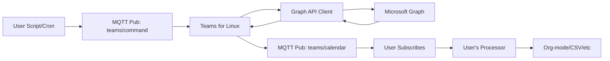

# Calendar Data Export Research

**Issue**: [#1995](https://github.com/IsmaelMartinez/teams-for-linux/issues/1995)
**Related**: [#1832 - Graph API Integration](https://github.com/IsmaelMartinez/teams-for-linux/issues/1832)
**Status**: ✅ Implemented
**Date**: 2025-11-27
**Implementation Date**: 2025-11-29

## Overview

User needs access to calendar data from Teams for Linux to process externally (e.g., convert to org-mode). This research investigates how to expose calendar data with minimal internal logic.

## Problem Statement

User wants to:
1. Access their Teams calendar data programmatically
2. Process it externally (org-mode conversion, etc.)
3. Avoid maintaining separate authentication scripts (2FA expires daily)

**Key insight:** Since they log into Teams for Linux daily anyway, the app can expose calendar data using existing authentication.

## Current State

### ✅ Already Implemented

Teams for Linux has Graph API integration (Phase 1 complete):

- **GraphApiClient** in `app/graphApi/`
- **Calendar endpoints** functional:
  - `GET /me/calendar/events` - All events
  - `GET /me/calendar/calendarView` - Date range filtered
- **IPC channels** available:
  - `graph-api-get-calendar-events`
  - `graph-api-get-calendar-view`

**User can already access calendar data today** via IPC calls (just needs documentation).

## Recommended Architecture

### Philosophy: Minimal Internal Logic

**What Teams for Linux should do:**
- ✅ Expose calendar data via MQTT command
- ✅ Return raw Graph API JSON
- ✅ React to `get-calendar` command

**What Teams for Linux should NOT do:**
- ❌ Format conversion (org-mode, CSV, etc.)
- ❌ Internal scheduling/polling
- ❌ Complex data transformation
- ❌ File management logic

**Let the user handle:** All formatting, scheduling, and processing externally.

### Architectural Constraints

Per [ADR-006](../adr/006-cli-argument-parsing-library.md):
- ❌ **Cannot add CLI action commands** (e.g., `teams-for-linux --get-calendar`)
  - Conflicts with meeting URL positional arguments
  - Would require fragile pre-parsing
  - High risk of breaking existing functionality

**Chosen approach:**
- ✅ MQTT commands (already used for actions like toggle-mute, toggle-video, etc.)

## Implementation: MQTT Command

**Decision:** MQTT command approach (leverages existing MQTT infrastructure per [MQTT Commands Implementation](mqtt-commands-implementation.md)).

**User triggers export via MQTT command:**

```bash
# User sends command to get calendar with start/end dates
mosquitto_pub -h localhost -t teams/command -m '{
  "action": "get-calendar",
  "startDate": "2025-11-27T00:00:00Z",
  "endDate": "2025-12-04T23:59:59Z"
}'
```

**Teams publishes calendar data to response topic:**

```bash
# Teams publishes to teams/calendar topic
# User subscribes and pipes to their processor
mosquitto_sub -h localhost -t teams/calendar | python3 ~/to_orgmode.py
```

**Architecture:**



**Implementation:**

```javascript
// In app/index.js - Extend existing mqttClient 'command' event listener
mqttClient.on('command', async (command) => {
  // ... existing command handlers (toggle-mute, toggle-video, etc.)

  if (command.action === 'get-calendar') {
    // Validate parameters
    const { startDate, endDate } = command;
    if (!startDate || !endDate) {
      console.error('[MQTT] get-calendar requires startDate and endDate');
      return;
    }

    // Fetch from Graph API
    const result = await graphApiClient.getCalendarView(startDate, endDate);

    // Publish raw Graph API JSON to dedicated topic
    if (result.success) {
      mqttClient.publish('teams/calendar', JSON.stringify(result));
    } else {
      console.error('[MQTT] Failed to get calendar:', result.error);
    }
  }
});
```

**User workflow:**

```bash
# 1. User creates script to request calendar
#!/bin/bash
START_DATE=$(date -I)
END_DATE=$(date -I -d "+7 days")
mosquitto_pub -h localhost -t teams/command -m "{
  \"action\":\"get-calendar\",
  \"startDate\":\"${START_DATE}T00:00:00Z\",
  \"endDate\":\"${END_DATE}T23:59:59Z\"
}"

# 2. User subscribes and processes
mosquitto_sub -h localhost -t teams/calendar -C 1 | python3 ~/to_orgmode.py > calendar.org

# 3. User schedules with cron
0 6 * * * /home/user/scripts/fetch-calendar.sh
```

**Pros:**
- ✅ Follows established MQTT pattern (ADR-006, ADR-007)
- ✅ Minimal code changes (~20 lines)
- ✅ Integrates with home automation
- ✅ Event-driven (no internal scheduling)
- ✅ User controls everything externally

**Cons:**
- ⚠️ Requires MQTT broker (but many users already have one)
- ⚠️ Slightly more setup than direct IPC

**Estimated effort:** 2-3 hours

## Data Format

**Return exactly what Graph API returns:**

```json
{
  "success": true,
  "data": {
    "value": [
      {
        "id": "AAMkAGI1...",
        "subject": "Team Standup",
        "start": {
          "dateTime": "2025-11-27T10:00:00.0000000",
          "timeZone": "UTC"
        },
        "end": {
          "dateTime": "2025-11-27T10:30:00.0000000",
          "timeZone": "UTC"
        },
        "location": {
          "displayName": "Teams Meeting"
        },
        "organizer": {
          "emailAddress": {
            "name": "John Doe",
            "address": "john@example.com"
          }
        },
        "attendees": [...],
        "bodyPreview": "Meeting description...",
        "onlineMeeting": {
          "joinUrl": "https://teams.cloud.microsoft/l/meetup/..."
        }
      }
    ]
  }
}
```

**User converts externally** with their own script (Python, shell, whatever).

## Implementation Steps

✅ **Completed Implementation** (2025-11-29):

1. ✅ Added `get-calendar` command to MQTT command handler (`app/mqtt/index.js`)
2. ✅ Implemented command validation for startDate and endDate parameters
3. ✅ Integrated Graph API client to fetch calendar data (`app/index.js`)
4. ✅ Added generic `publish()` method to MQTTClient for calendar data publishing
5. ✅ Published raw Graph API JSON to `teams/calendar` topic
6. ✅ Documented MQTT workflow in [MQTT Integration Guide](../../mqtt-integration.md#calendar-data-export)

**Files Modified:**
- `app/mqtt/index.js` - Added `get-calendar` to allowed actions and generic `publish()` method
- `app/index.js` - Added get-calendar command handler with Graph API integration
- `docs-site/docs/mqtt-integration.md` - Added Calendar Data Export section

## Implementation Risk

**Low risk:**
- ✅ Minimal code changes (~20 lines for MQTT)
- ✅ Uses existing Graph API client
- ✅ Uses existing MQTT infrastructure
- ✅ No complex logic
- ✅ User controls everything

## Success Criteria

1. User can retrieve calendar data as JSON via MQTT command
2. Data includes all Graph API fields
3. User can process output with their own tools
4. No internal formatting/transformation logic
5. No internal scheduling (user controls when to fetch)

## References

- [Issue #1995](https://github.com/IsmaelMartinez/teams-for-linux/issues/1995)
- [ADR-006: CLI Argument Parsing](../adr/006-cli-argument-parsing-library.md) - Why CLI commands are rejected
- [ADR-007: Embedded MQTT Broker](../adr/007-embedded-mqtt-broker.md) - MQTT architecture decisions
- [MQTT Commands Implementation](mqtt-commands-implementation.md) - Existing MQTT command pattern
- [Microsoft Graph Calendar API](https://learn.microsoft.com/en-us/graph/api/resources/calendar)
- [Existing Graph API Integration](graph-api-integration-research.md)
