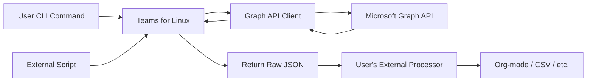

# Calendar Data Export Research

**Issue**: [#1995](https://github.com/IsmaelMartinez/teams-for-linux/issues/1995)
**Related**: [#1832 - Graph API Integration](https://github.com/IsmaelMartinez/teams-for-linux/issues/1832)
**Status**: Research Phase
**Date**: 2025-11-27

## Overview

User needs access to calendar data from Teams for Linux to process externally (e.g., convert to org-mode). This research investigates how to expose calendar data with minimal internal logic.

## Problem Statement

User wants to:
1. Access their Teams calendar data programmatically
2. Process it externally (org-mode conversion, etc.)
3. Avoid maintaining separate authentication scripts (2FA expires daily)

**Key insight:** Since they log into Teams for Linux daily anyway, the app can expose calendar data using existing authentication.

## Current State

### ✅ Already Implemented

Teams for Linux has Graph API integration (Phase 1 complete):

- **GraphApiClient** in `app/graphApi/`
- **Calendar endpoints** functional:
  - `GET /me/calendar/events` - All events
  - `GET /me/calendar/calendarView` - Date range filtered
- **IPC channels** available:
  - `graph-api-get-calendar-events`
  - `graph-api-get-calendar-view`

**User can already access calendar data today** via IPC calls:

```javascript
// From renderer/external script
const result = await ipcRenderer.invoke('graph-api-get-calendar-view',
  '2025-11-27T00:00:00Z',
  '2025-12-27T00:00:00Z'
);

console.log(result.data.value); // Raw Graph API JSON
```

## Recommended Architecture

### Philosophy: Minimal Internal Logic

**What Teams for Linux should do:**
- ✅ Expose calendar data via commands/IPC
- ✅ Return raw Graph API JSON
- ✅ Provide simple trigger mechanisms

**What Teams for Linux should NOT do:**
- ❌ Format conversion (org-mode, CSV, etc.)
- ❌ Internal scheduling/polling
- ❌ Complex data transformation
- ❌ File management logic

**Let the user handle:** All formatting, scheduling, and processing externally.

### Implementation: Command-Line Calendar Access

**Add a simple CLI command:**

```bash
# Get calendar for next 7 days as JSON
teams-for-linux --get-calendar --days 7 > calendar.json

# User processes externally
./convert-to-orgmode.sh calendar.json > calendar.org
```

**Or via IPC for external scripts:**

```bash
# External script triggers via IPC, receives JSON
electron-ipc-send teams-for-linux calendar-get-events \
  --start "2025-11-27" --end "2025-12-04" > events.json

# User's script processes it
python3 ~/scripts/to_orgmode.py events.json
```

### Architecture Diagram



**Key point:** Teams for Linux is just a bridge to the Graph API. All logic lives in user's scripts.

## Implementation Options

### Option 1: CLI Flag (Recommended)

**Add to existing CLI:**

```javascript
// app/startup/commandLine.js
if (args['get-calendar']) {
  const days = args['days'] || 7;
  // Fetch calendar, print JSON to stdout, exit
  fetchAndPrintCalendar(days);
  app.quit();
}
```

**User workflow:**
```bash
teams-for-linux --get-calendar --days 14 | jq . | my-processor.sh
```

**Pros:**
- ✅ Simple, standard CLI pattern
- ✅ Composable with pipes/scripts
- ✅ No new IPC channels needed
- ✅ Can be scripted with cron

**Cons:**
- ⚠️ Requires Teams to be authenticated (may need to handle auth flow)

### Option 2: IPC Command (Secondary)

**Expose existing IPC for external access:**

Already exists! User just needs documentation on how to call from external scripts.

**User workflow:**
```bash
# Using electron-ipc or similar tool
electron-ipc call teams-for-linux graph-api-get-calendar-view \
  "2025-11-27T00:00:00Z" "2025-12-04T00:00:00Z"
```

**Pros:**
- ✅ Already implemented
- ✅ No code changes needed

**Cons:**
- ⚠️ Requires IPC bridge tool
- ⚠️ Less standard than CLI

### Option 3: MQTT Publishing (If User Uses MQTT)

**Leverage existing MQTT infrastructure:**

```javascript
// On command or schedule
mqttClient.publish('teams-for-linux/calendar/events', JSON.stringify(events));
```

**Pros:**
- ✅ Integrates with home automation
- ✅ Existing infrastructure

**Cons:**
- ⚠️ Only useful if user has MQTT

## Data Format

**Return exactly what Graph API returns:**

```json
{
  "success": true,
  "data": {
    "value": [
      {
        "id": "AAMkAGI1...",
        "subject": "Team Standup",
        "start": {
          "dateTime": "2025-11-27T10:00:00.0000000",
          "timeZone": "UTC"
        },
        "end": {
          "dateTime": "2025-11-27T10:30:00.0000000",
          "timeZone": "UTC"
        },
        "location": {
          "displayName": "Teams Meeting"
        },
        "organizer": {
          "emailAddress": {
            "name": "John Doe",
            "address": "john@example.com"
          }
        },
        "attendees": [...],
        "onlineMeeting": {
          "joinUrl": "https://teams.microsoft.com/l/meetup/..."
        }
      }
    ]
  }
}
```

**User converts externally** with their own script (Python, shell, whatever).

## Implementation Steps

### Phase 1: CLI Access (Minimal)

1. Add `--get-calendar` CLI flag
2. Add `--days N` option (default: 7)
3. Print raw JSON to stdout
4. Document usage
5. User handles everything else

**Estimated effort:** 2-4 hours

### Phase 2: MQTT Integration (If Requested)

1. Add command to publish calendar to MQTT topic
2. User subscribes and processes
3. Document usage

**Estimated effort:** 1-2 hours

## Questions for User

### 1. Trigger Mechanism ⭐

**How do you want to retrieve calendar data?**

- [ ] CLI command (e.g., `teams-for-linux --get-calendar`)
- [ ] Existing IPC (call from external script)
- [ ] MQTT publish (if you use MQTT)
- [ ] Other: ___________

### 2. Date Range ⭐

**What date range should be retrieved?**

- [ ] Next N days (specify: ___)
- [ ] Specific start/end dates (passed as arguments)
- [ ] Doesn't matter, I'll specify each time
- [ ] Other: ___________

### 3. Your Processing Workflow

**What will you do with the JSON data?**

Example: "I'll run `teams-for-linux --get-calendar | python3 ~/scripts/to_orgmode.py > calendar.org`"

Your workflow:
```
[Describe briefly]
```

### 4. Scheduling

**How will you schedule/trigger this?**

- [ ] Manually when needed
- [ ] Cron job (I'll set up)
- [ ] Systemd timer (I'll set up)
- [ ] Home automation (I'll set up)
- [ ] Other: ___________

## Implementation Risk

**Low risk:**
- ✅ Minimal code changes
- ✅ Uses existing Graph API client
- ✅ No complex logic
- ✅ No file I/O (just stdout)
- ✅ User controls everything

## Success Criteria

1. User can retrieve calendar data as JSON
2. Data includes all Graph API fields
3. User can pipe output to their own processor
4. No internal formatting/transformation logic

## References

- [Issue #1995](https://github.com/IsmaelMartinez/teams-for-linux/issues/1995)
- [Microsoft Graph Calendar API](https://learn.microsoft.com/en-us/graph/api/resources/calendar)
- [Existing Graph API Integration](graph-api-integration-research.md)
