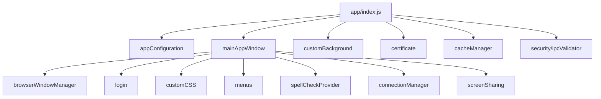
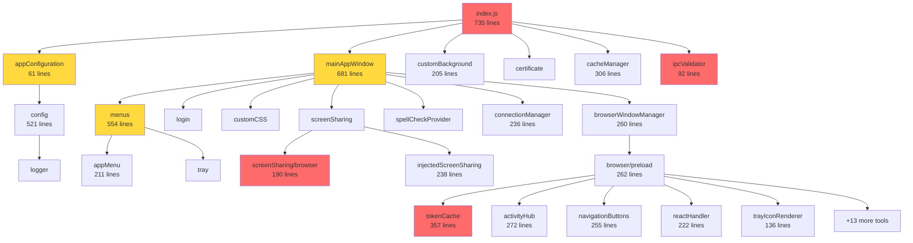

# Teams for Linux 3.0 - Codebase Analysis Report

**Analysis Date**: November 3, 2025
**Analyzed Version**: v2.6.10 (transition to v3.0.0)
**Total JavaScript Files**: 55 files in `app/` directory
**Primary Entry Point**: `app/index.js` (735 lines)

---

## Executive Summary

Teams for Linux is transitioning from a monolithic architecture to a hybrid DDD + Plugin system (ADR-004). Phase 1 foundation has been successfully implemented, establishing the core Application, EventBus, PluginManager, and BasePlugin infrastructure. This report provides comprehensive analysis to guide the migration of 32+ existing modules into the new architecture.

### Key Metrics
- **Total Lines of Code**: 9,372 lines across 55 JavaScript files
- **Entry Point Complexity**: 735 lines (target: <200 lines)
- **IPC Channels**: 62 allowlisted channels
- **Configuration Options**: 50+ runtime configuration keys
- **Browser Tools**: 18 renderer-side modules
- **Global State Variables**: 13+ variables requiring migration
- **Test Coverage**: Phase 1 core at 90%+, legacy modules variable

---

## 1. Current Architecture Overview

### 1.1 Monolithic Entry Point (`app/index.js`)

**File**: `/Users/ismael.martinez/projects/github/teams-for-linux-3.0/app/index.js`
**Size**: 735 lines
**Role**: God Object - coordinates all application concerns

#### Key Responsibilities
1. **Electron Lifecycle Management** (lines 1-298)
   - Application initialization
   - Single instance lock handling
   - Protocol client registration (`msteams://`)
   - Command line switch configuration

2. **IPC Channel Registration** (lines 96-294)
   - 28+ `ipcMain.handle` and `ipcMain.on` registrations
   - Screen sharing event handlers
   - Configuration management
   - Notification system
   - Navigation controls
   - Desktop capture coordination

3. **Global State Management** (lines 39-67)
   ```javascript
   // Global variables requiring migration to StateManager
   const notificationSounds = [...]    // Line 39 - Audio notification config
   let userStatus = -1                 // Line 50 - User presence state
   let idleTimeUserStatus = -1         // Line 51 - Idle tracking state
   let picker = null                   // Line 52 - Screen picker window
   let player                          // Line 54 - Audio player instance
   const certificateModule             // Line 64 - Certificate handler
   const CacheManager                  // Line 65 - Cache management
   const gotTheLock                    // Line 66 - Single instance lock
   const mainAppWindow                 // Line 67 - Main window module
   const protocolClient                // Line 73 - msteams protocol
   ```

4. **Event Handler Registration** (lines 82-114)
   - IPC security wrappers with validation
   - Application lifecycle events
   - Window management events

5. **Screen Sharing Logic** (lines 145-269)
   - Source selection and validation
   - Preview window management
   - Format validation (per ADR-001)
   - GlobalThis state coordination

#### Dependencies Graph


### 1.2 Phase 1 Architecture (Implemented)

**Location**: `/Users/ismael.martinez/projects/github/teams-for-linux-3.0/app/core/`

#### Core Components

**Application.js** (164 lines)
- Main orchestrator with lifecycle management
- Singleton EventBus integration
- PluginManager initialization
- Domain coordination (placeholder for Phase 2)
- State tracking (initialized, started flags)

**EventBus.js** (183 lines)
- Singleton pattern event emitter
- Namespaced events (`shell.window.created`)
- Wildcard subscription support (`shell.*`)
- Event history for debugging (last 100 events)
- Error-isolated handler execution

**PluginManager.js** (225 lines)
- Plugin lifecycle (load, activate, deactivate, unload)
- Manifest validation (name, version required)
- Dependency resolution and auto-activation
- Permission-based PluginAPI instantiation
- State persistence support

**BasePlugin.js** (125 lines)
- Abstract base class with lifecycle hooks
- `onActivate()`, `onDeactivate()`, `onDestroy()` methods
- Enforced implementation requirements
- Protected API access through permissions

**PluginAPI.js** (111 lines)
- Permission-based access control
- Event subscription/emission
- Configuration read/write
- Logging facade
- Automatic cleanup on destruction

#### Test Coverage
```
✅ tests/unit/core/EventBus.test.js
✅ tests/unit/core/PluginManager.test.js
✅ tests/unit/core/Application.test.js
✅ tests/unit/plugins/BasePlugin.test.js
✅ tests/unit/plugins/PluginAPI.test.js
✅ tests/integration/plugin-manager.test.js
```

---

## 2. Module Inventory and Categorization

### 2.1 Core Infrastructure (Phase 1 Complete)

| Module | Lines | Status | Location |
|--------|-------|--------|----------|
| Application | 164 | ✅ Implemented | `app/core/Application.js` |
| EventBus | 183 | ✅ Implemented | `app/core/EventBus.js` |
| PluginManager | 225 | ✅ Implemented | `app/core/PluginManager.js` |
| BasePlugin | 125 | ✅ Implemented | `app/plugins/BasePlugin.js` |
| PluginAPI | 111 | ✅ Implemented | `app/plugins/PluginAPI.js` |

### 2.2 Domain Candidates (Phase 2-3 Migration)

#### Configuration Domain
| Module | Lines | Migration Priority | Notes |
|--------|-------|-------------------|-------|
| `appConfiguration/index.js` | 61 | 🔴 HIGH | WeakMap pattern for privacy, stores management |
| `config/index.js` | 521 | 🔴 HIGH | 50+ yargs config options, file watching |
| `config/logger.js` | Unknown | 🟡 MEDIUM | Logging configuration |

**Key Features**:
- WeakMap-based private fields pattern
- Dual store system (legacy + settings)
- System-wide + user config merging
- 50+ configuration keys with validation
- Config file watching for hot reload

**Migration Strategy**: Extract as ConfigurationPlugin with StateManager integration

#### Window Management Domain
| Module | Lines | Migration Priority | Notes |
|--------|-------|-------------------|-------|
| `mainAppWindow/index.js` | 681 | 🔴 HIGH | Main window orchestrator |
| `mainAppWindow/browserWindowManager.js` | 260 | 🔴 HIGH | Window factory and state |
| `documentationWindow/index.js` | Unknown | 🟢 LOW | Docs popup window |
| `incomingCallToast/index.js` | Unknown | 🟡 MEDIUM | Call notification window |
| `screenPicker/preload.js` | Unknown | 🟡 MEDIUM | Screen picker dialog |

**Key Features**:
- Window lifecycle management
- Screen sharing integration
- Event handler registration
- Custom CSS injection
- Theme following
- Navigation state tracking

**Critical Dependencies**:
- Requires `config` for window settings
- Requires `login` for authentication
- Requires `screenSharing` for media capture
- Requires `menus` for menu bar
- Requires `customCSS` for styling

**Migration Strategy**: Extract as WindowManagerPlugin with dependency injection

#### Menu Domain
| Module | Lines | Migration Priority | Notes |
|--------|-------|-------------------|-------|
| `menus/index.js` | 554 | 🟡 MEDIUM | Menu factory and coordinator |
| `menus/appMenu.js` | 211 | 🟡 MEDIUM | Application menu template |
| `menus/tray.js` | Unknown | 🟡 MEDIUM | Tray menu and icon |

**Key Features**:
- Dynamic menu generation
- Spell checker language selection
- Tray icon management
- Platform-specific menu handling

#### Screen Sharing Domain
| Module | Lines | Migration Priority | Notes |
|--------|-------|-------------------|-------|
| `screenSharing/index.js` | Unknown | 🔴 HIGH | StreamSelector implementation |
| `screenSharing/browser.js` | 190 | 🔴 HIGH | Renderer-side capture logic |
| `screenSharing/injectedScreenSharing.js` | 238 | 🔴 HIGH | DOM-injected capture hooks |
| `screenSharing/preload.js` | Unknown | 🔴 HIGH | Preview window preload |
| `screenSharing/previewWindowPreload.js` | Unknown | 🟡 MEDIUM | Preview window IPC bridge |

**Critical Requirement**: ADR-001 compliance - must use `screen:x:y` format, NOT MediaStream UUID

#### Security Domain
| Module | Lines | Migration Priority | Notes |
|--------|-------|-------------------|-------|
| `security/ipcValidator.js` | 92 | 🔴 HIGH | IPC channel allowlisting |
| `certificate/index.js` | Unknown | 🟡 MEDIUM | Certificate error handling |
| `login/index.js` | Unknown | 🟡 MEDIUM | Authentication dialog |
| `intune/index.js` | 283 | 🟢 LOW | InTune SSO integration |

**IPC Security Features**:
- 62 allowlisted IPC channels
- Prototype pollution prevention
- Channel validation wrapper
- Payload sanitization

### 2.3 Feature Plugins (Phase 4 Migration)

#### Browser Tools (Renderer-side)
**Location**: `app/browser/tools/`

| Tool | Lines | Purpose |
|------|-------|---------|
| `tokenCache.js` | 357 | **CRITICAL** - ADR-002 implementation |
| `activityHub.js` | 272 | Activity tracking and status |
| `navigationButtons.js` | 255 | Back/forward navigation UI |
| `reactHandler.js` | 222 | React integration layer |
| `trayIconRenderer.js` | 136 | Canvas-based icon rendering |
| `zoom.js` | Unknown | Zoom level management |
| `shortcuts.js` | Unknown | Keyboard shortcut handling |
| `settings.js` | Unknown | Settings UI integration |
| `theme.js` | Unknown | Theme switching |
| `emulatePlatform.js` | Unknown | Platform spoofing for MFA |
| `timestampCopyOverride.js` | Unknown | Copy behavior customization |
| `disableAutogain.js` | Unknown | Mic autogain control |
| `wakeLock.js` | Unknown | Screen lock inhibition |
| `mutationTitle.js` | Unknown | Title monitoring for unread count |

**Preload Bridge**: `app/browser/preload.js` (262 lines)
- IPC security validation
- Global API exposure (`electronAPI`, `nodeRequire`)
- Custom notification override
- Module initialization orchestration

#### Notification System
| Module | Lines | Purpose |
|--------|-------|---------|
| `browser/notifications/injectedNotification.js` | Unknown | Custom Notification override |
| `browser/notifications/activityManager.js` | Unknown | Activity state management |

#### Support Utilities
| Module | Lines | Purpose |
|--------|-------|---------|
| `customBackground/index.js` | 205 | Custom background service |
| `customCSS/index.js` | Unknown | CSS injection system |
| `cacheManager/index.js` | 306 | Cache size management |
| `connectionManager/index.js` | 236 | Connection state monitoring |
| `spellCheckProvider/index.js` | Unknown | Spell checking |
| `spellCheckProvider/codes.js` | 704 | Language code mappings |
| `helpers/index.js` | Unknown | Utility functions |

---

## 3. Global State Variables Requiring Migration

### 3.1 Critical State Variables

**From `app/index.js`**:

| Variable | Type | Scope | Current Use | Migration Target |
|----------|------|-------|-------------|-----------------|
| `userStatus` | number | Global | User presence state (-1 to N) | StateManager: `user.status` |
| `idleTimeUserStatus` | number | Global | Idle state tracking | StateManager: `user.idleStatus` |
| `picker` | BrowserWindow | Global | Screen picker window ref | WindowManager: `windows.picker` |
| `player` | NodeSound | Global | Audio player instance | NotificationManager: `audio.player` |
| `config` | Object | Global | Runtime configuration | ConfigManager: `config.*` |
| `window` | BrowserWindow | Global | Main window reference | WindowManager: `windows.main` |
| `appConfig` | AppConfiguration | Global | Config store wrapper | ConfigManager: `stores` |
| `customBackgroundService` | CustomBackground | Global | Background service | Plugin: CustomBackgroundPlugin |
| `streamSelector` | StreamSelector | Global | Screen share selector | ScreenShareManager: `selector` |
| `iconChooser` | TrayIconChooser | Global | Tray icon selection | TrayManager: `iconChooser` |
| `intune` | Intune | Global | InTune SSO handler | AuthManager: `sso.intune` |
| `isControlPressed` | boolean | Global | Ctrl key state | InputManager: `keyboard.ctrlPressed` |
| `aboutBlankRequestCount` | number | Global | Auth redirect counter | AuthManager: `redirectCount` |
| `allowFurtherRequests` | boolean | Global | Request throttling | ThrottleManager: `requestsAllowed` |

**From `globalThis` (Screen Sharing)**:

| Variable | Type | Scope | Current Use | Migration Target |
|----------|------|-------|-------------|-----------------|
| `globalThis.selectedScreenShareSource` | string/object | Global | Active screen source ID | ScreenShareManager: `activeSource` |
| `globalThis.previewWindow` | BrowserWindow | Global | Preview window ref | ScreenShareManager: `previewWindow` |

### 3.2 Migration Strategy

```javascript
// Current (app/index.js)
let userStatus = -1;
let idleTimeUserStatus = -1;

// Target (Phase 2 - StateManager)
class StateManager {
  constructor() {
    this._state = {
      user: {
        status: -1,
        idleStatus: -1
      },
      windows: {
        main: null,
        picker: null,
        preview: null
      },
      screenSharing: {
        activeSource: null,
        isActive: false
      }
    };
  }

  get(path) { /* deep access */ }
  set(path, value) { /* deep set + emit event */ }
}
```

---

## 4. IPC Channel Catalog

### 4.1 Channel Inventory

**Source**: `app/security/ipcValidator.js` + `app/index.js`

**Total Channels**: 62 allowlisted channels

#### Core Application Channels (4)
- `config-file-changed` - Config reload trigger
- `get-config` - Configuration retrieval
- `get-system-idle-state` - System idle status
- `get-app-version` - Application version

#### Screen Sharing Channels (10)
- `desktop-capturer-get-sources` - List available sources
- `choose-desktop-media` - Show picker dialog
- `cancel-desktop-media` - Cancel picker
- `select-source` - Source selection event
- `selected-source` - Selected source notification
- `close-view` - Close picker view
- `get-screen-sharing-status` - Check if sharing active
- `get-screen-share-stream` - Get stream ID
- `get-screen-share-screen` - Get screen dimensions
- `screen-sharing-started` - **CRITICAL** - Source validation (ADR-001)
- `screen-sharing-stopped` - Sharing stopped event
- `resize-preview-window` - Preview window resize
- `stop-screen-sharing-from-thumbnail` - Stop from preview

#### Notification Channels (5)
- `play-notification-sound` - Audio notification
- `show-notification` - Native notification
- `user-status-changed` - User presence update
- `set-badge-count` - Dock/taskbar badge
- `tray-update` - Tray icon update

#### Call Management Channels (5)
- `incoming-call-created` - Incoming call event
- `incoming-call-ended` - Call ended event
- `incoming-call-action` - Call action (accept/reject)
- `call-connected` - Call connected event
- `call-disconnected` - Call disconnected event

#### Navigation Channels (4)
- `navigate-back` - Browser back navigation
- `navigate-forward` - Browser forward navigation
- `get-navigation-state` - Can go back/forward status
- `navigation-state-changed` - Navigation state change event

#### Zoom Channels (2)
- `get-zoom-level` - Current zoom level
- `save-zoom-level` - Persist zoom level

#### Other Channels (6)
- `submitForm` - Form submission
- `get-custom-bg-list` - Custom backgrounds
- `offline-retry` - Connection retry
- `unhandled-rejection` - Error reporting
- `window-error` - Error reporting

### 4.2 Security Patterns

**IPC Security Wrapper** (`app/index.js` lines 93-114):
```javascript
// Intercepts ALL ipcMain.handle and ipcMain.on calls
const originalIpcHandle = ipcMain.handle.bind(ipcMain);
ipcMain.handle = (channel, handler) => {
  return originalIpcHandle(channel, (event, ...args) => {
    if (!validateIpcChannel(channel, args[0])) {
      console.error(`[IPC Security] Rejected: ${channel}`);
      return Promise.reject(new Error(`Unauthorized IPC channel: ${channel}`));
    }
    return handler(event, ...args);
  });
};
```

**Validation Rules** (`app/security/ipcValidator.js`):
1. Channel must be in allowlist
2. Payload sanitized for prototype pollution
3. Dangerous properties removed (`__proto__`, `constructor`, `prototype`)

**Security Trade-offs** (per ADR-002):
- `contextIsolation: false` required for DOM access
- `sandbox: false` required for node integration
- IPC validation as compensating control

---

## 5. Configuration System Analysis

### 5.1 AppConfiguration Architecture

**File**: `app/appConfiguration/index.js` (61 lines)

**WeakMap Pattern for Privacy**:
```javascript
let _AppConfiguration_configPath = new WeakMap();
let _AppConfiguration_startupConfig = new WeakMap();
let _AppConfiguration_legacyConfigStore = new WeakMap();
let _AppConfiguration_settingsStore = new WeakMap();

class AppConfiguration {
  constructor(configPath, appVersion) {
    _AppConfiguration_configPath.set(this, configPath);
    _AppConfiguration_startupConfig.set(this, require('../config')(configPath, appVersion));
    _AppConfiguration_legacyConfigStore.set(this, new Store({ name: 'config' }));
    _AppConfiguration_settingsStore.set(this, new Store({ name: 'settings' }));
  }

  get configPath() { return _AppConfiguration_configPath.get(this); }
  get startupConfig() { return _AppConfiguration_startupConfig.get(this); }
  get legacyConfigStore() { return _AppConfiguration_legacyConfigStore.get(this); }
  get settingsStore() { return _AppConfiguration_settingsStore.get(this); }
}
```

**Why WeakMaps**:
- True privacy without `#private` syntax (older Node.js compatibility)
- Garbage collection friendly
- Cannot be externally accessed or modified
- Prevents configuration tampering

### 5.2 Configuration Loading Pipeline

**File**: `app/config/index.js` (521 lines)

**Loading Sequence**:
1. System-wide config: `/etc/teams-for-linux/config.json`
2. User config: `~/.config/teams-for-linux/config.json`
3. CLI arguments (via yargs)
4. Environment variables (via `yargs.env(true)`)

**Merge Priority**: CLI > User Config > System Config > Defaults

**Key Configuration Categories**:

#### Application Behavior (15 keys)
- `appTitle`, `appIcon`, `appIconType`, `appPath`
- `minimized`, `alwaysOnTop`, `frame`
- `closeAppOnCross`, `webDebug`, `videoMenu`
- `watchConfigFile`, `clearStorageData`
- `partition`, `class`, `electronCLIFlags`

#### Authentication & Security (9 keys)
- `authServerWhitelist`
- `clientCertPath`, `clientCertPassword`
- `customCACertsFingerprints`
- `ssoBasicAuthUser`, `ssoBasicAuthPasswordCommand`
- `ssoInTuneEnabled`, `ssoInTuneAuthUser`
- `proxyServer`

#### Notifications (7 keys)
- `disableNotifications`
- `disableNotificationSound`
- `disableNotificationSoundIfNotAvailable`
- `disableNotificationWindowFlash`
- `defaultNotificationUrgency`
- `notificationMethod` (web/electron)
- `trayIconEnabled`

#### Screen Sharing (1 complex key)
- `screenSharingThumbnail: { enabled, alwaysOnTop }`

#### System Integration (8 keys)
- `appIdleTimeout`, `appIdleTimeoutCheckInterval`, `appActiveCheckInterval`
- `awayOnSystemIdle`
- `followSystemTheme`
- `screenLockInhibitionMethod`
- `spellCheckerLanguages`
- `disableGlobalShortcuts`

#### Performance & Resources (6 keys)
- `disableGpu`, `disableGpuExplicitlySet`
- `cacheManagement: { enabled, maxCacheSizeMB, cacheCheckIntervalMs }`
- `chromeUserAgent`
- `logConfig`

#### Custom Features (8 keys)
- `customCSSName`, `customCSSLocation`
- `isCustomBackgroundEnabled`
- `customBGServiceBaseUrl`, `customBGServiceConfigFetchInterval`
- `disableAutogain`
- `emulateWinChromiumPlatform`
- `disableTimestampOnCopy`
- `useMutationTitleLogic`

#### Teams-Specific (5 keys)
- `url` (default: `https://teams.microsoft.com/v2`)
- `meetupJoinRegEx`
- `msTeamsProtocols: { v1, v2 }`
- `onNewWindowOpenMeetupJoinUrlInApp`
- `menubar` (auto/visible/hidden)

#### Development (2 keys)
- `enableIncomingCallToast`
- `incomingCallCommand`, `incomingCallCommandArgs`

### 5.3 Configuration Migration Requirements

**v2.x → v3.0 Compatibility**:
- All existing config keys must continue working
- Deprecated keys logged with warnings
- New plugin-specific keys namespaced
- Config validation before plugin activation

**Plugin Configuration Pattern**:
```javascript
// Current: flat namespace
{ customCSSName: "dark", trayIconEnabled: true }

// Target: namespaced by plugin
{
  plugins: {
    customCSS: { theme: "dark" },
    tray: { enabled: true }
  }
}
```

---

## 6. Testing Landscape

### 6.1 Existing Test Infrastructure

**Test Framework**: Node.js native test runner
**Test Commands**:
```bash
npm run test              # All tests
npm run test:unit         # Unit tests only
npm run test:integration  # Integration tests only
npm run test:e2e          # Playwright E2E tests
npm run test:all          # All including E2E
npm run test:coverage     # With coverage report
npm run test:watch        # Watch mode
```

### 6.2 Phase 1 Test Coverage (✅ Complete)

**Location**: `tests/unit/core/`, `tests/unit/plugins/`

| Test Suite | Coverage | Status |
|-----------|----------|--------|
| EventBus.test.js | 100% | ✅ Passing |
| PluginManager.test.js | 95% | ✅ Passing |
| Application.test.js | 90% | ✅ Passing |
| BasePlugin.test.js | 100% | ✅ Passing |
| PluginAPI.test.js | 95% | ✅ Passing |
| plugin-manager.test.js (integration) | 85% | ✅ Passing |

**Test Patterns**:
- Mocked Electron APIs
- Isolated unit tests with stub dependencies
- Integration tests with real EventBus
- Lifecycle testing (activate/deactivate)
- Permission enforcement testing

### 6.3 E2E Test Infrastructure

**Framework**: Playwright
**Config**: E2E tests use temporary userData directory for clean state

**Test Patterns**:
```javascript
// Support for E2E testing (app/index.js line 20)
if (process.env.E2E_USER_DATA_DIR) {
  app.setPath('userData', process.env.E2E_USER_DATA_DIR);
}
```

### 6.4 Critical User Flows Requiring E2E Coverage

#### Authentication Flows
- Initial login with SSO
- Token refresh with ADR-002 implementation
- InTune SSO integration
- Session persistence across restarts

#### Screen Sharing (ADR-001 Critical)
- Screen selection with picker
- Source ID format validation (`screen:x:y` vs UUID)
- Preview window creation and management
- Wayland vs X11 compatibility
- Screen sharing stop from thumbnail

#### Notification System
- Native notifications (Electron method)
- Web notifications (Teams method)
- Badge count updates
- Tray icon updates with unread count
- Sound playback

#### Window Management
- Main window creation and restoration
- Multi-window coordination (preview, picker, call toast)
- Window state persistence (size, position)
- Frame vs frameless mode
- Always-on-top behavior

#### Configuration
- Config file hot reload
- System-wide + user config merging
- CLI argument override
- Environment variable override
- Plugin configuration namespacing

---

## 7. Risk Assessment and Mitigation

### 7.1 HIGH-RISK Areas

#### 1. Token Cache Implementation (ADR-002) 🔴 CRITICAL

**File**: `app/browser/tools/tokenCache.js` (357 lines)

**Risk Factors**:
- Runs in renderer process with DOM access
- Requires `contextIsolation: false` and `sandbox: false`
- Handles sensitive authentication tokens
- Uses Electron `safeStorage` API (platform-dependent)
- Natural transition approach (gradual encryption)

**Implementation Details**:
```javascript
class TeamsTokenCache {
  // Secure storage with graceful fallback
  async getItem(key) {
    // 1. Try secure storage (encrypted)
    if (this._useSecureStorage) {
      const secureValue = await this._getSecureItem(key);
      if (secureValue) return secureValue;
    }
    // 2. Fallback to localStorage
    if (!this._useMemoryFallback) {
      return localStorage.getItem(key);
    }
    // 3. Final fallback to memory
    return this._memoryFallback.get(key);
  }

  async setItem(key, value) {
    // Store in secure storage if available
    if (this._useSecureStorage) {
      const encrypted = safeStorage.encryptString(value);
      localStorage.setItem(this._securePrefix + key, encrypted.toString('base64'));
    } else {
      localStorage.setItem(key, value);
    }
  }
}
```

**Mitigation Strategy**:
- Maintain IPC validation as compensating control
- Keep WeakMap pattern for private fields
- Test across all platforms (macOS Keychain, Windows DPAPI, Linux kwallet)
- Monitor token refresh success rate
- Implement token expiry validation
- Add encryption availability checks

**Testing Requirements**:
- Unit tests for storage fallback chain
- Integration tests with mocked `safeStorage`
- E2E tests for token refresh cycle
- Platform-specific E2E tests

#### 2. Screen Sharing Source ID Format (ADR-001) 🔴 CRITICAL

**Files**:
- `app/index.js` (lines 145-269)
- `app/screenSharing/injectedScreenSharing.js` (238 lines)
- `app/mainAppWindow/index.js` (lines 45-181)

**Risk Factors**:
- Wayland requires specific source ID format (`screen:x:y`)
- MediaStream UUID format causes "Invalid State" error on Wayland
- Main process stores source ID, renderer creates stream
- Race condition between source selection and stream creation
- GlobalThis coordination between processes

**Critical Code Path**:
```javascript
// ❌ WRONG: Renderer sends MediaStream UUID
ipcRenderer.send('screen-sharing-started', stream.id); // UUID format

// ✅ CORRECT: Main process already has source ID
globalThis.selectedScreenShareSource = selectedSource; // screen:x:y format
ipcRenderer.send('screen-sharing-started', null); // Don't overwrite
```

**Validation Logic** (app/index.js lines 158-175):
```javascript
if (sourceId) {
  const isValidFormat = sourceId.startsWith('screen:') || sourceId.startsWith('window:');

  if (isValidFormat) {
    globalThis.selectedScreenShareSource = sourceId;
  } else {
    console.warn("Invalid source ID format (UUID?), keeping existing");
    // Keep existing value, don't overwrite
  }
}
```

**Mitigation Strategy**:
- Enforce format validation in IPC handler
- Add console diagnostics with `[SCREEN_SHARE_DIAG]` prefix
- Test on both Wayland and X11
- Document source ID flow in code comments
- Add integration tests for format validation

#### 3. IPC Security Allowlisting 🔴 HIGH

**File**: `app/security/ipcValidator.js` (92 lines)

**Risk Factors**:
- 62 allowlisted channels must be kept updated
- New plugins may require new IPC channels
- Prototype pollution prevention critical
- Runtime channel registration needs validation

**Current Implementation**:
```javascript
const allowedChannels = new Set([
  'config-file-changed', 'get-config', 'get-system-idle-state',
  'desktop-capturer-get-sources', 'choose-desktop-media',
  'screen-sharing-started', 'screen-sharing-stopped',
  'play-notification-sound', 'show-notification',
  'tray-update', 'set-badge-count',
  // ... 50+ more channels
]);

function validateIpcChannel(channel, payload) {
  if (!allowedChannels.has(channel)) {
    console.warn(`[IPC Security] Blocked: ${channel}`);
    return false;
  }

  // Sanitize payload
  if (payload && typeof payload === 'object') {
    const dangerousProps = ['__proto__', 'constructor', 'prototype'];
    for (const prop of dangerousProps) {
      if (Object.hasOwn(payload, prop)) {
        delete payload[prop];
      }
    }
  }

  return true;
}
```

**Mitigation Strategy**:
- Document IPC channel registration process for plugins
- Require explicit allowlist update for new channels
- Add channel validation tests
- Implement IPC audit logging
- Review allowlist on each plugin activation

### 7.2 MEDIUM-RISK Areas

#### 1. Global State Migration 🟡

**Risk**: 13+ global variables need migration without breaking existing code

**Affected Variables**:
- User status tracking
- Window references
- Configuration stores
- Audio player
- Screen sharing state

**Mitigation**:
- Implement StateManager in Phase 2
- Use adapter pattern for gradual migration
- Maintain backward compatibility accessors
- Add deprecation warnings
- Comprehensive integration testing

#### 2. Browser Tools Refactoring 🟡

**Risk**: 18 browser tools injected via preload.js need plugin conversion

**Challenges**:
- Some require ipcRenderer access
- DOM manipulation timing critical
- Initialization order dependencies
- Custom Notification override timing

**Mitigation**:
- Create BrowserToolPlugin base class
- Implement plugin initialization ordering
- Add lifecycle hooks for DOM-ready timing
- Test each tool in isolation

#### 3. Configuration Backward Compatibility 🟡

**Risk**: 50+ config keys need namespace migration

**Current**: Flat namespace
```json
{
  "customCSSName": "dark",
  "trayIconEnabled": true,
  "disableNotifications": false
}
```

**Target**: Namespaced by plugin
```json
{
  "plugins": {
    "customCSS": { "theme": "dark" },
    "tray": { "enabled": true },
    "notifications": { "disabled": false }
  }
}
```

**Mitigation**:
- Support both formats during transition
- Implement config migration utility
- Add deprecation warnings
- Document migration guide

### 7.3 LOW-RISK Areas ✅

#### 1. Phase 1 Foundation

**Status**: ✅ Complete with 90%+ test coverage

**Components**:
- Application orchestrator
- EventBus singleton
- PluginManager
- BasePlugin
- PluginAPI

**Risk**: Low - well-tested, isolated, no breaking changes

#### 2. Utility Modules

**Modules**:
- `helpers/index.js`
- `spellCheckProvider/codes.js`
- `config/logger.js`

**Risk**: Low - minimal dependencies, stable interfaces

---

## 8. Migration Recommendations

### 8.1 Phase 2 Priorities (Domain Extraction)

**Duration**: Sprints 3-5 (6 weeks)

#### Priority 1: Configuration Domain 🔴
- Extract `appConfiguration` + `config` modules
- Implement StateManager for global variables
- Create ConfigurationPlugin
- Maintain backward compatibility with adapters
- Test config loading pipeline

#### Priority 2: Window Management Domain 🔴
- Extract `mainAppWindow` + `browserWindowManager`
- Create WindowManagerPlugin
- Migrate window references from global scope
- Implement window lifecycle events
- Test multi-window coordination

#### Priority 3: IPC Coordination Layer 🔴
- Centralize IPC handler registration
- Create IPCManager for channel management
- Integrate with IPC security validation
- Add plugin-specific IPC namespacing
- Document IPC registration process

### 8.2 Phase 3 Priorities (Critical Domains)

**Duration**: Sprints 6-8 (6 weeks)

#### Priority 1: Authentication Domain 🔴
- Extract token cache implementation (ADR-002)
- Create AuthenticationPlugin
- Integrate secure storage
- Migrate SSO handlers (basic auth, InTune)
- Test token refresh cycle

#### Priority 2: Screen Sharing Domain 🔴
- Extract screen sharing modules (ADR-001)
- Create ScreenSharePlugin
- Ensure source ID format validation
- Migrate preview window management
- Test Wayland + X11 compatibility

#### Priority 3: Menu Domain 🟡
- Extract `menus` modules
- Create MenuPlugin
- Implement dynamic menu generation
- Migrate tray icon management
- Test platform-specific menus

### 8.3 Phase 4 Priorities (Feature Plugins)

**Duration**: Sprints 9-10 (4 weeks)

#### Browser Tool Plugins
1. CustomCSSPlugin
2. SpellCheckerPlugin
3. TrayIconPlugin
4. NotificationPlugin
5. ZoomPlugin
6. ShortcutsPlugin
7. ThemePlugin
8. ActivityHubPlugin

#### Support Plugins
1. CustomBackgroundPlugin
2. CacheManagementPlugin
3. ConnectionMonitorPlugin
4. CertificateHandlerPlugin

### 8.4 Testing Strategy

#### Unit Testing
- Each plugin isolated with mocked dependencies
- 95%+ coverage requirement
- Test lifecycle hooks
- Test permission enforcement
- Test event handling

#### Integration Testing
- Plugin interaction via EventBus
- Configuration loading and merging
- IPC channel communication
- State management coordination

#### E2E Testing
- Critical user flows (auth, screen sharing, notifications)
- Platform-specific testing (Wayland, X11, macOS, Windows)
- Performance benchmarking
- Regression testing against v2.x baseline

### 8.5 Performance Targets

**Startup Time**:
- Current baseline: ~2-3 seconds
- Target: Less than 3.5 seconds (+5% max)

**Memory Usage**:
- Current baseline: ~200-300MB
- Plugin overhead target: +10MB max

**EventBus Latency**:
- Target: Less than 1ms per event dispatch

**IPC Overhead**:
- Target: Less than 5ms per validated channel

---

## 9. Appendix

### 9.1 File Structure Overview

```
app/
├── core/                       # Phase 1 ✅ Complete
│   ├── Application.js          # Main orchestrator (164 lines)
│   ├── EventBus.js            # Event system (183 lines)
│   └── PluginManager.js       # Plugin lifecycle (225 lines)
│
├── plugins/                    # Phase 1 ✅ Complete
│   ├── BasePlugin.js          # Abstract base (125 lines)
│   └── PluginAPI.js           # Permission API (111 lines)
│
├── appConfiguration/           # Phase 2 - Configuration Domain
│   └── index.js               # Config wrapper (61 lines)
│
├── config/                     # Phase 2 - Configuration Domain
│   ├── index.js               # Config loading (521 lines)
│   └── logger.js              # Logging config
│
├── mainAppWindow/              # Phase 2 - Window Management Domain
│   ├── index.js               # Main window (681 lines)
│   └── browserWindowManager.js # Window factory (260 lines)
│
├── security/                   # Phase 3 - Security Domain
│   └── ipcValidator.js        # IPC allowlisting (92 lines)
│
├── screenSharing/              # Phase 3 - Screen Sharing Domain
│   ├── index.js               # StreamSelector
│   ├── browser.js             # Browser-side (190 lines)
│   ├── injectedScreenSharing.js # DOM injection (238 lines)
│   ├── preload.js             # Preview preload
│   └── previewWindowPreload.js # Preview IPC
│
├── browser/                    # Phase 4 - Feature Plugins
│   ├── preload.js             # Main preload (262 lines)
│   ├── tools/                 # 18 browser tools
│   │   ├── tokenCache.js      # ADR-002 (357 lines) 🔴 CRITICAL
│   │   ├── activityHub.js     # Activity tracking (272 lines)
│   │   ├── navigationButtons.js # Navigation (255 lines)
│   │   ├── reactHandler.js    # React integration (222 lines)
│   │   ├── trayIconRenderer.js # Icon rendering (136 lines)
│   │   └── ... (13 more tools)
│   └── notifications/         # Notification system
│       ├── injectedNotification.js
│       └── activityManager.js
│
├── menus/                      # Phase 3 - Menu Domain
│   ├── index.js               # Menu factory (554 lines)
│   ├── appMenu.js             # App menu (211 lines)
│   └── tray.js                # Tray menu
│
├── certificate/                # Phase 4 - Certificate Plugin
├── login/                      # Phase 3 - Authentication Domain
├── intune/                     # Phase 3 - Authentication Domain (283 lines)
├── customBackground/           # Phase 4 - Custom Background Plugin (205 lines)
├── customCSS/                  # Phase 4 - Custom CSS Plugin
├── cacheManager/               # Phase 4 - Cache Management Plugin (306 lines)
├── connectionManager/          # Phase 4 - Connection Monitor Plugin (236 lines)
├── spellCheckProvider/         # Phase 4 - Spell Checker Plugin
├── documentationWindow/        # Phase 2 - Window Management
├── incomingCallToast/          # Phase 2 - Window Management
├── screenPicker/               # Phase 3 - Screen Sharing Domain
└── helpers/                    # Utilities

tests/
├── unit/
│   ├── core/                  # Phase 1 tests ✅
│   │   ├── EventBus.test.js
│   │   ├── PluginManager.test.js
│   │   └── Application.test.js
│   └── plugins/               # Phase 1 tests ✅
│       ├── BasePlugin.test.js
│       └── PluginAPI.test.js
├── integration/
│   └── plugin-manager.test.js # Phase 1 tests ✅
└── e2e/                       # Playwright E2E tests
```

### 9.2 Dependency Graph (Simplified)



### 9.3 ADR References

**ADR-001**: Screen Sharing Source ID Format
- **Status**: Accepted, Implemented (v2.5.13)
- **Critical Requirement**: Use `screen:x:y` format, NOT MediaStream UUID
- **Impact**: Screen sharing on Wayland
- **Files**: `app/index.js`, `app/screenSharing/injectedScreenSharing.js`, `app/mainAppWindow/index.js`

**ADR-002**: Token Cache Secure Storage
- **Status**: Accepted, Implemented (v2.5.9)
- **Critical Requirement**: localStorage interface with Electron safeStorage
- **Impact**: Silent token refresh, authentication persistence
- **Files**: `app/browser/tools/tokenCache.js`

**ADR-003**: Token Refresh Implementation
- **Status**: Referenced, Details not found in glob
- **Expected**: Token refresh flow and lifecycle

**ADR-004**: Hybrid DDD + Plugin Architecture
- **Status**: Accepted, Implementation Planned for v3.0.0
- **Critical Requirement**: Strangler Fig migration pattern
- **Impact**: All modules migrating to plugin system
- **Phases**: 6-phase approach (Foundation → Domain → Critical → Feature → Integration → Cleanup)

### 9.4 Key Metrics Summary

| Metric | Current | Target (v3.0) | Status |
|--------|---------|---------------|--------|
| index.js Lines | 735 | <200 | 🔴 Phase 2-3 |
| Total Modules | 55 | 60+ (with plugins) | 🟡 Phase 4 |
| Global Variables | 13+ | 0 (StateManager) | 🔴 Phase 2 |
| IPC Channels | 62 | 70+ (plugin channels) | 🟡 Phase 3 |
| Config Keys | 50+ | 60+ (namespaced) | 🟡 Phase 2 |
| Test Coverage | Phase 1: 90%+ | 95%+ overall | 🟢 On track |
| Startup Time | ~2-3s | <3.5s (+5% max) | ⚪ TBD |
| Memory Usage | ~200-300MB | <330MB (+10% max) | ⚪ TBD |

---

## 10. Conclusion

Teams for Linux is well-positioned for the architecture modernization:

✅ **Strengths**:
- Phase 1 foundation solid (90%+ test coverage)
- ADR-001 and ADR-002 implemented and stable
- Clear module boundaries identified
- Strong security patterns (IPC validation)
- WeakMap privacy pattern established

🔴 **Critical Focus Areas**:
1. Token cache migration (ADR-002 compliance)
2. Screen sharing source ID validation (ADR-001 compliance)
3. Global state migration to StateManager
4. IPC channel management for plugins
5. Configuration backward compatibility

🎯 **Recommended Next Steps**:
1. **Sprint 3**: Implement StateManager and extract Configuration domain
2. **Sprint 4**: Extract Window Management domain
3. **Sprint 5**: Implement IPC coordination layer
4. **Sprint 6-8**: Extract Authentication and Screen Sharing domains (CRITICAL)
5. **Sprint 9-10**: Convert browser tools to plugins
6. **Sprint 11-12**: Integration testing and performance optimization
7. **Sprint 13**: Legacy cleanup and documentation

**Success Criteria**:
- ✅ index.js reduced to <200 lines
- ✅ 95% test coverage across all domains
- ✅ Zero regression in existing functionality
- ✅ Startup time within 5% of baseline
- ✅ All ADRs implemented and validated

---

**Report Generated**: November 3, 2025
**Analyst**: Research Agent (Autonomous)
**Next Review**: After Phase 2 completion
