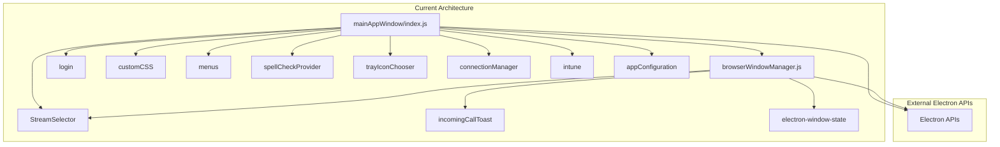

# Shell Domain Migration Analysis

## Executive Summary

This document analyzes the existing `mainAppWindow` module to plan its migration to a Shell Domain plugin as part of the Phase 2 hybrid DDD + plugin architecture (ADR-004).

**Current State**: 682 lines of tightly coupled window management logic spread across `index.js` (542 lines) and `browserWindowManager.js` (261 lines).

**Target State**: Modular Shell Domain plugin with clear responsibilities, event-driven coordination, and comprehensive test coverage.

**Migration Complexity**: **HIGH** - Core module with dependencies on 15+ other modules, global state management, and complex lifecycle coordination.

---

## Table of Contents

1. [Current Architecture Overview](#current-architecture-overview)
2. [Core Window Management Functionality](#core-window-management-functionality)
3. [Window State Management](#window-state-management)
4. [Window Event Handlers](#window-event-handlers)
5. [Screen Sharing Integration](#screen-sharing-integration)
6. [Module Dependencies](#module-dependencies)
7. [Global State Usage](#global-state-usage)
8. [Risk Analysis](#risk-analysis)
9. [Recommended Migration Strategy](#recommended-migration-strategy)
10. [Shell Domain Plugin Specification](#shell-domain-plugin-specification)

---

## 1. Current Architecture Overview

### File Structure

```
app/mainAppWindow/
├── index.js                    (542 lines) - Entry point & lifecycle management
├── browserWindowManager.js     (261 lines) - Window creation & event coordination
└── README.md                   (16 lines)  - Basic documentation
```

### Module Responsibilities

#### `mainAppWindow/index.js`
- **Primary Role**: Main application window orchestration
- **Key Functions**:
  - `onAppReady()` - Initialize window and dependencies
  - `show()` - Display main window
  - `onAppSecondInstance()` - Handle second instance launch
  - Screen sharing coordination
  - Navigation management
  - Deep linking (msteams:// protocol)
  - Event handling setup

#### `mainAppWindow/browserWindowManager.js`
- **Primary Role**: BrowserWindow lifecycle management
- **Key Functions**:
  - Window creation with state persistence
  - Content Security Policy setup
  - IPC event handler registration
  - Screen lock inhibition (calls, screen sharing)
  - Incoming call notifications
  - Wake lock management

### Architectural Problems

1. **God Object Pattern**: `index.js` coordinates too many concerns
2. **Global State Pollution**: Uses `globalThis` for state sharing
3. **Tight Coupling**: Direct dependencies on 15+ modules
4. **Mixed Responsibilities**: Screen sharing, navigation, auth, config all intertwined
5. **Hard to Test**: No dependency injection, global state, complex setup
6. **Implicit Contracts**: Event handlers and side effects unclear

---

## 2. Core Window Management Functionality

### Window Creation (BrowserWindowManager)

**Location**: `browserWindowManager.js:25-57`

**Responsibilities**:
- Load window state from `electron-window-state` (position, size, maximized)
- Clear storage data if configured
- Apply Content Security Policy
- Create BrowserWindow with security settings
- Disable eval for security
- Register IPC handlers
- Return configured window

**Key Configuration**:
```javascript
{
  title: "Teams for Linux",
  x: windowState.x,
  y: windowState.y,
  width: windowState.width,
  height: windowState.height,
  backgroundColor: nativeTheme.shouldUseDarkColors ? "#302a75" : "#fff",
  show: false,
  autoHideMenuBar: config.menubar == "auto",
  icon: iconChooser ? iconChooser.getFile() : undefined,
  frame: config.frame,
  webPreferences: {
    partition: config.partition,
    preload: path.join(__dirname, "..", "browser", "preload.js"),
    plugins: true,
    spellcheck: true,
    webviewTag: true,
    contextIsolation: false,  // Required for DOM access
    nodeIntegration: false,
    sandbox: false
  }
}
```

**Security Concerns**:
- `contextIsolation: false` - Required for Teams DOM access
- CSP applied as compensating control
- Allows unsafe-eval and unsafe-inline for Teams compatibility

### Window Display Management

**Location**: `index.js:277-279, 319-323, 412-424`

**Functions**:
- `show()` - Make window visible
- `restoreWindow()` - Restore from minimized or hidden state
- Initial show/hide based on config.minimized

**Logic**:
```javascript
// Initial display (lines 319-323)
if (!config.minimized) {
  window.show();
} else {
  window.hide();
}

// Restore from minimized/tray (lines 412-424)
function restoreWindow() {
  if (window.isMinimized()) {
    window.restore();
  } else if (!window.isVisible()) {
    window.show();
  }
  window.focus();
}
```

### Window Lifecycle

**Initialization Flow**:
1. `onAppReady()` called by `app/index.js:565`
2. Initialize dependencies (intune, iconChooser, customBackground)
3. Create BrowserWindowManager
4. Create window with state persistence
5. Create StreamSelector for screen sharing
6. Register event handlers
7. Configure login handling
8. Load URL and start connection manager
9. Apply configuration (spell checker, certificates, user agent)

**Cleanup Flow**:
1. `onWindowClosed()` event triggered
2. Close screen share preview window if active
3. Clear preview window references
4. Quit application

---

## 3. Window State Management

### State Persistence (electron-window-state)

**Location**: `browserWindowManager.js:27-30, 45`

**Current Implementation**:
```javascript
const windowState = windowStateKeeper({
  defaultWidth: 0,
  defaultHeight: 0,
});

// ...

windowState.manage(this.window);
```

**State Tracked**:
- Window position (x, y)
- Window size (width, height)
- Maximized state
- Full screen state

**Storage**: Persisted to electron user data directory

### Window State Access

**Current Issues**:
- Window state accessed directly through BrowserWindow API
- No centralized state management
- State changes not communicated to other components
- Difficult to track state history for debugging

### Proposed StateManager Integration

**Migration Target**: Use `app/domains/configuration/StateManager.js`

**Benefits**:
- Centralized state management
- Event-driven state changes
- State snapshot/restore capabilities
- Better testability
- Cross-domain state coordination

**StateManager Features**:
- User status tracking
- Idle status tracking
- Screen sharing state
- Custom state for extensions
- Event emission on state changes

**Example Usage**:
```javascript
// In Shell Domain plugin
this.stateManager = app.getStateManager();

// Track window state
this.stateManager.setCustomState('window.visible', true);
this.stateManager.setCustomState('window.focused', false);
this.stateManager.setCustomState('window.minimized', false);

// Listen to state changes
this.eventBus.on('state.custom.changed', (data) => {
  if (data.key.startsWith('window.')) {
    this.handleWindowStateChange(data);
  }
});
```

---

## 4. Window Event Handlers

### WebContents Events

**Location**: `index.js:564-588`

**Event Handlers**:

| Event | Handler | Responsibility |
|-------|---------|---------------|
| `did-finish-load` | `onDidFinishLoad` | Execute Teams-specific JS, inject screen sharing, apply custom CSS, setup theme following |
| `did-frame-finish-load` | `onDidFrameFinishLoad` | Apply custom CSS to Teams V2 iframes |
| `page-title-updated` | `onPageTitleUpdated` | Forward title to renderer for custom title bar |
| `did-navigate` | `onNavigationChanged` | Update navigation state (back/forward buttons) |
| `did-navigate-in-page` | `onNavigationChanged` | Update navigation state for SPA routing |

### Window Events

**Location**: `index.js:566, 582`

**Event Handlers**:

| Event | Handler | Responsibility |
|-------|---------|---------------|
| `page-title-updated` | `onPageTitleUpdated` | Send page title to renderer |
| `closed` | `onWindowClosed` | Close preview window, quit app |

### WebRequest Events

**Location**: `index.js:568-579`

**Event Handlers**:

| Event | Handler | Responsibility |
|-------|---------|---------------|
| `onBeforeRequest` | `onBeforeRequestHandler` | Custom background redirect, auth window handling |
| `onHeadersReceived` | `onHeadersReceivedHandler` | Custom background headers |
| `onBeforeSendHeaders` | `onBeforeSendHeadersHandler` | SSO cookies, custom background headers |

### Input Events

**Location**: `index.js:583, 601-603`

**Event Handlers**:

| Event | Handler | Responsibility |
|-------|---------|---------------|
| `before-input-event` | `onBeforeInput` | Track Ctrl key for secure link handling |

### Window State Events (BrowserWindowManager)

**Location**: `browserWindowManager.js:136-147`

**Event Handlers**:

| Event | Handler | Responsibility |
|-------|---------|---------------|
| `restore` | `enableWakeLockOnWindowRestore` | Re-enable wake lock if on call |

### Screen Sharing Events

**Location**: Screen sharing preview window (lines 159-180)**

| Event | Handler | Responsibility |
|-------|---------|---------------|
| `ready-to-show` | Anonymous | Show preview window when ready |
| `focus` | Anonymous | Log focus event for diagnostics |
| `blur` | Anonymous | Log blur event for diagnostics |
| `closed` | Anonymous | Clean up preview window state |

### Event Handler Migration Strategy

**Target Architecture**:
1. Extract event handlers to Shell Domain plugin
2. Use EventBus for cross-domain communication
3. Create typed event payload interfaces
4. Add event validation and sanitization
5. Implement event logging and debugging
6. Add event metrics and monitoring

**Event Categories**:
- **Window Lifecycle**: create, show, hide, close, minimize, restore
- **Navigation**: navigate, navigate-back, navigate-forward
- **Content Loading**: did-finish-load, did-frame-finish-load
- **User Interaction**: focus, blur, input
- **Network**: before-request, headers-received, before-send-headers
- **Screen Sharing**: sharing-started, sharing-stopped, preview-events

---

## 5. Screen Sharing Integration

### Screen Sharing Coordination

**Current Architecture**:
- Screen source selection via StreamSelector
- Preview window creation for active screen sharing
- Global state for source ID (`globalThis.selectedScreenShareSource`)
- IPC coordination between main and renderer processes

**Key Functions**:

#### 1. Screen Source Selection
**Location**: `index.js:231-248`

```javascript
window.webContents.session.setDisplayMediaRequestHandler(
  (_request, callback) => {
    streamSelector.show((source) => {
      if (source) {
        handleScreenSourceSelection(source, callback);
      } else {
        // User canceled
        callback({});
      }
    });
  }
);
```

**Responsibilities**:
- Show screen/window selector dialog
- Handle source selection
- Setup screen sharing on selection
- Handle cancellation

#### 2. Screen Share Preview Window
**Location**: `index.js:78-181`

**Key Features**:
- 320x180 preview window
- Always on top (configurable)
- Shows screen share content
- Prevents duplicate windows (critical for audio issues)
- Diagnostic logging
- Auto-cleanup on sharing stop

**Configuration**:
```javascript
const DEFAULT_SCREEN_SHARING_THUMBNAIL_CONFIG = {
  enabled: true,
  alwaysOnTop: true,
};
```

**Window Creation**:
```javascript
globalThis.previewWindow = new BrowserWindow({
  width: 320,
  height: 180,
  minWidth: 200,
  minHeight: 120,
  show: false,
  resizable: true,
  alwaysOnTop: thumbnailConfig.alwaysOnTop || false,
  autoHideMenuBar: true,
  webPreferences: {
    preload: path.join(__dirname, "..", "screenSharing", "previewWindowPreload.js"),
    partition: "persist:teams-for-linux-session",
  },
});
```

#### 3. Global State Management
**Location**: Throughout `index.js` and `app/index.js`

**Global Variables**:
- `globalThis.selectedScreenShareSource` - Current screen share source ID
- `globalThis.previewWindow` - Preview BrowserWindow instance

**Problems**:
- Global state pollution
- Race conditions possible
- Difficult to test
- No change notifications
- State shared across unrelated components

#### 4. IPC Coordination
**Location**: `app/index.js:146-269`

**IPC Channels**:

| Channel | Direction | Purpose |
|---------|-----------|---------|
| `screen-sharing-started` | Renderer → Main | Notify screen sharing started |
| `screen-sharing-stopped` | Renderer → Main | Notify screen sharing stopped |
| `get-screen-sharing-status` | Renderer ← Main | Query if sharing active |
| `get-screen-share-stream` | Renderer ← Main | Get source ID for preview |
| `get-screen-share-screen` | Renderer ← Main | Get screen dimensions |
| `resize-preview-window` | Renderer → Main | Resize preview window |
| `stop-screen-sharing-from-thumbnail` | Renderer → Main | Stop sharing from preview |

### Screen Sharing Dependencies

**Direct Dependencies**:
- `app/screenSharing/StreamSelector.js` - Source selection dialog
- `app/screenSharing/previewWindowPreload.js` - Preview window preload
- `app/screenSharing/previewWindow.html` - Preview window UI
- `app/screenSharing/injectedScreenSharing.js` - Browser-side logic

**Electron APIs**:
- `desktopCapturer.getSources()` - Enumerate screens/windows
- `session.setDisplayMediaRequestHandler()` - Intercept media requests
- `BrowserWindow` - Create preview window

**Configuration Dependencies**:
- `config.screenSharingThumbnail` - Preview window settings
- `config.partition` - Session partition for isolation

### Migration Challenges

**Complex State Management**:
- Global state needs to move to StateManager
- Preview window lifecycle needs coordination
- Race conditions between IPC messages

**Multi-Component Coordination**:
- StreamSelector (UI component)
- Preview window (separate BrowserWindow)
- Main window (renderer process)
- Main process (coordination)

**Event Timing**:
- `screen-sharing-started` may fire before preview window ready
- Preview window must be destroyed before app quit
- Source ID must persist across IPC calls

### Recommended Approach

**Phase 1: Extract Screen Sharing to Separate Plugin**
- Create `ScreenSharingPlugin` separate from Shell Domain
- Move all screen sharing logic to plugin
- Use EventBus for coordination
- StateManager for source tracking

**Phase 2: Modernize State Management**
```javascript
// Replace globalThis usage
this.stateManager.setScreenSharingActive(true);
this.stateManager.setCurrentScreenShareSourceId(sourceId);

// EventBus communication
this.eventBus.emit('screenshare:started', { sourceId });
this.eventBus.emit('screenshare:preview:show', { sourceId, config });
```

**Phase 3: Cleanup Global State**
- Remove `globalThis.selectedScreenShareSource`
- Remove `globalThis.previewWindow`
- Add proper cleanup lifecycle

---

## 6. Module Dependencies

### Direct Dependencies Analysis

**From `mainAppWindow/index.js`**:

| Module | Usage | Coupling Level |
|--------|-------|---------------|
| electron | BrowserWindow, shell, app, nativeTheme, dialog, webFrameMain, nativeImage, desktopCapturer | **HIGH** - Core Electron APIs |
| `../screenSharing/StreamSelector` | Screen/window source selection | **HIGH** - Screen sharing critical path |
| `../login` | Login dialog handling | **MEDIUM** - Authentication flow |
| `../customCSS` | CSS injection | **MEDIUM** - Customization feature |
| `../menus` | Application menus | **MEDIUM** - UI coordination |
| `../spellCheckProvider` | Spell checking | **LOW** - Optional feature |
| `../browser/tools/trayIconChooser` | Tray icon management | **MEDIUM** - System tray |
| `../appConfiguration` | Configuration loading | **HIGH** - Required global |
| `../connectionManager` | Connection management | **HIGH** - Network coordination |
| `../mainAppWindow/browserWindowManager` | Window creation | **HIGH** - Core functionality |
| `../intune` | SSO integration | **MEDIUM** - Enterprise auth |

**From `browserWindowManager.js`**:

| Module | Usage | Coupling Level |
|--------|-------|---------------|
| electron | BrowserWindow, ipcMain, session, nativeTheme, powerSaveBlocker | **HIGH** - Core APIs |
| electron-window-state | State persistence | **MEDIUM** - Window state |
| `../screenSharing/StreamSelector` | Source selection | **HIGH** - Screen sharing |
| `../incomingCallToast` | Call notifications | **MEDIUM** - Call handling |
| child_process | Spawn command for call notifications | **LOW** - Optional feature |

### Dependency Graph



### Circular Dependency Risks

**Current Issues**:
- `appConfiguration` is required as side effect (line 18)
- Global config object shared across modules
- No clear initialization order

**Potential Circular Dependencies**:
- mainAppWindow → menus → mainAppWindow (for window reference)
- mainAppWindow → connectionManager → mainAppWindow (for window reference)
- mainAppWindow → customCSS → mainAppWindow (for webContents)

**Migration Risk**: High - Many modules hold references to the main window

### Decoupling Strategy

**Phase 1: Introduce EventBus**
```javascript
// Instead of passing window reference
menus.setWindow(window);

// Use events
this.eventBus.emit('window:created', { windowId: window.id });
this.eventBus.on('window:command', this.handleCommand);
```

**Phase 2: Dependency Injection**
```javascript
class ShellDomainPlugin extends BasePlugin {
  constructor(app, eventBus, config, dependencies) {
    super(app, eventBus, config);
    this.streamSelector = dependencies.streamSelector;
    this.loginHandler = dependencies.loginHandler;
  }
}
```

**Phase 3: Service Locator Pattern**
```javascript
// For optional dependencies
const spellChecker = app.getService('spellChecker');
if (spellChecker) {
  spellChecker.configure(languages);
}
```

---

## 7. Global State Usage

### Current Global State Variables

**In `mainAppWindow/index.js`**:

| Variable | Type | Scope | Purpose |
|----------|------|-------|---------|
| `iconChooser` | TrayIconChooser | Module | Tray icon management |
| `intune` | Object | Module | Intune SSO integration |
| `isControlPressed` | boolean | Module | Track Ctrl key for secure links |
| `aboutBlankRequestCount` | number | Module | Counter for auth flow handling |
| `config` | Object | Module | Application configuration |
| `window` | BrowserWindow | Module | **Main window instance** |
| `appConfig` | Object | Module | Configuration group |
| `customBackgroundService` | Object | Module | Custom background service |
| `streamSelector` | StreamSelector | Module | Screen source selector |

**In `browserWindowManager.js`**:

| Variable | Type | Scope | Class Property |
|----------|------|-------|---------------|
| `this.config` | Object | Instance | Configuration |
| `this.iconChooser` | TrayIconChooser | Instance | Tray icon |
| `this.isOnCall` | boolean | Instance | Call state |
| `this.blockerId` | number | Instance | Power save blocker ID |
| `this.window` | BrowserWindow | Instance | Window reference |
| `this.incomingCallCommandProcess` | ChildProcess | Instance | Call command process |
| `this.incomingCallToast` | IncomingCallToast | Instance | Call notification |

**Global Variables (via globalThis)**:

| Variable | Set In | Read In | Purpose |
|----------|--------|---------|---------|
| `globalThis.selectedScreenShareSource` | mainAppWindow/index.js | app/index.js | Screen share source ID |
| `globalThis.previewWindow` | mainAppWindow/index.js | app/index.js | Preview window reference |
| `globalThis.eval` | browserWindowManager.js | - | Disabled for security |

### Problems with Current State Management

1. **Global State Pollution**:
   - `globalThis` used for cross-file communication
   - No ownership or lifecycle management
   - Race conditions possible

2. **Module-Level Variables**:
   - Singleton pattern without explicit declaration
   - Difficult to reset for testing
   - Hidden dependencies

3. **No State Change Notifications**:
   - Components can't react to state changes
   - Manual coordination required
   - Error-prone synchronization

4. **Testing Challenges**:
   - Cannot easily mock or stub state
   - State leaks between tests
   - Setup/teardown complex

5. **No State History**:
   - Can't track state changes for debugging
   - No undo/redo capability
   - Difficult to reproduce bugs

### Migration to StateManager

**StateManager Features** (from `app/domains/configuration/StateManager.js`):

```javascript
class StateManager {
  // User status
  getUserStatus() -> number
  setUserStatus(status) -> void

  // Idle status
  getIdleTimeUserStatus() -> number
  setIdleTimeUserStatus(status) -> void

  // Screen sharing
  isScreenSharingActive() -> boolean
  setScreenSharingActive(active) -> void
  getCurrentScreenShareSourceId() -> string|null
  setCurrentScreenShareSourceId(sourceId) -> void

  // Custom state (for plugins)
  getCustomState(key, defaultValue) -> any
  setCustomState(key, value) -> void
  deleteCustomState(key) -> boolean

  // Snapshots
  getSnapshot() -> Object
  restoreSnapshot(snapshot) -> void
  reset() -> void
}
```

**Event Emission**:
- `state.user.statusChanged`
- `state.user.idleStatusChanged`
- `state.screenshare.activeChanged`
- `state.screenshare.sourceChanged`
- `state.custom.changed`
- `state.custom.deleted`
- `state.custom.cleared`
- `state.reset`

**Migration Plan**:

1. **Replace Global State**:
```javascript
// OLD
globalThis.selectedScreenShareSource = sourceId;

// NEW
stateManager.setCurrentScreenShareSourceId(sourceId);
```

2. **Replace Module Variables**:
```javascript
// OLD
let isControlPressed = false;

// NEW
stateManager.setCustomState('input.ctrlPressed', false);
```

3. **Add State Change Listeners**:
```javascript
// Listen to state changes
eventBus.on('state.screenshare.sourceChanged', (data) => {
  console.log(`Screen share source changed: ${data.oldSourceId} -> ${data.newSourceId}`);
  this.updatePreviewWindow(data.newSourceId);
});
```

4. **State Persistence**:
```javascript
// Save state on shutdown
app.on('before-quit', () => {
  const snapshot = stateManager.getSnapshot();
  saveStateToFile(snapshot);
});

// Restore state on startup
const savedState = loadStateFromFile();
stateManager.restoreSnapshot(savedState);
```

---

## 8. Risk Analysis

### Critical Risks

| Risk | Impact | Likelihood | Severity |
|------|--------|------------|----------|
| **Breaking existing window functionality** | HIGH | MEDIUM | **CRITICAL** |
| **Screen sharing regression** | HIGH | HIGH | **CRITICAL** |
| **Global state race conditions** | MEDIUM | HIGH | **HIGH** |
| **IPC communication breakage** | HIGH | MEDIUM | **CRITICAL** |
| **Performance degradation** | MEDIUM | LOW | **MEDIUM** |
| **Memory leaks from preview windows** | MEDIUM | MEDIUM | **HIGH** |
| **Loss of window state persistence** | LOW | LOW | **MEDIUM** |

### Risk Mitigation Strategies

#### 1. Breaking Existing Window Functionality
**Mitigation**:
- Comprehensive integration tests for all window operations
- Feature flags for gradual rollout
- Adapter pattern for backward compatibility
- Parallel implementation during migration
- Extensive manual testing on all platforms (Windows, macOS, Linux)

**Test Coverage Required**:
- Window creation and destruction
- Show/hide/minimize/restore operations
- Multi-monitor scenarios
- Window state persistence
- Deep linking and protocol handling

#### 2. Screen Sharing Regression
**Mitigation**:
- Dedicated screen sharing test suite
- Test on multiple platforms and window managers
- Monitor preview window lifecycle
- Add diagnostic logging
- Create reproducible test scenarios

**Test Scenarios**:
- Start/stop screen sharing
- Switch between screen and window sharing
- Preview window creation/destruction
- Multiple concurrent sharing attempts
- App quit during active sharing

#### 3. Global State Race Conditions
**Mitigation**:
- StateManager with atomic operations
- Event-driven state changes
- Single source of truth
- State change logging
- Locking mechanisms for critical sections

**Implementation**:
```javascript
// Atomic state update
stateManager.transaction(() => {
  stateManager.setScreenSharingActive(true);
  stateManager.setCurrentScreenShareSourceId(sourceId);
});
```

#### 4. IPC Communication Breakage
**Mitigation**:
- IPC validation layer
- Type-safe IPC channels
- Protocol versioning
- Backward compatibility adapters
- IPC monitoring and logging

**Test Coverage**:
- All IPC channels tested
- Payload validation
- Error handling
- Timeout handling
- Message ordering

#### 5. Performance Degradation
**Mitigation**:
- Benchmark critical paths before migration
- Monitor EventBus latency
- Profile memory usage
- Lazy initialization where possible
- Performance budgets

**Metrics to Track**:
- Window creation time (< 100ms)
- Screen sharing startup time (< 500ms)
- EventBus dispatch latency (< 1ms)
- Memory usage (< 2MB overhead)
- CPU usage during idle (< 1%)

#### 6. Memory Leaks from Preview Windows
**Mitigation**:
- Explicit lifecycle management
- Window reference cleanup
- Event listener cleanup
- Automated leak detection tests
- Memory profiling

**Cleanup Checklist**:
```javascript
async cleanup() {
  // Close preview window
  if (this.previewWindow && !this.previewWindow.isDestroyed()) {
    this.previewWindow.removeAllListeners();
    this.previewWindow.close();
    this.previewWindow = null;
  }

  // Clear state
  this.stateManager.setScreenSharingActive(false);
  this.stateManager.setCurrentScreenShareSourceId(null);

  // Unsubscribe events
  this.eventBus.off('screenshare:*');
}
```

### Platform-Specific Risks

**Windows**:
- Window frame handling differences
- Tray icon behavior
- Screen sharing API differences

**macOS**:
- Dock icon management
- Permissions (screen recording, microphone, camera)
- System menu bar integration
- Window level handling (always on top)

**Linux**:
- Multiple window managers (X11 vs Wayland)
- Tray icon support varies by DE
- Screen sharing (PipeWire vs X11)
- Window state persistence differences

### Rollback Strategy

**If Critical Issues Arise**:

1. **Immediate Rollback**:
   - Revert to previous release
   - Document failure scenarios
   - Analyze logs and telemetry

2. **Feature Flag Disable**:
   - Disable Shell Domain plugin
   - Fall back to legacy mainAppWindow
   - Continue with adapter layer

3. **Partial Rollback**:
   - Keep non-critical improvements
   - Revert problematic components
   - Maintain backward compatibility

4. **Hotfix Release**:
   - Critical bug fixes only
   - Minimal changes
   - Expedited testing

---

## 9. Recommended Migration Strategy

### Phase-Based Approach (Strangler Fig Pattern)

#### Phase 1: Foundation & Preparation (Week 1-2)

**Objectives**:
- Create Shell Domain plugin skeleton
- Setup test infrastructure
- Document existing behavior
- Create adapter layer

**Deliverables**:
- `app/domains/shell/ShellDomainPlugin.js` - Plugin skeleton
- `tests/domains/shell/` - Test suite structure
- `docs/shell-domain-api.md` - API documentation
- Baseline performance metrics

**Tasks**:
1. Create plugin directory structure
2. Implement BasePlugin extension
3. Setup jest test configuration
4. Create test fixtures and mocks
5. Document all current window behaviors
6. Create adapter pattern for backward compatibility

**Success Criteria**:
- Plugin skeleton passes basic tests
- Adapter layer functional
- No regression in existing functionality

#### Phase 2: Window Creation & Lifecycle (Week 3-4)

**Objectives**:
- Migrate window creation logic
- Implement lifecycle management
- Integrate with StateManager
- Preserve window state persistence

**Components to Migrate**:
- `BrowserWindowManager.createWindow()`
- `BrowserWindowManager.createNewBrowserWindow()`
- Window state persistence
- Configuration application

**Migration Steps**:
1. Extract window creation to ShellDomainPlugin
2. Replace module variables with StateManager
3. Add event emission for lifecycle events
4. Implement window factory pattern
5. Add comprehensive tests

**Code Structure**:
```javascript
class ShellDomainPlugin extends BasePlugin {
  async initialize() {
    this.windowFactory = new WindowFactory(this.config);
    this.windowStateManager = new WindowStateManager();

    // Create main window
    this.mainWindow = await this.createMainWindow();

    // Emit event
    this.eventBus.emit('shell:window:created', {
      windowId: this.mainWindow.id
    });
  }

  async createMainWindow() {
    const windowState = await this.windowStateManager.load();
    const window = this.windowFactory.create({
      ...windowState,
      config: this.config
    });

    this.windowStateManager.manage(window);
    return window;
  }
}
```

**Testing**:
- Unit tests for window creation
- Integration tests for state persistence
- Cross-platform window creation tests
- Memory leak detection

**Success Criteria**:
- Window creation functional
- State persistence works
- No memory leaks
- Tests passing on all platforms

#### Phase 3: Event Handler Migration (Week 5-6)

**Objectives**:
- Migrate all window event handlers
- Implement EventBus coordination
- Remove global event handler setup
- Add event logging and monitoring

**Event Handlers to Migrate**:
- WebContents events (did-finish-load, did-frame-finish-load)
- Window events (focus, blur, minimize, restore, close)
- Navigation events (did-navigate, did-navigate-in-page)
- Input events (before-input-event)
- WebRequest events (onBeforeRequest, onHeadersReceived, onBeforeSendHeaders)

**Migration Pattern**:
```javascript
// OLD: Global event handler setup
window.webContents.on('did-finish-load', onDidFinishLoad);

// NEW: Plugin event handler
class ShellDomainPlugin extends BasePlugin {
  setupEventHandlers() {
    this.mainWindow.webContents.on('did-finish-load', () => {
      this.handleDidFinishLoad();
    });
  }

  handleDidFinishLoad() {
    // Emit event for other plugins
    this.eventBus.emit('shell:content:loaded', {
      windowId: this.mainWindow.id,
      url: this.mainWindow.webContents.getURL()
    });

    // Plugin-specific logic
    this.injectTeamsScripts();
    this.applyCustomizations();
  }
}
```

**EventBus Integration**:
- Create typed event schemas
- Add event validation
- Implement event logging
- Add event metrics

**Testing**:
- Unit tests for each event handler
- Integration tests for event flow
- Mock EventBus for isolation
- Test event ordering

**Success Criteria**:
- All event handlers migrated
- EventBus communication working
- No event handler leaks
- Tests passing with 95%+ coverage

#### Phase 4: Screen Sharing Extraction (Week 7-8)

**Objectives**:
- Extract screen sharing to separate plugin
- Remove globalThis state
- Implement StateManager integration
- Fix preview window lifecycle

**Components**:
- Screen source selection
- Preview window management
- IPC coordination
- State management

**New Plugin Structure**:
```javascript
class ScreenSharingPlugin extends BasePlugin {
  async initialize() {
    this.streamSelector = new StreamSelector(this.mainWindow);
    this.previewWindow = null;

    // Register display media handler
    this.setupDisplayMediaHandler();

    // Listen to state changes
    this.eventBus.on('state.screenshare.activeChanged',
      this.handleScreenSharingStateChange.bind(this));
  }

  setupDisplayMediaHandler() {
    const session = this.mainWindow.webContents.session;
    session.setDisplayMediaRequestHandler((_request, callback) => {
      this.streamSelector.show((source) => {
        this.handleSourceSelection(source, callback);
      });
    });
  }

  async handleSourceSelection(source, callback) {
    if (!source) {
      callback({});
      return;
    }

    // Update state
    this.stateManager.setScreenSharingActive(true);
    this.stateManager.setCurrentScreenShareSourceId(source.id);

    // Create preview window
    await this.createPreviewWindow(source);

    // Complete media request
    callback({ video: source });
  }

  async cleanup() {
    this.destroyPreviewWindow();
    this.stateManager.setScreenSharingActive(false);
    this.stateManager.setCurrentScreenShareSourceId(null);
  }
}
```

**StateManager Integration**:
- Replace globalThis.selectedScreenShareSource
- Replace globalThis.previewWindow
- Use state events for coordination

**Testing**:
- Unit tests for screen sharing logic
- Integration tests with StateManager
- Preview window lifecycle tests
- IPC message flow tests
- Platform-specific tests

**Success Criteria**:
- Screen sharing functional
- No global state usage
- Preview window cleanup working
- Tests passing on all platforms

#### Phase 5: Dependency Decoupling (Week 9-10)

**Objectives**:
- Decouple from tightly coupled modules
- Implement dependency injection
- Remove circular dependencies
- Refactor to use services

**Modules to Decouple**:
- Login module
- Custom CSS module
- Menu module
- Spell checker module
- Intune SSO module
- Connection manager

**Decoupling Strategy**:
```javascript
class ShellDomainPlugin extends BasePlugin {
  constructor(app, eventBus, config, services) {
    super(app, eventBus, config);

    // Injected services
    this.authService = services.auth;
    this.customizationService = services.customization;
    this.menuService = services.menu;
    this.connectionService = services.connection;
  }

  async initialize() {
    // Use services instead of direct module imports
    await this.authService.setupLoginHandling(this.mainWindow);
    await this.customizationService.applyCustomCSS(this.mainWindow);
    await this.menuService.createMenus(this.mainWindow);
  }
}
```

**Service Registry**:
```javascript
class ServiceRegistry {
  constructor() {
    this.services = new Map();
  }

  register(name, service) {
    this.services.set(name, service);
  }

  get(name) {
    if (!this.services.has(name)) {
      throw new Error(`Service not found: ${name}`);
    }
    return this.services.get(name);
  }
}
```

**Testing**:
- Test with mocked services
- Test service registration
- Test service lifecycle
- Integration tests with real services

**Success Criteria**:
- No circular dependencies
- Services testable in isolation
- Clear dependency graph
- Tests passing with 95%+ coverage

#### Phase 6: Integration & Optimization (Week 11-12)

**Objectives**:
- Comprehensive integration testing
- Performance optimization
- Documentation
- Production readiness

**Tasks**:
1. End-to-end integration tests
2. Performance benchmarking
3. Memory leak detection
4. Load testing
5. Documentation updates
6. Migration guide creation

**Performance Targets**:
- Window creation: < 100ms
- EventBus latency: < 1ms
- Memory overhead: < 2MB
- CPU usage (idle): < 1%
- Screen sharing startup: < 500ms

**Documentation**:
- API documentation
- Migration guide
- Architecture diagrams
- Best practices
- Troubleshooting guide

**Success Criteria**:
- All tests passing (95%+ coverage)
- Performance within targets
- Documentation complete
- Production-ready
- No known critical issues

### Rollout Strategy

**Alpha Release** (Internal Testing):
- Deploy to development team
- Feature flag enabled
- Extensive logging
- Daily monitoring

**Beta Release** (Limited Users):
- Deploy to 10% of users
- Gradual rollout over 2 weeks
- A/B testing
- Telemetry collection

**General Availability**:
- Deploy to all users
- Monitor for issues
- Hotfix readiness
- Rollback plan active

### Rollback Triggers

**Automatic Rollback If**:
- Crash rate > 1%
- Screen sharing failure > 5%
- Memory leak detected
- Performance degradation > 20%
- Critical security issue

**Manual Rollback If**:
- User complaints > threshold
- Platform-specific issues
- Unforeseen compatibility issues
- Team consensus

---

## 10. Shell Domain Plugin Specification

### Plugin Interface

```javascript
/**
 * ShellDomainPlugin
 *
 * Manages application shell (main window, window state, lifecycle).
 * Replaces mainAppWindow module with event-driven architecture.
 *
 * @extends BasePlugin
 */
class ShellDomainPlugin extends BasePlugin {
  constructor(app, eventBus, config, services);

  // Lifecycle methods
  async initialize();
  async cleanup();

  // Window management
  async createMainWindow();
  async showWindow();
  async hideWindow();
  async minimizeWindow();
  async restoreWindow();
  async closeWindow();

  // Window state
  getWindowState();
  setWindowState(state);
  saveWindowState();
  restoreWindowState();

  // Event handlers
  setupEventHandlers();
  handleDidFinishLoad();
  handleDidFrameFinishLoad();
  handlePageTitleUpdated();
  handleNavigationChanged();
  handleWindowClosed();

  // Deep linking
  processDeepLink(url);
  handleSecondInstance(args);

  // Configuration
  applyConfiguration();
  applySpellCheckerConfiguration();
  applySecurityConfiguration();
}
```

### Event Schema

**Events Emitted**:

| Event | Payload | Description |
|-------|---------|-------------|
| `shell:initialized` | `{ windowId, config }` | Plugin initialized |
| `shell:window:created` | `{ windowId, state }` | Main window created |
| `shell:window:shown` | `{ windowId }` | Window shown |
| `shell:window:hidden` | `{ windowId }` | Window hidden |
| `shell:window:minimized` | `{ windowId }` | Window minimized |
| `shell:window:restored` | `{ windowId }` | Window restored |
| `shell:window:closed` | `{ windowId }` | Window closed |
| `shell:window:focused` | `{ windowId }` | Window gained focus |
| `shell:window:blurred` | `{ windowId }` | Window lost focus |
| `shell:content:loaded` | `{ windowId, url }` | Page loaded |
| `shell:navigation:changed` | `{ windowId, canGoBack, canGoForward }` | Navigation state changed |
| `shell:title:updated` | `{ windowId, title }` | Page title updated |
| `shell:deeplink:received` | `{ url, protocol }` | Deep link received |

**Events Consumed**:

| Event | Handler | Description |
|-------|---------|-------------|
| `config:changed` | `handleConfigChanged` | Configuration updated |
| `auth:session-expired` | `handleSessionExpired` | Session expired |
| `state.screenshare.activeChanged` | `handleScreenSharingStateChange` | Screen sharing state changed |

### Configuration Schema

```javascript
{
  // Window configuration
  window: {
    defaultWidth: 0,
    defaultHeight: 0,
    frame: true,
    minimized: false,
    menubar: "auto"
  },

  // Security configuration
  security: {
    contextIsolation: false,  // Required for Teams DOM access
    nodeIntegration: false,
    sandbox: false,
    partition: "persist:teams-for-linux-session",
    contentSecurityPolicy: {
      enabled: true,
      directives: {
        defaultSrc: ["'self'", "https://teams.microsoft.com"],
        scriptSrc: ["'self'", "'unsafe-inline'", "'unsafe-eval'"],
        styleSrc: ["'self'", "'unsafe-inline'"],
        imgSrc: ["'self'", "data:", "blob:", "https:", "http:"],
        mediaSrc: ["'self'", "blob:", "https:", "mediastream:"],
        connectSrc: ["'self'", "wss:", "https:", "blob:"]
      }
    }
  },

  // Feature flags
  features: {
    screenSharing: true,
    customCSS: true,
    spellChecker: true,
    deepLinking: true
  }
}
```

### Dependencies

**Required Services**:
- `eventBus` - Event-driven communication
- `stateManager` - Application state management
- `config` - Configuration management

**Optional Services**:
- `authService` - Authentication handling
- `customizationService` - CSS customization
- `menuService` - Menu management
- `connectionService` - Network management

**Electron APIs**:
- `BrowserWindow` - Window creation
- `app` - Application lifecycle
- `session` - Session management
- `nativeTheme` - Theme detection
- `webFrameMain` - Frame inspection

### Testing Strategy

**Unit Tests**:
- Window creation
- Event handler logic
- State management
- Configuration application
- Deep link processing

**Integration Tests**:
- Window lifecycle
- Event flow
- StateManager integration
- Service coordination
- Multi-window scenarios

**E2E Tests**:
- Full application startup
- Screen sharing flow
- Deep linking
- Second instance handling
- Window state persistence

**Platform Tests**:
- Windows-specific features
- macOS-specific features
- Linux-specific features (X11 & Wayland)

**Performance Tests**:
- Window creation time
- EventBus latency
- Memory usage
- CPU usage
- Startup time impact

### Success Metrics

**Code Quality**:
- Test coverage: 95%+
- Cyclomatic complexity: < 10 per function
- Lines per file: < 300
- No code duplication

**Performance**:
- Window creation: < 100ms
- EventBus dispatch: < 1ms
- Memory overhead: < 2MB
- Startup time: < 5% increase

**Reliability**:
- Crash rate: < 0.1%
- Screen sharing success rate: > 99%
- Window state persistence: 100%
- Event delivery: 100%

---

## Conclusion

### Summary

The migration of mainAppWindow to a Shell Domain plugin is a **high-complexity, high-impact** effort that will:

1. **Reduce Complexity**: From 682 lines of tightly coupled code to modular, testable components
2. **Improve Maintainability**: Clear boundaries, event-driven architecture, dependency injection
3. **Enable Extensibility**: Plugin-based architecture allows future enhancements
4. **Increase Reliability**: Comprehensive testing, proper state management, lifecycle management

### Critical Success Factors

1. **Comprehensive Testing**: 95%+ coverage with unit, integration, and E2E tests
2. **Gradual Migration**: Strangler Fig pattern with backward compatibility
3. **StateManager Integration**: Replace global state with centralized management
4. **EventBus Coordination**: Decouple components with event-driven communication
5. **Platform Testing**: Test on Windows, macOS, Linux (X11 & Wayland)
6. **Performance Monitoring**: Ensure no regression in critical paths
7. **Clear Documentation**: API docs, migration guide, troubleshooting

### Next Steps

1. **Week 1-2**: Create plugin skeleton and test infrastructure
2. **Week 3-4**: Migrate window creation and lifecycle
3. **Week 5-6**: Migrate event handlers
4. **Week 7-8**: Extract screen sharing to separate plugin
5. **Week 9-10**: Decouple dependencies
6. **Week 11-12**: Integration testing and optimization

### Risk Level: HIGH

**Primary Risks**:
- Breaking core window functionality
- Screen sharing regressions
- Global state race conditions
- IPC communication issues

**Mitigation**: Comprehensive testing, gradual rollout, feature flags, rollback plan

---

**Document Version**: 1.0
**Last Updated**: November 2024
**Status**: Ready for Review
**Next Review**: Start of Phase 1 implementation
