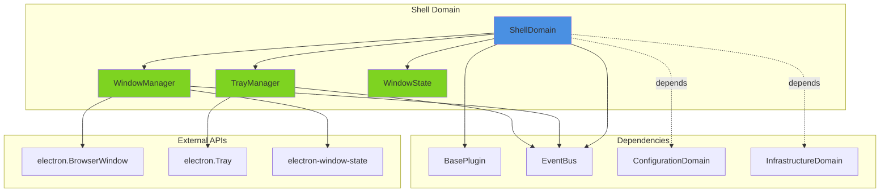
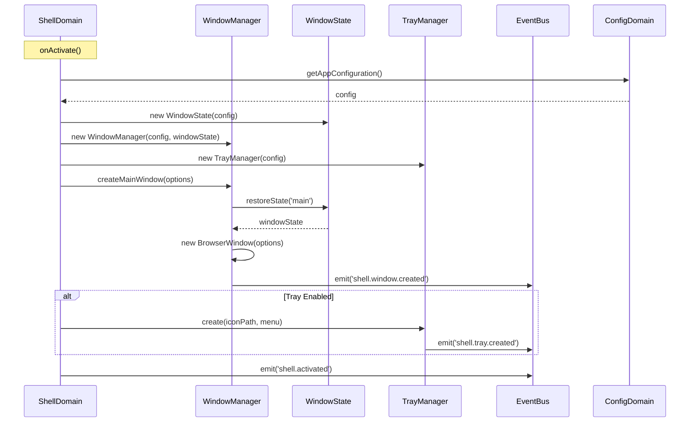
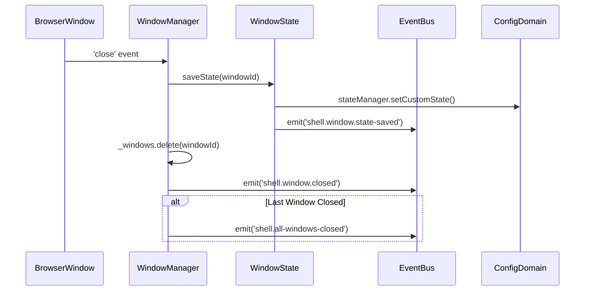
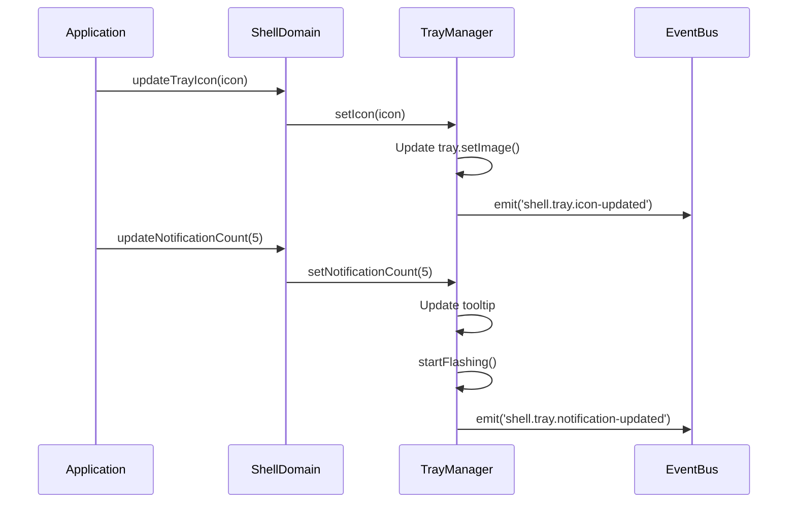

# Shell Domain Architecture Design - Phase 4

**Status**: Design Complete
**Target Phase**: Phase 4
**Dependencies**: Phase 1 (Foundation), Phase 2 (Infrastructure), Phase 3 (Configuration)
**Author**: System Architecture Designer
**Date**: 2025-11-03

## Overview

The Shell Domain manages all user interface shell components including windows, system tray, and window state persistence. This domain follows the established patterns from Infrastructure and Configuration domains while addressing the specific needs of window lifecycle management and system integration.

## Design Principles

Following ADR-004 and established domain patterns:

1. **Direct Properties**: Use direct property access (no WeakMap) for better performance (Configuration pattern)
2. **EventBus Integration**: Emit events for cross-domain coordination
3. **Focused Services**: Each service handles one specific concern
4. **BasePlugin Foundation**: Extend BasePlugin for lifecycle management
5. **State Persistence**: Integrate with Configuration domain for persistence
6. **Multi-Window Support**: Handle main window and popup windows efficiently

## Architecture Diagram



## Domain Components

### 1. ShellDomain.js - Domain Orchestrator

**Purpose**: Main domain orchestrator extending BasePlugin, manages shell services lifecycle and coordination.

**Responsibilities**:
- Initialize and manage WindowManager, TrayManager, and WindowState services
- Coordinate window and tray lifecycle events
- Provide unified API for shell operations
- Integrate with Configuration domain for settings
- Emit domain lifecycle events via EventBus

**Class Structure**:

```javascript
class ShellDomain extends BasePlugin {
  constructor(id, manifest, api) {
    super(id, manifest, api);

    // Service instances (direct properties)
    this._windowManager = null;
    this._trayManager = null;
    this._windowState = null;

    // Service state
    this._initialized = false;
    this._mainWindow = null;
    this._eventBus = EventBus.getInstance();
  }

  // Lifecycle methods
  async onActivate()
  async onDeactivate()
  async onDestroy()

  // Service accessors
  getWindowManager()
  getTrayManager()
  getWindowState()
  getServices()

  // Window operations
  getMainWindow()
  createWindow(options)
  closeWindow(windowId)
  focusWindow(windowId)

  // Tray operations
  updateTrayIcon(icon)
  updateTrayTooltip(tooltip)

  // Health check
  isHealthy()
}
```

**Event Emissions**:
- `shell.activated` - Domain activated successfully
- `shell.deactivated` - Domain deactivated
- `shell.error` - Error occurred in shell operations

### 2. WindowManager Service

**Purpose**: Manages BrowserWindow lifecycle including creation, state management, and multi-window coordination.

**Responsibilities**:
- Create and configure BrowserWindow instances
- Track multiple windows (main + popups)
- Handle window lifecycle events (close, minimize, maximize, focus)
- Apply window state persistence via WindowState
- Coordinate with Configuration domain for window settings
- Manage window-specific features (DevTools, menu bar, frame)

**Class Structure**:

```javascript
class WindowManager {
  constructor(config, logger) {
    this._config = config;
    this._logger = logger;
    this._eventBus = EventBus.getInstance();

    // Window tracking (direct properties)
    this._windows = new Map(); // windowId -> window instance
    this._mainWindowId = null;
    this._windowConfigs = new Map(); // windowId -> config
    this._windowStateManager = null;
  }

  // Window creation
  async createMainWindow(options)
  async createPopupWindow(options)
  async createWindow(windowType, options)

  // Window management
  getWindow(windowId)
  getMainWindow()
  getAllWindows()
  closeWindow(windowId)
  closeAllWindows()

  // Window operations
  focusWindow(windowId)
  minimizeWindow(windowId)
  maximizeWindow(windowId)
  restoreWindow(windowId)
  showWindow(windowId)
  hideWindow(windowId)

  // Window state
  saveWindowState(windowId)
  restoreWindowState(windowId)

  // Lifecycle
  cleanup()
}
```

**Event Emissions**:
- `shell.window.created` - Window created with { windowId, type, options }
- `shell.window.closed` - Window closed with { windowId, type }
- `shell.window.focused` - Window gained focus with { windowId }
- `shell.window.minimized` - Window minimized with { windowId }
- `shell.window.maximized` - Window maximized with { windowId }
- `shell.window.restored` - Window restored with { windowId }
- `shell.window.state-changed` - Window state changed with { windowId, state }
- `shell.window.error` - Window operation error with { windowId, error }

**Window Types**:
- `main` - Main application window
- `popup` - Popup/modal window
- `preview` - Screen share preview window
- `documentation` - Documentation window
- `custom` - Custom window type

### 3. TrayManager Service

**Purpose**: Manages system tray icon, menu, and interactions.

**Responsibilities**:
- Create and configure system tray
- Update tray icon and tooltip dynamically
- Handle tray click events
- Manage tray context menu
- Support platform-specific tray behavior (macOS dock icon)
- Handle notification badges and counts

**Class Structure**:

```javascript
class TrayManager {
  constructor(config, logger) {
    this._config = config;
    this._logger = logger;
    this._eventBus = EventBus.getInstance();

    // Tray state (direct properties)
    this._tray = null;
    this._enabled = false;
    this._iconPath = null;
    this._currentIcon = null;
    this._notificationCount = 0;
    this._flashing = false;

    // Platform detection
    this._isMac = process.platform === 'darwin';
    this._isLinux = process.platform === 'linux';
    this._isWindows = process.platform === 'win32';
  }

  // Tray lifecycle
  create(iconPath, menu)
  destroy()

  // Icon management
  setIcon(iconPath)
  setIconFromDataURL(dataUrl)
  resetIcon()

  // Tooltip and menu
  setTooltip(tooltip)
  setContextMenu(menu)

  // Notifications
  setNotificationCount(count)
  startFlashing()
  stopFlashing()

  // Platform-specific
  setDockIcon(iconPath) // macOS only

  // Event handlers
  onTrayClick(callback)
  onTrayRightClick(callback)

  // State
  isEnabled()
  getNotificationCount()
  isFlashing()

  // Cleanup
  cleanup()
}
```

**Event Emissions**:
- `shell.tray.created` - Tray created with { iconPath }
- `shell.tray.clicked` - Tray icon clicked
- `shell.tray.icon-updated` - Tray icon updated with { iconPath }
- `shell.tray.notification-updated` - Notification count updated with { count }
- `shell.tray.destroyed` - Tray destroyed

### 4. WindowState Model

**Purpose**: Window state persistence and restoration model.

**Responsibilities**:
- Track window position, size, and display
- Save window state to Configuration domain
- Restore window state on application restart
- Handle multi-display configurations
- Manage window bounds validation
- Integration with electron-window-state

**Class Structure**:

```javascript
class WindowState {
  constructor(config, stateManager) {
    this._config = config;
    this._stateManager = stateManager; // From Configuration domain
    this._eventBus = EventBus.getInstance();

    // State tracking (direct properties)
    this._windowStates = new Map(); // windowId -> state object
    this._persistenceEnabled = true;
  }

  // State management
  createStateTracker(windowId, options)
  getState(windowId)
  saveState(windowId, state)
  restoreState(windowId)
  deleteState(windowId)

  // Window bounds
  validateBounds(bounds)
  getDefaultBounds()

  // Persistence
  enablePersistence()
  disablePersistence()
  isPersistenceEnabled()

  // Cleanup
  cleanup()
}
```

**State Object Structure**:
```javascript
{
  windowId: string,
  x: number,
  y: number,
  width: number,
  height: number,
  isMaximized: boolean,
  isFullScreen: boolean,
  display: string,
  lastUpdated: number
}
```

**Event Emissions**:
- `shell.window.state-saved` - State saved with { windowId, state }
- `shell.window.state-restored` - State restored with { windowId, state }
- `shell.window.state-deleted` - State deleted with { windowId }

## Service Interactions

### Creation Flow



### Window Close Flow



### Tray Update Flow



## Configuration Integration

The Shell Domain integrates with Configuration Domain for:

### Window Settings
```javascript
{
  // Window behavior
  frame: boolean,
  menubar: 'auto' | 'show' | 'hide',
  minimized: boolean,
  webDebug: boolean,

  // Window state persistence
  windowState: {
    enabled: boolean,
    persist: boolean
  },

  // Multi-window
  allowMultipleWindows: boolean,
  popupWindowsBehavior: 'modal' | 'standalone'
}
```

### Tray Settings
```javascript
{
  trayIconEnabled: boolean,
  appIcon: string,
  appIconType: 'default' | 'dark' | 'light',
  appTitle: string,

  // Notification
  enableIncomingCallToast: boolean,
  flashFrame: boolean
}
```

### Accessing Configuration
```javascript
// In ShellDomain.onActivate()
const configDomain = this.api.getDomain('configuration');
const windowConfig = configDomain.getConfig('settings.window');
const trayConfig = configDomain.getConfig('settings.tray');

// Listen for config changes
this._eventBus.on('configuration.changed', (data) => {
  if (data.keyPath.startsWith('settings.window')) {
    this._windowManager.updateConfig(windowConfig);
  }
  if (data.keyPath.startsWith('settings.tray')) {
    this._trayManager.updateConfig(trayConfig);
  }
});
```

## Event Emission Strategy

### Namespaced Events

Following Infrastructure and Configuration domain patterns:

```javascript
// Domain lifecycle events
'shell.activated'
'shell.deactivated'
'shell.error'

// Window events
'shell.window.created'
'shell.window.closed'
'shell.window.focused'
'shell.window.minimized'
'shell.window.maximized'
'shell.window.restored'
'shell.window.state-changed'
'shell.window.error'
'shell.all-windows-closed'

// Tray events
'shell.tray.created'
'shell.tray.clicked'
'shell.tray.icon-updated'
'shell.tray.notification-updated'
'shell.tray.destroyed'

// State events
'shell.window.state-saved'
'shell.window.state-restored'
'shell.window.state-deleted'
```

### Event Payload Standards

```javascript
// All events include timestamp
{
  timestamp: Date.now(),
  // ... event-specific data
}

// Window events include windowId
{
  windowId: string,
  timestamp: Date.now(),
  // ... additional data
}

// Error events include error details
{
  error: string,
  stack: string,
  context: Object,
  timestamp: Date.now()
}
```

### Event Subscriptions

```javascript
// In other domains/plugins
eventBus.on('shell.window.created', (data) => {
  console.log(`Window ${data.windowId} created`);
});

// Wildcard subscriptions
eventBus.on('shell.window.*', (data) => {
  console.log('Any window event', data);
});

// Subscribe in domain activation
async onActivate() {
  this._unsubscribe = this._eventBus.on(
    'shell.window.closed',
    this._handleWindowClosed.bind(this)
  );
}

// Cleanup in deactivation
async onDeactivate() {
  if (this._unsubscribe) {
    this._unsubscribe();
  }
}
```

## Testing Strategy

### Unit Tests

#### ShellDomain.test.js
```javascript
describe('ShellDomain', () => {
  describe('Lifecycle', () => {
    test('should activate domain and initialize services')
    test('should deactivate domain and cleanup services')
    test('should emit shell.activated event')
    test('should handle activation errors gracefully')
  });

  describe('Service Management', () => {
    test('should provide WindowManager service')
    test('should provide TrayManager service')
    test('should provide WindowState service')
    test('should throw if services accessed before activation')
  });

  describe('Window Operations', () => {
    test('should create main window')
    test('should get main window')
    test('should delegate to WindowManager')
  });

  describe('Health Check', () => {
    test('should return true when all services initialized')
    test('should return false when services not initialized')
  });
});
```

#### WindowManager.test.js
```javascript
describe('WindowManager', () => {
  describe('Window Creation', () => {
    test('should create main window with config')
    test('should create popup window')
    test('should track multiple windows')
    test('should emit shell.window.created event')
  });

  describe('Window Management', () => {
    test('should get window by ID')
    test('should get all windows')
    test('should close window by ID')
    test('should close all windows')
  });

  describe('Window Operations', () => {
    test('should focus window')
    test('should minimize window')
    test('should maximize window')
    test('should restore window')
    test('should show/hide window')
  });

  describe('State Management', () => {
    test('should save window state on close')
    test('should restore window state on create')
  });

  describe('Error Handling', () => {
    test('should handle window creation failure')
    test('should emit error events')
  });
});
```

#### TrayManager.test.js
```javascript
describe('TrayManager', () => {
  describe('Tray Creation', () => {
    test('should create tray with icon')
    test('should skip creation if disabled')
    test('should emit shell.tray.created event')
  });

  describe('Icon Management', () => {
    test('should update tray icon')
    test('should update from data URL')
    test('should reset to default icon')
  });

  describe('Notifications', () => {
    test('should update notification count')
    test('should update tooltip with count')
    test('should start/stop flashing')
  });

  describe('Platform-Specific', () => {
    test('should set dock icon on macOS')
    test('should handle platform differences')
  });
});
```

#### WindowState.test.js
```javascript
describe('WindowState', () => {
  describe('State Tracking', () => {
    test('should create state tracker')
    test('should get window state')
    test('should save window state')
    test('should restore window state')
  });

  describe('Bounds Validation', () => {
    test('should validate window bounds')
    test('should reject invalid bounds')
    test('should provide default bounds')
  });

  describe('Persistence', () => {
    test('should enable/disable persistence')
    test('should integrate with StateManager')
  });
});
```

### Integration Tests

#### shell-domain-integration.test.js
```javascript
describe('Shell Domain Integration', () => {
  test('should create domain with all services')
  test('should create main window on activation')
  test('should create tray if enabled')
  test('should integrate with Configuration domain')
  test('should emit events via EventBus')
  test('should handle window lifecycle')
  test('should persist window state')
  test('should cleanup all resources on deactivation')
});
```

### Test Coverage Goals

- Unit Test Coverage: 95%+
- Integration Test Coverage: 90%+
- Critical Paths: 100% coverage
  - Window creation and destruction
  - State persistence and restoration
  - Event emission
  - Error handling

### Mocking Strategy

```javascript
// Mock Electron APIs
jest.mock('electron', () => ({
  BrowserWindow: jest.fn(),
  Tray: jest.fn(),
  app: {
    getPath: jest.fn(),
    dock: {
      setIcon: jest.fn()
    }
  },
  nativeImage: {
    createFromPath: jest.fn(),
    createFromDataURL: jest.fn()
  }
}));

// Mock EventBus
jest.mock('../../core/EventBus', () => ({
  getInstance: jest.fn(() => ({
    on: jest.fn(),
    off: jest.fn(),
    emit: jest.fn()
  }))
}));

// Mock Configuration Domain
const mockConfigDomain = {
  getConfig: jest.fn(),
  getStateManager: jest.fn()
};
```

## Migration Checklist

### From Existing Code

#### Current Implementation Locations
- `app/mainAppWindow/browserWindowManager.js` - Window management
- `app/mainAppWindow/index.js` - Window creation and lifecycle
- `app/menus/tray.js` - Tray management (ApplicationTray class)
- `app/browser/tools/trayIconChooser.js` - Icon selection
- `electron-window-state` - Window state persistence

#### Migration Steps

**Phase 4.1: Service Extraction (Week 1-2)**
- [ ] Create `app/domains/shell/` directory structure
- [ ] Implement WindowManager service
  - [ ] Extract from BrowserWindowManager
  - [ ] Add multi-window tracking
  - [ ] Integrate WindowState
- [ ] Implement TrayManager service
  - [ ] Extract from ApplicationTray
  - [ ] Add event emissions
  - [ ] Integrate TrayIconChooser logic
- [ ] Implement WindowState model
  - [ ] Wrap electron-window-state
  - [ ] Add Configuration domain integration
- [ ] Create unit tests for each service

**Phase 4.2: Domain Integration (Week 3)**
- [ ] Implement ShellDomain.js
- [ ] Integrate with BasePlugin
- [ ] Add EventBus event emissions
- [ ] Wire up Configuration domain dependencies
- [ ] Create integration tests
- [ ] Update PluginManager to load ShellDomain

**Phase 4.3: Legacy Adapter (Week 4)**
- [ ] Create adapter for backward compatibility
- [ ] Map old API calls to new domain
- [ ] Test with existing code
- [ ] Document migration path

**Phase 4.4: Migration & Cleanup (Week 5)**
- [ ] Update `app/index.js` to use ShellDomain
- [ ] Migrate window creation to ShellDomain API
- [ ] Migrate tray management to ShellDomain API
- [ ] Remove old implementations
- [ ] Update all references
- [ ] Integration testing
- [ ] Performance validation

### Backward Compatibility

During migration, provide adapter:

```javascript
// app/domains/shell/adapter.js
class ShellAdapter {
  constructor(shellDomain) {
    this._domain = shellDomain;
  }

  // Legacy API compatibility
  createWindow() {
    return this._domain.getWindowManager().createMainWindow();
  }

  getWindow() {
    return this._domain.getMainWindow();
  }

  createTray(iconPath, menu) {
    return this._domain.getTrayManager().create(iconPath, menu);
  }
}
```

### Breaking Changes

**None during Phase 4** - Full backward compatibility maintained until Phase 6 (Legacy Cleanup).

### Testing During Migration

1. **Parallel Testing**: Run tests for both old and new implementations
2. **Feature Flags**: Use feature flags to toggle between implementations
3. **Gradual Rollout**: Enable for developers first, then beta users
4. **Monitoring**: Track errors and performance metrics
5. **Rollback Plan**: Keep old implementation available for quick rollback

## Performance Considerations

### Memory Usage
- WindowManager tracks ~10-50 windows max: ~1-5MB
- TrayManager single instance: ~100KB
- WindowState persistence: ~10KB per window
- **Total overhead**: ~2-10MB depending on window count

### Event Overhead
- EventBus emission: <1ms per event
- Window creation: ~50-100ms (unchanged from baseline)
- State persistence: ~5-10ms per save operation
- **Total runtime overhead**: <1% CPU

### Optimization Strategies
1. **Lazy Loading**: Create services only when needed
2. **Event Batching**: Batch state saves to reduce I/O
3. **Debouncing**: Debounce window state saves (500ms)
4. **Weak References**: Use WeakMap for window references if memory becomes issue
5. **Cleanup**: Aggressive cleanup of closed window resources

## Security Considerations

### Window Security
- Validate window options before creation
- Sanitize window URLs
- Enforce CSP policies (delegated to BrowserWindow config)
- Restrict access to privileged window APIs

### Tray Security
- Validate icon paths (no arbitrary file access)
- Sanitize tooltip text
- Validate menu items before rendering

### State Persistence Security
- Validate bounds before restoration (prevent off-screen windows)
- Sanitize state data before saving
- Use Configuration domain's secure storage

## Future Enhancements

### Phase 4.x Improvements
- Window session restoration (reopen closed windows)
- Advanced multi-display support
- Window grouping and tabs
- Custom window chrome and styling
- Window animations and transitions

### Phase 5.x Advanced Features
- Virtual window management (off-screen rendering)
- Window thumbnails and previews
- Advanced tray features (progress bars, context-aware menus)
- Window workspace management
- Custom window overlays

## Related Documents

- [ADR-004: Hybrid DDD + Plugin Architecture](../docs-site/docs/development/adr/004-hybrid-ddd-plugin-architecture.md)
- [Phase 1 Completion Summary](./phase1-completion-summary.md)
- [Infrastructure Domain](../app/domains/infrastructure/InfrastructureDomain.js)
- [Configuration Domain](../app/domains/configuration/ConfigurationDomain.js)

## Appendix: Code Examples

### Creating a Window

```javascript
// Get Shell Domain
const shellDomain = pluginManager.getDomain('shell');

// Create main window
const options = {
  title: 'Teams for Linux',
  width: 1280,
  height: 720,
  frame: true,
  autoHideMenuBar: true
};

const window = await shellDomain.createWindow(options);

// Window is now managed by WindowManager
// State will be automatically persisted
```

### Updating Tray

```javascript
// Get Shell Domain
const shellDomain = pluginManager.getDomain('shell');

// Update icon
shellDomain.updateTrayIcon('/path/to/icon.png');

// Update notification count
const trayManager = shellDomain.getTrayManager();
trayManager.setNotificationCount(5);
trayManager.startFlashing();

// Listen for tray clicks
eventBus.on('shell.tray.clicked', () => {
  const window = shellDomain.getMainWindow();
  window.show();
  window.focus();
});
```

### Window State Persistence

```javascript
// Automatic state persistence
const windowManager = shellDomain.getWindowManager();

// Create window - state automatically restored
const window = await windowManager.createMainWindow({
  // ... options
});

// State automatically saved on:
// - Window move
// - Window resize
// - Window close
// - Application exit

// Manual state operations
windowManager.saveWindowState('main');
const state = windowManager.getWindowState('main');
```

## Success Criteria

### Functional Requirements
- ✅ All windows created through ShellDomain
- ✅ Window state persisted and restored
- ✅ Tray icon functional with notifications
- ✅ Multi-window support working
- ✅ All events emitted correctly
- ✅ Configuration integration working

### Non-Functional Requirements
- ✅ 95%+ test coverage
- ✅ <100ms window creation overhead
- ✅ <10MB memory overhead
- ✅ Zero memory leaks
- ✅ Backward compatible until Phase 6

### Quality Gates
- All unit tests passing
- All integration tests passing
- Performance within 5% of baseline
- No new security vulnerabilities
- Code review approved
- Documentation complete

---

**Document Status**: Ready for Implementation
**Next Steps**: Begin Phase 4.1 - Service Extraction
**Review Date**: After Phase 4.1 completion
