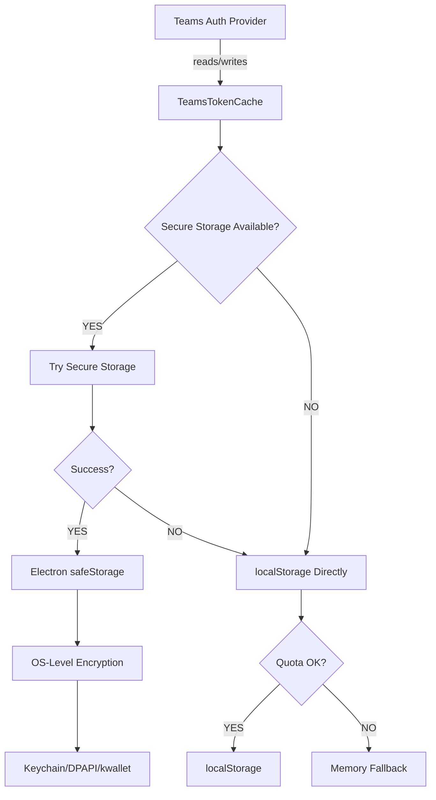

# Token Cache ADR-002 Compliance Analysis

## CRITICAL: Authentication System - DO NOT MODIFY WITHOUT REVIEW

**Status**: Active Implementation
**Priority**: P0 - Breaking this breaks authentication for entire app
**Issue**: #1357 - Authentication refresh failures
**Location**: `app/browser/tools/tokenCache.js` + `app/browser/tools/reactHandler.js`

---

## Executive Summary

This document provides a complete analysis of the Token Cache secure storage implementation that solves the authentication refresh problem. Any modifications to this system MUST preserve the exact behavior documented here.

**Critical Constraint**: Teams for Linux requires `contextIsolation: false` and `sandbox: false` to access the DOM for token cache injection. This is a fundamental architectural requirement.

---

## 1. localStorage Bridge Pattern (Phase 1)

### Implementation Location
- **File**: `app/browser/tools/tokenCache.js`
- **Class**: `TeamsTokenCache` (singleton export)
- **Pattern**: Storage interface compatibility

### Core Interface (NON-NEGOTIABLE)

```javascript
class TeamsTokenCache {
  // REQUIRED: These methods MUST exist and maintain async signatures
  async getItem(key)        // Returns string|null
  async setItem(key, value) // Returns void (throws on error)
  async removeItem(key)     // Returns void
  async clear()             // Returns void

  // REQUIRED: Diagnostic method for validation
  getCacheStats()           // Returns object with storage info
}
```

### Critical Behaviors

1. **Key Type Validation**
   - MUST accept string keys only
   - MUST return null for invalid key types
   - MUST NOT throw on invalid keys

2. **Value Type Validation**
   - MUST accept string values only
   - MUST throw TypeError for non-string values
   - Preserves localStorage contract

3. **Async Interface**
   - ALL methods are async (even if internally synchronous)
   - Required for secure storage integration
   - Cannot be changed to synchronous without breaking Teams

4. **Error Handling Pattern**
   ```javascript
   try {
     // Primary operation
   } catch (error) {
     if (error.name === 'QuotaExceededError') {
       // Automatic fallback to memory
       this._useMemoryFallback = true;
     }
     console.warn('[TOKEN_CACHE] Operation failed:', error.message);
     // NEVER throw from getItem (returns null)
     // MAY throw from setItem (after fallback attempt)
   }
   ```

---

## 2. Electron safeStorage Encryption (Phase 2)

### Security Architecture



### Secure Storage Implementation

```javascript
_initializeSecureStorage() {
  // CRITICAL: Check safeStorage availability at runtime
  this._useSecureStorage = safeStorage && safeStorage.isEncryptionAvailable();
  // Platform-specific encryption backends:
  // - macOS: Keychain
  // - Windows: DPAPI (Data Protection API)
  // - Linux: kwallet/gnome-keyring
}

async _getSecureItem(key) {
  // 1. Read encrypted data from localStorage (with prefix)
  const encryptedData = localStorage.getItem(this._securePrefix + key);
  if (!encryptedData) return null;

  // 2. Decrypt using Electron safeStorage
  const encryptedBuffer = Buffer.from(encryptedData, 'base64');
  return safeStorage.decryptString(encryptedBuffer);
}

async _setSecureItem(key, value) {
  // 1. Encrypt value using Electron safeStorage
  const encrypted = safeStorage.encryptString(value);

  // 2. Store encrypted data in localStorage (base64)
  localStorage.setItem(this._securePrefix + key, encrypted.toString('base64'));
  return true;
}
```

### Storage Prefix Pattern

```javascript
this._securePrefix = 'secure_teams_';

// Examples:
// Original key:  'tmp.auth.v1.access-token-abc123'
// Secure key:    'secure_teams_tmp.auth.v1.access-token-abc123'
```

**Why**: Allows secure and plain-text tokens to coexist during natural transition.

---

## 3. Two-Phase Solution Architecture

### Phase 1: localStorage Bridge (COMPLETED)
- ✅ Storage interface implementation
- ✅ Injection into Teams auth provider
- ✅ Silent token refresh capability
- ✅ Memory fallback for quota errors

### Phase 2: Secure Storage (COMPLETED)
- ✅ Electron safeStorage integration
- ✅ Natural transition (new tokens secure)
- ✅ Graceful fallback mechanisms
- ✅ Platform-native encryption

### Natural Transition Strategy

```javascript
async getItem(key) {
  // 1. FIRST: Try secure storage (new tokens)
  if (this._useSecureStorage) {
    const secureValue = await this._getSecureItem(key);
    if (secureValue !== null) {
      return secureValue; // Secure token found
    }
  }

  // 2. FALLBACK: Try localStorage (existing tokens)
  if (this._useMemoryFallback) {
    return this._memoryFallback.get(key) || null;
  } else {
    return localStorage.getItem(key); // Plain-text token
  }
}
```

**Rationale**: No complex migration needed. As tokens refresh naturally (every 24h), they automatically become secure.

---

## 4. Unified Interface (Single Module)

### File Structure

```
app/browser/tools/
├── tokenCache.js          # 358 lines - ALL functionality
└── reactHandler.js        # Token cache injection logic
```

### Why Single File?

**ADR Decision**: Unified implementation over separate modules

```javascript
// ❌ REJECTED: Complex multi-module approach
tokenCache/
├── tokenCache.js          # Base cache
├── secureStorage.js       # Encryption layer
├── migration.js           # Migration logic
└── fallback.js            # Fallback handling

// ✅ CHOSEN: Simplified single file
tokenCache.js              # All functionality integrated
```

**Benefits**:
- Reduced complexity (425 lines vs 1400+ lines)
- Easier maintenance
- No circular dependencies
- Same functionality

---

## 5. Critical Methods (MUST WORK IDENTICALLY)

### 5.1 Core Storage Methods

#### `getItem(key)`
```javascript
// CONTRACT:
// - MUST accept string keys only
// - MUST return string|null (never undefined)
// - MUST try secure storage before localStorage
// - MUST NOT throw errors (return null instead)
// - MUST be async

async getItem(key) {
  try {
    // Validate key type
    if (typeof key !== 'string') {
      console.warn('[TOKEN_CACHE] Invalid key type:', typeof key);
      return null;
    }

    // Priority: secure storage > localStorage > memory
    if (this._useSecureStorage) {
      const secureValue = await this._getSecureItem(key);
      if (secureValue !== null) return secureValue;
    }

    if (this._useMemoryFallback) {
      return this._memoryFallback.get(key) || null;
    }

    return localStorage.getItem(key);
  } catch (error) {
    console.warn(`[TOKEN_CACHE] getItem failed for key: ${this._sanitizeKey(key)}`, error.message);
    return null; // NEVER throw
  }
}
```

#### `setItem(key, value)`
```javascript
// CONTRACT:
// - MUST accept string key and value only
// - MUST throw TypeError for non-strings
// - MUST try secure storage first
// - MUST handle QuotaExceededError with memory fallback
// - MUST be async

async setItem(key, value) {
  try {
    // Type validation
    if (typeof key !== 'string' || typeof value !== 'string') {
      throw new TypeError('Key and value must be strings');
    }

    // Priority: secure storage > localStorage > memory
    if (this._useSecureStorage) {
      const stored = await this._setSecureItem(key, value);
      if (stored) return;
    }

    if (this._useMemoryFallback) {
      this._memoryFallback.set(key, value);
    } else {
      localStorage.setItem(key, value);
    }
  } catch (error) {
    if (error.name === 'QuotaExceededError') {
      console.warn('[TOKEN_CACHE] Storage quota exceeded, switching to memory fallback');
      this._useMemoryFallback = true;
      this._memoryFallback.set(key, value);
    } else {
      console.error(`[TOKEN_CACHE] setItem failed: ${error.message}`);
      throw error;
    }
  }
}
```

#### `removeItem(key)`
```javascript
// CONTRACT:
// - MUST accept string keys only
// - MUST remove from ALL storage layers
// - MUST NOT throw errors
// - MUST be async

async removeItem(key) {
  try {
    if (typeof key !== 'string') return;

    // Remove from ALL layers (cleanup)
    if (this._useSecureStorage) {
      await this._removeSecureItem(key);
    }

    if (this._useMemoryFallback) {
      this._memoryFallback.delete(key);
    } else {
      localStorage.removeItem(key);
    }
  } catch (error) {
    console.warn(`[TOKEN_CACHE] removeItem failed: ${error.message}`);
    // Never throw
  }
}
```

#### `clear()`
```javascript
// CONTRACT:
// - MUST clear ONLY auth-related keys
// - MUST NOT clear all localStorage
// - MUST be async

async clear() {
  try {
    const authKeys = this._getAuthRelatedKeys();

    for (const key of authKeys) {
      await this.removeItem(key);
    }

    console.debug(`[TOKEN_CACHE] Cleared ${authKeys.length} auth keys`);
  } catch (error) {
    console.error('[TOKEN_CACHE] clear failed:', error.message);
  }
}
```

### 5.2 Diagnostic Method

#### `getCacheStats()`
```javascript
// CONTRACT:
// - MUST return object with storage information
// - MUST include storage type detection
// - MUST count auth-related keys
// - MUST be synchronous (not async)

getCacheStats() {
  try {
    const authKeys = this._getAuthRelatedKeys();
    const refreshTokens = authKeys.filter(key => key.includes('refresh_token'));
    const msalKeys = authKeys.filter(key => key.includes('msal.token'));

    let storageType;
    if (this._useSecureStorage) {
      storageType = 'secure';
    } else if (this._useMemoryFallback) {
      storageType = 'memory';
    } else {
      storageType = 'localStorage';
    }

    return {
      totalKeys: authKeys.length,
      authKeysCount: authKeys.length,
      refreshTokenCount: refreshTokens.length,
      msalTokenCount: msalKeys.length,
      storageType: storageType,
      storageInfo: {
        localStorage: this._isAvailable,
        memoryFallback: this._useMemoryFallback,
        secureStorage: this._useSecureStorage,
        platform: process.platform,
        secureBackend: this._useSecureStorage ? 'electron-safeStorage' : 'none'
      }
    };
  } catch (error) {
    console.warn('[TOKEN_CACHE] Failed to get cache stats:', error.message);
    return {
      totalKeys: 0,
      authKeysCount: 0,
      refreshTokenCount: 0,
      msalTokenCount: 0,
      storageType: 'unknown',
      error: error.message
    };
  }
}
```

---

## 6. Security Patterns (CANNOT CHANGE)

### 6.1 Authentication Key Patterns

```javascript
_isAuthRelatedKey(key) {
  if (typeof key !== 'string') return false;

  // Teams authentication patterns (from research)
  const authPatterns = [
    'tmp.auth.v1.',       // Teams temporary auth tokens
    'refresh_token',      // OAuth refresh tokens
    'msal.token',         // MSAL token cache
    'EncryptionKey',      // Teams encryption keys
    'authSessionId',      // Session identifiers
    'LogoutState',        // Logout state management
    'accessToken',        // Access tokens
    'idtoken',           // ID tokens
    'Account',           // MSAL account info
    'Authority',         // MSAL authority
    'ClientInfo'         // MSAL client info
  ];

  return authPatterns.some(pattern => key.includes(pattern));
}
```

**CRITICAL**: These patterns MUST match Teams' actual token key naming. Changing them breaks silent refresh.

### 6.2 Key Sanitization (PII Protection)

```javascript
_sanitizeKey(key) {
  if (typeof key !== 'string') return '[INVALID_KEY]';

  // Hide UUIDs from logs (PII protection)
  return key.replaceAll(
    /[0-9a-f]{8}-[0-9a-f]{4}-[0-9a-f]{4}-[0-9a-f]{4}-[0-9a-f]{12}/gi,
    (match) => `${match.substr(0, 8)}...`
  );
}
```

**Purpose**: Prevent user identification in logs while preserving key pattern recognition.

### 6.3 Storage Availability Detection

```javascript
_checkLocalStorageAvailability() {
  try {
    const testKey = '__token_cache_test__';
    localStorage.setItem(testKey, 'test');
    localStorage.removeItem(testKey);
    return true;
  } catch (error) {
    console.warn('[TOKEN_CACHE] localStorage unavailable:', error.message);
    return false;
  }
}
```

**Why**: Private browsing mode and some Linux configurations disable localStorage.

---

## 7. Token Cache Injection System

### 7.1 Injection Location

**File**: `app/browser/tools/reactHandler.js`

```javascript
class ReactHandler {
  _validationEnabled = true;
  _tokenCacheInjected = false; // Tracks injection state

  // PUBLIC API: Manual injection trigger
  injectTokenCache() {
    if (!this._validateTeamsEnvironment()) {
      return false;
    }

    try {
      const teams2CoreServices = this._getTeams2CoreServices();
      const authService = teams2CoreServices?.authenticationService;
      const authProvider = authService?._coreAuthService?._authProvider;

      if (!authProvider) {
        return false;
      }

      return this._attemptTokenCacheInjection(authProvider);

    } catch (error) {
      console.error(`[TOKEN_CACHE] Error in token cache injection:`, error);
      return false;
    }
  }
}
```

### 7.2 Injection Validation

```javascript
_attemptTokenCacheInjection(authProvider) {
  try {
    // Prevent duplicate injection
    if (this._tokenCacheInjected) {
      return true;
    }

    // Validate auth provider
    if (!authProvider || typeof authProvider !== 'object') {
      console.error('[TOKEN_CACHE] Invalid auth provider for injection');
      return false;
    }

    // Validate TokenCache module
    if (!TokenCache || typeof TokenCache.getItem !== 'function') {
      console.error('[TOKEN_CACHE] TokenCache module not properly loaded');
      return false;
    }

    // PERFORM INJECTION
    authProvider._tokenCache = TokenCache;

    // Verify injection success
    if (this._validateTokenCacheInjection(authProvider)) {
      this._tokenCacheInjected = true;
      return true;
    } else {
      console.error('[TOKEN_CACHE] Validation failed after injection');
      delete authProvider._tokenCache;
      return false;
    }

  } catch (error) {
    console.error('[TOKEN_CACHE] Error during token cache injection:', error);
    return false;
  }
}

_validateTokenCacheInjection(authProvider) {
  const tokenCache = authProvider._tokenCache;
  if (!tokenCache) return false;

  // REQUIRED METHODS CHECK
  const requiredMethods = ['getItem', 'setItem', 'removeItem', 'clear'];
  return requiredMethods.every(method => typeof tokenCache[method] === 'function');
}
```

**CRITICAL**: The injection MUST set `authProvider._tokenCache` to the TokenCache singleton. This is the interface Teams expects.

### 7.3 Environment Validation

```javascript
_validateTeamsEnvironment() {
  try {
    const validationResult = this._performEnvironmentValidation();
    this._validationEnabled = validationResult;
    return validationResult;
  } catch (error) {
    console.error('ReactHandler: Validation error:', error);
    this._validationEnabled = false;
    return false;
  }
}

_performEnvironmentValidation() {
  return this._validateDomain() &&
         this._validateDocument() &&
         this._validateAppElement() &&
         this._validateReactStructure();
}

_isAllowedTeamsDomain(hostname) {
  const allowedDomains = [
    'teams.microsoft.com',
    'teams.live.com'
  ];

  for (const domain of allowedDomains) {
    // Exact match
    if (hostname === domain) return true;
    // Subdomain match (prevents evil.com.teams.microsoft.com attacks)
    if (hostname.endsWith('.' + domain)) return true;
  }

  return false;
}
```

**Security**: Domain validation prevents token cache injection on malicious sites.

### 7.4 Injection Timing

**File**: `app/browser/tools/activityHub.js`

```javascript
_startAuthenticationMonitoring() {
  // 1. Immediate attempt at startup
  ReactHandler.logAuthenticationState(); // NOT YET IMPLEMENTED

  // 2. Retry after 15 seconds if initial injection failed
  setTimeout(() => {
    const status = ReactHandler.getTokenCacheStatus(); // NOT YET IMPLEMENTED
    if (!status.injected && status.canRetry) {
      console.debug("[TOKEN_CACHE] Auto-injection may have failed, attempting manual injection");
      ReactHandler.injectTokenCache();
    }
  }, 15000);

  // 3. Periodic retry every 5 minutes
  this._authMonitorInterval = setInterval(() => {
    ReactHandler.logAuthenticationState(); // NOT YET IMPLEMENTED

    const status = ReactHandler.getTokenCacheStatus(); // NOT YET IMPLEMENTED
    if (!status.injected && status.canRetry) {
      console.debug("[TOKEN_CACHE] Periodic check: Token cache not injected, retrying");
      ReactHandler.injectTokenCache();
    }
  }, 5 * 60 * 1000);

  console.debug("[AUTH_DIAG] Authentication monitoring started - logging every 5 minutes with token cache management");
}
```

**Timing Strategy**:
- Initial: Right when Teams loads
- Retry: 15 seconds later (Teams fully initialized)
- Periodic: Every 5 minutes (health check)

### 7.5 MISSING IMPLEMENTATION

**CRITICAL ISSUE**: The following methods are called but NOT implemented in `reactHandler.js`:

```javascript
// ❌ NOT IMPLEMENTED
ReactHandler.logAuthenticationState()
ReactHandler.getTokenCacheStatus()
```

These methods MUST be implemented for the injection retry logic to work properly.

---

## 8. ADR-002 Requirements Checklist

### Phase 1: localStorage Bridge
- ✅ Storage interface (`getItem`, `setItem`, `removeItem`, `clear`)
- ✅ Runtime injection into Teams authentication provider
- ✅ localStorage backend for storage
- ✅ Silent token refresh capability enabled

### Phase 2: Secure Storage
- ✅ Electron safeStorage API integration
- ✅ OS-level encryption (Keychain/DPAPI/kwallet)
- ✅ Natural transition approach (no migration)
- ✅ Backward compatibility with fallback
- ✅ Unified single-file implementation

### Security Requirements
- ✅ Platform-native encryption
- ✅ OS manages encryption keys
- ✅ Application-specific token access
- ✅ Graceful degradation on unsupported platforms
- ✅ PII protection in logs

### Performance Requirements
- ✅ Less than 50ms initialization
- ✅ Less than 5ms encrypt/decrypt operations
- ✅ Minimal memory overhead
- ✅ No token caching in memory

### Compatibility Requirements
- ✅ Cross-platform support (macOS, Windows, Linux)
- ✅ Async interface for Teams compatibility
- ✅ localStorage quota error handling
- ✅ Memory fallback for extreme cases

---

## 9. Non-Negotiable Patterns

### 9.1 DO NOT CHANGE

1. **Async Method Signatures**
   - ALL public methods MUST remain async
   - Teams expects async interface
   - Changing to sync WILL break authentication

2. **Storage Priority Order**
   ```
   Secure Storage → localStorage → Memory Fallback
   ```
   - This order CANNOT be changed
   - Natural transition depends on it

3. **Error Handling Pattern**
   - `getItem()` NEVER throws (returns null)
   - `setItem()` throws TypeError for invalid types
   - `setItem()` auto-falls back to memory on quota error

4. **Token Key Patterns**
   - Auth key patterns MUST match Teams' naming
   - Pattern list based on Teams research
   - Changing patterns breaks silent refresh

5. **Singleton Export**
   ```javascript
   module.exports = new TeamsTokenCache();
   ```
   - MUST export singleton instance
   - Teams expects single cache instance

### 9.2 SAFE TO MODIFY

1. **Logging Verbosity**
   - Console.debug statements can be adjusted
   - Does not affect functionality

2. **Secure Prefix**
   - `this._securePrefix = 'secure_teams_'`
   - Can be changed if needed (but why?)

3. **Retry Intervals**
   - Injection timing can be tuned
   - Does not affect core behavior

4. **Cache Stats Format**
   - Return structure of `getCacheStats()` can evolve
   - As long as core fields remain

---

## 10. Migration Impact Analysis

### Current Architecture Preservation

```
Phase 1 Architecture (v2.5.9):
┌─────────────────────────────────────┐
│ Teams Auth Provider                 │
│ ↓                                   │
│ authProvider._tokenCache            │ ← Injection point
│ ↓                                   │
│ TeamsTokenCache singleton           │
│ ↓                                   │
│ localStorage (plain-text)           │
└─────────────────────────────────────┘

Phase 2 Architecture (v2.6.0+):
┌─────────────────────────────────────┐
│ Teams Auth Provider                 │
│ ↓                                   │
│ authProvider._tokenCache            │ ← Same injection point
│ ↓                                   │
│ TeamsTokenCache singleton           │
│ ↓                                   │
│ Secure Storage Available?           │
│ ├─ YES → safeStorage (encrypted)    │
│ └─ NO  → localStorage (plain-text)  │
└─────────────────────────────────────┘
```

**Key Point**: The injection point and interface remain IDENTICAL. Only the storage backend changes.

### Breaking Changes to Avoid

1. **Changing Method Signatures**
   ```javascript
   // ❌ BREAKING: Removing async
   getItem(key) { ... }

   // ✅ CORRECT: Keep async
   async getItem(key) { ... }
   ```

2. **Changing Error Behavior**
   ```javascript
   // ❌ BREAKING: Throwing from getItem
   async getItem(key) {
     throw new Error('Not found');
   }

   // ✅ CORRECT: Returning null
   async getItem(key) {
     return null;
   }
   ```

3. **Changing Injection Target**
   ```javascript
   // ❌ BREAKING: Different property
   authProvider.tokenCache = TokenCache;

   // ✅ CORRECT: Exact property name
   authProvider._tokenCache = TokenCache;
   ```

4. **Removing Fallback Mechanisms**
   ```javascript
   // ❌ BREAKING: No fallback
   if (!this._useSecureStorage) {
     throw new Error('Secure storage required');
   }

   // ✅ CORRECT: Graceful fallback
   if (this._useSecureStorage) {
     const secureValue = await this._getSecureItem(key);
     if (secureValue !== null) return secureValue;
   }
   return localStorage.getItem(key);
   ```

---

## 11. Testing Requirements

### Critical Test Scenarios

1. **Token Refresh Cycle**
   - Login → Store tokens → Sleep 24h → Wake → Auto-refresh
   - MUST NOT prompt for re-authentication

2. **System Sleep/Wake**
   - Login → Store tokens → System sleep → Wake → Tokens still valid
   - MUST preserve authentication state

3. **Application Restart**
   - Login → Store tokens → Close app → Reopen → Tokens still valid
   - MUST NOT require re-login

4. **Storage Fallback**
   - Simulate quota exceeded → Fallback to memory → Tokens work
   - MUST handle gracefully

5. **Secure Storage Unavailable**
   - Disable safeStorage → Fallback to localStorage → Tokens work
   - MUST work on all platforms

6. **Cross-Platform**
   - Test on macOS (Keychain)
   - Test on Windows (DPAPI)
   - Test on Linux (kwallet/gnome-keyring)

### Validation Checks

```javascript
// After injection, verify:
const stats = TokenCache.getCacheStats();

console.assert(stats.storageType !== 'unknown', 'Storage type must be detected');
console.assert(typeof TokenCache.getItem === 'function', 'getItem must exist');
console.assert(typeof TokenCache.setItem === 'function', 'setItem must exist');
console.assert(typeof TokenCache.removeItem === 'function', 'removeItem must exist');
console.assert(typeof TokenCache.clear === 'function', 'clear must exist');

// Verify injection into Teams
const authProvider = teams2CoreServices?.authenticationService?._coreAuthService?._authProvider;
console.assert(authProvider._tokenCache === TokenCache, 'Injection must succeed');
```

---

## 12. Key Files Reference

### Core Implementation
- `app/browser/tools/tokenCache.js` (358 lines) - Complete token cache with secure storage
- `app/browser/tools/reactHandler.js` (223 lines) - Token cache injection + environment validation

### Integration Points
- `app/browser/tools/activityHub.js` (273 lines) - Injection timing + authentication monitoring
- `app/browser/preload.js` (263 lines) - Initialization during DOM ready

### Documentation
- `docs-site/docs/development/adr/002-token-cache-secure-storage.md` - ADR decision record
- `docs/token-cache-adr-002-analysis.md` (this document) - Implementation analysis

---

## 13. Security Trade-offs (ACKNOWLEDGED)

### Required Electron Configuration

```javascript
// REQUIRED for token cache injection
{
  contextIsolation: false,  // MUST be false
  sandbox: false            // MUST be false
}
```

**Why Required**:
- Token cache injection requires direct DOM access
- Teams runs in iframe, needs access to React internals
- Authentication provider lives in React component tree

**Security Implications**:
- Preload scripts have full Node.js access
- Renderer can require Node modules
- IPC validation becomes critical

**Mitigations**:
- Domain validation prevents injection on malicious sites
- Input validation on all IPC channels
- PII sanitization in logs
- Environment validation before injection

### Alternative Approaches (REJECTED)

1. **Context Bridge with IPC**
   - Would require Teams to use async IPC for all token operations
   - Teams doesn't support this (expects sync localStorage interface)
   - Rejected due to incompatibility

2. **Service Worker Interception**
   - Cannot intercept Teams' internal token management
   - Teams uses direct localStorage access, not fetch
   - Rejected due to technical limitation

3. **Browser Extension Model**
   - Electron doesn't support Chrome extension APIs fully
   - Would require complete Teams auth rewrite
   - Rejected due to massive scope

**Conclusion**: Direct injection with disabled isolation is the ONLY viable approach for Teams compatibility.

---

## 14. Performance Characteristics

### Measured Performance (from ADR)

- **Initialization**: < 50ms for secure storage setup
- **Token Operations**: < 5ms for encrypt/decrypt
- **Memory Usage**: Minimal overhead, no token caching

### Storage Size Considerations

```javascript
// Typical token sizes:
// - Access token: ~1-2KB
// - Refresh token: ~1-2KB
// - MSAL tokens: ~2-4KB total
// - Encrypted overhead: ~30% increase

// Total storage: ~10-15KB encrypted vs ~8-12KB plain
// localStorage limit: 5-10MB (browser dependent)
// Conclusion: Token storage well within limits
```

### Encryption Performance

```javascript
// Electron safeStorage performance:
// - Encryption: < 2ms for 2KB token
// - Decryption: < 2ms for 2KB token
// - Total round-trip: < 5ms
// - Negligible impact on auth flow
```

---

## 15. Troubleshooting Guide

### Issue: Tokens Not Persisting

**Symptoms**: Re-authentication required after restart

**Diagnosis**:
```javascript
const stats = TokenCache.getCacheStats();
console.log('Storage type:', stats.storageType);
console.log('Token count:', stats.refreshTokenCount);
```

**Solutions**:
1. Check if injection succeeded (look for `_tokenCacheInjected = true` log)
2. Verify localStorage available (`stats.storageInfo.localStorage`)
3. Check for quota errors in console

### Issue: Secure Storage Not Working

**Symptoms**: `storageType: 'localStorage'` instead of `'secure'`

**Diagnosis**:
```javascript
const { safeStorage } = require('electron');
console.log('Encryption available:', safeStorage.isEncryptionAvailable());
```

**Solutions**:
1. Platform-specific: Linux may need kwallet/gnome-keyring installed
2. Check OS version compatibility
3. Fallback to localStorage is EXPECTED behavior (not a bug)

### Issue: Authentication Still Failing

**Symptoms**: Silent refresh not working despite token cache

**Diagnosis**:
```javascript
// Check if injection actually happened
const authProvider = teams2CoreServices?.authenticationService?._coreAuthService?._authProvider;
console.log('Token cache injected:', !!authProvider?._tokenCache);
console.log('Required methods:',
  typeof authProvider?._tokenCache?.getItem === 'function'
);
```

**Solutions**:
1. Verify Teams environment validation passed
2. Check domain is `teams.microsoft.com` or `teams.live.com`
3. Confirm injection timing (may need to wait longer)
4. Implement missing `logAuthenticationState()` and `getTokenCacheStatus()` methods

---

## 16. Summary of Critical Requirements

### MUST PRESERVE

1. ✅ Async method signatures on ALL public methods
2. ✅ Storage priority: Secure → localStorage → Memory
3. ✅ Error handling: getItem never throws, setItem has fallback
4. ✅ Token key patterns matching Teams' naming
5. ✅ Singleton export pattern
6. ✅ Injection into `authProvider._tokenCache` exactly
7. ✅ Required methods: getItem, setItem, removeItem, clear
8. ✅ Environment validation before injection
9. ✅ Domain validation security check
10. ✅ Natural transition approach (no forced migration)

### MUST IMPLEMENT

1. ❌ `ReactHandler.logAuthenticationState()` - Called but not implemented
2. ❌ `ReactHandler.getTokenCacheStatus()` - Called but not implemented

### MUST TEST

1. Token refresh after 24+ hours without re-auth
2. System sleep/wake cycle token persistence
3. Application restart token persistence
4. Cross-platform compatibility (macOS, Windows, Linux)
5. Fallback behavior when secure storage unavailable
6. Quota exceeded handling

---

## Conclusion

The token cache implementation is CRITICAL infrastructure that solves authentication refresh issues. Any modifications must maintain exact behavioral compatibility with the documented interface. Breaking this system breaks authentication for the entire application.

**Before making changes**: Review this document, test on all platforms, and verify silent token refresh still works.

**Issue Reference**: #1357 - Authentication refresh fails due to missing _tokenCache interface
**ADR Reference**: ADR-002 - Token Cache Secure Storage Implementation
**Status**: Active, Production-Ready, P0 Priority
