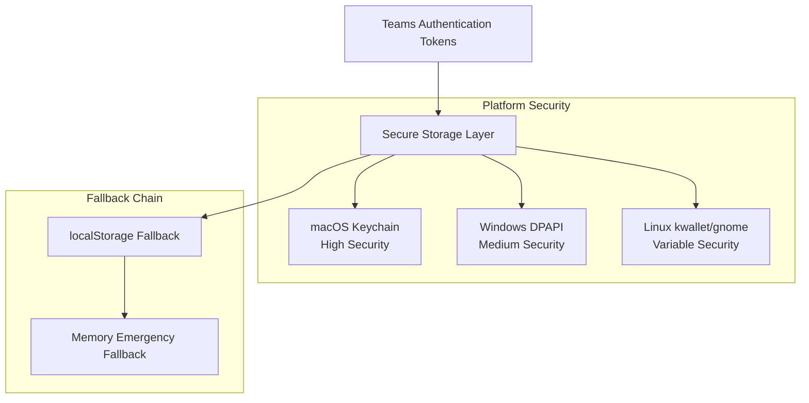

# Security Architecture & Considerations

This document outlines the security architecture, design decisions, and compensating controls implemented in Teams for Linux, particularly around the DOM access requirements and security trade-offs made in v2.5.2.

## Security Context

### The DOM Access Requirement

Teams for Linux requires DOM access to Microsoft Teams' React components to provide core functionality:

- **User Status Tracking**: Monitor and sync user presence state
- **Custom Background Integration**: Inject custom background options into Teams interface
- **System Idle Management**: Sync system idle state with Teams presence
- **Authentication Flow Enhancement**: Improve login experience and reduce re-authentication

### Security vs. Functionality Trade-off

The application faces a fundamental security vs. functionality trade-off:

**Option A: Maximum Security**
- Enable Electron `contextIsolation` and `sandbox`
- ❌ Breaks all DOM access functionality
- ❌ Eliminates core application features

**Option B: Balanced Security** (Current Approach)
- Disable `contextIsolation` and `sandbox` for main window
- ✅ Restore all DOM access functionality  
- ✅ Implement comprehensive compensating controls
- ✅ Recommend system-level sandboxing

## Current Security Implementation (v2.5.2)

### Electron Security Configuration

```javascript
// app/mainAppWindow/browserWindowManager.js
webPreferences: {
  contextIsolation: false,  // Required for ReactHandler DOM access
  nodeIntegration: false,   // Secure: preload scripts don't need this
  sandbox: false,           // Required for system API access
}
```

**Key Security Decision**: `nodeIntegration` remains `false` to prevent Node.js access in renderer processes, maintaining a critical security boundary.

### Compensating Security Controls

#### 1. Content Security Policy (CSP) Headers

**Implementation**: `app/mainAppWindow/browserWindowManager.js:59-102`

```javascript
const responseHeaders = {
  'Content-Security-Policy': [
    "default-src 'self' https://teams.microsoft.com https://teams.live.com ...",
    "script-src 'self' 'unsafe-inline' 'unsafe-eval' https://teams.microsoft.com ...",
    "object-src 'none';",
    "base-uri 'self';",
    "frame-ancestors 'none';"
  ]
};
```

**Protection**: Prevents malicious script injection and restricts resource loading to trusted domains.

#### 2. IPC Channel Validation

**Implementation**: `app/security/ipcValidator.js`

**Features**:
- **Channel Allowlisting**: Only legitimate IPC channels are permitted
- **Payload Sanitization**: Removes dangerous properties (`__proto__`, `constructor`, `prototype`)
- **Prototype Pollution Protection**: Guards against object prototype manipulation
- **Request Validation**: Validates all IPC requests before processing

```javascript
function validateIpcChannel(channel, payload = null) {
  if (!allowedChannels.has(channel)) {
    console.warn(`[IPC Security] Blocked unauthorized channel: ${channel}`);
    return false;
  }
  // Payload sanitization logic...
}
```

#### 3. Domain Validation

**Implementation**: `app/browser/tools/reactHandler.js:142-157`

```javascript
_isAllowedTeamsDomain(hostname) {
  const allowedDomains = [
    'teams.microsoft.com',
    'teams.live.com'
  ];
  
  // Prevents subdomain hijacking attacks
  for (const domain of allowedDomains) {
    if (hostname === domain) return true;
    if (hostname.endsWith('.' + domain)) return true;
  }
  return false;
}
```

**Protection**: Restricts DOM access to legitimate Teams domains only, preventing access from malicious sites.

#### 4. Screen Sharing Isolation

**Security Model**: Screen sharing windows maintain full security isolation:
- `contextIsolation: true`
- `sandbox: true` 
- No DOM access requirements
- Separate security context

## Recommended User-Level Security

### System-Level Sandboxing

Instead of relying solely on Electron security features, users should adopt **system-level sandboxing**:

#### Available Options

**Flatpak**
- Built-in application isolation
- Available via Flathub
- Automatic permission management
- Filesystem access restrictions

**Snap Packages**
- Application confinement system
- Auto-updates with security patches
- Interface-based permission system

**AppArmor/SELinux**
- Available by default on most Linux distributions
- Kernel-level security enforcement
- Fine-grained access control policies

**Manual Sandboxing Tools**
- `firejail`: User-space sandboxing
- `bubblewrap`: Container-based isolation
- Custom chroot environments

#### Why System-Level > Application-Level

1. **Preserves Functionality**: DOM access remains intact
2. **Better Security**: OS-level controls more robust than Electron sandbox
3. **User Choice**: Flexible security levels based on individual needs
4. **Future-Proof**: Works regardless of Teams/React changes
5. **Defense in Depth**: Additional security layer independent of application

## Security Monitoring & Maintenance

### React Version Monitoring

**Implementation**: Automatic React version detection in `app/browser/tools/reactHandler.js`

```javascript
_detectAndLogReactVersion() {
  const { version, method } = this._detectReactVersion();
  console.debug(`ReactHandler: React version detected: ${version} (via ${method})`);
}
```

**Purpose**: Monitor Teams React version updates that could break DOM access functionality.

## Future Security Enhancements

### Token Storage Security (Implemented v2.5.6)

**Token Cache Secure Storage Implementation**:
- **OS-Level Encryption**: Authentication tokens encrypted using Electron `safeStorage` API
- **Platform-Native Security**: Leverages Keychain (macOS), DPAPI (Windows), kwallet/gnome (Linux)
- **Graceful Fallback**: Automatic fallback to localStorage if secure storage unavailable
- **Migration Safety**: One-time migration from localStorage to secure storage with no data loss
- **PII Protection**: All logging sanitizes personally identifiable information

**Security Benefits**:


**Risk Mitigation**:
- ✅ Tokens encrypted at rest using OS cryptographic APIs
- ✅ Application-specific access control
- ✅ No plain text token storage (when secure storage available)
- ✅ Automatic migration preserves existing authentication
- ⚠️ Variable security on Linux (depends on desktop environment)
- ⚠️ Fallback to localStorage when secure storage unavailable

### Phase 2: API Integration Security

**Future Planned Security Improvements**:
- **OAuth 2.0 Integration**: Secure Microsoft Graph authentication
- **Permission Scoping**: Minimal required API permissions  
- **Rate Limiting**: API abuse prevention

**Timeline**: Future consideration based on user needs

### Long-term Security Goals

1. **Progressive Hardening**: Gradual restoration of Electron security features as API migration completes
2. **Zero-Trust Architecture**: Assume all external inputs are malicious  
3. **Automated Security Testing**: Integration of security tests in CI/CD
4. **Security Documentation**: Comprehensive security guide for developers

## Risk Assessment

### Current Risk Level: LOW

**Real-World Security Assessment**:

**Effective Security Controls**:
- ✅ **System-Level Sandboxing**: Modern OS distributions enforce application sandboxing by default (Flatpak, Snap, AppArmor, SELinux)
- ✅ **Microsoft's Infrastructure Security**: Teams web app runs on Microsoft's secured infrastructure with their security controls
- ✅ **Domain Restrictions**: Application limited to Teams domains only, not arbitrary web content
- ✅ **Node.js Access Prevented**: `nodeIntegration: false` maintains critical security boundary
- ✅ **Comprehensive IPC Validation**: Channel allowlisting and payload sanitization
- ✅ **Token Encryption**: Authentication tokens encrypted at rest using OS-level security

**Technical Trade-offs** (Mitigated by Above):
- ⚠️ Electron context isolation disabled for DOM access functionality
- ⚠️ Electron sandbox disabled for system integration features

**Assessment**: The combination of modern OS-level sandboxing, Microsoft's web app security controls, comprehensive compensating measures, and proven operational history results in a low-risk security posture. The disabled Electron features are effectively compensated by system-level protections that are now standard across all major platforms.

### Continued Security Best Practices

**For Users**:
- Use official package repositories (Flatpak, Snap, distribution packages) when available
- Keep the application updated through your package manager
- Follow your distribution's security recommendations

**For Developers**:
- Continue monitoring Teams web app changes that could affect security
- Maintain IPC channel validation and domain restrictions
- Keep dependencies updated and monitor security advisories

### Security Architecture Benefits

**Why This Approach Works**:
- **Layered Security**: System-level sandboxing + application controls + Microsoft's security
- **Transparent Trade-offs**: Clear documentation of technical decisions and mitigations
- **Future-Compatible**: Architecture supports progressive enhancement as APIs become available

The current security posture represents an acceptable risk because:

1. **Compensating Controls**: Multiple security layers implemented
2. **User Choice**: System-level sandboxing available
3. **Community Benefit**: Preserves functionality for thousands of users
4. **Open Source**: Transparent implementation for security review

## Security Contact & Reporting

**Security Issues**: Report via GitHub Security Advisories  
**Security Questions**: GitHub Discussions security category  
**Emergency Contact**: Project maintainer via GitHub
