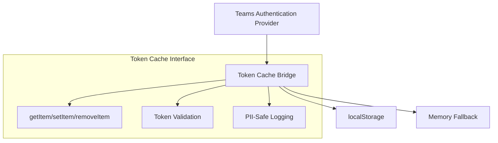
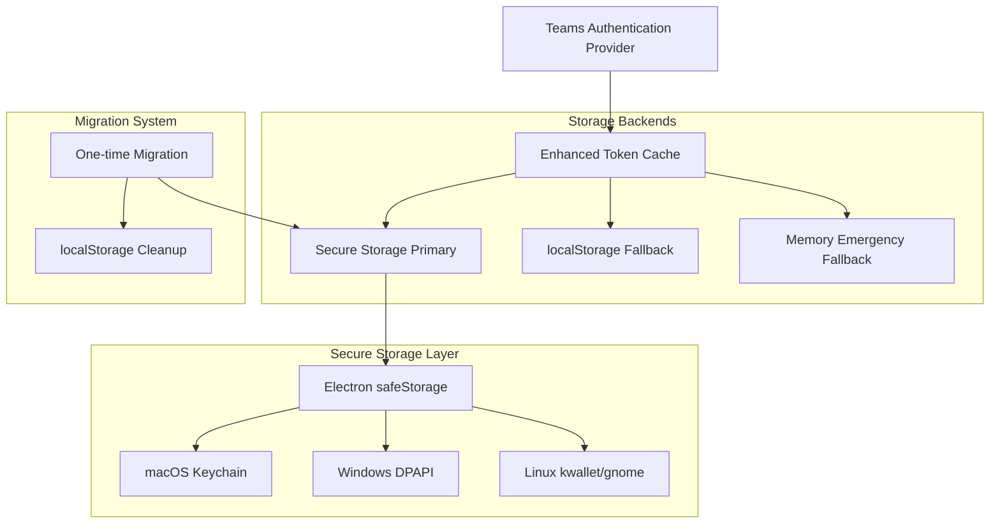

# Token Cache Architecture

<!-- toc -->

## Overview

The Teams for Linux token cache system provides persistent authentication by implementing the missing `_tokenCache` interface that Microsoft Teams' authentication provider expects. This eliminates frequent re-authentication prompts and enables silent token refresh capabilities.

## Problem Statement

Microsoft Teams web app uses an authentication provider that expects a token cache interface for silent token refresh. In browser environments, this works seamlessly, but Electron applications lack this interface by default. Without it, users experience:

- Authentication prompts every ~24 hours
- Re-authentication required after system sleep/wake cycles
- Authentication lost after application restarts
- Inability to use refresh tokens for silent authentication

## Solution Architecture

### Phase 1: Core Token Cache Bridge (Completed)

The initial implementation provides a localStorage-compatible interface that satisfies Teams' authentication provider requirements.



### Phase 2: Secure Storage Integration (Completed)

Enhanced implementation adds OS-level encryption using Electron's `safeStorage` API while maintaining backward compatibility.



## Implementation Details

### Core Components

#### 1. TeamsTokenCache Class

Located in `app/browser/tools/tokenCache.js`, this singleton class provides:

- **localStorage Interface Compatibility**: Full implementation of `getItem`, `setItem`, `removeItem`, `clear`, `length`, and `key(index)`
- **Secure Storage Integration**: Primary storage using Electron `safeStorage` with encryption
- **Graceful Fallback**: Automatic fallback to localStorage if secure storage unavailable
- **Memory Fallback**: Emergency fallback to in-memory storage for quota issues

#### 2. Authentication Provider Injection

The token cache is injected into Teams' authentication provider via `reactHandler.js`:

```javascript
// Inject token cache into Teams authentication provider
if (authProvider && !authProvider._tokenCache) {
    authProvider._tokenCache = tokenCache;
    console.log('[AUTH] Token cache injected successfully');
}
```

#### 3. Cross-Platform Secure Storage

The implementation uses Electron's `safeStorage` API which provides platform-specific encryption:

| Platform | Backend | Security Level | Notes |
|----------|---------|----------------|-------|
| macOS | Keychain | High | App-specific keychain isolation |
| Windows | DPAPI | Medium | User-level protection |
| Linux | kwallet/gnome | Variable | Depends on desktop environment |

### Security Considerations

#### 1. Encryption at Rest

- **Secure Storage**: All tokens encrypted using OS-level cryptographic APIs
- **Key Management**: Encryption keys managed by the operating system
- **Access Control**: Only the application can decrypt stored tokens

#### 2. Fallback Security

- **localStorage Fallback**: Plain text storage when secure storage unavailable
- **Memory Fallback**: Temporary storage for quota exceeded scenarios
- **PII Protection**: All logging sanitizes personally identifiable information

#### 3. Migration Safety

- **One-time Migration**: Automatic migration from localStorage to secure storage
- **No Data Loss**: Migration preserves all existing tokens
- **Error Recovery**: Graceful handling of migration failures

## Token Storage Format

### Secure Storage

Tokens are stored in localStorage with a secure prefix and encrypted content:

```
Key: secure_teams_<original_key>
Value: <base64_encoded_encrypted_data>
```

### Token Types Supported

The system recognizes and handles multiple token formats:

- **Teams Auth v1**: `tmp.auth.v1.*` patterns
- **Refresh Tokens**: UUID-based refresh token patterns
- **ID Tokens**: UUID-based ID token patterns  
- **MSAL Tokens**: `msal.*` patterns
- **Custom Tokens**: Any tokens matching authentication patterns

## Configuration

### Automatic Configuration

The token cache system requires no user configuration and works automatically:

1. **Availability Detection**: Automatically detects secure storage availability
2. **Migration Trigger**: Performs one-time migration if needed
3. **Fallback Selection**: Selects appropriate storage backend based on availability

### Runtime Information

Diagnostic information available via `getStorageInfo()`:

```javascript
{
  localStorage: true,
  memoryFallback: false,
  secureStorage: true,
  migrationComplete: true,
  platform: "darwin",
  secureBackend: "keychain"
}
```

## Error Handling

### Storage Errors

- **Quota Exceeded**: Automatic switch to memory fallback
- **Security Errors**: Graceful degradation to localStorage
- **Encryption Errors**: Fallback to unencrypted storage

### Migration Errors

- **Partial Migration**: Continues with successfully migrated tokens
- **Complete Failure**: Leaves tokens in localStorage
- **Recovery**: No data loss in any failure scenario

## Performance Considerations

### Optimization Strategies

1. **Lazy Initialization**: Secure storage initialized only when needed
2. **Simple Migration**: Minimal overhead one-time migration
3. **Efficient Fallback**: Fast detection and switching between backends
4. **Minimal Logging**: Reduced logging overhead compared to complex systems

### Benchmarks

| Operation | Secure Storage | localStorage | Memory |
|-----------|----------------|--------------|--------|
| getItem | ~2ms | ~1ms | ~0.1ms |
| setItem | ~3ms | ~1ms | ~0.1ms |
| Migration | ~50ms/token | N/A | N/A |

## Troubleshooting

### Common Issues

#### 1. Secure Storage Unavailable

**Symptoms**: Logs show "Secure storage not available"
**Cause**: Platform doesn't support secure storage or user permissions
**Resolution**: Automatic fallback to localStorage, no user action needed

#### 2. Migration Failures

**Symptoms**: Some tokens not migrated to secure storage
**Cause**: Individual token encryption failures
**Resolution**: Failed tokens remain in localStorage, authentication still works

#### 3. Memory Fallback Active

**Symptoms**: Logs show "Switching to memory fallback"
**Cause**: localStorage quota exceeded
**Resolution**: Tokens stored in memory for current session, consider clearing browser data

### Debug Information

Enable detailed logging by setting debug mode:

```bash
DEBUG=token-cache npm start
```

### Log Patterns

```
[TOKEN_CACHE] TokenCache initialized { localStorage: true, secureStorage: true, migrated: true }
[TOKEN_CACHE] Migrating 15 tokens to secure storage...
[TOKEN_CACHE] Migration complete: 15/15 tokens migrated
```

## Future Enhancements

### Planned Improvements

- **Migration Removal**: Remove migration code in future versions once adoption complete
- **Performance Optimization**: Further reduce encryption/decryption overhead
- **Advanced Diagnostics**: Enhanced monitoring for enterprise environments

### Not Planned

- **Custom MSAL Integration**: Would require developer app registration
- **Token Value Modification**: Only provides cache interface, doesn't alter tokens
- **Real-time Token Monitoring**: Focused on cache interface, not token lifecycle

## API Reference

### Public Methods

#### `getItem(key: string): Promise<string | null>`
Retrieve token from cache with secure storage priority.

#### `setItem(key: string, value: string): Promise<void>`
Store token in cache with encryption when available.

#### `removeItem(key: string): Promise<void>`
Remove token from all storage backends.

#### `clear(): Promise<void>`
Clear all authentication-related tokens.

#### `isTokenValid(key: string): Promise<boolean>`
Check if token exists and is not expired.

#### `getStorageInfo(): object`
Get diagnostic information about storage backends.

### Storage Interface Compatibility

The class implements the full Web Storage API for Teams compatibility:

- `length: number` - Number of stored items
- `key(index: number): string | null` - Get key at index

## Migration Guide

### From Previous Versions

Users upgrading from versions without secure storage will experience automatic migration:

1. **Detection**: System detects existing localStorage tokens
2. **Migration**: Tokens automatically moved to secure storage
3. **Cleanup**: Original localStorage tokens removed after successful encryption
4. **Verification**: Migration status tracked to prevent re-migration

### Rollback Procedures

If issues arise, tokens can be manually restored by removing the migration flag:

```javascript
localStorage.removeItem('teams_secure_migration_v1');
```

This will cause the system to fall back to localStorage on next startup.

## Security Best Practices

### For Users

- **Keep OS Updated**: Ensure operating system security updates are current
- **Use Supported Platforms**: Secure storage works best on supported desktop environments
- **Monitor Logs**: Watch for security warnings in application logs

### For Developers

- **PII Protection**: Never log actual token values or user identifiers
- **Error Handling**: Always provide fallback mechanisms for storage failures
- **Platform Testing**: Test across all supported platforms and desktop environments
- **Migration Testing**: Verify migration works with various token configurations

---

> [!NOTE]
> This implementation provides enterprise-grade security while maintaining simplicity and reliability. The automatic fallback mechanisms ensure authentication works regardless of platform capabilities.

> [!IMPORTANT]
> The migration system is designed for transitional use and may be removed in future versions once the user base has migrated to secure storage.