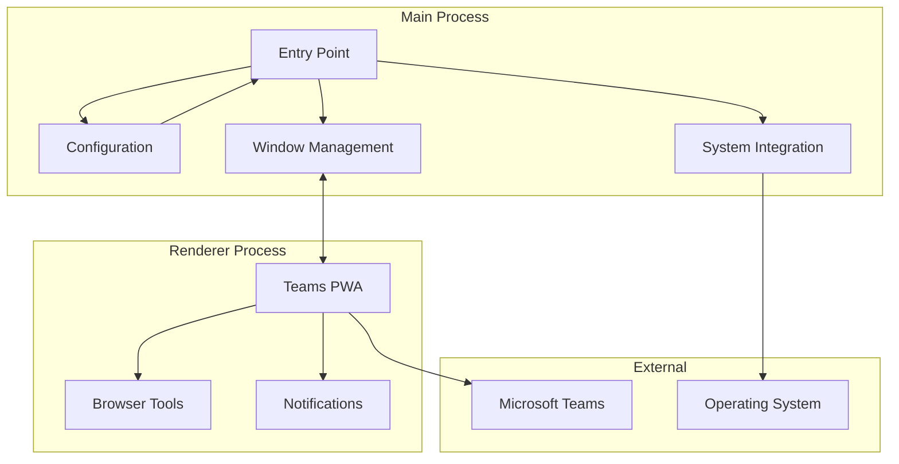

# Teams for Linux Documentation

**Unofficial Microsoft Teams client for Linux** — a native desktop app that wraps the Teams web version with enhanced Linux integration.

✅ **System notifications**
✅ **System tray integration**
✅ **Custom backgrounds & themes**
✅ **Screen sharing support**
✅ **Multiple account profiles**
✅ **Certificate management**
✅ **Proxy server support**
✅ **Microsoft Intune SSO integration**
✅ **Secure token storage**
✅ **Protocol handler support**
✅ **MQTT integration for home automation**
✅ **Advanced logging & debugging**

:::info Project Status
This is an independent project, not affiliated with Microsoft. Some features are limited by the Teams web app capabilities.
:::

## Getting Started

### Installation
- **[Installation Guide](installation.md)** - Package repositories, distribution packages, and manual installation
- **[Configuration Guide](configuration.md)** - Complete configuration options and settings
- **[Multiple Instances](multiple-instances.md)** - Running separate profiles (work/personal)
- **[Intune SSO Integration](intune-sso.md)** - Microsoft Intune Single Sign-On for enterprise environments

### Features
- **[Screen Sharing Guide](screen-sharing.md)** - Complete screen sharing implementation and usage
- **[Custom Backgrounds](custom-backgrounds.md)** - Setting up custom video call backgrounds
- **[Certificate Management](certificate.md)** - Custom CA certificate handling for corporate environments
- **[MQTT Integration](mqtt-integration.md)** - Home automation and status publishing via MQTT

## Developer Documentation
- **[Development Guide](development/README.md)** - Architecture patterns, security guidelines, and development practices
- **[Contributing Guide](development/contributing.md)** - Development setup, code standards, and contribution guidelines
- **[Architecture Decision Records](development/adr/README.md)** - Significant technical decisions and their rationale
- **[Research Documentation](development/research/README.md)** - Strategic analysis and research documents

## Architecture Overview

For detailed architecture documentation, see the [Development Guide](development/README.md).

## Quick Start

1. **Basic Usage**: Launch with `teams-for-linux`
2. **Configuration**: Create `~/.config/teams-for-linux/config.json` with your settings
3. **Troubleshooting**: Check the [Troubleshooting Guide](troubleshooting.md) for common issues
4. **Multiple Profiles**: Use `--user-data-dir` and `--class` flags for separate instances

## Support & Community

- **[Troubleshooting Guide](troubleshooting.md)** - Common issues and solutions
- **[Installation Guide](installation.md)** - Setup and installation help
- **[Contributing Guide](development/contributing.md)** - How to contribute to the project
- 💬 **Chat**: [Matrix space](https://matrix.to/#/#teams-for-linux-space:matrix.org)
- 🐛 **Issues**: [Report bugs](https://github.com/IsmaelMartinez/teams-for-linux/issues)