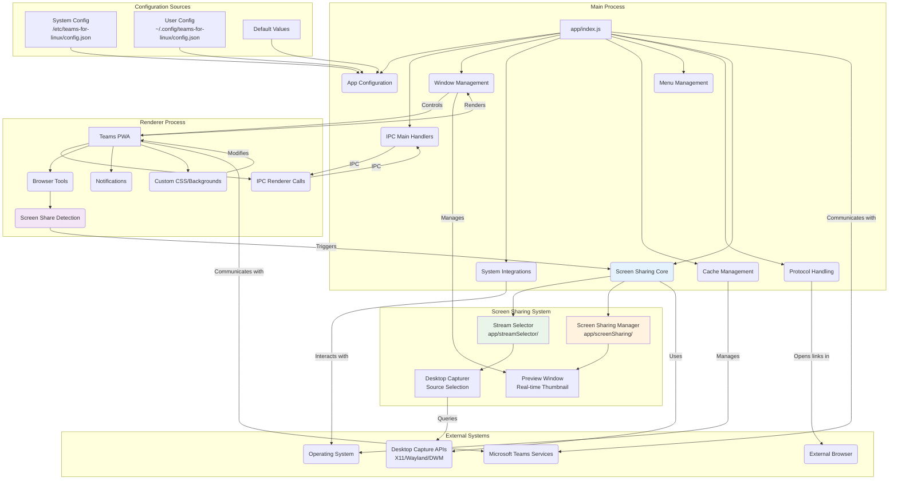

# Teams for Linux Documentation

**Unofficial Microsoft Teams client for Linux** — a native desktop app that wraps the Teams web version with enhanced Linux integration.

✅ **System notifications**  
✅ **System tray integration**  
✅ **Custom backgrounds & themes**  
✅ **Screen sharing support**  
✅ **Multiple account profiles**

:::info Project Status
This is an independent project, not affiliated with Microsoft. Some features are limited by the Teams web app capabilities.
:::

## Getting Started

### Installation
- **[Installation Guide](installation.md)** - Package repositories, distribution packages, and manual installation
- **[Configuration Guide](configuration.md)** - Complete configuration options and settings
- **[Multiple Instances](multiple-instances.md)** - Running separate profiles (work/personal)
- **[Intune SSO Integration](intune-sso.md)** - Microsoft Intune Single Sign-On for enterprise environments

### Features
- **[Screen Sharing Guide](screen-sharing.md)** - Complete screen sharing implementation and usage
- **[Custom Backgrounds](custom-backgrounds.md)** - Setting up custom video call backgrounds
- **[Certificate Management](certificate.md)** - Custom CA certificate handling for corporate environments

## Developer Documentation
- **[Contributing Guide](contributing.md)** - Development setup, code standards, and contribution guidelines
- **[IPC API Reference](ipc-api.md)** - Inter-process communication channels and developer integration
- **[Development Guide](development/README.md)** - Architecture patterns, security guidelines, and development practices
- **[Token Cache Architecture](development/token-cache-architecture.md)** - Authentication persistence and secure storage implementation  
- **[Security Architecture](development/security-architecture.md)** - Security model, threat analysis, and compensating controls
- **[Logging Configuration](log-config.md)** - Customizing application logging and debugging
- **[Release Automation](release-info.md)** - Release process and automation for maintainers

## Architecture Decisions
- **[ADR-001: Token Cache Secure Storage](adr/token-cache-secure-storage.md)** - Decision to implement OS-level secure storage for authentication tokens

## Research & Analysis
- **[Research Documentation](research/index.md)** - Strategic analysis and research documents

## Architecture Overview

## Quick Start

1. **Basic Usage**: Launch with `teams-for-linux`
2. **Configuration**: Create `~/.config/teams-for-linux/config.json` with your settings
3. **Troubleshooting**: Check the [Troubleshooting Guide](troubleshooting.md) for common issues
4. **Multiple Profiles**: Use `--user-data-dir` and `--class` flags for separate instances

## Support & Community

- **[Troubleshooting Guide](troubleshooting.md)** - Common issues and solutions
- **[Installation Guide](installation.md)** - Setup and installation help
- **[Contributing Guide](contributing.md)** - How to contribute to the project
- 💬 **Chat**: [Matrix room](https://matrix.to/#/#teams-for-linux_community:gitter.im)
- 🐛 **Issues**: [Report bugs](https://github.com/IsmaelMartinez/teams-for-linux/issues)