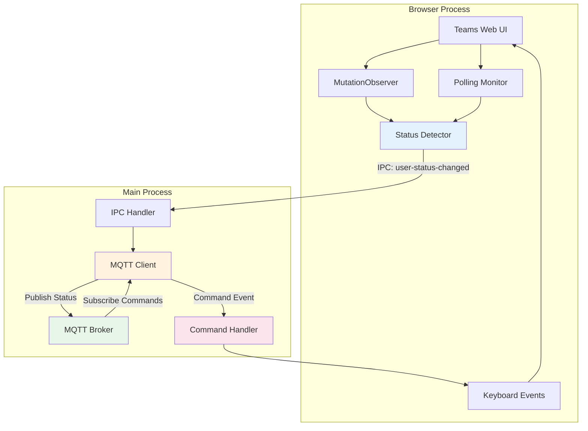

# MQTT Integration

:::info Feature Status
This feature is **disabled by default**. You must explicitly enable it in your configuration.
:::

Teams for Linux includes built-in **bidirectional** MQTT support, allowing you to:
- **Publish** your Microsoft Teams status to an MQTT broker for monitoring and automation
- **Receive** action commands from MQTT to control Teams (toggle mute, video, etc.)

## Overview

The MQTT integration provides two-way communication with your MQTT broker:

### Status Publishing (Outbound)
Automatically detects your Teams presence status (Available, Busy, Do Not Disturb, Away, etc.) and publishes it to a configurable MQTT broker. This enables powerful automation scenarios such as:

- **Smart Home Integration**: Control lights, desk availability indicators, or "on air" signs based on your Teams status
- **Home Assistant Automations**: Trigger scenes, notifications, or device states when you join meetings
- **Status Monitoring**: Track team availability across dashboards and monitoring systems
- **Custom Workflows**: Build Node-RED flows that respond to your Teams presence

### Command Reception (Inbound)
Receive action commands from your MQTT broker to control Teams, enabling scenarios such as:

- **System Keyboard Shortcuts**: Bind global hotkeys (e.g., Super+M) to toggle mute via MQTT
- **Home Automation Actions**: Mute Teams automatically when doorbell rings
- **Stream Deck Integration**: Hardware buttons to control Teams via MQTT
- **Accessibility**: Alternative input methods for users with disabilities

## Features

### Status Publishing Features
- **Real-time Status Updates**: Detects Teams status changes instantly using dual-layer monitoring
- **Robust Detection**: Combines MutationObserver (300ms debounce) with configurable polling fallback
- **Retained Messages**: Last status persists on the broker for new subscribers
- **Deduplication**: Only publishes on actual status changes to prevent MQTT spam

### Command Reception Features
- **Bidirectional Control**: Receive commands from MQTT to control Teams actions
- **Security Validated**: Action whitelist, JSON validation, and rate limiting (2 commands/sec)
- **Multiple Actions**: Toggle mute, video, raise hand
- **Reliable Execution**: Maps commands to Teams keyboard shortcuts

### General Features
- **Automatic Reconnection**: Handles network interruptions gracefully
- **Secure Authentication**: Supports username/password authentication
- **Configurable Topics**: Customize topic structure to match your MQTT namespace

## Quick Start

### 1. Configure MQTT

Create or edit your `config.json` file (see [Configuration Locations](configuration.md#configuration-locations)):

```json
{
  "mqtt": {
    "enabled": true,
    "brokerUrl": "mqtt://192.168.1.100:1883",
    "username": "your-username",
    "password": "your-password",
    "clientId": "teams-for-linux",
    "topicPrefix": "teams",
    "statusTopic": "status",
    "commandTopic": "command",
    "statusCheckInterval": 10000
  }
}
```

### 2. Start Teams for Linux

Launch the application normally. The MQTT client will connect automatically and begin publishing status updates.

### 3. Verify Connection

Use `mosquitto_sub` to verify messages are being published:

```bash
mosquitto_sub -h 192.168.1.100 -t "teams/status" -v
```

You should see JSON messages when your Teams status changes.

## Configuration Options

Add these options under the `mqtt` key in your `config.json`:

| Option | Type | Default | Description |
|--------|------|---------|-------------|
| `enabled` | `boolean` | `false` | Enable/disable MQTT integration (both publishing and commands) |
| `brokerUrl` | `string` | `""` | MQTT broker URL (e.g., `mqtt://broker:1883` or `mqtts://broker:8883` for TLS) |
| `username` | `string` | `""` | MQTT username (optional) |
| `password` | `string` | `""` | MQTT password (optional) |
| `clientId` | `string` | `"teams-for-linux"` | Unique client identifier |
| `topicPrefix` | `string` | `"teams"` | Topic prefix for all messages |
| `statusTopic` | `string` | `"status"` | Topic name for status messages (outbound) |
| `commandTopic` | `string` | `"command"` | Topic name for receiving commands (inbound) |
| `statusCheckInterval` | `number` | `10000` | Polling fallback interval in milliseconds |

### Topic Structure

**Status Publishing (Outbound)**: `{topicPrefix}/{statusTopic}`
- Example: `teams/status`

**Command Reception (Inbound)**: `{topicPrefix}/{commandTopic}`
- Example: `teams/command`

### Broker URL Formats

- **Plain TCP**: `mqtt://broker.example.com:1883`
- **TLS/SSL**: `mqtts://broker.example.com:8883`

:::note WebSocket Support
While the underlying mqtt.js library supports WebSocket URLs (`ws://` and `wss://`), these have not been tested with Teams for Linux. If you successfully use WebSocket connections, please share your experience on [GitHub Issues](https://github.com/IsmaelMartinez/teams-for-linux/issues) or in our [Matrix chat](https://matrix.to/#/#teams-for-linux_community:gitter.im).
:::

## Message Format

Status updates are published as JSON with the following structure:

```json
{
  "status": "busy",
  "statusCode": 2,
  "timestamp": "2025-11-12T14:30:00.000Z",
  "clientId": "teams-for-linux"
}
```

### Fields

- **status** (`string`): Human-readable status name
- **statusCode** (`number`): Numeric status code for easier parsing
- **timestamp** (`string`): ISO 8601 timestamp of the status change
- **clientId** (`string`): Client identifier from configuration

### Status Values

| Status | Code | Description |
|--------|------|-------------|
| `unknown` | `-1` | Status cannot be determined |
| `available` | `1` | Available / Online |
| `busy` | `2` | Busy / In a call |
| `do_not_disturb` | `3` | Do Not Disturb / Presenting |
| `away` | `4` | Away / Idle |
| `be_right_back` | `5` | Be Right Back |

## MQTT Commands

Teams for Linux can receive action commands via MQTT, allowing external systems to trigger Teams actions like toggle mute, toggle video, raise hand, and toggle blur.

### Command Message Format

Send commands as JSON messages to the command topic (`teams/command` by default):

```json
{
  "action": "toggle-mute",
  "timestamp": "2025-11-12T14:30:00.000Z",
  "requestId": "optional-request-id"
}
```

### Supported Actions

| Action | Teams Shortcut | Description |
|--------|---------------|-------------|
| `toggle-mute` | Ctrl+Shift+M | Toggle microphone mute/unmute |
| `toggle-video` | Ctrl+Shift+O | Toggle video on/off |
| `raise-hand` | Ctrl+Shift+K | Raise/lower hand in meeting |

### Sending Commands

#### Using mosquitto_pub

```bash
# Toggle mute
mosquitto_pub -h localhost -t "teams/command" -m '{"action":"toggle-mute"}' -q 1

# Toggle video
mosquitto_pub -h localhost -t "teams/command" -m '{"action":"toggle-video"}' -q 1

# Raise hand
mosquitto_pub -h localhost -t "teams/command" -m '{"action":"raise-hand"}' -q 1
```

#### System Keyboard Shortcuts

Create wrapper scripts to bind global keyboard shortcuts:

**1. Create script** (`~/.local/bin/teams-toggle-mute`):

```bash
#!/bin/bash
mosquitto_pub -h localhost -t "teams/command" -m '{"action":"toggle-mute"}' -q 1
```

**2. Make executable**:

```bash
chmod +x ~/.local/bin/teams-toggle-mute
```

**3. Bind in desktop environment**:

- **GNOME**: Settings → Keyboard → Custom Shortcuts
  - Name: "Toggle Teams Mute"
  - Command: `teams-toggle-mute`
  - Shortcut: `Super+M`

- **KDE Plasma**: System Settings → Shortcuts → Custom Shortcuts
  - Add new custom shortcut → Command
  - Trigger: `Meta+M`

### Command Security

Commands are validated with multiple security measures:

- **Action Whitelist**: Only the three supported actions are allowed
- **JSON Validation**: Commands must be valid JSON
- **Rate Limiting**: Maximum 2 commands per second
- **Localhost Recommended**: For maximum security, use a localhost MQTT broker

:::warning Security Notice
Commands trigger Teams keyboard shortcuts. Only use trusted MQTT brokers and protect your broker credentials. For maximum security, use `mqtt://localhost:1883` with no external network access.
:::

## Home Automation Integration

The MQTT integration has been tested with various home automation platforms. However, specific automation configurations vary based on your setup and requirements.

### Share Your Automations

If you've successfully integrated Teams for Linux with your home automation system, **please share your configurations** to help other users:

- **[GitHub Issues](https://github.com/IsmaelMartinez/teams-for-linux/issues)** - Tag as enhancement and share your automation scripts
- **[Matrix Chat](https://matrix.to/#/#teams-for-linux_community:gitter.im)** - Discuss and share configurations with the community
- **Supported Platforms**: Node-RED, n8n, openHAB, Domoticz, and other MQTT-enabled systems
- **What to Share**:
  - Flow exports for Node-RED/n8n
  - Example use cases (busy lights, notification routing, etc.)
  - Hardware integrations (ESP32, Raspberry Pi projects, etc.)

### Integration Ideas

Common automation scenarios include:
- **Status Lights**: Change LED colors based on availability (red=busy, green=available)
- **Do Not Disturb Signs**: Physical "On Air" signs for home offices
- **Smart Home Scenes**: Adjust lighting, mute speakers during calls
- **Notification Routing**: Silence phone notifications when in meetings
- **Calendar Integration**: Sync status with other calendar systems
- **Dashboards**: Display team availability in Grafana, MQTT Explorer, or custom dashboards

## Testing & Troubleshooting

### Testing with Mosquitto

#### Testing Status Publishing

**1. Start a local broker** (for testing):

```bash
mosquitto -v
```

**2. Subscribe to status topic**:

```bash
mosquitto_sub -h localhost -t "teams/status" -v
```

**3. Change your Teams status** and watch for messages in the subscriber terminal.

#### Testing Command Reception

**1. Ensure Teams for Linux is running with MQTT enabled**

**2. Send test commands**:

```bash
# Test toggle mute
mosquitto_pub -h localhost -t "teams/command" -m '{"action":"toggle-mute"}' -q 1

# Test toggle video
mosquitto_pub -h localhost -t "teams/command" -m '{"action":"toggle-video"}' -q 1
```

**3. Expected behavior**:
- Teams should execute the corresponding keyboard shortcut
- Application logs should show: `[MQTT] Received valid command: <action>`
- Application logs should show: `[MQTT] Executed command '<action>' -> <shortcut>`

### Common Issues

#### No Messages Published

**Symptoms**: MQTT subscriber receives no messages when Teams status changes

**Solutions**:
- Verify `mqtt.enabled` is set to `true` in `config.json`
- Check broker URL, username, and password are correct
- Ensure the broker is reachable from your network
- Check Teams for Linux logs for MQTT connection errors
- Verify your Teams status is actually changing in the Teams web interface

#### Connection Refused

**Symptoms**: "Connection refused" or "ECONNREFUSED" errors in logs

**Solutions**:
- Verify the MQTT broker is running: `netstat -an | grep 1883`
- Check firewall rules allow connections to the broker port
- Test connectivity: `telnet <broker_address> 1883`
- Verify broker URL format (e.g., `mqtt://` not `http://`)

#### Authentication Failed

**Symptoms**: "Not authorized" or authentication errors

**Solutions**:
- Verify username and password are correct
- Check broker ACL (Access Control List) allows publishing to your topic
- Test credentials with `mosquitto_pub`:
  ```bash
  mosquitto_pub -h broker -u username -P password -t test -m "test"
  ```

#### Status Detection Not Working

**Symptoms**: Messages are published but status is always "unknown"

**Solutions**:
- This may occur if Teams UI structure has changed
- Decrease `statusCheckInterval` for more frequent polling: `"statusCheckInterval": 5000`
- Check browser console (DevTools) for JavaScript errors
- Report the issue on [GitHub Issues](https://github.com/IsmaelMartinez/teams-for-linux/issues) with Teams version info

#### Commands Not Working

**Symptoms**: MQTT commands sent but Teams doesn't respond

**Solutions**:
- Verify MQTT is enabled in config (`"enabled": true`)
- Ensure the command topic is correct (`teams/command` by default)
- Check application logs for validation errors
- Verify JSON is valid (use a JSON validator)
- Ensure action is in the whitelist: `toggle-mute`, `toggle-video`, `raise-hand`
- Check spelling and case sensitivity (use lowercase with hyphens)

#### Command Rate Limiting

**Symptoms**: Some commands are ignored

**Solutions**:
- Commands are limited to 2 per second
- Wait at least 500ms between commands
- Check logs for "rate limit exceeded" messages

#### Window Not Available Error

**Symptoms**: Logs show "window not available" when sending commands

**Solutions**:
- Ensure Teams for Linux window is open
- The application must be running for commands to work
- Check that the window is not destroyed or minimized to tray

### Debug Logging

Enable debug logging to see detailed MQTT activity:

```bash
ELECTRON_ENABLE_LOGGING=true teams-for-linux
```

For more logging options, see the **[Troubleshooting Guide](troubleshooting.md)**.

Check logs for MQTT-related messages:
- Connection attempts and results
- Status change detections
- Publish confirmations
- Error details

## Security Considerations

:::warning Important
You should take extra care when sharing your status with other systems, especially externally. Monitor your MQTT subscribers, protect your passwords, rotate credentials regularly, isolate your local network from the Internet, and follow other security best practices.

**We cannot take responsibility for any misuse of this feature or the application** as stated in our [LICENSE.md](https://github.com/IsmaelMartinez/teams-for-linux/blob/master/LICENSE.md) file.
:::

### Basic Security Practices

- **Use Authentication**: Always configure username/password for your MQTT broker
- **Enable TLS**: Use `mqtts://` URLs for encrypted connections when possible
- **Protect Credentials**: Passwords in `config.json` are stored in plain text - use appropriate file permissions (`chmod 600`)
- **Monitor Access**: Regularly review who has access to your MQTT broker and topics

## Architecture Details

### How It Works

The MQTT integration uses a **bidirectional** multi-layer architecture for both status publishing and command reception:



**Status Publishing Flow** (Outbound):
1. Teams Web UI status changes → MutationObserver/Polling Monitor detects → Status Detector → IPC to Main Process → MQTT Client publishes to broker

**Command Reception Flow** (Inbound):
1. External system (mosquitto_pub, automation systems, etc.) → MQTT Broker → MQTT Client subscribes → Command validation → Command Handler → Keyboard Events sent to Teams Web UI

### Status Detection Strategy

The implementation uses a **dual-layer detection approach** for maximum reliability:

#### 1. MutationObserver (Primary)

- Watches for real-time DOM changes in the Teams interface
- Monitors status-related attributes: `class`, `aria-label`, `title`, `data-testid`
- 300ms debouncing prevents excessive checks during UI animations
- Provides instant updates when Teams status changes
- Location: `app/browser/tools/mqttStatusMonitor.js`

#### 2. Polling (Fallback)

- Periodic checks ensure status is detected even if DOM events are missed
- Default interval: 10 seconds (configurable via `statusCheckInterval`)
- Handles cases where MutationObserver might not fire
- Provides redundancy for UI structure changes

#### 3. Multiple Selector Strategies

The status detector tries multiple CSS selector patterns to locate status information, making it resilient to Teams UI updates:

- Profile button status attributes
- Avatar status indicators
- Presence badges
- ARIA labels and accessibility attributes

### IPC Communication

#### Status Publishing
Status changes flow from browser to main process:

1. **Browser-side**: `mqttStatusMonitor.js` detects status change
2. **IPC Channel**: Sends message via `user-status-changed` channel
3. **Main Process**: `app/index.js` receives status and forwards to MQTT client
4. **MQTT Client**: `app/mqtt/index.js` publishes to broker

### Command Processing Strategy

Commands are validated with multiple security layers:

#### 1. MQTT Subscription
- **Location**: `app/mqtt/index.js`
- Subscribes to `{topicPrefix}/{commandTopic}` on broker connection
- Receives messages from external systems

#### 2. Message Validation
- **JSON Parsing**: Validates message is valid JSON
- **Structure Check**: Ensures `action` field exists and is a string
- **Action Whitelist**: Only allows: `toggle-mute`, `toggle-video`, `raise-hand`
- **Rate Limiting**: Maximum 2 commands per second

#### 3. Command Execution
- **Location**: `app/index.js` command handler
- Maps action to Teams keyboard shortcut:
  - `toggle-mute` → Ctrl+Shift+M
  - `toggle-video` → Ctrl+Shift+O
  - `raise-hand` → Ctrl+Shift+K
- Sends keyboard events to Teams window via `sendKeyboardEventToWindow`
- **Location**: `app/globalShortcuts/index.js` for keyboard event generation

### Message Lifecycle

#### Status Publishing
1. Status change detected in browser process
2. Deduplicated (only publish if different from last status)
3. Sent via IPC to main process
4. Published to MQTT broker with QoS 1 and retain flag
5. Broker distributes to all subscribers
6. Message persists for new subscribers (retain flag)

#### Command Reception
1. External system publishes command to MQTT broker
2. MQTT Client receives message on command topic
3. Command validation (JSON, whitelist, rate limit)
4. MQTTClient emits 'command' event to main process
5. Command handler maps action to keyboard shortcut
6. Keyboard event sent to Teams window
7. Teams executes the action


## Related Documentation

- **[Configuration Guide](configuration.md)** - Complete configuration options
- **[Multiple Instances](multiple-instances.md)** - Running work/personal profiles
- **[IPC API Reference](development/ipc-api.md)** - Inter-process communication details
- **[Troubleshooting](troubleshooting.md)** - Common issues and solutions

## References

- [MQTT.org](https://mqtt.org/) - MQTT protocol specification
- [Mosquitto](https://mosquitto.org/) - Popular open-source MQTT broker
