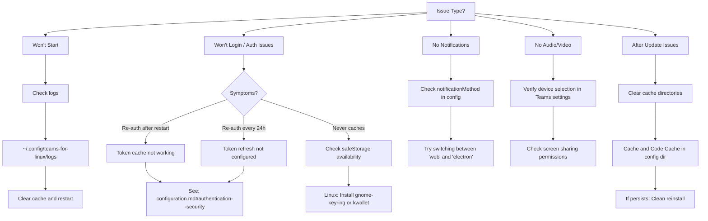

# Quick Reference

Fast access to the most commonly used commands, configurations, and troubleshooting steps for Teams for Linux.

## Essential Commands

| Task | Command | When to Use |
|------|---------|-------------|
| **Development mode** | `npm start` | Development and testing with trace warnings |
| **Lint (required)** | `npm run lint` | Before every commit - mandatory validation |
| **E2E tests** | `npm run test:e2e` | Before pull requests and major changes |
| **Build Linux packages** | `npm run dist:linux` | Creating AppImage, deb, rpm, snap packages |
| **Development pack** | `npm run pack` | Quick build without packaging (faster) |
| **Generate IPC docs** | `npm run generate-ipc-docs` | After adding/modifying IPC channels |
| **Generate release info** | `npm run generate-release-info` | Creating release information file |

### Specialized Build Commands

| Platform | Command | Output |
|----------|---------|--------|
| **Linux (all formats)** | `npm run dist:linux` | AppImage, deb, rpm, snap |
| **Linux (deb only)** | `npm run dist:linux:deb` | Debian packages |
| **Linux (rpm only)** | `npm run dist:linux:rpm` | RedHat packages |
| **Linux (AppImage only)** | `npm run dist:linux:appimage` | AppImage portable |
| **macOS (Intel)** | `npm run dist:mac:x64` | macOS x64 build |
| **macOS (Apple Silicon)** | `npm run dist:mac:arm64` | macOS ARM64 build |
| **Windows** | `npm run dist:windows` | Windows installer |

## Common Configuration Snippets

### Enable MQTT Integration

Add to your `config.json` ([location guide](configuration.md#configuration-locations)):

```json
{
  "mqtt": {
    "enabled": true,
    "brokerUrl": "mqtt://192.168.1.100:1883",
    "username": "your-username",
    "password": "your-password",
    "topicPrefix": "teams",
    "statusTopic": "status"
  }
}
```

**→** [Full MQTT documentation](mqtt-integration.md)

### Configure Multiple Instances (Work + Personal)

Run separate profiles with isolated sessions:

```bash
# Work profile
teams-for-linux \
  --appIcon=/path/to/work-icon.png \
  --class=teams-work \
  --user-data-dir=~/.config/teams-profile-work

# Personal profile
teams-for-linux \
  --appIcon=/path/to/personal-icon.png \
  --class=teams-personal \
  --user-data-dir=~/.config/teams-profile-personal
```

**→** [Full multiple instances guide](multiple-instances.md)

### Enable Custom CSS Themes

```json
{
  "customCSSName": "compactDark"
}
```

**Available themes:** `compactDark`, `compactLight`, `tweaks`, `condensedDark`, `condensedLight`

**→** [Full configuration reference](configuration.md)

### Disable Notifications Temporarily

```json
{
  "disableNotifications": true
}
```

**→** [Notification configuration](configuration.md#notifications--ui)

## Troubleshooting Decision Tree



## Quick Troubleshooting

| Problem | Quick Solution | Detailed Guide |
|---------|---------------|----------------|
| **App won't start** | Check logs: `~/.config/teams-for-linux/logs` | [Troubleshooting](troubleshooting.md#installation-and-updates) |
| **Login issues** | Clear cache: `rm -rf ~/.config/teams-for-linux/Cache` | [Troubleshooting](troubleshooting.md#installation-and-updates) |
| **No history after update** | Remove stored data in config directory | [Troubleshooting](troubleshooting.md#installation-and-updates) |
| **No notifications** | Check `notificationMethod` config (try `web` or `electron`) | [Troubleshooting](troubleshooting.md#common-issues-and-solutions) |
| **Screen sharing issues** | Verify permissions and check Wayland compatibility | [Screen Sharing Guide](screen-sharing.md) |

## Configuration File Locations

| Install Type | Config Path | Clean-up Command |
|--------------|-------------|------------------|
| **Vanilla** | `~/.config/teams-for-linux/` | `rm -rf ~/.config/teams-for-linux` |
| **Snap** | `~/snap/teams-for-linux/current/.config/teams-for-linux/` | `rm -rf ~/snap/teams-for-linux/current/.config/teams-for-linux/` |
| **Flatpak** | `~/.var/app/com.github.IsmaelMartinez.teams_for_linux/config/teams-for-linux/` | `rm -rf ~/.var/app/com.github.IsmaelMartinez.teams_for_linux/config/teams-for-linux/` |
| **From source** | `~/.config/Electron/` | `rm -rf ~/.config/Electron/` |

## Development Quick Start

### First Time Setup

```bash
# Clone and install
git clone https://github.com/IsmaelMartinez/teams-for-linux.git
cd teams-for-linux
npm ci

# Run in development mode
npm start
```

### Before Committing

```bash
# Always run lint (mandatory)
npm run lint

# Run E2E tests
npm run test:e2e

# If you modified IPC channels
npm run generate-ipc-docs
```

**→** [Full contributing guide](development/contributing.md)

## Useful Paths & Resources

| Resource | Location/Link |
|----------|---------------|
| **Application logs** | `~/.config/teams-for-linux/logs/` |
| **Config file** | `~/.config/teams-for-linux/config.json` |
| **Source code** | [GitHub Repository](https://github.com/IsmaelMartinez/teams-for-linux) |
| **Report issues** | [GitHub Issues](https://github.com/IsmaelMartinez/teams-for-linux/issues) |
| **Discussions** | [GitHub Discussions](https://github.com/IsmaelMartinez/teams-for-linux/discussions) |
| **Documentation site** | [https://ismaelmartinez.github.io/teams-for-linux/](https://ismaelmartinez.github.io/teams-for-linux/) |

## Need More Help?

- **Full Configuration Options:** [Configuration Reference](configuration.md)
- **Installation Issues:** [Troubleshooting Guide](troubleshooting.md)
- **Development Setup:** [Contributing Guide](development/contributing.md)
- **Architecture:** [Module Index](development/module-index.md)
- **Decisions & History:** [ADR Index](development/adr/README.md)
