# Release Automation

Technical documentation on the automated release process and info generation.

## Overview

The release info integration automatically:

1. **Validates version consistency** across `package.json`, `package-lock.json`, and `com.github.IsmaelMartinez.teams_for_linux.appdata.xml`
2. **Extracts release notes** from the `com.github.IsmaelMartinez.teams_for_linux.appdata.xml` file
3. **Generates a `release-info.json`** file conforming to [electron-builder's ReleaseInfo interface](https://www.electron.build/app-builder-lib.interface.releaseinfo)
4. **Makes release info available** for Linux publishing to GitHub

## How It Works

### Build Process Integration

```mermaid
graph LR
    A[Start Build] --> B[Pre-build Hook]
    B --> C[Generate Release Info]
    C --> D[Version Validation]
    D --> E[Extract Release Notes]
    E --> F[Create release-info.json]
    F --> G[Continue Build Process]
    G --> H[After Pack Hook]
    H --> I[Bundle Release Info]
    I --> J[Publish to GitHub]
```



1. **Pre-build**: The `prebuild` npm script runs `generate-release-info` before any build
2. **After Pack**: The `afterPack` hook in electron-builder generates fresh release info for Linux builds
3. **Publishing**: The `release-info.json` file is referenced by electron-builder's `releaseNotesFile` setting for Linux publishing to GitHub

### Generated Files

- **`release-info.json`** (project root): Used for Linux publishing process

## Usage

### NPM Scripts

```bash
# Generate release info manually
npm run generate-release-info

# Build with automatic release info generation
npm run pack
npm run dist
```

### Essential Commands

:::tip Quick Reference
- `npm run generate-release-info` - Generate release information manually
- `npm run pack` - Development build with automatic release info generation
- `npm run dist` - Production build with publishing support
:::

## File Structure

```
project/
├── package.json                           # Contains version and build config
├── package-lock.json                      # Version consistency check
├── com.github.IsmaelMartinez.teams_for_linux.appdata.xml  # Source of release notes
├── release-info.json                      # Generated release info (dev)
├── scripts/
│   ├── generateReleaseInfo.js             # Release info generator
│   └── afterpack.js                       # Build hook integration
```

## Configuration

### electron-builder Configuration (package.json)

```json
{
  "build": {
    "linux": {
      "publish": {
        "provider": "github",
        "releaseType": "draft",
        "releaseInfo": {
          "releaseNotesFile": "release-info.json"
        }
      }
    },
    "afterPack": "scripts/afterpack.js"
  }
}
```

### NPM Scripts (package.json)

```json
{
  "scripts": {
    "generate-release-info": "node scripts/generateReleaseInfo.js",
    "prebuild": "npm run generate-release-info"
  }
}
```

## Release Info Schema

The generated `release-info.json` follows electron-builder's ReleaseInfo interface:

```json
{
  "releaseName": "2.0.16",
  "releaseNotes": "• Added feature A\n• Fixed bug B\n• Improved performance C",
  "releaseDate": "2025-06-05"
}
```

### Properties

| Property | Source | Description |
|----------|--------|-------------|
| `releaseName` | `package.json` | Current version number |
| `releaseNotes` | `appdata.xml` | Release notes from `<description>` section |
| `releaseDate` | `appdata.xml` | Release date from `date` attribute |

## Release Workflow

### Adding Release Notes

To add release notes for a new version:

1. **Update version** in `package.json`
2. **Update lock file** by running `npm install` to update `package-lock.json`
3. **Add release entry** in `com.github.IsmaelMartinez.teams_for_linux.appdata.xml`:

```xml
<release version="2.0.17" date="2025-06-15">
  <description>
    <ul>
      <li>New feature description</li>
      <li>Bug fix description</li>
      <li>Performance improvement</li>
    </ul>
  </description>
</release>
```

4. **Build automatically** - The release info will be generated during the next build

### Release Checklist

- [ ] Version updated in `package.json`
- [ ] `package-lock.json` updated via `npm install`
- [ ] Release entry added to `appdata.xml`
- [ ] Release notes describe all significant changes
- [ ] Version consistency validated
- [ ] Build and test locally before publishing

## Error Handling

The system performs validation and provides helpful error messages:

:::danger Common Errors
- **Version Mismatch**: If `package.json` and `package-lock.json` versions don't match
- **Missing Release Entry**: If no release entry exists for the current version in `appdata.xml`
- **Empty Release Notes**: If the release entry has no description
- **Missing Files**: If any required file is not found
:::

### Troubleshooting Steps

1. **Check version consistency** across all three files
2. **Validate XML syntax** in the appdata file
3. **Ensure release entry exists** for the current version
4. **Verify file permissions** for script execution

## Examples

### Manual Generation

```bash
cd /path/to/teams-for-linux
npm run generate-release-info
```

**Successful Output:**

```
✅ Version consistency check passed!
   package.json: 2.0.16
   package-lock.json: 2.0.16
   com.github.IsmaelMartinez.teams_for_linux.appdata.xml: 2.0.16 (with release notes)

📋 Generated Release Info (electron-builder ReleaseInfo interface):

{
  "releaseName": "2.0.16",
  "releaseNotes": "• Added a reimplementation of the call events to revive the incoming call scripts\n• Added an incoming call toast just like the one from the discontinued Linux Teams App from Microsoft",
  "releaseDate": "2025-06-05"
}

💾 Release info saved to: /path/to/teams-for-linux/release-info.json
```

### Build Integration

```bash
npm run pack  # Automatically runs prebuild and afterPack hooks
```

The release info will be automatically generated and bundled with the application.

### CI/CD Integration

For automated releases in GitHub Actions:

```yaml
- name: Generate Release Info
  run: npm run generate-release-info

- name: Build Application
  run: npm run dist

- name: Publish Release
  run: npm run publish
```

## Advanced Configuration

### Custom Release Notes Format

You can customize the release notes extraction by modifying the `generateReleaseInfo.js` script to:

- Change formatting (HTML to Markdown conversion)
- Add additional metadata
- Include commit information
- Generate changelogs from git history

### Multi-Platform Releases

For cross-platform releases, ensure:

- Version consistency across all platforms
- Platform-specific release notes if needed
- Proper artifact naming and organization

## Related Documentation

- [Configuration Options](configuration.md) - Application configuration reference
- [IPC API](ipc-api.md) - Integration with application features