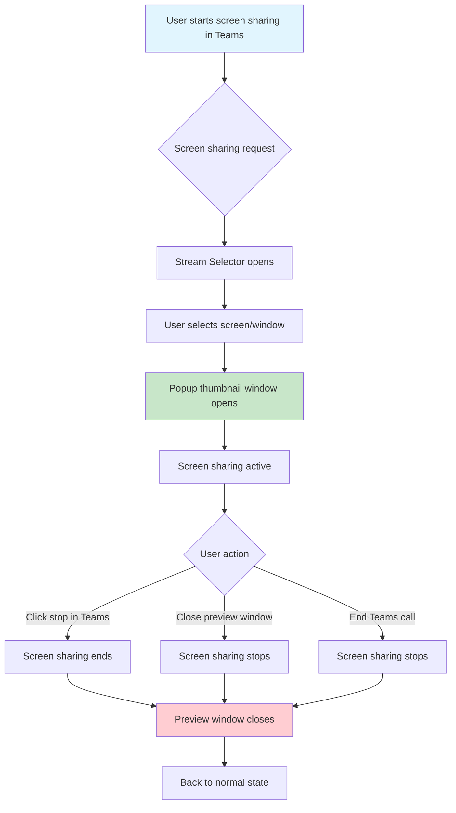

# Screen Sharing in Teams for Linux

Teams for Linux provides robust screen sharing capabilities that integrate seamlessly with the Microsoft Teams web interface while maintaining the security benefits of Electron's contextIsolation and sandbox features.

## How It Works

### User Experience Flow



### What You'll See

1. **Stream Selector Window**: When you start screen sharing, a selection dialog appears showing:
   - Available screens (monitors)
   - Open application windows
   - Preview thumbnails of each option

2. **Preview Window**: Once sharing begins, a small floating window appears showing:
   - Live preview of what you're sharing
   - Always stays on top (configurable)
   - Resizable but maintains aspect ratio
   - Can be manually closed to stop sharing

## Configuration

### Screen Sharing Thumbnail Settings

```json
{
  "screenSharingThumbnail": {
    "enabled": true,
    "alwaysOnTop": true
  }
}
```

| Option | Type | Default | Description |
|--------|------|---------|-------------|
| `enabled` | `boolean` | `true` | Enable/disable the preview thumbnail window |
| `alwaysOnTop` | `boolean` | `true` | Keep preview window always on top of other windows |

### Disabling Screen Sharing Preview

To disable the preview window entirely:

```json
{
  "screenSharingThumbnail": {
    "enabled": false
  }
}
```

## Troubleshooting

### Common Issues

#### Preview Window Not Appearing
- **Check configuration**: Ensure `screenSharingThumbnail.enabled` is `true`
- **Window manager**: Some Linux window managers may interfere with always-on-top windows
- **Restart**: Try restarting Teams for Linux

#### Screen Selection Dialog Not Showing
- **Permissions**: Check if Teams for Linux has screen capture permissions
- **Wayland**: On Wayland, ensure proper screen sharing portal is configured
- **X11**: Verify X11 screen capture is working

#### Poor Performance During Screen Sharing
- **Resolution**: Lower the shared screen resolution if possible
- **Disable GPU acceleration**: Try `--disable-gpu` flag if experiencing issues
- **System resources**: Close unnecessary applications

### Platform-Specific Notes

#### Linux (X11)
- Works out of the box with X11
- No additional permissions required
- Full screen and window sharing supported

#### Linux (Wayland)
- Requires xdg-desktop-portal-wlr or similar
- May need additional portal configuration
- Some window managers have better support than others

#### macOS
- Requires screen recording permissions
- System will prompt for permission on first use
- May need to add Teams for Linux to Security & Privacy settings

#### Windows
- No additional configuration required
- Works with multiple monitors
- Supports window and screen sharing

## Advanced Configuration

### Custom Stream Selection

Teams for Linux automatically detects available screens and windows. The selection is handled by Electron's `desktopCapturer` API, which provides:

- **Screen sources**: Each connected monitor
- **Window sources**: All visible application windows
- **Thumbnail previews**: Small preview images for easy identification

### Integration with Teams Web

The screen sharing feature integrates directly with Microsoft Teams' web interface by:

1. **Intercepting capture requests**: When Teams requests screen sharing access
2. **Providing stream sources**: Electron's desktop capturer provides available sources
3. **Managing stream lifecycle**: Automatic cleanup when sharing ends

### Security Considerations

:::warning Privacy Notice
Screen sharing in Teams for Linux follows the same security model as Microsoft Teams:
- Only selected screens/windows are shared
- No additional system access is granted
- Screen sharing can be stopped at any time
- Preview window shows exactly what's being shared
:::

## Development Information

### IPC Integration

Screen sharing uses several IPC channels for communication between the main and renderer processes:

- `get-desktop-capturer-sources`: Retrieves available capture sources
- `screen-sharing-started`: Notifies when sharing begins
- `screen-sharing-stopped`: Notifies when sharing ends

For detailed IPC documentation, see [IPC API Reference](ipc-api.md).

### Code Organization

```
app/
├── screenSharing/           # Main screen sharing logic
├── streamSelector/          # Source selection dialog
└── browser/tools/          # Renderer-side integration
```

## Best Practices

### For Users
1. **Test before important meetings**: Verify screen sharing works in a test call
2. **Close sensitive applications**: Before sharing your entire screen
3. **Use window sharing**: When possible, share specific windows instead of full screen
4. **Monitor the preview**: Keep an eye on the preview window to see what's being shared

### For Developers
1. **Handle errors gracefully**: Screen capture can fail for various reasons
2. **Respect user privacy**: Always show what's being captured
3. **Clean up resources**: Properly dispose of media streams
4. **Test across platforms**: Screen sharing behavior varies by OS

## Related Documentation

- [Configuration Options](configuration.md) - General application configuration
- [IPC API Reference](ipc-api.md) - Inter-process communication details
- [Troubleshooting](troubleshooting.md) - General troubleshooting guide