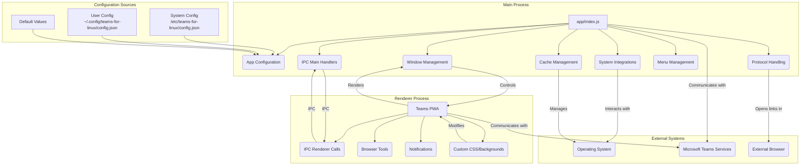

# Teams for Linux Documentation

This directory contains documentation for Teams for Linux, organized for both users and developers.

## User Documentation

### Getting Started
- **[Configuration Guide](configuration.md)** - Complete configuration options and settings
- **[Troubleshooting Guide](knowledge-base.md)** - Common issues and solutions
- **[Multiple Instances](multiple-instances.md)** - Running separate profiles (work/personal)

### Features
- **[Custom Backgrounds](custom-backgrounds.md)** - Setting up custom video call backgrounds
- **[Certificate Management](certificate.md)** - Custom CA certificate handling
- **[Logging Configuration](log-config.md)** - Customizing application logging

## Developer Documentation
- **[IPC API Reference](ipc-api.md)** - Inter-process communication channels
- **[AI Research](ai-research/)** - Strategic analysis and research documents

## Architecture Overview

## Quick Start

1. **Basic Usage**: Launch with `teams-for-linux`
2. **Configuration**: Create `~/.config/teams-for-linux/config.json` with your settings
3. **Troubleshooting**: Check the [Troubleshooting Guide](knowledge-base.md) for common issues
4. **Multiple Profiles**: Use `--user-data-dir` and `--class` flags for separate instances

## Getting Help

- Review the troubleshooting guide for common issues
- Check configuration options for customization needs
- For development questions, see the IPC API documentation
- Report bugs at https://github.com/IsmaelMartinez/teams-for-linux/issues