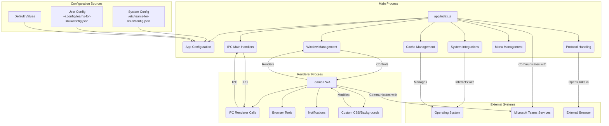

```mermaid
graph TD
    subgraph Main Process
        A[app/index.js] --> B(App Configuration)
        A --> C(IPC Main Handlers)
        A --> D(Window Management)
        A --> E(System Integrations)
        A --> F(Cache Management)
        A --> G(Menu Management)
        A --> H(Protocol Handling)
    end

    subgraph Configuration Sources
        Q[System Config<br>/etc/teams-for-linux/config.json]
        R[User Config<br>~/.config/teams-for-linux/config.json]
        S[Default Values]
    end

    subgraph Renderer Process
        I[Teams PWA] --> J(IPC Renderer Calls)
        I --> K(Browser Tools)
        I --> L(Notifications)
        I --> M(Custom CSS/Backgrounds)
    end

    subgraph External Systems
        N(Operating System)
        O(Microsoft Teams Services)
        P(External Browser)
    end

    Q --> B
    R --> B
    S --> B

    C -- IPC --> J
    J -- IPC --> C

    D -- Controls --> I
    I -- Renders --> D

    E -- Interacts with --> N
    H -- Opens links in --> P

    I -- Communicates with --> O
    A -- Communicates with --> O

    F -- Manages --> N
    M -- Modifies --> I
```