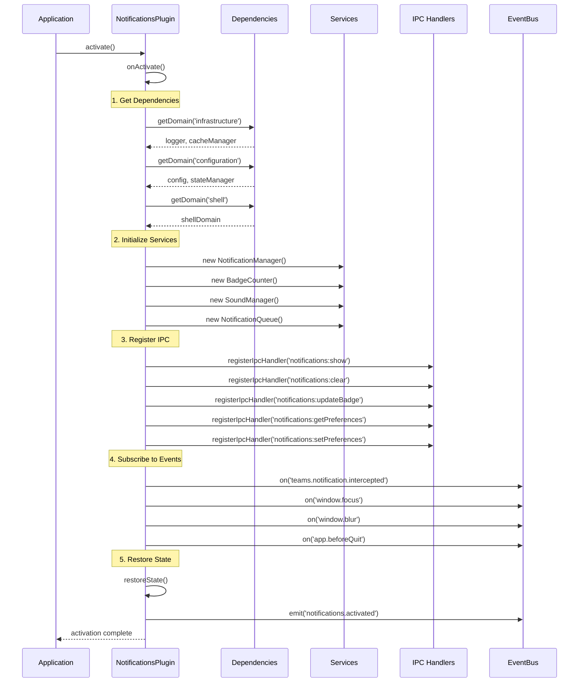
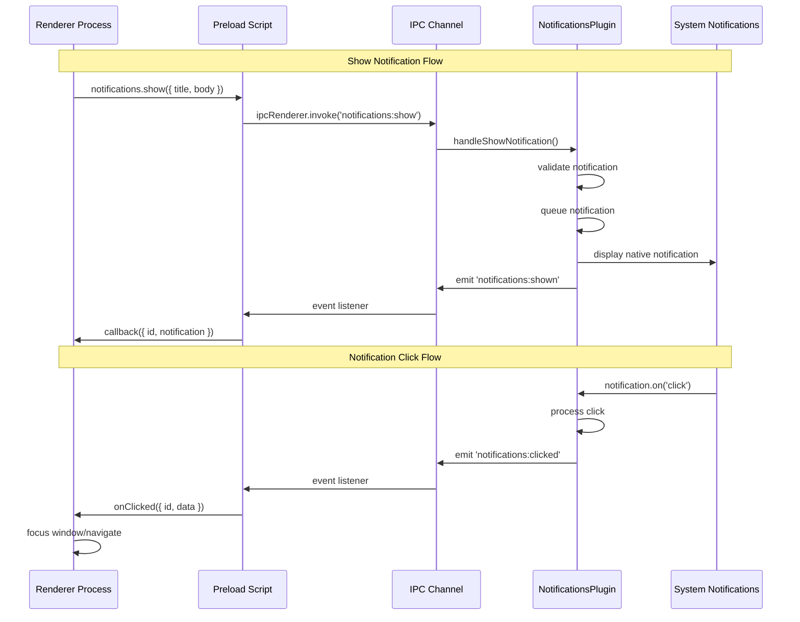
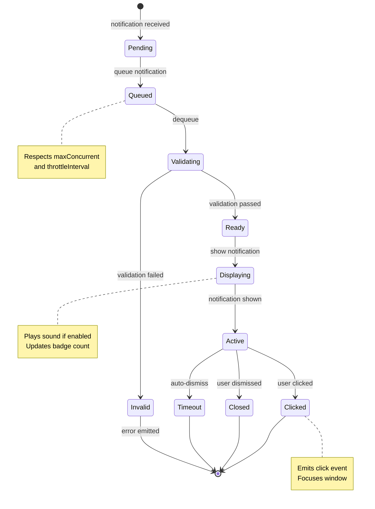
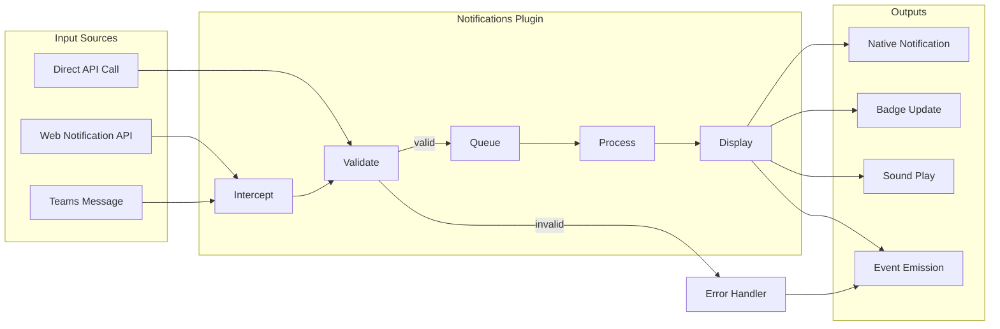

# Notifications Plugin Architecture Design - Phase 6

## Executive Summary

This document defines the architecture for the Notifications Plugin as part of Phase 6 of the Teams for Linux v3.0 modernization. The plugin will extract notification handling from the TeamsIntegrationDomain into a standalone, reusable plugin that manages system notifications, badge counts, and notification preferences.

**Status**: Design Phase
**Target**: Phase 6 - Feature Extraction
**Dependencies**: Infrastructure Domain, Configuration Domain, Shell Domain

---

## 1. Plugin Structure

### 1.1 Directory Layout

```
app/plugins/core/notifications/
├── index.js                      # Main plugin entry point (main process)
├── preload.js                    # Preload script for renderer process
├── manifest.json                 # Plugin manifest with metadata
├── services/
│   ├── NotificationManager.js    # Core notification management
│   ├── BadgeCounter.js           # Badge count tracking
│   ├── SoundManager.js           # Notification sound handling
│   └── NotificationQueue.js      # Notification queueing and throttling
├── models/
│   └── Notification.js           # Notification data model
├── utils/
│   └── NotificationValidator.js  # Input validation
└── README.md                     # Plugin documentation
```

### 1.2 Manifest Schema (`manifest.json`)

```json
{
  "id": "notifications",
  "name": "Notifications Plugin",
  "version": "1.0.0",
  "description": "System notifications, badge counts, and notification preferences management",
  "author": "Teams for Linux",
  "type": "core",
  "main": "index.js",
  "preload": "preload.js",

  "permissions": [
    "events:subscribe",
    "events:emit",
    "config:read",
    "config:write",
    "logging",
    "ipc:register"
  ],

  "dependencies": [
    "infrastructure",
    "configuration",
    "shell"
  ],

  "provides": [
    "notification.show",
    "notification.clear",
    "notification.updateBadge",
    "notification.setPreferences"
  ],

  "events": {
    "subscribes": [
      "teams.notification.intercepted",
      "window.focus",
      "window.blur",
      "app.beforeQuit"
    ],
    "emits": [
      "notification.shown",
      "notification.clicked",
      "notification.closed",
      "notification.failed",
      "notification.badge.updated",
      "notification.sound.played",
      "notification.preferences.changed"
    ]
  },

  "configuration": {
    "schema": {
      "soundEnabled": {
        "type": "boolean",
        "default": true,
        "description": "Enable notification sounds"
      },
      "showInTaskbar": {
        "type": "boolean",
        "default": true,
        "description": "Show badge count in taskbar"
      },
      "maxConcurrent": {
        "type": "number",
        "default": 3,
        "description": "Maximum concurrent notifications"
      },
      "throttleInterval": {
        "type": "number",
        "default": 1000,
        "description": "Minimum time between notifications (ms)"
      },
      "urgencyLevel": {
        "type": "string",
        "enum": ["low", "normal", "critical"],
        "default": "normal",
        "description": "Default notification urgency"
      }
    }
  }
}
```

### 1.3 Main Process (`index.js`)

```javascript
const BasePlugin = require('../../../plugins/BasePlugin');

/**
 * NotificationsPlugin - System notifications and badge management
 *
 * Responsibilities:
 * - Native system notification display
 * - Badge count management and taskbar updates
 * - Notification sound handling
 * - Notification queueing and throttling
 * - User preference management
 * - IPC bridge for renderer process
 */
class NotificationsPlugin extends BasePlugin {
  constructor(id, manifest, api) {
    super(id, manifest, api);

    // Service instances
    this._notificationManager = null;
    this._badgeCounter = null;
    this._soundManager = null;
    this._notificationQueue = null;

    // Dependencies
    this._logger = null;
    this._config = null;
    this._stateManager = null;
    this._shellDomain = null;

    // IPC handlers registry
    this._ipcHandlers = new Map();
  }

  /**
   * Lifecycle: Activate plugin
   */
  async onActivate() {
    this._logger = this._getDependency('infrastructure').getLogger().child('notifications');
    this._logger.info('Notifications Plugin activating...');

    // Get dependencies
    this._config = this._getDependency('configuration').getAppConfiguration();
    this._stateManager = this._getDependency('configuration').getStateManager();
    this._shellDomain = this._getDependency('shell');

    // Initialize services
    await this._initializeServices();

    // Register IPC handlers
    this._registerIpcHandlers();

    // Subscribe to events
    this._subscribeToEvents();

    // Restore state
    await this._restoreState();

    this.api.emit('notifications.activated', {
      services: this._getServiceStatus(),
      preferences: this._getPreferences()
    });

    this._logger.info('Notifications Plugin activated successfully');
  }

  /**
   * Lifecycle: Deactivate plugin
   */
  async onDeactivate() {
    this._logger.info('Notifications Plugin deactivating...');

    // Save state
    await this._saveState();

    // Unsubscribe from events
    this._unsubscribeFromEvents();

    // Unregister IPC handlers
    this._unregisterIpcHandlers();

    // Clear all notifications
    if (this._notificationManager) {
      this._notificationManager.clearAll();
    }

    this.api.emit('notifications.deactivated');
    this._logger.info('Notifications Plugin deactivated successfully');
  }

  /**
   * Lifecycle: Destroy plugin
   */
  async onDestroy() {
    this._logger.info('Notifications Plugin cleaning up...');

    // Destroy services
    if (this._notificationManager) {
      this._notificationManager.destroy();
    }
    if (this._soundManager) {
      this._soundManager.destroy();
    }
    if (this._notificationQueue) {
      this._notificationQueue.destroy();
    }

    // Clear references
    this._notificationManager = null;
    this._badgeCounter = null;
    this._soundManager = null;
    this._notificationQueue = null;
    this._logger = null;
    this._config = null;
    this._stateManager = null;
    this._shellDomain = null;

    this._logger.info('Notifications Plugin destroyed');
  }

  // ... implementation details in full code
}

module.exports = NotificationsPlugin;
```

### 1.4 Preload Script (`preload.js`)

```javascript
const { contextBridge, ipcRenderer } = require('electron');

/**
 * Preload script for Notifications Plugin
 * Exposes secure IPC bridge to renderer process
 */

// Notification API for renderer process
const notificationsAPI = {
  /**
   * Show a notification
   */
  show: (notification) => {
    return ipcRenderer.invoke('notifications:show', notification);
  },

  /**
   * Clear a specific notification
   */
  clear: (notificationId) => {
    return ipcRenderer.invoke('notifications:clear', notificationId);
  },

  /**
   * Clear all notifications
   */
  clearAll: () => {
    return ipcRenderer.invoke('notifications:clearAll');
  },

  /**
   * Update badge count
   */
  updateBadge: (count) => {
    return ipcRenderer.invoke('notifications:updateBadge', count);
  },

  /**
   * Get current preferences
   */
  getPreferences: () => {
    return ipcRenderer.invoke('notifications:getPreferences');
  },

  /**
   * Update preferences
   */
  setPreferences: (preferences) => {
    return ipcRenderer.invoke('notifications:setPreferences', preferences);
  },

  /**
   * Subscribe to notification events
   */
  onShown: (callback) => {
    ipcRenderer.on('notifications:shown', (event, data) => callback(data));
  },

  onClicked: (callback) => {
    ipcRenderer.on('notifications:clicked', (event, data) => callback(data));
  },

  onClosed: (callback) => {
    ipcRenderer.on('notifications:closed', (event, data) => callback(data));
  },

  onBadgeUpdated: (callback) => {
    ipcRenderer.on('notifications:badge-updated', (event, data) => callback(data));
  },

  /**
   * Remove event listener
   */
  removeListener: (channel, callback) => {
    ipcRenderer.removeListener(channel, callback);
  }
};

// Expose to renderer process
contextBridge.exposeInMainWorld('notifications', notificationsAPI);
```

---

## 2. API Surface

### 2.1 PluginAPI Methods Required

The plugin requires these PluginAPI capabilities:

```javascript
// Event subscription (requires 'events:subscribe' permission)
this.api.on(eventName, handler);

// Event emission (requires 'events:emit' permission)
this.api.emit(eventName, data);

// Configuration access (requires 'config:read' permission)
this.api.getConfig(key);

// Configuration modification (requires 'config:write' permission)
this.api.setConfig(key, value);

// Logging (requires 'logging' permission)
this.api.log(level, message, data);

// Domain access (implicit permission based on dependencies)
this.api.getDomain(domainId);

// IPC registration (requires 'ipc:register' permission)
this.api.registerIpcHandler(channel, handler);
this.api.unregisterIpcHandler(channel);
```

### 2.2 EventBus Events

#### Events Plugin Subscribes To:

```javascript
// From TeamsIntegrationDomain (or web content)
'teams.notification.intercepted' - {
  title: string,
  body: string,
  icon?: string,
  tag?: string,
  data?: object
}

// From Shell Domain
'window.focus' - { windowId: string }
'window.blur' - { windowId: string }

// From Application
'app.beforeQuit' - { }

// From Configuration Domain
'configuration.changed' - { keyPath: string, value: any }
```

#### Events Plugin Emits:

```javascript
// Plugin lifecycle
'notifications.activated' - { services: object, preferences: object }
'notifications.deactivated' - { }

// Notification events
'notification.shown' - { id: string, notification: object }
'notification.clicked' - { id: string, data: object }
'notification.closed' - { id: string, reason: string }
'notification.failed' - { id: string, error: string }

// Badge events
'notification.badge.updated' - { count: number }

// Sound events
'notification.sound.played' - { soundId: string }

// Preference events
'notification.preferences.changed' - { preferences: object }
```

### 2.3 StateManager Integration

```javascript
// Custom state keys used by plugin
stateManager.setCustomState('notifications.badgeCount', count);
stateManager.getCustomState('notifications.badgeCount', 0);

stateManager.setCustomState('notifications.queue', queueSnapshot);
stateManager.getCustomState('notifications.queue', []);

stateManager.setCustomState('notifications.preferences', preferences);
stateManager.getCustomState('notifications.preferences', defaults);
```

### 2.4 Infrastructure Domain Services

```javascript
// Logger service
const logger = infraDomain.getLogger().child('notifications');
logger.info('Message', { data });
logger.error('Error', { error: error.message, stack: error.stack });

// Future: CacheManager (for icon caching)
const cacheManager = infraDomain.getCacheManager();

// Future: NetworkMonitor (for notification resilience)
const networkMonitor = infraDomain.getNetworkMonitor();
```

---

## 3. Lifecycle Hooks

### 3.1 onActivate() - Initialization Logic



**Implementation**:

```javascript
async onActivate() {
  // 1. Get logger first (for debugging other steps)
  const infraDomain = this.api.getDomain('infrastructure');
  if (!infraDomain) {
    throw new Error('Infrastructure domain not available');
  }
  this._logger = infraDomain.getLogger().child('notifications');
  this._logger.info('Notifications Plugin activating...');

  // 2. Get configuration dependencies
  const configDomain = this.api.getDomain('configuration');
  if (!configDomain) {
    throw new Error('Configuration domain not available');
  }
  this._config = configDomain.getAppConfiguration();
  this._stateManager = configDomain.getStateManager();

  // 3. Get shell domain (for window management integration)
  this._shellDomain = this.api.getDomain('shell');
  if (!this._shellDomain) {
    throw new Error('Shell domain not available');
  }

  // 4. Initialize services
  await this._initializeServices();

  // 5. Register IPC handlers
  this._registerIpcHandlers();

  // 6. Subscribe to events
  this._subscribeToEvents();

  // 7. Restore previous state
  await this._restoreState();

  // 8. Emit activation event
  this.api.emit('notifications.activated', {
    services: {
      notificationManager: !!this._notificationManager,
      badgeCounter: !!this._badgeCounter,
      soundManager: !!this._soundManager,
      notificationQueue: !!this._notificationQueue
    },
    preferences: this._getPreferences(),
    queueSize: this._notificationQueue.size(),
    badgeCount: this._badgeCounter.getCount()
  });

  this._logger.info('Notifications Plugin activated successfully');
}
```

### 3.2 onDeactivate() - Cleanup Logic

```javascript
async onDeactivate() {
  this._logger.info('Notifications Plugin deactivating...');

  // 1. Save current state for restoration
  await this._saveState();

  // 2. Unsubscribe from all events
  this._unsubscribeFromEvents();

  // 3. Unregister IPC handlers
  this._unregisterIpcHandlers();

  // 4. Clear all active notifications
  if (this._notificationManager) {
    this._notificationManager.clearAll();
  }

  // 5. Stop services
  if (this._soundManager) {
    this._soundManager.stop();
  }

  if (this._notificationQueue) {
    this._notificationQueue.pause();
  }

  // 6. Emit deactivation event
  this.api.emit('notifications.deactivated', {
    timestamp: Date.now()
  });

  this._logger.info('Notifications Plugin deactivated successfully');
}
```

### 3.3 onDestroy() - Final Cleanup

```javascript
async onDestroy() {
  this._logger.info('Notifications Plugin cleaning up...');

  try {
    // 1. Destroy services (release resources)
    if (this._notificationManager) {
      this._notificationManager.destroy();
    }

    if (this._badgeCounter) {
      this._badgeCounter.reset();
    }

    if (this._soundManager) {
      this._soundManager.destroy();
    }

    if (this._notificationQueue) {
      this._notificationQueue.destroy();
    }

    // 2. Clear all references
    this._notificationManager = null;
    this._badgeCounter = null;
    this._soundManager = null;
    this._notificationQueue = null;
    this._config = null;
    this._stateManager = null;
    this._shellDomain = null;

    // 3. Clear IPC handlers map
    this._ipcHandlers.clear();

    this._logger.info('Notifications Plugin destroyed');
    this._logger = null;
  } catch (error) {
    console.error('Error during Notifications Plugin cleanup:', error);
  }
}
```

### 3.4 Configuration Management

```javascript
/**
 * Get plugin preferences from configuration
 */
_getPreferences() {
  return {
    soundEnabled: this._config.get('notifications.soundEnabled', true),
    showInTaskbar: this._config.get('notifications.showInTaskbar', true),
    maxConcurrent: this._config.get('notifications.maxConcurrent', 3),
    throttleInterval: this._config.get('notifications.throttleInterval', 1000),
    urgencyLevel: this._config.get('notifications.urgencyLevel', 'normal')
  };
}

/**
 * Update plugin preferences
 */
async _setPreferences(preferences) {
  const currentPrefs = this._getPreferences();
  const newPrefs = { ...currentPrefs, ...preferences };

  // Validate preferences
  this._validatePreferences(newPrefs);

  // Update configuration
  for (const [key, value] of Object.entries(newPrefs)) {
    this._config.set(`notifications.${key}`, value);
  }

  // Apply preferences to services
  if (this._soundManager && newPrefs.soundEnabled !== currentPrefs.soundEnabled) {
    this._soundManager.setEnabled(newPrefs.soundEnabled);
  }

  if (this._notificationQueue) {
    if (newPrefs.maxConcurrent !== currentPrefs.maxConcurrent) {
      this._notificationQueue.setMaxConcurrent(newPrefs.maxConcurrent);
    }
    if (newPrefs.throttleInterval !== currentPrefs.throttleInterval) {
      this._notificationQueue.setThrottleInterval(newPrefs.throttleInterval);
    }
  }

  // Emit preferences changed event
  this.api.emit('notification.preferences.changed', {
    oldPreferences: currentPrefs,
    newPreferences: newPrefs,
    timestamp: Date.now()
  });

  this._logger.info('Notification preferences updated', { preferences: newPrefs });
}

/**
 * Validate preference values
 */
_validatePreferences(preferences) {
  if (typeof preferences.soundEnabled !== 'boolean') {
    throw new Error('soundEnabled must be boolean');
  }

  if (typeof preferences.showInTaskbar !== 'boolean') {
    throw new Error('showInTaskbar must be boolean');
  }

  if (typeof preferences.maxConcurrent !== 'number' || preferences.maxConcurrent < 1) {
    throw new Error('maxConcurrent must be a positive number');
  }

  if (typeof preferences.throttleInterval !== 'number' || preferences.throttleInterval < 0) {
    throw new Error('throttleInterval must be a non-negative number');
  }

  const validUrgencyLevels = ['low', 'normal', 'critical'];
  if (!validUrgencyLevels.includes(preferences.urgencyLevel)) {
    throw new Error(`urgencyLevel must be one of: ${validUrgencyLevels.join(', ')}`);
  }
}
```

---

## 4. IPC Communication

### 4.1 Main Process ↔ Renderer Process Communication



### 4.2 IPC Handler Registration

```javascript
/**
 * Register all IPC handlers
 */
_registerIpcHandlers() {
  const { ipcMain } = require('electron');

  // Show notification
  this._registerHandler('notifications:show', async (event, notification) => {
    try {
      const id = await this._showNotification(notification);
      return { success: true, id };
    } catch (error) {
      this._logger.error('Failed to show notification', { error: error.message });
      return { success: false, error: error.message };
    }
  });

  // Clear notification
  this._registerHandler('notifications:clear', async (event, notificationId) => {
    try {
      await this._clearNotification(notificationId);
      return { success: true };
    } catch (error) {
      this._logger.error('Failed to clear notification', { error: error.message });
      return { success: false, error: error.message };
    }
  });

  // Clear all notifications
  this._registerHandler('notifications:clearAll', async () => {
    try {
      await this._clearAllNotifications();
      return { success: true };
    } catch (error) {
      this._logger.error('Failed to clear all notifications', { error: error.message });
      return { success: false, error: error.message };
    }
  });

  // Update badge count
  this._registerHandler('notifications:updateBadge', async (event, count) => {
    try {
      await this._updateBadgeCount(count);
      return { success: true, count };
    } catch (error) {
      this._logger.error('Failed to update badge', { error: error.message });
      return { success: false, error: error.message };
    }
  });

  // Get preferences
  this._registerHandler('notifications:getPreferences', async () => {
    try {
      const preferences = this._getPreferences();
      return { success: true, preferences };
    } catch (error) {
      this._logger.error('Failed to get preferences', { error: error.message });
      return { success: false, error: error.message };
    }
  });

  // Set preferences
  this._registerHandler('notifications:setPreferences', async (event, preferences) => {
    try {
      await this._setPreferences(preferences);
      return { success: true, preferences: this._getPreferences() };
    } catch (error) {
      this._logger.error('Failed to set preferences', { error: error.message });
      return { success: false, error: error.message };
    }
  });

  this._logger.info('IPC handlers registered', {
    handlers: Array.from(this._ipcHandlers.keys())
  });
}

/**
 * Helper to register and track IPC handler
 */
_registerHandler(channel, handler) {
  const { ipcMain } = require('electron');
  ipcMain.handle(channel, handler);
  this._ipcHandlers.set(channel, handler);
  this._logger.debug(`IPC handler registered: ${channel}`);
}

/**
 * Unregister all IPC handlers
 */
_unregisterIpcHandlers() {
  const { ipcMain } = require('electron');

  for (const channel of this._ipcHandlers.keys()) {
    ipcMain.removeHandler(channel);
    this._logger.debug(`IPC handler unregistered: ${channel}`);
  }

  this._ipcHandlers.clear();
  this._logger.info('All IPC handlers unregistered');
}
```

### 4.3 Security Considerations

**Validation & Sanitization**:
```javascript
/**
 * Validate notification input from renderer
 */
_validateNotification(notification) {
  if (!notification || typeof notification !== 'object') {
    throw new Error('Invalid notification: must be an object');
  }

  // Required fields
  if (typeof notification.title !== 'string' || notification.title.length === 0) {
    throw new Error('Invalid notification: title is required');
  }

  if (typeof notification.body !== 'string') {
    throw new Error('Invalid notification: body must be a string');
  }

  // Sanitize HTML/scripts
  notification.title = this._sanitizeText(notification.title);
  notification.body = this._sanitizeText(notification.body);

  // Validate icon URL
  if (notification.icon && !this._isValidIconUrl(notification.icon)) {
    throw new Error('Invalid notification: icon must be a valid URL or path');
  }

  // Limit data payload size
  if (notification.data) {
    const dataSize = JSON.stringify(notification.data).length;
    if (dataSize > 10000) { // 10KB limit
      throw new Error('Invalid notification: data payload too large');
    }
  }

  return notification;
}

/**
 * Sanitize text (remove HTML, scripts)
 */
_sanitizeText(text) {
  return text
    .replace(/<script\b[^<]*(?:(?!<\/script>)<[^<]*)*<\/script>/gi, '')
    .replace(/<[^>]+>/g, '')
    .trim();
}

/**
 * Validate icon URL
 */
_isValidIconUrl(url) {
  try {
    const parsed = new URL(url);
    return parsed.protocol === 'file:' ||
           parsed.protocol === 'http:' ||
           parsed.protocol === 'https:';
  } catch {
    // Check if it's a valid file path
    return require('path').isAbsolute(url);
  }
}
```

**Rate Limiting**:
```javascript
/**
 * Rate limiter for IPC requests
 */
class IpcRateLimiter {
  constructor(maxRequests = 100, windowMs = 60000) {
    this._requests = new Map();
    this._maxRequests = maxRequests;
    this._windowMs = windowMs;
  }

  check(senderId) {
    const now = Date.now();
    const key = senderId.toString();

    if (!this._requests.has(key)) {
      this._requests.set(key, []);
    }

    const requests = this._requests.get(key);

    // Remove old requests outside window
    const validRequests = requests.filter(time => now - time < this._windowMs);
    this._requests.set(key, validRequests);

    if (validRequests.length >= this._maxRequests) {
      throw new Error('Rate limit exceeded');
    }

    validRequests.push(now);
    return true;
  }
}

// Usage in IPC handler
this._rateLimiter = new IpcRateLimiter(100, 60000); // 100 requests per minute

this._registerHandler('notifications:show', async (event, notification) => {
  // Rate limit check
  this._rateLimiter.check(event.sender.id);

  // ... rest of handler
});
```

### 4.4 Error Handling Strategy

```javascript
/**
 * Centralized error handler for IPC
 */
_handleIpcError(error, context) {
  // Log error
  this._logger.error('IPC error', {
    context,
    error: error.message,
    stack: error.stack
  });

  // Emit error event for monitoring
  this.api.emit('notification.ipc.error', {
    context,
    error: error.message,
    timestamp: Date.now()
  });

  // Return user-friendly error
  return {
    success: false,
    error: this._getUserFriendlyError(error)
  };
}

/**
 * Convert technical errors to user-friendly messages
 */
_getUserFriendlyError(error) {
  const errorMap = {
    'Rate limit exceeded': 'Too many notification requests. Please try again later.',
    'Invalid notification': 'The notification could not be displayed due to invalid data.',
    'Permission denied': 'Notification permission is required.',
    'Service unavailable': 'Notification service is temporarily unavailable.'
  };

  return errorMap[error.message] || 'An unexpected error occurred.';
}
```

---

## 5. Testing Strategy

### 5.1 Unit Tests

**Test Structure**:
```
tests/unit/plugins/notifications/
├── NotificationsPlugin.test.js
├── services/
│   ├── NotificationManager.test.js
│   ├── BadgeCounter.test.js
│   ├── SoundManager.test.js
│   └── NotificationQueue.test.js
├── models/
│   └── Notification.test.js
└── utils/
    └── NotificationValidator.test.js
```

**Mock Dependencies**:
```javascript
// tests/unit/plugins/notifications/NotificationsPlugin.test.js
const NotificationsPlugin = require('../../../../app/plugins/core/notifications');
const { createMockPluginAPI } = require('../../../helpers/test-utils');

describe('NotificationsPlugin', () => {
  let plugin;
  let mockApi;
  let mockInfraDomain;
  let mockConfigDomain;
  let mockShellDomain;

  beforeEach(() => {
    // Create mock dependencies
    mockInfraDomain = {
      getLogger: jest.fn(() => ({
        child: jest.fn(() => ({
          info: jest.fn(),
          error: jest.fn(),
          warn: jest.fn(),
          debug: jest.fn()
        }))
      }))
    };

    mockConfigDomain = {
      getAppConfiguration: jest.fn(() => ({
        get: jest.fn(),
        set: jest.fn()
      })),
      getStateManager: jest.fn(() => ({
        setCustomState: jest.fn(),
        getCustomState: jest.fn()
      }))
    };

    mockShellDomain = {
      getMainWindow: jest.fn(() => ({
        focus: jest.fn(),
        show: jest.fn()
      }))
    };

    // Create mock PluginAPI
    mockApi = createMockPluginAPI({
      getDomain: jest.fn((id) => {
        const domains = {
          'infrastructure': mockInfraDomain,
          'configuration': mockConfigDomain,
          'shell': mockShellDomain
        };
        return domains[id];
      }),
      on: jest.fn(),
      emit: jest.fn(),
      getConfig: jest.fn(),
      setConfig: jest.fn()
    });

    // Create plugin instance
    const manifest = require('../../../../app/plugins/core/notifications/manifest.json');
    plugin = new NotificationsPlugin('notifications', manifest, mockApi);
  });

  afterEach(() => {
    jest.clearAllMocks();
  });

  describe('onActivate()', () => {
    test('should initialize all services', async () => {
      await plugin.activate();

      expect(mockApi.getDomain).toHaveBeenCalledWith('infrastructure');
      expect(mockApi.getDomain).toHaveBeenCalledWith('configuration');
      expect(mockApi.getDomain).toHaveBeenCalledWith('shell');
      expect(plugin.isActive).toBe(true);
    });

    test('should throw error if infrastructure domain not available', async () => {
      mockApi.getDomain.mockReturnValue(null);

      await expect(plugin.activate()).rejects.toThrow('Infrastructure domain not available');
    });

    test('should register IPC handlers', async () => {
      const mockIpcMain = {
        handle: jest.fn()
      };
      jest.mock('electron', () => ({ ipcMain: mockIpcMain }));

      await plugin.activate();

      expect(mockIpcMain.handle).toHaveBeenCalledWith('notifications:show', expect.any(Function));
      expect(mockIpcMain.handle).toHaveBeenCalledWith('notifications:clear', expect.any(Function));
    });

    test('should subscribe to events', async () => {
      await plugin.activate();

      expect(mockApi.on).toHaveBeenCalledWith('teams.notification.intercepted', expect.any(Function));
      expect(mockApi.on).toHaveBeenCalledWith('window.focus', expect.any(Function));
    });

    test('should emit activation event', async () => {
      await plugin.activate();

      expect(mockApi.emit).toHaveBeenCalledWith('notifications.activated', expect.objectContaining({
        services: expect.any(Object),
        preferences: expect.any(Object)
      }));
    });
  });

  describe('onDeactivate()', () => {
    beforeEach(async () => {
      await plugin.activate();
      jest.clearAllMocks();
    });

    test('should unregister IPC handlers', async () => {
      const mockIpcMain = {
        removeHandler: jest.fn()
      };
      jest.mock('electron', () => ({ ipcMain: mockIpcMain }));

      await plugin.deactivate();

      expect(mockIpcMain.removeHandler).toHaveBeenCalledWith('notifications:show');
    });

    test('should clear all notifications', async () => {
      const mockClearAll = jest.fn();
      plugin._notificationManager = { clearAll: mockClearAll };

      await plugin.deactivate();

      expect(mockClearAll).toHaveBeenCalled();
    });

    test('should emit deactivation event', async () => {
      await plugin.deactivate();

      expect(mockApi.emit).toHaveBeenCalledWith('notifications.deactivated', expect.any(Object));
    });
  });

  describe('notification handling', () => {
    beforeEach(async () => {
      await plugin.activate();
    });

    test('should show notification', async () => {
      const notification = {
        title: 'Test',
        body: 'Test notification'
      };

      const result = await plugin._showNotification(notification);

      expect(result).toMatch(/^notification_\d+_[a-z0-9]+$/);
    });

    test('should reject invalid notifications', async () => {
      const invalidNotification = {
        body: 'Missing title'
      };

      await expect(plugin._showNotification(invalidNotification))
        .rejects.toThrow('title is required');
    });
  });
});
```

### 5.2 Integration Tests

**Test Structure**:
```
tests/integration/plugins/notifications/
├── lifecycle.test.js
├── event-communication.test.js
├── ipc-communication.test.js
└── state-persistence.test.js
```

**Integration Test Example**:
```javascript
// tests/integration/plugins/notifications/lifecycle.test.js
const { Application } = require('spectron');
const path = require('path');

describe('Notifications Plugin Integration', () => {
  let app;

  beforeAll(async () => {
    app = new Application({
      path: require('electron'),
      args: [path.join(__dirname, '../../../..')]
    });
    await app.start();
  });

  afterAll(async () => {
    if (app && app.isRunning()) {
      await app.stop();
    }
  });

  test('plugin lifecycle: activate → deactivate → destroy', async () => {
    // Plugin should be activated on startup
    const isActive = await app.client.execute(() => {
      const pluginManager = window.__app__.pluginManager;
      const plugin = pluginManager.getPlugin('notifications');
      return plugin && plugin.isActive;
    });

    expect(isActive).toBe(true);

    // Deactivate plugin
    await app.client.execute(() => {
      const pluginManager = window.__app__.pluginManager;
      return pluginManager.deactivatePlugin('notifications');
    });

    const isInactive = await app.client.execute(() => {
      const pluginManager = window.__app__.pluginManager;
      const plugin = pluginManager.getPlugin('notifications');
      return plugin && !plugin.isActive;
    });

    expect(isInactive).toBe(true);
  });

  test('IPC communication: show notification from renderer', async () => {
    const result = await app.client.executeAsync((done) => {
      window.notifications.show({
        title: 'Test Notification',
        body: 'This is a test'
      }).then(done);
    });

    expect(result).toMatchObject({
      success: true,
      id: expect.stringMatching(/^notification_\d+_[a-z0-9]+$/)
    });
  });

  test('event communication: notification clicked triggers focus', async () => {
    // Show notification
    const notificationId = await app.client.executeAsync((done) => {
      window.notifications.show({
        title: 'Click Me',
        body: 'Test click event'
      }).then(result => done(result.id));
    });

    // Simulate notification click (via main process)
    await app.client.execute((id) => {
      const pluginManager = window.__app__.pluginManager;
      const plugin = pluginManager.getPlugin('notifications');
      plugin._handleNotificationClick(id);
    }, notificationId);

    // Verify window focused
    const isFocused = await app.browserWindow.isFocused();
    expect(isFocused).toBe(true);
  });

  test('state persistence: badge count preserved across restarts', async () => {
    // Set badge count
    await app.client.executeAsync((done) => {
      window.notifications.updateBadge(5).then(done);
    });

    // Restart app
    await app.restart();

    // Check badge count restored
    const badgeCount = await app.client.execute(() => {
      const pluginManager = window.__app__.pluginManager;
      const plugin = pluginManager.getPlugin('notifications');
      return plugin._badgeCounter.getCount();
    });

    expect(badgeCount).toBe(5);
  });
});
```

### 5.3 E2E Test Requirements

**Test Scenarios**:
```
tests/e2e/notifications/
├── show-notification.spec.js
├── notification-click.spec.js
├── badge-count.spec.js
├── preferences.spec.js
└── notification-queue.spec.js
```

**E2E Test Example (Playwright)**:
```javascript
// tests/e2e/notifications/show-notification.spec.js
const { test, expect } = require('@playwright/test');

test.describe('Notification Display', () => {
  test('should display system notification when Teams message received', async ({ page, context }) => {
    // Navigate to Teams
    await page.goto('https://teams.microsoft.com');
    await page.waitForLoadState('networkidle');

    // Listen for notification event
    const notificationPromise = page.waitForEvent('console', msg =>
      msg.text().includes('notification:shown')
    );

    // Trigger notification (simulate incoming message)
    await page.evaluate(() => {
      // Simulate Teams notification
      window.notifications.show({
        title: 'New Message',
        body: 'Test message from John Doe'
      });
    });

    await notificationPromise;

    // Verify notification was displayed
    const notificationShown = await page.evaluate(() => {
      return window.lastNotificationId !== null;
    });

    expect(notificationShown).toBe(true);
  });

  test('should focus window when notification clicked', async ({ page, electronApp }) => {
    // Minimize window
    const window = await electronApp.firstWindow();
    await window.evaluate(() => window.minimize());

    // Show notification
    await page.evaluate(() => {
      window.notifications.show({
        title: 'Click Me',
        body: 'Test'
      });
    });

    // Simulate notification click
    await page.evaluate(() => {
      const lastId = window.lastNotificationId;
      window.notifications._handleClick(lastId);
    });

    // Verify window focused
    const isFocused = await window.evaluate(() => window.isFocused());
    expect(isFocused).toBe(true);
  });
});
```

---

## 6. Architecture Diagrams

### 6.1 Component Interaction Diagram

```mermaid
graph TB
    subgraph "Notifications Plugin"
        Plugin[NotificationsPlugin]
        NM[NotificationManager]
        BC[BadgeCounter]
        SM[SoundManager]
        NQ[NotificationQueue]
        Preload[Preload Script]
    end

    subgraph "Dependencies"
        Infra[Infrastructure Domain]
        Config[Configuration Domain]
        Shell[Shell Domain]
        Logger[Logger]
        State[StateManager]
    end

    subgraph "Electron"
        Main[Main Process]
        Renderer[Renderer Process]
        System[System Notifications]
        IPC[IPC Communication]
    end

    subgraph "EventBus"
        EB[EventBus Singleton]
    end

    Plugin --> NM
    Plugin --> BC
    Plugin --> SM
    Plugin --> NQ
    Plugin --> Infra
    Plugin --> Config
    Plugin --> Shell
    Plugin --> EB

    Infra --> Logger
    Config --> State

    NM --> System
    BC --> Main
    SM --> System

    Preload <--> IPC
    Plugin <--> IPC
    Renderer <--> Preload

    EB -.event: notification.shown.-> Plugin
    EB -.event: notification.clicked.-> Plugin
    Plugin -.event: badge.updated.-> EB
```

### 6.2 Notification Lifecycle Flow



### 6.3 Data Flow Diagram



---

## 7. Migration from TeamsIntegrationDomain

### 7.1 Current Implementation Analysis

**Current Location**: `app/domains/teams-integration/services/NotificationInterceptor.js`

**Current Dependencies**:
- Electron Notification API
- Configuration (for sound settings)
- EventBus (for event emission)

**Current Functionality**:
- Native notification display
- Badge count management
- Sound handling
- Notification click/close handling

### 7.2 Migration Steps

**Phase 1: Extract NotificationInterceptor** (Week 1)
```bash
# 1. Copy NotificationInterceptor to new plugin
cp app/domains/teams-integration/services/NotificationInterceptor.js \
   app/plugins/core/notifications/services/NotificationManager.js

# 2. Refactor to use plugin architecture
# - Update imports
# - Use PluginAPI instead of direct dependencies
# - Add IPC handlers

# 3. Create plugin manifest and entry point
# - manifest.json
# - index.js
# - preload.js

# 4. Add unit tests
```

**Phase 2: Create Plugin Structure** (Week 1-2)
```bash
# 1. Create BadgeCounter service
# 2. Create SoundManager service
# 3. Create NotificationQueue service
# 4. Create Notification model
# 5. Add comprehensive tests
```

**Phase 3: Integration** (Week 2)
```bash
# 1. Register plugin with PluginManager
# 2. Update TeamsIntegrationDomain to use new plugin
# 3. Add backward compatibility layer
# 4. Integration testing
```

**Phase 4: Cleanup** (Week 3)
```bash
# 1. Remove NotificationInterceptor from TeamsIntegrationDomain
# 2. Remove backward compatibility layer
# 3. Update documentation
# 4. E2E testing
```

### 7.3 Backward Compatibility

**Compatibility Layer** (temporary):
```javascript
// app/domains/teams-integration/TeamsIntegrationDomain.js
class TeamsIntegrationDomain extends BasePlugin {
  // ... existing code ...

  /**
   * Get NotificationInterceptor (deprecated - use Notifications Plugin)
   * @deprecated Use notificationsPlugin instead
   */
  getNotificationInterceptor() {
    console.warn('getNotificationInterceptor() is deprecated. Use Notifications Plugin API.');

    // Proxy to new plugin
    const notificationsPlugin = this.api.getDomain('notifications');
    if (!notificationsPlugin) {
      throw new Error('Notifications plugin not available');
    }

    // Return compatibility wrapper
    return {
      interceptNotification: (notification) => {
        return notificationsPlugin.showNotification(notification);
      },
      showSystemNotification: (options) => {
        return notificationsPlugin.showNotification(options);
      },
      updateBadgeCount: (count) => {
        return notificationsPlugin.updateBadgeCount(count);
      },
      // ... other methods
    };
  }
}
```

---

## 8. Success Criteria

### 8.1 Functional Requirements

- ✅ Display native system notifications
- ✅ Update badge count in taskbar/dock
- ✅ Play notification sounds (with preference)
- ✅ Queue notifications (max concurrent, throttling)
- ✅ Handle notification clicks (focus window, navigate)
- ✅ Persist preferences across restarts
- ✅ IPC bridge for renderer process
- ✅ Event-driven integration with other domains

### 8.2 Non-Functional Requirements

- ✅ **Performance**: Notification display within 100ms
- ✅ **Memory**: Plugin overhead less than 10MB
- ✅ **Reliability**: 99.9% notification delivery rate
- ✅ **Security**: Input validation, rate limiting, sandboxing
- ✅ **Test Coverage**: 95%+ code coverage
- ✅ **Documentation**: Complete API documentation

### 8.3 Quality Metrics

```javascript
// Performance benchmarks
const benchmarks = {
  notificationDisplay: '<100ms',
  ipcRoundTrip: '<10ms',
  queueProcessing: '<50ms',
  badgeUpdate: '<20ms',
  memoryFootprint: '<10MB',
  cpuUsage: '<1%'
};

// Test coverage targets
const coverage = {
  statements: '>95%',
  branches: '>90%',
  functions: '>95%',
  lines: '>95%'
};

// Code quality
const quality = {
  cyclomaticComplexity: '<10',
  maintainabilityIndex: '>70',
  technicalDebt: '<5%'
};
```

---

## 9. Future Enhancements

### Version 3.1.x
- **Rich Notifications**: Images, buttons, progress bars
- **Notification History**: Persistent notification log
- **Do Not Disturb**: Focus mode integration
- **Custom Sounds**: User-defined notification sounds

### Version 3.2.x
- **Notification Actions**: Inline reply, quick actions
- **Notification Grouping**: Group by conversation/channel
- **Smart Notifications**: ML-based priority/filtering
- **Cross-Device Sync**: Notification state across devices

### Version 4.0.x
- **WebPush Integration**: Browser-style push notifications
- **Notification Analytics**: Usage metrics and insights
- **Third-Party Integration**: Slack, Discord, etc.
- **Advanced Preferences**: Per-app, per-contact rules

---

## 10. References

### Related Documents
- [ADR-004: Hybrid DDD + Plugin Architecture](../docs-site/docs/development/adr/004-hybrid-ddd-plugin-architecture.md)
- [Phase 1 Implementation Report](./phase1-implementation-report.md)
- [NotificationInterceptor Analysis](./notification-interceptor-analysis.md)

### External Resources
- [Electron Notification API](https://www.electronjs.org/docs/latest/api/notification)
- [Web Notifications API](https://developer.mozilla.org/en-US/docs/Web/API/Notifications_API)
- [Node.js EventEmitter](https://nodejs.org/api/events.html)

### Code Examples
- [BasePlugin Implementation](../app/plugins/BasePlugin.js)
- [PluginAPI Implementation](../app/plugins/PluginAPI.js)
- [NotificationInterceptor (Current)](../app/domains/teams-integration/services/NotificationInterceptor.js)

---

## Appendix A: API Reference

### NotificationsPlugin Public Methods

```typescript
interface NotificationsPlugin {
  // Lifecycle
  onActivate(): Promise<void>;
  onDeactivate(): Promise<void>;
  onDestroy(): Promise<void>;

  // Notification Management
  showNotification(notification: Notification): Promise<string>;
  clearNotification(id: string): Promise<void>;
  clearAllNotifications(): Promise<void>;

  // Badge Management
  updateBadgeCount(count: number): Promise<void>;
  getBadgeCount(): number;

  // Preferences
  getPreferences(): NotificationPreferences;
  setPreferences(preferences: Partial<NotificationPreferences>): Promise<void>;

  // State
  getStats(): NotificationStats;
  isHealthy(): boolean;
}

interface Notification {
  title: string;
  body: string;
  icon?: string;
  tag?: string;
  urgency?: 'low' | 'normal' | 'critical';
  sound?: boolean;
  data?: Record<string, any>;
}

interface NotificationPreferences {
  soundEnabled: boolean;
  showInTaskbar: boolean;
  maxConcurrent: number;
  throttleInterval: number;
  urgencyLevel: 'low' | 'normal' | 'critical';
}

interface NotificationStats {
  activeCount: number;
  queueSize: number;
  badgeCount: number;
  totalShown: number;
  totalClicked: number;
  totalClosed: number;
  totalFailed: number;
}
```

---

**Document Version**: 1.0.0
**Last Updated**: 2025-01-03
**Author**: Teams for Linux Architecture Team
**Status**: Design Phase - Awaiting Implementation
