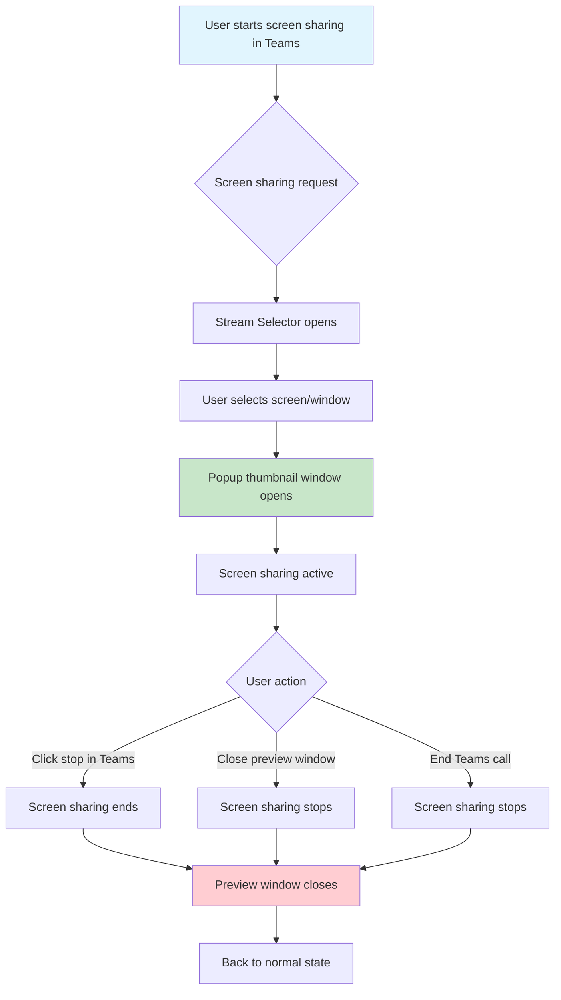
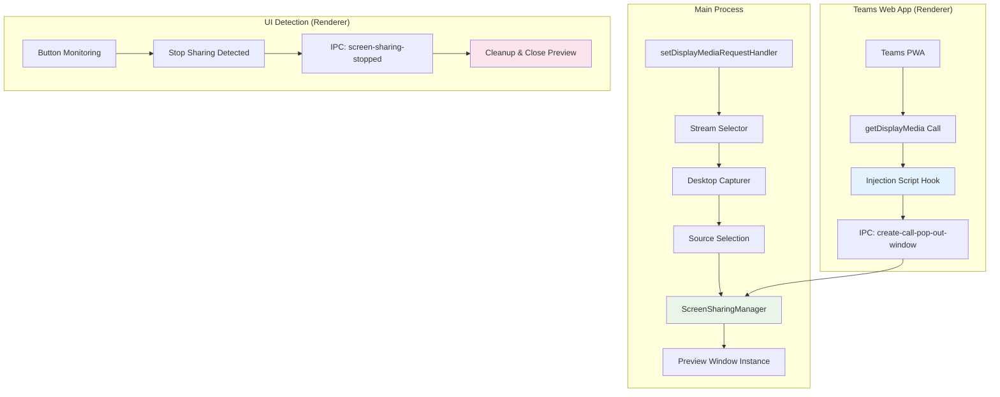
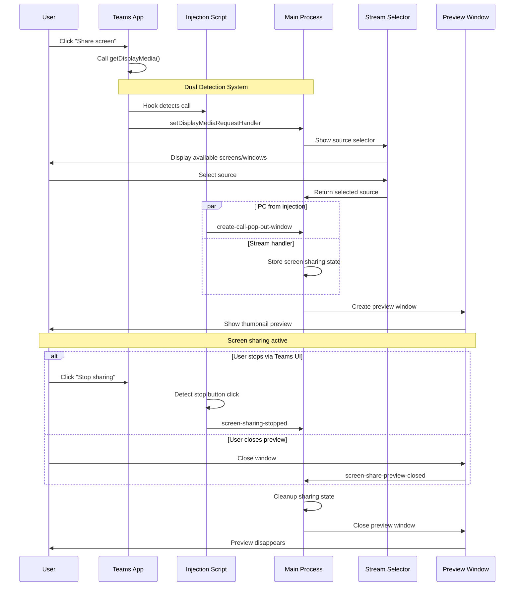
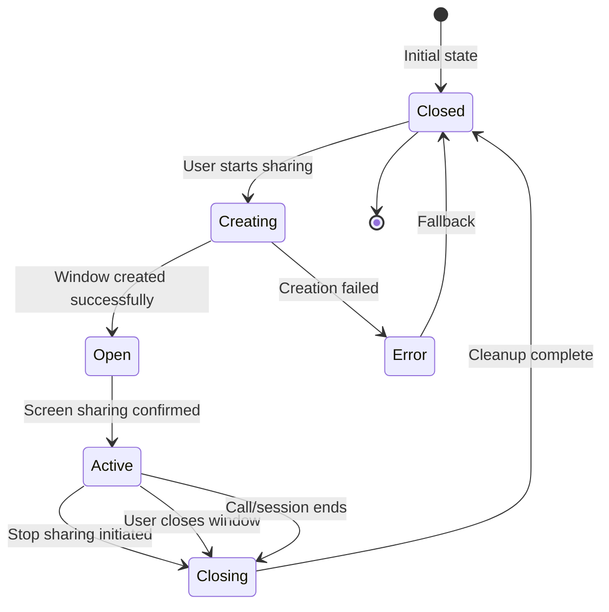

# Screen Sharing in Teams for Linux

Teams for Linux provides robust screen sharing capabilities that integrate seamlessly with the Microsoft Teams web interface while maintaining the security benefits of Electron's contextIsolation and sandbox features.

## How It Works

### User Experience Flow



### What You'll See

1. **Stream Selector Window**: When you start screen sharing, a selection dialog appears showing:
   - Available screens (monitors)
   - Open application windows
   - Preview thumbnails of each option

2. **Preview Window**: Once sharing begins, a small floating window appears showing:
   - Live preview of what you're sharing
   - Always stays on top (configurable)
   - Resizable but maintains aspect ratio
   - Can be manually closed to stop sharing

## Technical Implementation

### Architecture Overview



### Component Interaction Flow



## Configuration

### Enable/Disable Screen Sharing Thumbnail

```json
{
  "screenSharingThumbnail": {
    "enabled": true,
    "alwaysOnTop": true
  }
}
```

- `enabled`: Whether to show the preview thumbnail window (default: `true`)
- `alwaysOnTop`: Keep preview window above other windows (default: `true`)

## Window Lifecycle Management

### Preview Window States



### Automatic Cleanup Scenarios

The preview window automatically closes when:

1. **User stops sharing via Teams**: Stop button click detected
2. **User closes preview manually**: Window close event
3. **Teams call ends**: Session termination detected
4. **Application shutdown**: Process cleanup

## Troubleshooting

### Common Issues

#### Preview Window Doesn't Appear
**Symptoms**: Screen sharing works but no thumbnail preview shows
**Causes**:
- `screenSharingThumbnail.enabled` is `false`
- Window creation failed due to system restrictions

**Solutions**:
```json
{
  "screenSharingThumbnail": {
    "enabled": true
  }
}
```

#### Preview Window Won't Close
**Symptoms**: Preview remains open after sharing stops
**Causes**: IPC communication issues between renderer and main process

**Solutions**:
1. Manually close the preview window
2. Restart Teams for Linux
3. Check system logs for IPC errors

#### Screen Sharing Stops Unexpectedly
**Symptoms**: Sharing ends without user action
**Causes**: Usually related to system permissions or resource limits

**Solutions**:
1. Check screen capture permissions (macOS/Linux)
2. Verify no conflicting screen capture software
3. Monitor system resources

#### Multiple Preview Windows
**Symptoms**: Several preview windows appear for one sharing session
**Causes**: Duplicate window creation (should be fixed in current version)

**Solutions**: 
1. Update to latest version
2. Close extra windows manually
3. Report as bug if persists

### Debug Information

To troubleshoot screen sharing issues:

1. **Enable debug logging**:
```json
{
  "logConfig": {
    "transports": {
      "console": {
        "level": "debug"
      }
    }
  }
}
```

2. **Check IPC events**: Look for these debug messages:
   - `Screen sharing started`
   - `Creating preview window for screen sharing`
   - `Screen sharing stopped`
   - `Preview window closed`

3. **System information**: Note your platform (X11/Wayland/macOS) as different code paths are used

## Security Considerations

### Context Isolation Compatibility

Teams for Linux screen sharing is designed to work with Electron's security features:

- **Context Isolation**: ✅ Fully supported via `contextBridge` API
- **Sandbox**: ✅ Compatible with renderer process sandboxing
- **Node Integration**: ❌ Not required (disabled by default)

### Permissions Required

#### Linux
- **X11**: Screen capture via standard X11 protocols
- **Wayland**: PipeWire desktop portal access

#### macOS
- **Screen Recording**: System permission required
- **Camera/Microphone**: For audio sharing (optional)

#### Windows
- **Desktop Capture**: Built-in Windows APIs

## Advanced Usage

### Programmatic Control

For developers integrating with Teams for Linux:

```javascript
// Check if screen sharing is active
const isActive = await electronAPI.getScreenSharingStatus();

// Get current sharing details
const sourceId = await electronAPI.getScreenShareStream();
const screenConfig = await electronAPI.getScreenShareScreen();

// Stop sharing programmatically (if accessible)
electronAPI.stopSharing();
```

### Custom Integration

The screen sharing system exposes several IPC channels for custom integration:

- `create-call-pop-out-window`: Create preview thumbnail
- `screen-sharing-started`: Notification when sharing begins
- `screen-sharing-stopped`: Notification when sharing ends
- `screen-share-preview-opened`/`screen-share-preview-closed`: Window lifecycle events

See [`ipc-api.md`](ipc-api.md) for complete API documentation.

---

## Related Documentation

- **[IPC API Reference](ipc-api.md)** - Complete IPC channel documentation
- **[Configuration Guide](configuration.md)** - All configuration options
- **[Troubleshooting](knowledge-base.md)** - General troubleshooting guide