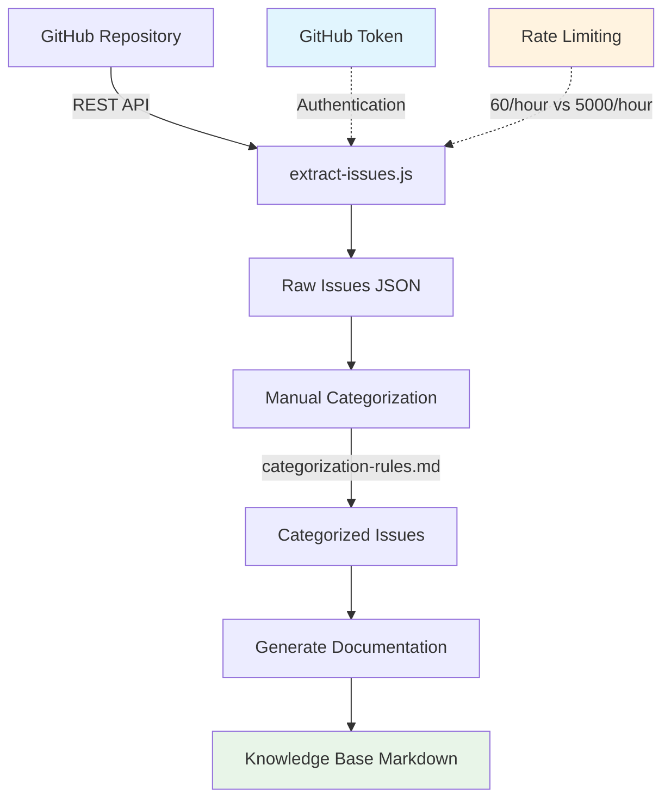

# Knowledge Base System

A comprehensive system for extracting, categorizing,```text
scripts/knowledge-base/
├── extract-issues.js           # Issue extraction via GitHub REST API
├── categorization-rules.md     # Human-readable categorization rules
├── package.json               # Project metadata and npm scripts
└── README.md                  # This documentation

data/
├── issues/                    # Current extraction data
│   ├── raw-issues.json       # Complete issue dataset
│   └── extraction-metadata.json
└── issues-backup/            # Historical data backup

docs/
└── knowledge-base.md         # Knowledge base documentation
```documentation from GitHub issues to create a searchable knowledge base for Teams for Linux.

## Overview

This system transforms GitHub issues into structured knowledge base documentation through a 3-step manual process:

```text
Extract → Categorize → Generate
```

## Table of Contents

- [Quick Start](#quick-start)
- [Prerequisites](#prerequisites)
- [System Architecture](#system-architecture)
- [Usage Guide](#usage-guide)
- [GitHub Token Setup](#github-token-setup)
- [Troubleshooting](#troubleshooting)
- [Implementation History](#implementation-history)

## Quick Start

> [!WARNING]
> **GitHub Token Required for Full Extraction**
> 
> Without a GitHub token, extraction will be throttled after ~600 issues. Our repository has **1000+ issues**, so a token is **essential** for complete data extraction.

```bash
# 1. Set up GitHub token (required)
export GITHUB_TOKEN=ghp_your_token_here

# 2. Extract issues
node scripts/knowledge-base/extract-issues.js

# 3. Categorize issues (manual process using rules)
# Use scripts/knowledge-base/categorization-rules.md

# 4. Generate documentation (future implementation)
```

## Prerequisites

### Required

- **Node.js** (v14 or higher)
- **GitHub Personal Access Token** (strongly recommended)

### Optional

- GitHub CLI (for additional workflow automation)

## System Architecture

### Flow Diagram



### Components

```text
scripts/knowledge-base/
├── extract-issues.js           # Issue extraction via GitHub REST API
├── categorization-rules.md     # Human-readable categorization rules
├── README.md                   # This documentation
└── [future] generate-docs.js   # Documentation generation

data/
├── issues/                     # Current extraction data
│   ├── raw-issues.json        # Complete issue dataset
│   └── extraction-metadata.json
└── issues-backup/             # Historical data backup

docs/
└── knowledge-base/            # Generated documentation (future)
    ├── installation-problems.md
    ├── audio-issues.md
    └── ...
```

## Usage Guide

### Step 1: Extract Issues

Extract all repository issues using the GitHub REST API:

```bash
# With authentication (recommended)
export GITHUB_TOKEN=ghp_your_token_here
node scripts/knowledge-base/extract-issues.js

# Without authentication (limited)
node scripts/knowledge-base/extract-issues.js
```

**Output**: `data/issues/raw-issues.json` containing all extracted issues with metadata.

### Step 2: Categorize Issues

Use the categorization rules to classify issues into knowledge base topics:

1. **Review rules**: Read `scripts/knowledge-base/categorization-rules.md`
2. **Manual process**: Apply rules to categorize issues by:
   - Keywords in title/body
   - GitHub labels
   - Issue patterns
3. **AI assistance**: Rules are designed to work with AI assistants for semi-automated categorization

### Step 3: Generate Documentation

> [!NOTE]
> Documentation generation is planned for future implementation

The final step will create structured markdown files for each category:
- `docs/knowledge-base/installation-problems.md`
- `docs/knowledge-base/audio-issues.md`
- etc.

## GitHub Token Setup

### Why You Need a Token

| Without Token | With Token |
|---------------|------------|
| 60 requests/hour | 5000 requests/hour |
| ~600 issues max | All issues (1000+) |
| **Continuous throttling** | **Smooth extraction** |

### Setup Instructions

1. **Generate Personal Access Token**:
   - Go to [GitHub Settings > Developer settings > Personal access tokens](https://github.com/settings/tokens)
   - Click "Generate new token (classic)"
   - Select scopes: `public_repo` (for public repositories)
   - Copy the token (starts with `ghp_`)

2. **Set Environment Variable**:
   ```bash
   # For current session
   export GITHUB_TOKEN=ghp_your_token_here
   
   # For permanent setup (add to ~/.bashrc or ~/.zshrc)
   echo 'export GITHUB_TOKEN=ghp_your_token_here' >> ~/.bashrc
   ```

3. **Verify Setup**:
   ```bash
   echo $GITHUB_TOKEN  # Should display your token
   ```

### Security Notes

- Never commit tokens to version control
- Use environment variables only
- Regularly rotate tokens for security
- Minimum required scope: `public_repo`

## Troubleshooting

### Common Issues

**Rate Limiting Errors**
```
❌ Error: Rate limit exceeded. Resets at 2025-07-30T20:51:30.000Z
```
- **Solution**: Set up GitHub token or wait for rate limit reset

**Pagination Errors**
```
❌ Error: Pagination with the page parameter is not supported for large datasets
```
- **Solution**: This is expected after ~1000 issues. The script handles this gracefully.

**Network Timeouts**
- **Solution**: Script includes automatic retries with exponential backoff

### Debug Mode

Run with verbose logging:
```bash
DEBUG=1 node scripts/knowledge-base/extract-issues.js
```

### Data Validation

Check extraction results:
```bash
# View summary statistics
jq '.validation' data/issues/raw-issues.json

# Count total issues
jq '.issues | length' data/issues/raw-issues.json
```

## Implementation History

### Major Refactoring (July 2025)

The system was completely refactored to remove dependencies and improve accessibility:

**Before**: MCP-based system
- Required VS Code environment with MCP tools
- Complex external dependencies
- Limited contributor accessibility
- 487 lines of integration code

**After**: Standard REST API implementation
- **Zero external dependencies** (Node.js built-ins only)
- **Universal compatibility** (any Node.js environment)
- **Enhanced error handling** and rate limiting
- **472 lines** of clean, maintainable code

### Key Improvements

1. **✅ Contributor Accessibility**: Anyone with Node.js can run extraction
2. **✅ Simplified Architecture**: 3-step manual process
3. **✅ Better Error Handling**: Automatic retries and rate limiting
4. **✅ Data Preservation**: Original data backed up in `data/issues-backup/`
5. **✅ Comprehensive Testing**: Verified with 1000+ issue extraction

### Files Changed

- `✅ extract-issues.js`: Completely rewritten for REST API
- `❌ extract-via-vscode.js`: Removed (MCP dependency)
- `✅ categorization-rules.md`: Updated with clear categorization logic
- `✅ README.md`: New comprehensive documentation (this file)

## Future Enhancements

- **Automated categorization**: ML-based issue classification
- **Documentation generation**: Automated markdown generation from categorized issues
- **Search interface**: Web-based knowledge base search
- **Integration**: GitHub Actions workflow for automatic updates
- **Analytics**: Issue trend analysis and reporting

## Contributing

1. **Test extraction**: Verify the extraction script works with your environment
2. **Improve categorization**: Suggest new categories or refine existing rules
3. **Documentation**: Help improve this documentation
4. **Code review**: Review and suggest improvements to the extraction logic

## Support

For issues with the knowledge base system:

1. **Check troubleshooting section** above
2. **Verify GitHub token setup** if experiencing rate limiting
3. **Create an issue** in the repository with detailed error information
4. **Include debug output** when reporting problems

---

> [!TIP]
> **Quick Test**: Run `node scripts/knowledge-base/extract-issues.js --help` to verify your setup
