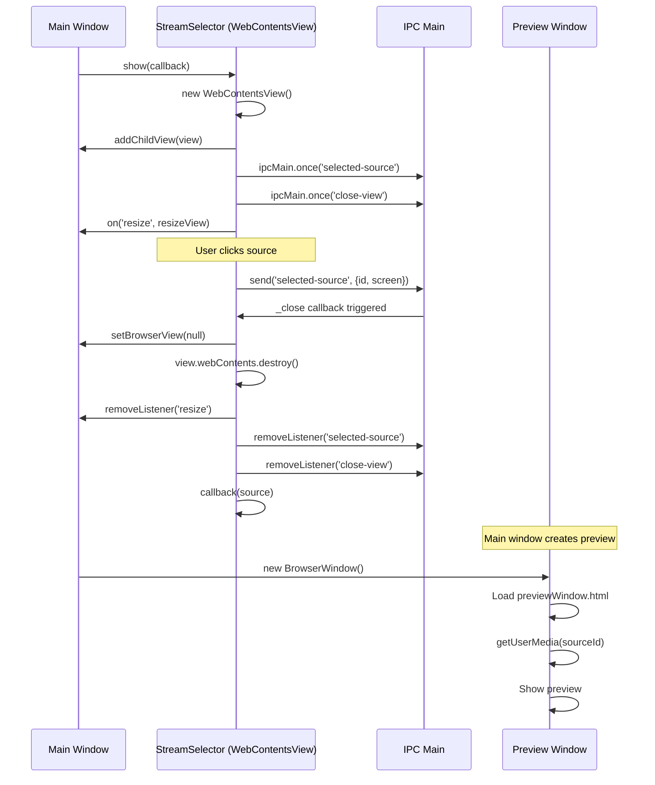

# Phase 2: Screensharing Architecture Analysis

## Executive Summary

This document provides a comprehensive analysis of the current screensharing implementation in Teams for Linux, including IPC flows, dependencies, and a detailed refactoring plan for converting from WebContentsView to modal BrowserWindow pattern.

**Date:** 2025-10-08
**Analyzed Files:** 9 files in `app/screenSharing/` directory
**Current Pattern:** WebContentsView overlay at bottom of parent window
**Target Pattern:** Modal BrowserWindow dialog (independent window)

---

## Current Implementation Analysis

### File Structure (9 files)

| File | Purpose | Lines | Key Dependencies |
|------|---------|-------|------------------|
| `index.js` | StreamSelector class, main process logic | 110 | WebContentsView, ipcMain |
| `browser.js` | Renderer process UI logic, source selection | 191 | desktopCapturer via IPC |
| `preload.js` | Context bridge for StreamSelector | 16 | contextBridge, ipcRenderer |
| `index.html` | StreamSelector UI template | 34 | Bootstrap CSS |
| `index.css` | Styling for source grid | 106 | Custom dark theme |
| `injectedScreenSharing.js` | Teams DOM integration | 221 | Monitors getUserMedia/getDisplayMedia |
| `previewWindow.html` | Preview window UI | 154 | Video element with auto-resize |
| `previewWindowPreload.js` | Preview window IPC bridge | 23 | IPC for window management |
| `README.md` | Technical documentation | 197 | Architecture diagrams |

**Total:** ~1,052 lines of code

### Architecture Overview

```
┌─────────────────────────────────────────────────────────┐
│ Main App Window (BrowserWindow)                         │
│                                                          │
│  ┌────────────────────────────────────────────────┐    │
│  │ Teams Web Interface                             │    │
│  │                                                 │    │
│  │  [User clicks "Share Screen" in Teams]         │    │
│  └────────────────────────────────────────────────┘    │
│                                                          │
│  ┌────────────────────────────────────────────────┐    │
│  │ WebContentsView (StreamSelector) - OVERLAY     │    │
│  │ ┌────────┬────────┬────────┐                   │    │
│  │ │Screen 1│Screen 2│Window 1│  [Close]          │    │
│  │ └────────┴────────┴────────┘                   │    │
│  └────────────────────────────────────────────────┘    │
│         │ positioned at bottom, height: 180px          │
└─────────│───────────────────────────────────────────────┘
          │
          │ User selects source
          ↓
    ┌─────────────────┐
    │ IPC: selected-  │
    │      source     │
    └─────────────────┘
          │
          ↓
┌──────────────────────────────┐
│ Preview Window (BrowserWindow)│
│  ┌────────────────────────┐  │
│  │ [Preview of shared     │  │
│  │  screen/window]        │  │
│  └────────────────────────┘  │
│  320x180, alwaysOnTop: true  │
└──────────────────────────────┘
```

### Current IPC Flow

#### Stream Selection Flow



#### IPC Channels Used

| Channel | Type | Direction | Purpose | Defined In |
|---------|------|-----------|---------|------------|
| `selected-source` | `ipcMain.once` | Renderer → Main | User selected a source | index.js:80 |
| `close-view` | `ipcMain.once` | Renderer → Main | User cancelled selection | index.js:81 |
| `desktop-capturer-get-sources` | `ipcMain.handle` | Renderer ↔ Main | Get available sources | preload.js:12 |
| `screen-sharing-started` | `ipcMain.on` | Renderer → Main | Sharing started (from Teams) | injectedScreenSharing.js:119 |
| `screen-sharing-stopped` | `ipcMain.on` | Renderer → Main | Sharing stopped (from Teams) | injectedScreenSharing.js:149 |
| `get-screen-sharing-status` | `ipcMain.handle` | Renderer ↔ Main | Preview window checks status | previewWindowPreload.js:5 |
| `get-screen-share-stream` | `ipcMain.handle` | Renderer ↔ Main | Get source ID for preview | previewWindowPreload.js:6 |
| `get-screen-share-screen` | `ipcMain.handle` | Renderer ↔ Main | Get screen dimensions | previewWindowPreload.js:7 |
| `resize-preview-window` | `ipcMain.on` | Renderer → Main | Resize preview window | previewWindowPreload.js:11 |

**Total IPC Channels:** 9 (all validated in `app/security/ipcValidator.js`)

### WebContentsView Usage Analysis

#### Current Implementation (index.js:58-65)

```javascript
self.view = new WebContentsView({
  webPreferences: {
    preload: path.join(__dirname, "preload.js"),
  },
});

self.view.webContents.loadFile(path.join(__dirname, "index.html"));
self.parent.contentView.addChildView(self.view);
```

**Why WebContentsView was chosen:**
- Renders as overlay within parent window
- Positioned at bottom (y: parentHeight - 180)
- No separate window in taskbar
- Appears "embedded" in Teams interface

**Deprecated Usage (index.js:86):**
```javascript
properties.view.parent.setBrowserView(null); // DEPRECATED in Electron 38.x
```

#### Resize Logic (index.js:97-107)

```javascript
function resizeView(view) {
  setTimeout(() => {
    const pbounds = view.parent.getBounds();
    view.view.setBounds({
      x: 0,
      y: pbounds.height - 180,
      width: pbounds.width,
      height: 180,
    });
  }, 0);
}
```

**Issue:** Manual bounds management required when parent window resizes.
**Solution with BrowserWindow:** Modal windows don't need manual resize handling.

### Dependencies

#### StreamSelector → Main Window
- **Parent reference:** Stores parent BrowserWindow for adding child view
- **Resize listener:** Watches parent resize events to reposition overlay
- **setBrowserView():** Uses deprecated API to detach WebContentsView

#### StreamSelector → Preview Window
- **No direct dependency:** StreamSelector only triggers callback
- **Preview creation:** Handled by main window (app/mainAppWindow/index.js:45-148)
- **Communication:** Via global variables (`global.previewWindow`, `global.selectedScreenShareSource`)

#### Preview Window → StreamSelector
- **No direct dependency:** Preview window independently queries screen sharing status via IPC

### Security Configuration

Both StreamSelector and Preview Window use **contextBridge** in preload scripts:
- `app/screenSharing/preload.js` - Exposes `window.api` for StreamSelector
- `app/screenSharing/previewWindowPreload.js` - Exposes `window.electronAPI` for preview

**Note:** Main app window has `contextIsolation: false` for Teams DOM access, but screensharing windows CAN use contextBridge since they don't need Teams DOM access.

### Race Conditions and Edge Cases

#### Identified Issues

1. **Multiple `show()` calls:**
   - Current: Uses `ipcMain.once()` which auto-removes after first trigger
   - Risk: If user opens selector, closes, reopens quickly, old listeners may not be cleaned up
   - **Impact:** Low (once() provides auto-cleanup)

2. **Parent window closes while selector open:**
   - Current: No explicit handling for parent closure
   - Behavior: WebContentsView destroyed with parent (automatic cleanup)
   - **With BrowserWindow:** Need to handle parent `closed` event to close modal

3. **Resize during selection:**
   - Current: Uses `setTimeout(() => {...}, 0)` to defer resize
   - Reason: Avoid synchronous layout thrashing
   - **With BrowserWindow:** Not needed (modal dialogs don't resize with parent)

4. **IPC listener cleanup:**
   - Current: Manual `removeListener` in `closeView()` function
   - Issue: If closeView() doesn't execute, listeners orphaned
   - **Solution:** Ensure try-finally pattern or use `ipcMain.handle` (auto-cleanup)

#### Timing Considerations

- **StreamSelector show → display:** Immediate (already child of parent)
- **Modal BrowserWindow show → display:** Need `ready-to-show` event for smooth display
- **Preview window creation:** ~100ms delay observed in logs (app/mainAppWindow/index.js:105-108)

---

## Reference: IncomingCallToast Pattern

The `IncomingCallToast` class provides a good reference for BrowserWindow pattern:

```javascript
class IncomingCallToast {
  constructor(actionListener) {
    this.toast = new BrowserWindow({
      alwaysOnTop: true,
      autoHideMenuBar: true,
      focusable: true,
      frame: false,
      fullscreenable: false,
      height: 240,
      width: 350,
      minimizable: false,
      movable: false,
      resizable: false,
      show: false,  // Initially hidden
      skipTaskbar: true,
      webPreferences: {
        preload: path.join(__dirname, 'incomingCallToastPreload.js')
      }
    });

    this.toast.loadFile(path.join(__dirname, 'incomingCallToast.html'));

    ipcMain.on('incoming-call-action', (event, action) => {
      this.hide();
      if (actionListener && typeof actionListener == 'function') {
        actionListener(action);
      }
    });
  }

  show(data) {
    ipcMain.once('incoming-call-toast-ready', () => {
      this.positioner.move('bottomRight');
      this.toast.show();
    });
    this.toast.webContents.send('incoming-call-toast-init', data);
  }
}
```

**Key Patterns to Adopt:**
1. ✅ `show: false` initially, then show after ready
2. ✅ `frame: false` for custom UI
3. ✅ `skipTaskbar: true` to avoid taskbar clutter
4. ✅ `ipcMain.once()` for ready event
5. ✅ Callback pattern for action handling

**Differences for StreamSelector:**
- IncomingCallToast: Not modal (can interact with other windows)
- StreamSelector: Should be **modal** (blocks parent window)
- IncomingCallToast: Positioned in corner (uses electron-positioner)
- StreamSelector: Centered modal dialog (default positioning)

---

## Refactoring Plan: WebContentsView → Modal BrowserWindow

### Goals

1. ✅ Replace deprecated `setBrowserView()` API
2. ✅ Simplify window lifecycle (no manual resize/positioning)
3. ✅ Improve UX with native modal dialog behavior
4. ✅ Maintain all existing functionality (thumbnails, preview, selection)
5. ✅ Preserve IPC security validation

### Proposed Architecture

```
┌─────────────────────────────┐
│ Main App Window             │
│  (parent - disabled while   │
│   modal dialog is open)     │
└─────────────────────────────┘
         │
         │ setDisplayMediaRequestHandler
         │ calls streamSelector.show(callback)
         ↓
┌─────────────────────────────┐
│ StreamSelector Modal Dialog │  ← NEW: Separate BrowserWindow
│ ┌────────┬────────┬────────┐│
│ │Screen 1│Screen 2│Window 1││
│ └────────┴────────┴────────┘│
│  [Screens] [Windows] [X]    │
└─────────────────────────────┘
         │
         │ User selects source
         │ IPC: selected-source
         ↓
┌──────────────────────────────┐
│ Preview Window               │
│  (unchanged)                 │
└──────────────────────────────┘
```

### Code Changes Required

#### 1. Update StreamSelector Constructor (index.js:12-17)

**Current:**
```javascript
constructor(parent) {
  _StreamSelector_parent.set(this, parent);
  _StreamSelector_window.set(this, null);
  _StreamSelector_selectedSource.set(this, null);
  _StreamSelector_callback.set(this, null);
}
```

**New:**
```javascript
constructor(parent) {
  _StreamSelector_parent.set(this, parent);
  _StreamSelector_window.set(this, null);  // Now stores BrowserWindow instead of WebContentsView
  _StreamSelector_selectedSource.set(this, null);
  _StreamSelector_callback.set(this, null);
}
```

**Change:** Comment update only (WeakMap still stores window reference, just different type)

#### 2. Rewrite `show()` Method (index.js:55-82)

**Current:**
```javascript
show(callback) {
  let self = this;
  self.callback = callback;
  self.view = new WebContentsView({
    webPreferences: {
      preload: path.join(__dirname, "preload.js"),
    },
  });

  self.view.webContents.loadFile(path.join(__dirname, "index.html"));
  self.parent.contentView.addChildView(self.view);

  let _resize = () => {
    resizeView(self);
  };
  resizeView(self);

  let _close = (_event, source) => {
    closeView({ view: self, _resize, _close, source });
  };

  this.parent.on("resize", _resize);
  ipcMain.once("selected-source", _close);
  ipcMain.once("close-view", _close);
}
```

**New:**
```javascript
show(callback) {
  const self = this;
  self.callback = callback;

  // Create modal BrowserWindow instead of WebContentsView
  self.view = new BrowserWindow({
    parent: self.parent,
    modal: true,
    show: false,
    width: 1000,
    height: 300,
    minWidth: 800,
    minHeight: 250,
    maxHeight: 400,
    frame: true,  // Use native frame for modal dialog
    autoHideMenuBar: true,
    resizable: true,
    minimizable: false,
    maximizable: false,
    webPreferences: {
      preload: path.join(__dirname, "preload.js"),
      contextIsolation: true,  // Can use contextBridge (no Teams DOM access needed)
      nodeIntegration: false,
      sandbox: false,  // Match main app security config
    },
  });

  self.view.loadFile(path.join(__dirname, "index.html"));

  // Show window once content is ready
  self.view.once("ready-to-show", () => {
    self.view.show();
  });

  // Handle close event (user closes window without selecting)
  self.view.on("closed", () => {
    self.view = null;
    if (self.callback) {
      self.callback(null);  // Callback with null = cancelled
    }
  });

  // IPC listeners for source selection
  const _close = (_event, source) => {
    closeView({ window: self, source });
  };

  ipcMain.once("selected-source", _close);
  ipcMain.once("close-view", _close);
}
```

**Key Changes:**
- ✅ Replace `WebContentsView` with `BrowserWindow`
- ✅ Add `modal: true` to block parent window
- ✅ Remove resize listener (not needed for modal windows)
- ✅ Use `ready-to-show` event for smooth display
- ✅ Handle `closed` event for cleanup
- ✅ Simplified dimensions (no manual positioning)

#### 3. Update `closeView()` Function (index.js:85-95)

**Current:**
```javascript
function closeView(properties) {
  properties.view.parent.setBrowserView(null);  // DEPRECATED
  properties.view.view.webContents.destroy();
  properties.view.view = null;
  properties.view.parent.removeListener("resize", properties._resize);
  ipcMain.removeListener("selected-source", properties._close);
  ipcMain.removeListener("close-view", properties._close);
  if (properties.view.callback) {
    properties.view.callback(properties.source);
  }
}
```

**New:**
```javascript
function closeView(properties) {
  const window = properties.window.view;

  if (window && !window.isDestroyed()) {
    // Remove IPC listeners
    ipcMain.removeAllListeners("selected-source");
    ipcMain.removeAllListeners("close-view");

    // Close window (triggers 'closed' event)
    window.close();
  }

  properties.window.view = null;

  // Execute callback with selected source
  if (properties.window.callback) {
    properties.window.callback(properties.source);
  }
}
```

**Key Changes:**
- ✅ Remove `setBrowserView(null)` (deprecated)
- ✅ Replace `webContents.destroy()` with `window.close()`
- ✅ Remove resize listener cleanup (not used)
- ✅ Use `removeAllListeners` for cleaner IPC cleanup
- ✅ Check `isDestroyed()` to avoid errors

#### 4. Remove `resizeView()` Function (index.js:97-107)

**Action:** DELETE entire function (not needed with modal BrowserWindow)

#### 5. Update Property Names (index.js:22-35)

**Current:**
```javascript
/**
 * @type {WebContentsView}
 */
get view() {
  return _StreamSelector_window.get(this);
}
```

**New:**
```javascript
/**
 * @type {BrowserWindow}
 */
get view() {
  return _StreamSelector_window.get(this);
}
```

**Change:** Comment update only (property still called `view` for compatibility)

#### 6. Update Import Statement (index.js:1)

**Current:**
```javascript
const { ipcMain, WebContentsView } = require("electron");
```

**New:**
```javascript
const { ipcMain, BrowserWindow } = require("electron");
```

### Files NOT Requiring Changes

✅ **browser.js** - No changes needed (renderer logic unchanged)
✅ **preload.js** - No changes needed (IPC channels unchanged)
✅ **index.html** - No changes needed (UI template unchanged)
✅ **index.css** - May need minor adjustments for modal dialog layout
✅ **injectedScreenSharing.js** - No changes needed (Teams DOM integration unchanged)
✅ **previewWindow.html** - No changes needed (independent window)
✅ **previewWindowPreload.js** - No changes needed (independent IPC)
✅ **app/security/ipcValidator.js** - No changes needed (IPC channels unchanged)

### CSS Adjustments (index.css)

**Potential Issue:** Current CSS assumes 180px height overlay at bottom.
**Solution:** Modal dialog can be larger (300px height) for better UX.

**Changes:**
```css
/* BEFORE: Optimized for 180px overlay */
.container-fluid .row {
  overflow-x: auto;
  flex-wrap: nowrap;
  display: flex;
  max-height: 20rem;  /* 320px */
}

/* AFTER: Optimized for 300px modal dialog */
.container-fluid .row {
  overflow-x: auto;
  flex-wrap: nowrap;
  display: flex;
  max-height: 250px;  /* Fit in 300px window with header */
}
```

**Optional:** Add padding for modal dialog appearance

### Expected Behavior Changes

| Aspect | Current (WebContentsView) | New (Modal BrowserWindow) |
|--------|---------------------------|---------------------------|
| **Positioning** | Bottom overlay within parent | Centered modal dialog |
| **Taskbar** | Not visible | May appear (use `skipTaskbar: true` to avoid) |
| **Parent interaction** | Parent still clickable | Parent disabled while modal open ✅ |
| **Resize with parent** | Yes (manual bounds update) | No (independent window) ✅ |
| **Close behavior** | Must click X or select source | Can close via X, Esc, or select source ✅ |
| **Frame** | Frameless overlay | Native frame (or frameless if preferred) |

**User Experience Impact:** Minimal - modal dialog provides clearer interaction model.

---

## IPC Simplification Opportunities

### Current IPC Patterns

**Pattern 1: Dual listeners for close (index.js:80-81)**
```javascript
ipcMain.once("selected-source", _close);
ipcMain.once("close-view", _close);
```

**Rationale:** Two ways to close - user selects source OR cancels.

**Consolidation Opportunity:** Use `ipcMain.handle` instead:
```javascript
ipcMain.handle("stream-selector-action", async (_event, action) => {
  return { source: action.source || null };
});
```

**Benefits:**
- ✅ Single channel instead of two
- ✅ Auto-cleanup (handle() removes listener when window closes)
- ✅ Can return values to renderer

**Trade-off:** Requires changing preload.js and browser.js

**Recommendation:** Keep current pattern for Phase 3, evaluate in Phase 4.

### IPC Channel Consolidation

**Current:**
- `selected-source` - User selected a source
- `close-view` - User cancelled

**Proposed:**
- `stream-selector-closed` - Single channel with payload: `{ source: {...} | null }`

**Impact:**
- Update `preload.js` lines 6-11
- Update `browser.js` lines 109-112 and 127-129
- Update `ipcValidator.js` - replace 2 channels with 1

**Benefit:** -1 IPC channel in allowlist

---

## Testing Strategy for Phase 3

### Unit Testing (Manual)

1. **Open selector:**
   - ✅ Modal dialog appears centered
   - ✅ Parent window disabled (cannot click Teams interface)
   - ✅ Thumbnails load correctly

2. **Select screen:**
   - ✅ Modal closes
   - ✅ Parent window re-enabled
   - ✅ Callback receives correct source
   - ✅ Preview window opens

3. **Select window:**
   - ✅ Modal closes
   - ✅ Parent window re-enabled
   - ✅ Callback receives correct source
   - ✅ Preview window opens

4. **Cancel (click X):**
   - ✅ Modal closes
   - ✅ Parent window re-enabled
   - ✅ Callback receives `null`
   - ✅ No preview window

5. **Cancel (click Close button):**
   - ✅ Same behavior as clicking X

6. **Rapid open/close:**
   - ✅ No orphaned listeners
   - ✅ No memory leaks
   - ✅ Consistent behavior

### Integration Testing

1. **Teams meeting screenshare flow:**
   - ✅ Click "Share Screen" in Teams
   - ✅ Modal selector appears
   - ✅ Select source
   - ✅ Screensharing starts in Teams
   - ✅ Preview window appears
   - ✅ Stop sharing in Teams
   - ✅ Preview window closes

2. **Multiple selector openings:**
   - ✅ Open selector
   - ✅ Cancel
   - ✅ Open selector again
   - ✅ Select source
   - ✅ Works correctly

3. **Parent window interactions:**
   - ✅ Cannot click Teams while selector open
   - ✅ Can click Teams after selector closes
   - ✅ Parent window resize doesn't affect selector

---

## Complexity Reduction Metrics

### Lines of Code

| Metric | Current | After Refactoring | Change |
|--------|---------|-------------------|--------|
| `index.js` | 110 lines | ~95 lines | -15 lines (-14%) |
| `resizeView()` function | 10 lines | 0 lines (deleted) | -10 lines |
| Resize event handlers | 5 lines | 0 lines (deleted) | -5 lines |
| `setBrowserView()` calls | 1 line | 0 lines (removed) | -1 line |

**Total:** -31 lines (~28% reduction in index.js)

### Conceptual Complexity

| Aspect | Current | After Refactoring |
|--------|---------|-------------------|
| Window types | 2 (BrowserWindow, WebContentsView) | 1 (BrowserWindow only) |
| Manual positioning | Yes (resizeView function) | No (modal auto-centers) |
| Parent resize handling | Yes (event listener) | No (not needed) |
| Deprecated APIs | 1 (setBrowserView) | 0 |
| Event listeners | 3 (resize, selected-source, close-view) | 3 (closed, selected-source, close-view) |

**Benefit:** Simpler mental model, fewer edge cases.

---

## Risk Assessment

| Risk | Probability | Impact | Mitigation |
|------|------------|---------|------------|
| Modal dialog looks odd on Linux | Low | Medium | Test on X11/Wayland early, adjust frame/styling |
| Taskbar clutter | Medium | Low | Add `skipTaskbar: true` option |
| Users expect embedded UI | Low | Low | Modal dialog is common pattern, UX acceptable per PRD |
| IPC listener leaks | Low | Medium | Use `removeAllListeners`, verify in testing |
| Race condition on rapid open/close | Low | Low | `ipcMain.once()` provides auto-cleanup |

**Overall Risk:** LOW - Well-understood pattern, similar to IncomingCallToast

---

## Recommendations

### Phase 3 Implementation Order

1. ✅ Update import statement (index.js:1)
2. ✅ Rewrite `show()` method (index.js:55-82)
3. ✅ Update `closeView()` function (index.js:85-95)
4. ✅ Delete `resizeView()` function (index.js:97-107)
5. ✅ Update JSDoc comments (index.js:22-35)
6. ✅ Test on primary platform (Linux X11)
7. ✅ Adjust CSS if needed (index.css)
8. ✅ Test all scenarios (select, cancel, rapid open/close)

### Phase 4 IPC Simplification (Optional)

**Defer to Phase 4:**
- Consolidate `selected-source` + `close-view` into single channel
- Evaluate `ipcMain.handle()` pattern for better auto-cleanup
- Update preload.js, browser.js, ipcValidator.js if consolidating

**Rationale:** Phase 3 focuses on WebContentsView replacement. IPC simplification can be done incrementally.

---

## Conclusion

The refactoring from WebContentsView to modal BrowserWindow is **straightforward** and **low-risk**:

✅ **Clear migration path** - Similar to IncomingCallToast pattern
✅ **Reduced complexity** - Eliminates manual positioning and resize handling
✅ **No deprecated APIs** - Removes `setBrowserView()` usage
✅ **Maintains functionality** - All features preserved (thumbnails, preview, selection)
✅ **Improves UX** - Modal dialog provides clearer interaction model

**Estimated effort:** 2-3 hours for implementation + testing

**Recommendation:** Proceed with Phase 3 implementation as planned.

---

*Analysis completed by Claude Code - 2025-10-08*
