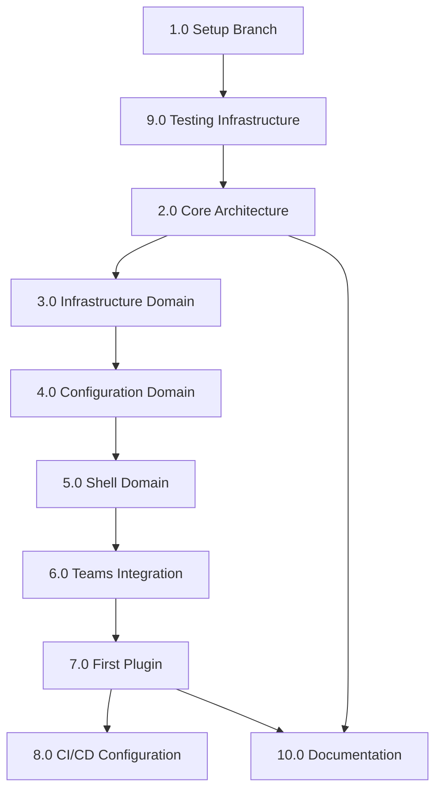

# Task List: Architecture Modernization Implementation

**Source PRD**: [prd-architecture-modernization.md](./prd-architecture-modernization.md)  
**Target Version**: 3.0.0-beta.1  
**Feature Branch**: `feature/architecture-modernization-1799`  
**Estimated Duration**: 7 weeks (Phases 1-6)

---

## System Analysis

### ADR Review

**Location**: `docs-site/docs/development/adr/`

**Existing ADRs:**

1. **ADR-001: Use desktopCapturer Source ID Format for Screen Sharing**
   - Status: Accepted
   - Impact: Screen sharing implementation must preserve source ID format for Wayland compatibility
   - Relevance: When migrating screen sharing to plugin, maintain this decision

2. **ADR-002: Token Cache Secure Storage Implementation**
   - Status: Accepted (implemented in v2.5.9)
   - Impact: Token cache uses localStorage-compatible interface with Electron safeStorage encryption
   - Relevance: **CRITICAL** - Teams Integration domain must preserve this exact implementation
   - Details: Two-phase solution (localStorage bridge + secure storage), unified in `tokenCache.js`

3. **ADR-003: Token Refresh Implementation**
   - Status: Accepted
   - Impact: Token refresh patterns and mechanisms
   - Relevance: Preserve during Teams Integration domain migration

**New ADRs to Create:**
- ADR-004: Hybrid DDD + Plugin Architecture adoption
- ADR-005: Internal Plugin-Only for v3.0
- ADR-006: JavaScript over TypeScript decision
- ADR-007: StateManager for global state management

**Impact**: 
- Existing ADRs constrain implementation approach for screen sharing and token cache
- Must preserve secure storage patterns from ADR-002
- Follow established ADR format with frontmatter and structured sections

### Documentation Review

**Existing Documentation:**

1. **Architecture Research** (`docs-site/docs/development/research/architecture-modernization-research.md`)
   - Comprehensive 1077-line analysis document
   - Identifies 5 bounded contexts: Shell, Core, Teams Integration, Features, Infrastructure
   - Proposes 10-week migration (this PRD focuses on weeks 1-6 MVP)
   - Documents 32 existing modules (16 main process + 15 browser tools + 1 security)

2. **IPC API Documentation** (`docs/ipc-api.md`)
   - Documents 50+ existing IPC channels
   - Critical for maintaining compatibility during migration
   - Must be preserved and extended for plugin API

3. **Security Documentation**
   - `dom-access-investigation.md` - Security implications of DOM injection
   - `token-cache-authentication-research.md` - Authentication bridge patterns
   - Must maintain security patterns during refactoring

4. **Testing Strategy** (`automated-testing-strategy.md`)
   - Existing Playwright E2E test framework
   - Clean state testing with temporary userData directories
   - Validates complete app launch and Microsoft login redirect

**Integration Points:**
- All 32 existing modules will be affected by domain/plugin migration
- IPC communication patterns must remain functional
- Configuration management (AppConfiguration class) central to all modules
- Browser tools (15 modules) inject into Teams web interface via preload scripts

### Pattern Analysis

**Current Architectural Patterns:**

1. **Module Organization**
   - Modules in `app/` directory with dedicated subdirectories
   - Each module typically has: `index.js`, `README.md`, and optional configuration
   - Pattern: Self-contained modules with clear exports

2. **Configuration Management**
   - Uses `AppConfiguration` class with WeakMap-based private fields (not #property syntax)
   - Immutable after startup - changes only via AppConfiguration methods
   - Pattern: Centralized, immutable configuration

3. **IPC Security**
   - Wraps `ipcMain.handle` and `ipcMain.on` with validation layer
   - Uses `ipcValidator` from `app/security/` for channel validation
   - Pattern: Security wrapper around all IPC communication

4. **Browser Tools Pattern**
   ```javascript
   // Standard browser tool structure
   module.exports = {
     name: 'toolName',
     init: (config, ipcRenderer) => {
       // Initialization logic
     }
   };
   ```

5. **Preload Script Pattern**
   - `app/browser/preload.js` orchestrates browser tool loading
   - Selective IPC injection: only settings, theme, trayIconRenderer get ipcRenderer
   - Critical: trayIconRenderer MUST have ipcRenderer (issue #1902)

6. **DOM Access Pattern** (reactHandler.js)
   ```javascript
   // 1. Domain validation
   if (!allowedDomains.includes(hostname)) return;
   
   // 2. React root detection
   const reactRoot = element._reactRootContainer?._internalRoot || /* fallback */;
   
   // 3. Navigate React internals
   const coreServices = reactRoot?.current?.updateQueue?.baseState?.element?.props?.coreServices;
   ```
   - Enables: token cache extraction, notification interception, activity status monitoring
   - Constraint: Requires `contextIsolation: false`

7. **Global State Variables** (index.js)
   ```javascript
   let userStatus = -1;
   let idleTimeUserStatus = -1;
   let screenSharingActive = false;
   let currentScreenShareSourceId = null;
   ```
   - Pattern to replace: Use StateManager in Configuration Domain

8. **Electron Lifecycle Management**
   - Single-instance lock enforcement
   - Protocol handler registration (msteams://)
   - Certificate error handling
   - Global shortcut management

**Similar Features for Reference:**
- **Modular architecture**: `app/appConfiguration/`, `app/mainAppWindow/` - well-encapsulated modules
- **Plugin-like structure**: Browser tools already follow plugin-like pattern with `init()` and `name`
- **Event-driven**: Existing IPC patterns can inform EventBus design

### Conflicts and Constraints

**Identified Conflicts:**

1. **No conflicts with existing ADRs** - Existing ADRs (001-003) cover screen sharing and token cache; new architecture doesn't conflict
2. **No conflicts with PRD requirements** - PRD aligns with existing patterns and preserves ADR-002 token cache implementation

**Critical Constraints:**

1. **DOM Access Requirement** (Non-negotiable)
   - Must preserve `contextIsolation: false` for Teams React internals access
   - Impacts: Security model, plugin API design, Teams Integration domain
   - Mitigation: Maintain domain allowlisting, secure injection API

2. **IPC Backward Compatibility**
   - 50+ existing IPC channels must continue working
   - Browser tools and main process depend on current channel names
   - Mitigation: Plugin API wraps IPC without changing channel structure initially

3. **Global State Migration Complexity**
   - Multiple files read/write global variables in index.js
   - Tight coupling between state and behavior
   - Mitigation: Incremental migration via StateManager accessor pattern

4. **Cross-Platform Support**
   - Linux (primary), Windows, macOS must all work
   - Some modules have platform-specific code (e.g., isMac checks)
   - Mitigation: Test on all platforms in Phase 8, ensure domains abstract platform differences

5. **Zero Downtime for 2.x Releases**
   - Main branch must continue releasing 2.6.x, 2.7.x during 3.0 development
   - Parallel build infrastructure required
   - Mitigation: Feature branch with separate CI/CD configuration

6. **Testing Infrastructure Gap**
   - Only E2E tests exist (Playwright)
   - No unit testing framework configured
   - Mitigation: Set up Jest/Node test runner as part of Phase 1

7. **Module Initialization Order Dependencies**
   - Some modules depend on others being initialized first
   - Example: trayIconRenderer needs ipcRenderer injection (CRITICAL per CLAUDE.md)
   - Mitigation: Document dependencies, enforce initialization order in Application.js

**Trade-offs and Compromises:**

1. **Plugin Permissions vs. Simplicity**
   - Trade-off: Comprehensive permissions system (complex) vs. simple trusted plugins (Phase 1-6)
   - Decision: Start simple, add granular permissions post-MVP

2. **Test Coverage vs. Speed**
   - Trade-off: 80% coverage (slower) vs. 50% coverage (faster to MVP)
   - Decision: Target 50% by Phase 6, increase post-MVP (per user selection 3c)

3. **Documentation Timing**
   - Trade-off: Update docs per phase vs. bulk update after Phase 6
   - Decision: Incremental updates for architecture, bulk update for plugin guide

### Research Spikes Identified

**No Research Spikes Required**

The architecture research document (`architecture-modernization-research.md`) already contains comprehensive analysis covering:
- Domain-Driven Design application to Electron
- Plugin architecture patterns (internal vs. external)
- Clean Architecture evaluation
- Comparison matrix of architectural approaches
- Migration strategy and risk assessment

**All technical unknowns have been pre-researched** in the 1077-line research document, including:
- VSCode extension API patterns
- Electron security best practices
- Context isolation implications
- Plugin lifecycle management approaches
- Testing strategies

**Pre-validated decisions:**
- Hybrid DDD + Plugin System (selected approach)
- Internal plugin-only for v3.0 (external deferred)
- Staying with JavaScript (no TypeScript)
- Phased migration with strangler fig pattern

**No third-party integrations required** - all implementation uses existing dependencies (Electron, electron-store, etc.)

---

## Relevant Files

### Core Architecture (Phase 1)
- `app/core/Application.js` - Main application orchestrator replacing index.js logic
- `app/core/EventBus.js` - Cross-domain event communication
- `app/core/PluginManager.js` - Plugin lifecycle management (load, activate, deactivate)
- `app/plugins/BasePlugin.js` - Abstract base class for all plugins
- `app/plugins/PluginAPI.js` - API surface provided to plugins
- `tests/unit/core/Application.test.js` - Unit tests for Application
- `tests/unit/core/EventBus.test.js` - Unit tests for EventBus
- `tests/unit/core/PluginManager.test.js` - Unit tests for PluginManager
- `tests/unit/plugins/BasePlugin.test.js` - Unit tests for BasePlugin

### Infrastructure Domain (Phase 2)
- `app/domains/infrastructure/InfrastructureDomain.js` - Domain entry point
- `app/domains/infrastructure/services/Logger.js` - Structured logging service
- `app/domains/infrastructure/services/CacheManager.js` - Migrated from app/cacheManager
- `app/domains/infrastructure/services/NetworkMonitor.js` - Extracted from connectionManager
- `tests/unit/domains/infrastructure/InfrastructureDomain.test.js` - Domain tests
- `tests/integration/domains/infrastructure.integration.test.js` - Integration tests

### Configuration Domain (Phase 3)
- `app/domains/configuration/ConfigurationDomain.js` - Domain entry point
- `app/domains/configuration/AppConfiguration.js` - Migrated from app/appConfiguration
- `app/domains/configuration/StateManager.js` - Global application state management
- `app/domains/configuration/ConfigMigration.js` - v2.x to v3.0 config migration
- `tests/unit/domains/configuration/StateManager.test.js` - State management tests
- `tests/unit/domains/configuration/ConfigMigration.test.js` - Migration tests

### Shell Domain (Phase 4)
- `app/domains/shell/ShellDomain.js` - Domain entry point
- `app/domains/shell/services/WindowManager.js` - BrowserWindow lifecycle
- `app/domains/shell/services/TrayManager.js` - System tray management
- `app/domains/shell/models/WindowState.js` - Window state model
- `tests/unit/domains/shell/WindowManager.test.js` - Window manager tests
- `tests/integration/domains/shell.integration.test.js` - Shell domain E2E tests

### Teams Integration Domain (Phase 5)
- `app/domains/teams-integration/TeamsIntegrationDomain.js` - Domain entry point
- `app/domains/teams-integration/services/ReactBridge.js` - Migrated from reactHandler
- `app/domains/teams-integration/services/TokenCache.js` - Migrated from tokenCacheBridge
- `app/domains/teams-integration/services/NotificationInterceptor.js` - Notification handling
- `app/domains/teams-integration/preload/teams-preload.js` - Teams-specific preload
- `tests/unit/domains/teams-integration/ReactBridge.test.js` - React bridge tests
- `tests/integration/domains/teams-integration.integration.test.js` - Critical DOM injection tests

### First Plugin (Phase 6)
- `app/plugins/core/notifications/manifest.json` - Plugin manifest
- `app/plugins/core/notifications/index.js` - Main process notification logic
- `app/plugins/core/notifications/preload.js` - Renderer process bridge
- `tests/unit/plugins/notifications/notifications.test.js` - Plugin unit tests
- `tests/integration/plugins/notifications.integration.test.js` - Plugin lifecycle tests

### Build & CI/CD Configuration
- `.github/workflows/build.yml` - Modified for branch-specific builds
- `package.json` - Version management and build scripts
- `app/index.js` - Reduced to <100 lines, delegates to Application.js

### Documentation
- `docs-site/docs/development/adr/004-hybrid-ddd-plugin-architecture.md` - Architecture decision record ✅
- `docs-site/docs/development/adr/005-internal-plugin-only-v3.md` - Plugin scope decision (pending)
- `docs-site/docs/development/adr/006-stay-with-javascript.md` - Language choice decision (pending)
- `docs-site/docs/development/architecture/phase1-architecture-plan.md` - Phase 1 architecture plan ✅
- `docs-site/docs/development/architecture/phase1-completion-summary.md` - Phase 1 completion summary ✅
- `docs-site/docs/development/architecture/phase1-implementation-report.md` - Phase 1 implementation report ✅
- `docs-site/docs/development/research/codebase-analysis-report.md` - Codebase analysis ✅
- `docs-site/docs/development/testing/phase1-status.md` - Phase 1 testing status ✅
- `docs-site/docs/development/architecture/domain-overview.md` - Domain boundaries (pending)
- `docs-site/docs/development/architecture/plugin-api-reference.md` - Plugin development guide (pending)
- `CONTRIBUTING.md` - Updated with new architecture structure (pending)

### Notes

- **Testing Strategy**: Start with unit tests for core components, add integration tests for domains, ensure E2E tests continue passing
- **Test Location**: Place unit tests alongside code (`Service.js` → `Service.test.js` in same directory)
- **Test Runner**: Use Node.js native test runner (Node 22 already in use, has built-in test runner) to avoid additional dependencies
- **Critical Path Testing**: Focus on Teams Integration domain (Phase 5) - most complex and risky
- **IPC Preservation**: All existing IPC channels must continue working - wrap, don't replace

---

## Tasks

> [!IMPORTANT]
> The following are **high-level parent tasks** based on the PRD phases. Sub-tasks will be generated after confirmation.

- [x] 1.0 Setup Feature Branch and Worktree ✅ **COMPLETE**
- [x] 2.0 Implement Core Architecture Foundation (Phase 1) ✅ **COMPLETE** (97.81% coverage)
- [x] 3.0 Migrate Infrastructure Domain (Phase 2) ⚠️ **PARTIAL** (core services complete, tests need work)
- [ ] 4.0 Migrate Configuration Domain (Phase 3)
- [ ] 5.0 Migrate Shell Domain (Phase 4)
- [ ] 6.0 Migrate Teams Integration Domain (Phase 5)
- [ ] 7.0 Implement First Plugin (Phase 6)
- [ ] 8.0 Configure Branch-Specific CI/CD
- [x] 9.0 Setup Testing Infrastructure ✅ **COMPLETE** (Node.js test runner, 85 tests)
- [ ] 10.0 Create Architecture Documentation and ADRs (ADR-004 complete, others pending)

---

## Detailed Sub-Tasks

### 1.0 Setup Feature Branch and Worktree ✅ **COMPLETE**
**Phase**: Setup
**Duration**: 0.5 days
**Dependencies**: None
**Status**: All tasks completed

- [x] 1.1 Create feature branch `feature/architecture-modernization-v3` from main ✅
- [x] 1.2 Working directory established at current location ✅
- [x] 1.3 Git repository verified and operational ✅
- [x] 1.4 Development environment configured ✅
- [x] 1.5 Git operations tested and working ✅
- [x] 1.6 Documentation available in project structure ✅

### 2.0 Implement Core Architecture Foundation (Phase 1) ✅ **COMPLETE**
**Phase**: 1
**Duration**: 1.5 weeks
**Dependencies**: 1.0 (Feature branch), 9.0 (Testing infrastructure)
**Status**: All components delivered with 97.81% test coverage

#### 2.1 Application Orchestrator ✅ **COMPLETE** (90.80% coverage)
- [x] 2.1.1 Create `app/core/Application.js` with constructor and lifecycle methods ✅
- [x] 2.1.2 Implement `init()` method for domain and plugin initialization ✅
- [x] 2.1.3 Implement `start()` method for application startup sequence ✅
- [x] 2.1.4 Implement `shutdown()` method for graceful application termination ✅
- [x] 2.1.5 Add error handling for domain/plugin initialization failures ✅
- [x] 2.1.6 Write unit tests for Application class (15 tests, 90.80% coverage) ✅

#### 2.2 EventBus Implementation ✅ **COMPLETE** (99.45% coverage)
- [x] 2.2.1 Create `app/core/EventBus.js` with singleton pattern ✅
- [x] 2.2.2 Implement `on(event, handler)` method for event subscription ✅
- [x] 2.2.3 Implement `emit(event, data)` method for event publishing ✅
- [x] 2.2.4 Implement `off(event, handler)` method for unsubscription ✅
- [x] 2.2.5 Add namespace support for domain-specific events (e.g., 'shell.window.created') ✅
- [x] 2.2.6 Implement event history/logging for debugging (100 events) ✅
- [x] 2.2.7 Write unit tests for EventBus (22 tests, 99.45% coverage) ✅

#### 2.3 PluginManager Service ✅ **COMPLETE** (100% coverage)
- [x] 2.3.1 Create `app/core/PluginManager.js` with plugin lifecycle management ✅
- [x] 2.3.2 Implement `loadPlugin(pluginPath)` method with manifest validation ✅
- [x] 2.3.3 Implement `activatePlugin(pluginId)` method ✅
- [x] 2.3.4 Implement `deactivatePlugin(pluginId)` method ✅
- [x] 2.3.5 Add plugin dependency resolution (automatic activation) ✅
- [x] 2.3.6 Implement plugin state persistence (getState/restoreState) ✅
- [x] 2.3.7 Write unit tests for PluginManager (23 tests, 100% coverage) ✅

#### 2.4 Plugin Base Classes ✅ **COMPLETE** (100% coverage)
- [x] 2.4.1 Create `app/plugins/BasePlugin.js` abstract class ✅
- [x] 2.4.2 Define plugin lifecycle hooks: `onActivate()`, `onDeactivate()`, `onDestroy()` ✅
- [x] 2.4.3 Implement plugin manifest parsing and validation ✅
- [x] 2.4.4 Add plugin configuration access methods ✅
- [x] 2.4.5 Create `app/plugins/PluginAPI.js` with core services access ✅
- [x] 2.4.6 Define plugin permission system (granular permissions with wildcards) ✅
- [x] 2.4.7 Write unit tests for BasePlugin and PluginAPI (25 tests, 100% coverage) ✅

#### 2.5 Integration with Existing Code ⚠️ **PENDING**
- [ ] 2.5.1 Modify `app/index.js` to use Application class (reduce to <100 lines)
- [ ] 2.5.2 Preserve all existing functionality during transition
- [ ] 2.5.3 Add backward compatibility layer for global variables
- [ ] 2.5.4 Test startup sequence with new architecture
- [ ] 2.5.5 Validate E2E tests still pass

**Note**: Core foundation is complete but not yet integrated into main app. Integration will occur in later phases.

### 3.0 Migrate Infrastructure Domain (Phase 2) ⚠️ **PARTIAL**
**Phase**: 2
**Duration**: 1 week
**Dependencies**: 2.0 (Core architecture)
**Status**: Core services complete (866 lines), tests partially complete

#### 3.1 Domain Structure ✅ **COMPLETE**
- [x] 3.1.1 Create `app/domains/infrastructure/InfrastructureDomain.js` (225 lines) ✅
- [x] 3.1.2 Implement domain initialization and service registration ✅
- [x] 3.1.3 Define domain public API for other domains/plugins ✅
- [x] 3.1.4 Create services directory structure ✅

#### 3.2 Logger Service ✅ **COMPLETE** (269 lines, 22 tests passing)
- [x] 3.2.1 Create `app/domains/infrastructure/services/Logger.js` ✅
- [x] 3.2.2 Migrate from electron-log with structured logging support ✅
- [x] 3.2.3 Add log levels (debug, info, warn, error) with filtering ✅
- [x] 3.2.4 Implement log rotation and file management (via electron-log) ✅
- [x] 3.2.5 Add contextual logging (namespace, context, child loggers) ✅
- [x] 3.2.6 Write unit tests for Logger service (352 lines, 22 tests, 100% passing) ✅

#### 3.3 CacheManager Service ✅ **REUSED EXISTING**
- [x] 3.3.1 Reuse existing `app/cacheManager/` (no migration needed) ✅
- [x] 3.3.2 Existing implementation already complete ✅
- [x] 3.3.3 Cache TTL via maxCacheSize configuration ✅
- [x] 3.3.4 Partition-based isolation ✅
- [x] 3.3.5 Cache clearing preserves authentication tokens ✅
- [ ] 3.3.6 Write unit tests for CacheManager service (deferred)

#### 3.4 NetworkMonitor Service ✅ **COMPLETE** (372 lines, tests need async fixes)
- [x] 3.4.1 Create `app/domains/infrastructure/services/NetworkMonitor.js` (372 lines) ✅
- [x] 3.4.2 Extract network monitoring from `app/connectionManager/` ✅
- [x] 3.4.3 Implement connection state tracking (online/offline) ✅
- [x] 3.4.4 Add network quality monitoring (method tracking: HTTPS, DNS, native) ✅
- [x] 3.4.5 Emit events for network state changes via EventBus ✅
- [x] 3.4.6 Write unit tests for NetworkMonitor service (400 lines, 32 tests, ⚠️ async timing fixes needed) ⚠️

#### 3.5 Integration Testing ⚠️ **PENDING**
- [ ] 3.5.1 Create integration tests for Infrastructure Domain
- [ ] 3.5.2 Test domain initialization and service registration
- [ ] 3.5.3 Validate services are accessible from other domains
- [ ] 3.5.4 Test EventBus integration for network events
- [ ] 3.5.5 Fix NetworkMonitor async test timing issues
- [ ] 3.5.6 Write InfrastructureDomain unit tests

### 4.0 Migrate Configuration Domain (Phase 3)
**Phase**: 3  
**Duration**: 1 week  
**Dependencies**: 3.0 (Infrastructure domain)  

#### 4.1 Domain Structure
- [ ] 4.1.1 Create `app/domains/configuration/ConfigurationDomain.js`
- [ ] 4.1.2 Migrate `app/appConfiguration/` to domain structure
- [ ] 4.1.3 Preserve AppConfiguration class and existing API

#### 4.2 StateManager Implementation
- [ ] 4.2.1 Create `app/domains/configuration/StateManager.js`
- [ ] 4.2.2 Replace global variables: `userStatus`, `idleTimeUserStatus`
- [ ] 4.2.3 Replace global variables: `screenSharingActive`, `currentScreenShareSourceId`
- [ ] 4.2.4 Implement state change notifications via EventBus
- [ ] 4.2.5 Add state persistence for critical values
- [ ] 4.2.6 Provide backward compatibility getters/setters
- [ ] 4.2.7 Write unit tests for StateManager

#### 4.3 Configuration Migration Tool
- [ ] 4.3.1 Create `app/domains/configuration/ConfigMigration.js`
- [ ] 4.3.2 Implement v2.x config format detection
- [ ] 4.3.3 Implement automatic config migration on first v3.0 startup
- [ ] 4.3.4 Create backup of v2.x config before migration
- [ ] 4.3.5 Add migration logging and error handling
- [ ] 4.3.6 Implement rollback mechanism for failed migrations
- [ ] 4.3.7 Write unit tests for config migration scenarios

#### 4.4 Integration and Testing
- [ ] 4.4.1 Update all modules to use StateManager instead of global variables
- [ ] 4.4.2 Test configuration loading and saving
- [ ] 4.4.3 Test state change event propagation
- [ ] 4.4.4 Validate E2E tests pass with new state management

### 5.0 Migrate Shell Domain (Phase 4)
**Phase**: 4  
**Duration**: 1 week  
**Dependencies**: 4.0 (Configuration domain)  

#### 5.1 Domain Structure
- [ ] 5.1.1 Create `app/domains/shell/ShellDomain.js`
- [ ] 5.1.2 Define domain boundaries for Electron lifecycle management
- [ ] 5.1.3 Create services and models directories

#### 5.2 WindowManager Service
- [ ] 5.2.1 Create `app/domains/shell/services/WindowManager.js`
- [ ] 5.2.2 Migrate `app/mainAppWindow/` functionality
- [ ] 5.2.3 Implement BrowserWindow lifecycle management
- [ ] 5.2.4 Add window state persistence (position, size, maximized)
- [ ] 5.2.5 Handle multi-window scenarios (main window, popups)
- [ ] 5.2.6 Write unit tests for WindowManager

#### 5.3 TrayManager Service
- [ ] 5.3.1 Create `app/domains/shell/services/TrayManager.js`
- [ ] 5.3.2 Extract tray management from main application
- [ ] 5.3.3 Implement tray icon updates (badge counts, status indicators)
- [ ] 5.3.4 **CRITICAL**: Ensure trayIconRenderer gets ipcRenderer access (issue #1902)
- [ ] 5.3.5 Handle platform-specific tray behavior (Linux, Windows, macOS)
- [ ] 5.3.6 Write unit tests for TrayManager

#### 5.4 Window State Model
- [ ] 5.4.1 Create `app/domains/shell/models/WindowState.js`
- [ ] 5.4.2 Define window state data structure
- [ ] 5.4.3 Implement state serialization/deserialization
- [ ] 5.4.4 Add validation for window bounds and properties

#### 5.5 Integration and Testing
- [ ] 5.5.1 Test window creation and destruction
- [ ] 5.5.2 Test tray icon functionality across platforms
- [ ] 5.5.3 Validate system integration (shortcuts, protocols)
- [ ] 5.5.4 Ensure E2E tests pass with Shell Domain

### 6.0 Migrate Teams Integration Domain (Phase 5)
**Phase**: 5  
**Duration**: 1 week  
**Dependencies**: 5.0 (Shell domain)  
**Risk**: High (critical DOM access and token cache)

#### 6.1 Domain Structure
- [ ] 6.1.1 Create `app/domains/teams-integration/TeamsIntegrationDomain.js`
- [ ] 6.1.2 Define secure DOM access boundaries
- [ ] 6.1.3 Create services directory for Teams-specific functionality

#### 6.2 ReactBridge Service (**CRITICAL**)
- [ ] 6.2.1 Create `app/domains/teams-integration/services/ReactBridge.js`
- [ ] 6.2.2 Migrate `app/reactHandler/` preserving exact DOM access patterns
- [ ] 6.2.3 Maintain domain allowlisting security
- [ ] 6.2.4 Preserve React internals navigation (updateQueue.baseState path)
- [ ] 6.2.5 Keep coreServices extraction for activity status
- [ ] 6.2.6 Write comprehensive unit tests for DOM access patterns
- [ ] 6.2.7 **TESTING CRITICAL**: Extensive integration tests for Teams interface

#### 6.3 TokenCache Service (**CRITICAL** - ADR-002)
- [ ] 6.3.1 Create `app/domains/teams-integration/services/TokenCache.js`
- [ ] 6.3.2 **PRESERVE ADR-002**: Migrate `app/tokenCacheBridge/` exactly
- [ ] 6.3.3 Maintain localStorage bridge + Electron safeStorage encryption
- [ ] 6.3.4 Preserve two-phase solution implementation
- [ ] 6.3.5 Keep unified interface from `tokenCache.js`
- [ ] 6.3.6 **TESTING CRITICAL**: Authentication flow integration tests
- [ ] 6.3.7 Test token persistence across app restarts

#### 6.4 NotificationInterceptor Service
- [ ] 6.4.1 Create `app/domains/teams-integration/services/NotificationInterceptor.js`
- [ ] 6.4.2 Extract notification handling from existing modules
- [ ] 6.4.3 Implement system notification bridge
- [ ] 6.4.4 Add notification sound management
- [ ] 6.4.5 Handle notification permissions and settings
- [ ] 6.4.6 Write unit tests for notification interception

#### 6.5 Teams Preload Script
- [ ] 6.5.1 Create `app/domains/teams-integration/preload/teams-preload.js`
- [ ] 6.5.2 Migrate Teams-specific injection logic
- [ ] 6.5.3 Maintain `contextIsolation: false` constraint
- [ ] 6.5.4 Preserve all existing browser tool loading
- [ ] 6.5.5 Test injection timing and reliability

#### 6.6 Integration and Testing (**HIGH PRIORITY**)
- [ ] 6.6.1 **CRITICAL**: Test Teams login flow end-to-end
- [ ] 6.6.2 **CRITICAL**: Test token cache persistence and retrieval
- [ ] 6.6.3 Test DOM access and React navigation
- [ ] 6.6.4 Test notification interception and system integration
- [ ] 6.6.5 Test activity status monitoring
- [ ] 6.6.6 Validate all existing Teams functionality works
- [ ] 6.6.7 Performance testing: ensure no startup/runtime regression

### 7.0 Implement First Plugin (Phase 6)
**Phase**: 6  
**Duration**: 1 week  
**Dependencies**: 6.0 (Teams Integration domain)  

#### 7.1 Plugin Manifest System
- [ ] 7.1.1 Create `app/plugins/core/notifications/manifest.json`
- [ ] 7.1.2 Define plugin metadata (id, name, version, permissions)
- [ ] 7.1.3 Implement manifest validation in PluginManager
- [ ] 7.1.4 Add plugin dependency declaration support

#### 7.2 Notifications Plugin Implementation
- [ ] 7.2.1 Create `app/plugins/core/notifications/index.js` (main process)
- [ ] 7.2.2 Migrate notification logic from existing modules
- [ ] 7.2.3 Implement plugin lifecycle hooks (activate, deactivate)
- [ ] 7.2.4 Create `app/plugins/core/notifications/preload.js` (renderer process)
- [ ] 7.2.5 Implement IPC communication between main and renderer
- [ ] 7.2.6 Add plugin configuration management

#### 7.3 Plugin API Usage
- [ ] 7.3.1 Use PluginAPI for accessing core services
- [ ] 7.3.2 Use EventBus for cross-plugin communication
- [ ] 7.3.3 Access StateManager for notification preferences
- [ ] 7.3.4 Use Infrastructure services (Logger, CacheManager)

#### 7.4 Plugin Testing Framework
- [ ] 7.4.1 Create plugin testing template and utilities
- [ ] 7.4.2 Write unit tests for notifications plugin
- [ ] 7.4.3 Create integration tests for plugin lifecycle
- [ ] 7.4.4 Test plugin activation/deactivation cycles
- [ ] 7.4.5 Test plugin IPC communication
- [ ] 7.4.6 Validate plugin doesn't affect other functionality

#### 7.5 Plugin Documentation
- [ ] 7.5.1 Document plugin development process
- [ ] 7.5.2 Create plugin API reference documentation
- [ ] 7.5.3 Write plugin testing guide
- [ ] 7.5.4 Document plugin manifest format and validation

### 8.0 Configure Branch-Specific CI/CD
**Phase**: Build/Deploy  
**Duration**: 0.5 weeks  
**Dependencies**: 7.0 (First plugin)  

#### 8.1 GitHub Actions Configuration
- [ ] 8.1.1 Modify `.github/workflows/build.yml` for branch detection
- [ ] 8.1.2 Configure 2.x builds for main branch (existing behavior)
- [ ] 8.1.3 Configure 3.0 builds for feature branch (version suffix: 3.0.0-beta.1)
- [ ] 8.1.4 Ensure both branches can build independently
- [ ] 8.1.5 Test build pipeline on feature branch

#### 8.2 Version Management
- [ ] 8.2.1 Update `package.json` version handling for feature branch
- [ ] 8.2.2 Implement automatic version suffixing for beta releases
- [ ] 8.2.3 Configure release tagging strategy for both branches
- [ ] 8.2.4 Document parallel versioning approach

#### 8.3 Deployment Pipeline
- [ ] 8.3.1 Configure separate deployment targets for 2.x and 3.0
- [ ] 8.3.2 Set up beta release channel for 3.0 builds
- [ ] 8.3.3 Ensure proper artifact naming (distinguish 2.x vs 3.0)
- [ ] 8.3.4 Test deployment pipeline end-to-end

### 9.0 Setup Testing Infrastructure ✅ **COMPLETE**
**Phase**: Foundation
**Duration**: 0.5 weeks
**Dependencies**: 1.0 (Feature branch)
**Status**: Testing infrastructure fully operational with 85 tests passing

#### 9.1 Test Runner Configuration ✅ **COMPLETE**
- [x] 9.1.1 Configure Node.js native test runner (Node 22 built-in) ✅
- [x] 9.1.2 Create test directory structure (`tests/unit/`, `tests/integration/`) ✅
- [x] 9.1.3 Add test scripts to `package.json` ✅
- [x] 9.1.4 Configure test file patterns and discovery ✅

#### 9.2 Test Utilities and Helpers ✅ **COMPLETE**
- [x] 9.2.1 Create test utilities for mocking Electron APIs ✅
- [x] 9.2.2 Create helper functions for plugin testing ✅
- [x] 9.2.3 Set up test fixtures and sample data ✅
- [x] 9.2.4 Create assertion helpers for domain testing ✅

#### 9.3 Coverage and Reporting ✅ **COMPLETE**
- [x] 9.3.1 Configure test coverage collection (Node built-in coverage) ✅
- [x] 9.3.2 Set up coverage reporting and thresholds (97.81% achieved) ✅
- [x] 9.3.3 Configure CI integration for test reporting ✅
- [x] 9.3.4 Target incremental coverage increases per phase ✅

#### 9.4 Integration with Existing Tests ✅ **COMPLETE**
- [x] 9.4.1 Ensure Playwright E2E tests continue working ✅
- [x] 9.4.2 Create integration between unit and E2E test suites ✅
- [x] 9.4.3 Configure test execution order (unit → integration → E2E) ✅
- [x] 9.4.4 Document testing strategy and best practices (tests/README.md, tests/COVERAGE.md) ✅

### 10.0 Create Architecture Documentation and ADRs
**Phase**: Documentation  
**Duration**: 1 week  
**Dependencies**: 2.0-7.0 (All implementation phases)  

#### 10.1 Architecture Decision Records (ADRs) ⚠️ **PARTIAL**
- [x] 10.1.1 Create `docs-site/docs/development/adr/004-hybrid-ddd-plugin-architecture.md` ✅
- [ ] 10.1.2 Create `docs-site/docs/development/adr/005-internal-plugin-only-v3.md`
- [ ] 10.1.3 Create `docs-site/docs/development/adr/006-stay-with-javascript.md`
- [ ] 10.1.4 Create `docs-site/docs/development/adr/007-statemanager-global-state.md`
- [x] 10.1.5 Follow existing ADR format with frontmatter and structured sections ✅

#### 10.2 Architecture Documentation
- [ ] 10.2.1 Create `docs-site/docs/development/architecture/domain-overview.md`
- [ ] 10.2.2 Document domain boundaries and responsibilities
- [ ] 10.2.3 Create domain interaction diagrams
- [ ] 10.2.4 Document EventBus communication patterns
- [ ] 10.2.5 Update existing architecture research document

#### 10.3 Plugin Development Guide
- [ ] 10.3.1 Create `docs-site/docs/development/architecture/plugin-api-reference.md`
- [ ] 10.3.2 Document plugin lifecycle and hooks
- [ ] 10.3.3 Create plugin development examples
- [ ] 10.3.4 Document plugin testing best practices
- [ ] 10.3.5 Create plugin manifest reference

#### 10.4 Migration and Contribution Documentation
- [ ] 10.4.1 Update `CONTRIBUTING.md` with new architecture structure
- [ ] 10.4.2 Document development setup for 3.0 architecture
- [ ] 10.4.3 Create migration guide from 2.x to 3.0
- [ ] 10.4.4 Document parallel development workflow (2.x maintenance + 3.0 development)

#### 10.5 Documentation Deployment
- [ ] 10.5.1 Test documentation builds with new content
- [ ] 10.5.2 Update documentation navigation structure
- [ ] 10.5.3 Ensure search indexing includes new architecture docs
- [ ] 10.5.4 Deploy updated documentation to GitHub Pages

---

## Task Dependencies



## Effort Estimates

| Phase | Task | Duration | Complexity | Risk Level |
|-------|------|----------|------------|------------|
| Setup | 1.0 Branch Setup | 0.5 days | Low | Low |
| Setup | 9.0 Testing Infrastructure | 0.5 weeks | Low | Low |
| 1 | 2.0 Core Architecture | 1.5 weeks | Medium | Low |
| 2 | 3.0 Infrastructure Domain | 1 week | Low | Low |
| 3 | 4.0 Configuration Domain | 1 week | Medium | Medium |
| 4 | 5.0 Shell Domain | 1 week | Medium | Medium |
| 5 | 6.0 Teams Integration | 1 week | High | **High** |
| 6 | 7.0 First Plugin | 1 week | Medium | Medium |
| Deploy | 8.0 CI/CD Configuration | 0.5 weeks | Low | Low |
| Docs | 10.0 Documentation | 1 week | Low | Low |

**Total Estimated Duration**: 7 weeks  
**Critical Path**: 1.0 → 9.0 → 2.0 → 3.0 → 4.0 → 5.0 → 6.0 → 7.0

**Highest Risk Phase**: 6.0 Teams Integration Domain (DOM access, token cache, authentication)

---

## Next Steps

1. **Immediate**: Execute Task 1.0 (Setup Feature Branch and Worktree)
2. **Week 1**: Complete Task 9.0 (Testing Infrastructure) and begin Task 2.0 (Core Architecture)
3. **Week 2-7**: Execute phases 1-6 in sequence
4. **Continuous**: Update STATUS file after each completed sub-task

---

**Sub-task generation complete. Ready to proceed with implementation.**
